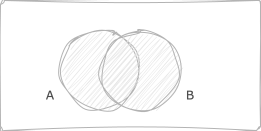
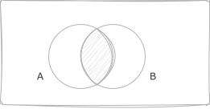

import Tabs from '@theme/Tabs';
import TabItem from '@theme/TabItem';

# Probability: Basics

## Overview

<Tabs queryString="primary">
  <TabItem value="definition" label="Definition">
  **Probability** is a measure of the likelihood or chance that a certain event will occur. It is quantified as a number between `0` and `1`. An event with a probability of `1` is considered a certainty, while an event with a probability of `0` is considered impossible. The probability of an event is often expressed as a fraction or decimal, and can also be expressed as a percentage.

  Formally, probability can be defined in several ways:
  - **Classical definition** (also known as the mathematical definition) defines probability as the ratio of the number of favorable outcomes to the number of possible outcomes. This definition assumes that all outcomes are equally likely
  - **Relative frequency definition** of probability defines it as the limit of the frequency of a particular outcome as the number of trials approaches infinity
  - **Axiomatic definition**, which is the most general and abstract, defines probability based on a set of axioms related to the properties that probabilities should have
  </TabItem>
  <TabItem value="useCase" label="Use Cases">
  - **Physics**: describe quantum mechanics, thermodynamics, statistical mechanics, and chaos theory
  - **Biology**: model genetic variation, evolution, population dynamics, epidemiology, and ecology
  - **Statistics**: design experiments, test hypotheses, estimate parameters, construct confidence intervals, perform hypothesis testing
  - **Computer Science**: design algorithms, analyze system performance, develop machine learning models, support artificial intelligence, and manage data systems
  - **Economics**: analyze market trends, forecast economic growth, assess risk in financial and insurance sectors, and to model economic behavior
  - **Psychology**: test hypotheses, conduct research studies, analyze behavioral patterns, and interpret experimental results
  - **Engineering**: reliability analysis, risk assessment, quality control, and in the design and analysis of systems and signals
  - **Sociology**: predict social behaviors, analyze social networks, conduct demographic studies, and understand societal patterns
  - **Medicine**: clinical trials, epidemiological studies, medical imaging, genetic research, and health services research
  - **Finance**: risk management, portfolio optimization, derivative pricing, and investment strategies
  - **Geography**: spatial analysis, environmental modeling, cartography, and understanding population dynamics
  - **Meteorology**: weather forecasting, climate modeling, storm prediction, and analysis of atmospheric conditions
  </TabItem>
  <TabItem value="examples" label="Examples">
  - **Weather forecasts**: When a meteorologist says there is a 30% chance of rain, they are using probability to quantify the uncertainty in the weather forecast
  - **Sports**: In a soccer game, the probability of a team winning can be estimated based on the team's past performance, the performance of the players, and other factors
  - **Health risks**: Doctors use probability to assess the risk of a patient developing a certain disease based on their age, lifestyle, genetic factors, and other factors
  - **Insurance**: Insurance companies use probability to calculate the likelihood of an insured event occurring, such as a car accident or a house fire, which helps them to set insurance premiums
  - **Lottery games**: The probability of winning a lottery can be calculated based on the number of tickets sold and the number of possible combinations of numbers
  </TabItem>
  <TabItem value="concepts" label="Concepts">
  - **Random Experiment**: A process leading to various outcomes, unpredictable beforehand; examples include tossing a coin or rolling a dice
  - **Outcome**: Possible result of a random experiment, forming elements of the sample space; e.g., "heads" or "tails" when tossing a coin
  - **Event**: Subset of the sample space, representing specific outcomes of interest; examples include "rolling an even number" when rolling a dice
  - **Equally Likely Events**: Events where each outcome has equal probability; for instance, getting "heads" or "tails" when tossing a fair coin
  - **Mutually Exclusive Events**: Events that cannot occur simultaneously; like rolling an "even" or "odd" number on a dice
  - **Exhaustive Events**: Events covering all possible outcomes, leaving no room for others to occur; such as rolling an "even" or "odd" number on a dice
  - **Independent and Dependent Events**: Independent events occur without affecting each other, like flipping a coin multiple times, while dependent events influence one another, such as drawing cards from a deck without replacement
  </TabItem>
</Tabs>

## Venn Diagrams

<Tabs queryString="primary">
  <TabItem value="complement" label="Complement">
  

  **Complement $\overline{A}$ ($A'$)**: all elements of `S` that are not in `A`
  </TabItem>
  <TabItem value="subset" label="Subset">
  

  **Subset $A ⊂ B$**: all elements of `A` are also elements of `B`
  </TabItem>
  <TabItem value="union" label="Union">
  

  **Union $A ∪ B$**: all elements of `S` that are in `A` or `B`
  </TabItem>
  <TabItem value="intersection" label="Intersection">
  

  **Intersection $A ∩ B$**: all elements of `S` that are in `A` and `B`
  </TabItem>
</Tabs>

## Sample Spaces, Events, and Probability Axioms

<Tabs queryString="primary">
  <TabItem value="sampleSpace" label="Sample Space">
  **Sample space** (denoted by `S`), is the set of all possible outcomes of a random experiment. It encompasses every conceivable outcome that could result from the experiment. For example, when rolling a 6-sided dice, the sample space is `S = { 1, 2, 3, 4, 5, 6 }`

  Determining the sample space involves identifying all possible outcomes of a given random experiment. This process requires careful consideration of the experiment's nature and the potential outcomes it could yield. Various techniques can be employed to determine sample spaces, including enumeration, listing all possible outcomes explicitly, and logical reasoning based on the experiment's conditions and constraints.

  For example, when flipping two coins successively, we can determine the sample space by considering all possible combinations of outcomes:

  $S = { HH, HT, TH, TT }$

  - `H` heads
  - `T` tails
  </TabItem>
  <TabItem value="event" label="Event">
  **Event** (denoted by `E`), is any subset of the sample space. It represents a specific outcome or a collection of outcomes of interest. Events can range from simple, consisting of a single outcome, to compound, containing multiple outcomes. For instance, in the context of rolling a dice, the event "rolling an even number" corresponds to the subset `E = { 2, 4, 6 }`

  ### Classifications

  Events in probability theory can be classified based on various criteria, including their complexity, relationship to the sample space, and interdependence.

  - **Simple Events**: consisting of a single outcome, such as rolling a specific number on a dice
  - **Compound Events**: comprising multiple outcomes, such as rolling an even number or drawing a red card from a deck
  - **Exhaustive Events**: that cover all possible outcomes of a random experiment, leaving no room for other outcomes
  - **Mutually Exclusive** events that cannot occur simultaneously, meaning if one event happens, the other event cannot occur
  - **Independent Events**: where the occurrence of one event does not influence the occurrence of the other event
  </TabItem>
  <TabItem value="probabilityAxioms" label="Probability Axioms">
  **Probability axioms** fundamental principles that govern the behavior of probabilities and ensure consistency in probabilistic reasoning.

  - **Non-negativity**: The probability of any event is a non-negative real number, meaning it cannot be negative
  - **Normalization**: The sum of the probabilities of all possible outcomes in the sample space is equal to 1, reflecting the certainty that one of these outcomes will occur
  - **Additivity**: The probability of the union of two mutually exclusive events is equal to the sum of their individual probabilities
  </TabItem>
</Tabs>

## Probability Rules and Laws

<Tabs queryString="primary">
  <TabItem value="addition" label="Addition">
  **Addition rule** of probability states that the probability of the union of 2 events `B` is equal to the sum of their individual probabilities minus the probability of their intersection:

  $P(A∪B)=P(A)+P(B)−P(A∩B)$

  This rule holds for both mutually exclusive and non-mutually exclusive events.

  **Example**

  Consider tossing a fair six-sided die. Let event `A` be rolling an even number ({2, 4, 6}) and event `B` be rolling a number less than 4 `{1, 2, 3}`. The probability of either rolling an even number or a number less than 4 is:

  $P(A∪B)=P(A)+P(B)−P(A∩B)=\frac{3}{6}+\frac{3}{6}-\frac{1}{6}=\frac{5}{6}$
  </TabItem>
  <TabItem value="multiplication" label="Multiplication">
  **Multiplication rule** of probability states that the probability of the intersection of two events `A` and `B` is equal to the probability of `A` multiplied by the conditional probability of `B` given `A`:

  $P(A∩B)=P(A)×P(B∣A)$

  This rule is applicable when events `A` and `B` are independent or when the conditional probability of `B` given `A` is known.

  **Example**

  Consider drawing two cards successively from a standard deck of 52 cards without replacement. Let event `A` be drawing a red card on the first draw and event `B` be drawing a red card on the second draw given that a red card was drawn on the first draw. The probability of drawing 2 red cards is:

  $P(A∩B)=P(A)×P(B∣A)=\frac{26}{52}×\frac{25}{51}=\frac{25}{102}$
  </TabItem>
  <TabItem value="conditional" label="Conditional">
  **Conditional probability** measures the likelihood of an event `B` occurring given that another event `A` has already occurred. It is denoted by `P(B∣A)` and can be calculated using the formula:

  $P(B∣A)=\frac{P(A∩B)}{P(A)}$

  This concept is crucial for understanding the relationship between events and updating probabilities based on new information.

  **Example**

  Given a standard deck of 52 cards, the probability of drawing a king from a shuffled deck given that the first card drawn was an ace:

  $P(King∣Ace)=\frac{P(Ace and King)}{P(Ace)}=\frac{\frac{4}{52}}{\frac{4}{52}}=\frac{1}{13}$
  </TabItem>
  <TabItem value="bayesTheorem" label="Bayes' Theorem">
  **Bayes' theorem** provides a method for updating probabilities based on new evidence or information. It states that the probability of an event `A` occurring given that event `B` has occurred is proportional to the probability of `B` given `A` times the prior probability of `A`, divided by the probability of `B`:

  $P(A∣B)=\frac{P(B∣A)×P(A)}{P(B)}$

  Bayes' theorem is widely used in statistics, machine learning, and various fields for inference and decision-making.

  **Example**

  Consider a medical test for a rare disease that has a false positive rate of 5% and a false negative rate of 1%. If 0.1% of the population has the disease, what is the probability that a person has the disease given that they test positive?

  $P(Disease|Positive)=\frac{P(Positive|Disease)×P(Disease)}{P(Positive)}$
  </TabItem>
  <TabItem value="lawOfTotalProbability" label="Law of Total Probability">
  The law of total probability states that the probability of an event `B` can be calculated by summing the probabilities of `B` given different outcomes of another event `A`, weighted by the probabilities of those outcomes occurring:

  $P(B)=\sum_i P(B∣A_i)×P(A_i)$

  This law is particularly useful when the sample space can be partitioned into mutually exclusive events.

  **Example**

  Suppose there are two factories producing a certain type of product. Factory `A` produces 60% of the products, and factory `B` produces 40%. The defect rates for products from factories `A` and `B` are 5% and 3%, respectively.The probability that a randomly selected product is defective:

  $P(Defective)=P(Defective|A)×P(A)+P(Defective|B)×P(B)=(0.05×0.60)+(0.03×0.40)=0.033$
  </TabItem>
</Tabs>

## Probability Distributions

<Tabs queryString="primary">
  <TabItem value="probabilityDistributions" label="Definition">
  **Probability distributions** describe the likelihood of various outcomes in a given scenario. Understanding different probability distributions is essential for modeling real-world phenomena and making predictions.
  </TabItem>
  <TabItem value="discrete" label="Discrete Probability Distributions">
  - **Bernoulli Distribution**: models the probability of success or failure in a single trial
  - **Binomial Distribution**: represents the number of successes in a fixed number of independent Bernoulli trials
  - **Poisson Distribution**: models the number of events occurring in a fixed interval of time or space, given a constant rate of occurrence
  </TabItem>
  <TabItem value="continuous" label="Continuous Probability Distributions">
  - **Uniform Distribution**: All outcomes are equally likely within a specified range
  - **Normal Distribution**: Describes the distribution of a continuous random variable with a bell-shaped curve
  - **Exponential Distribution**: Models the time between events in a Poisson process
  </TabItem>
</Tabs>
