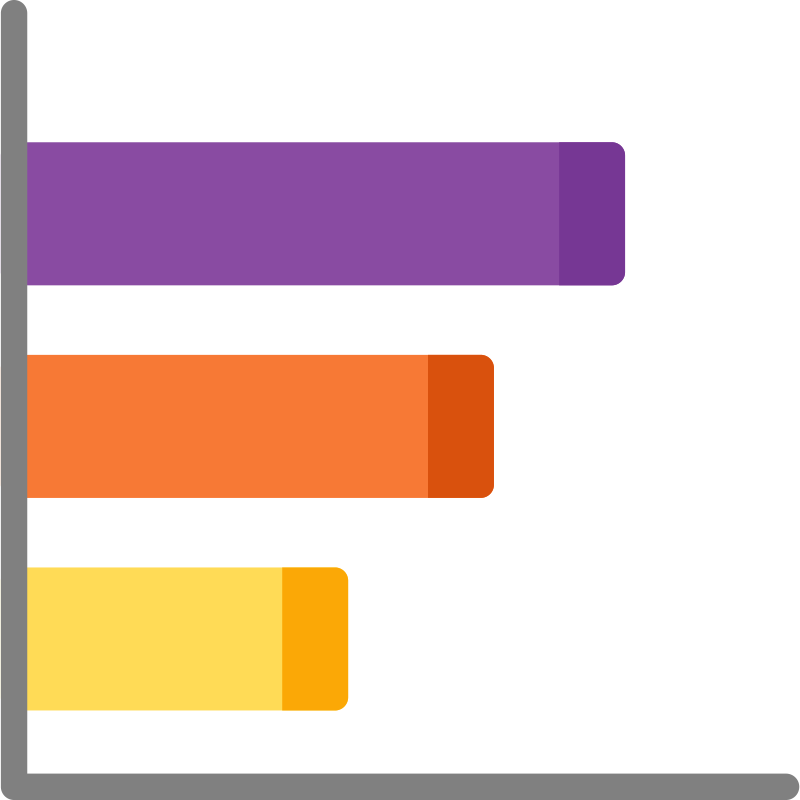
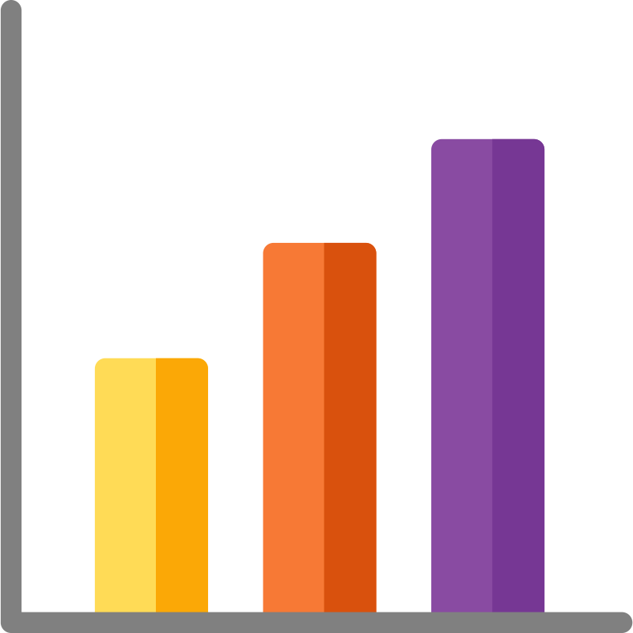
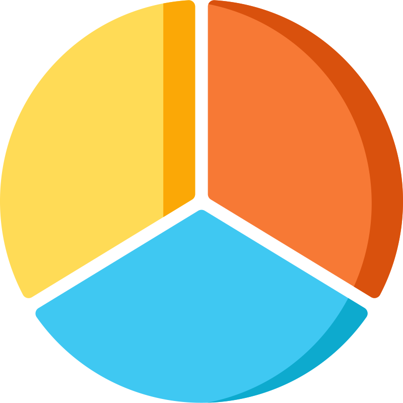
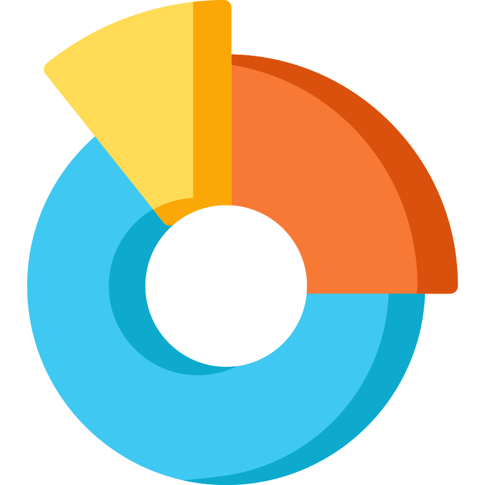
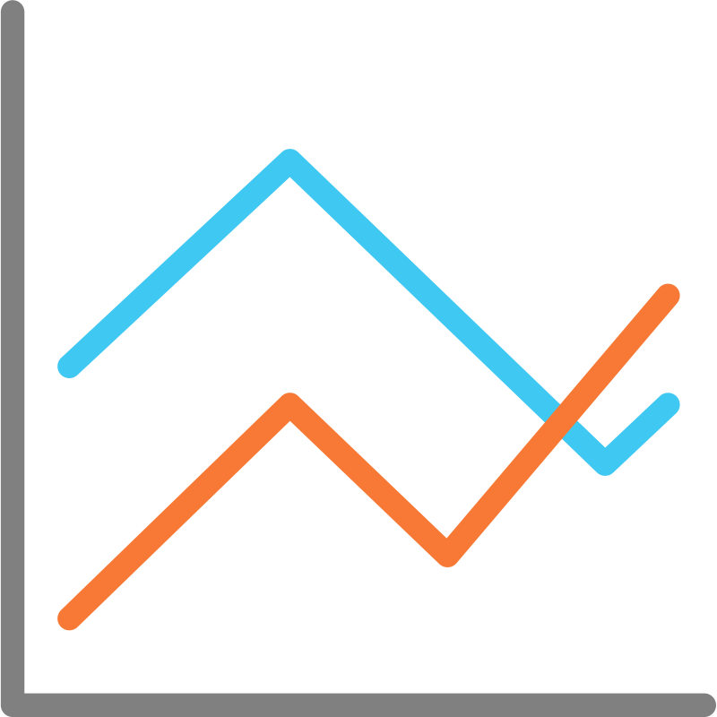
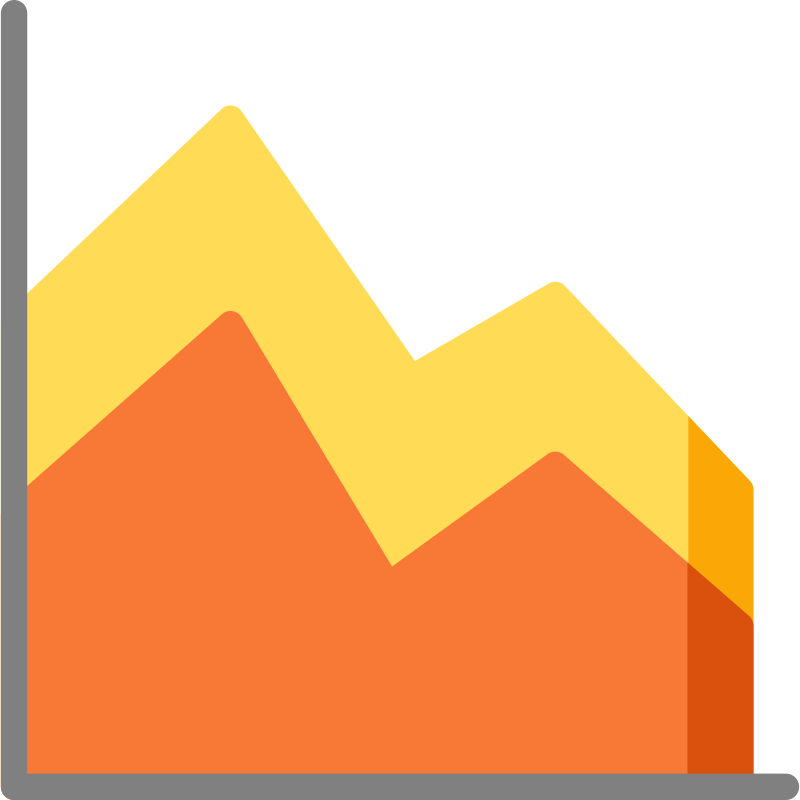
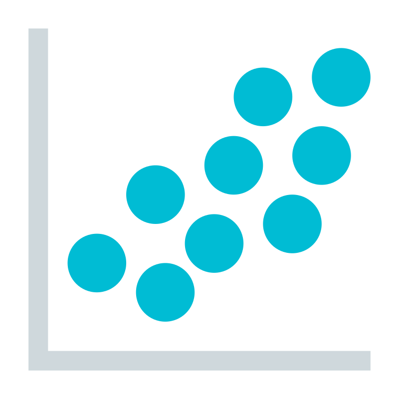
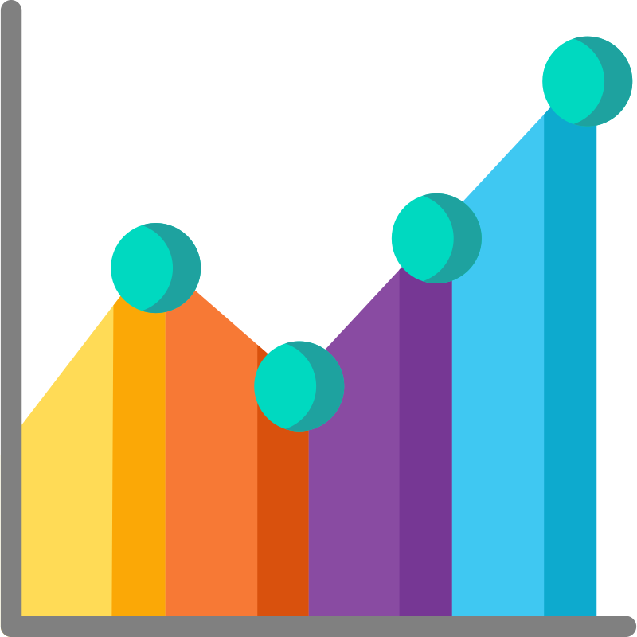
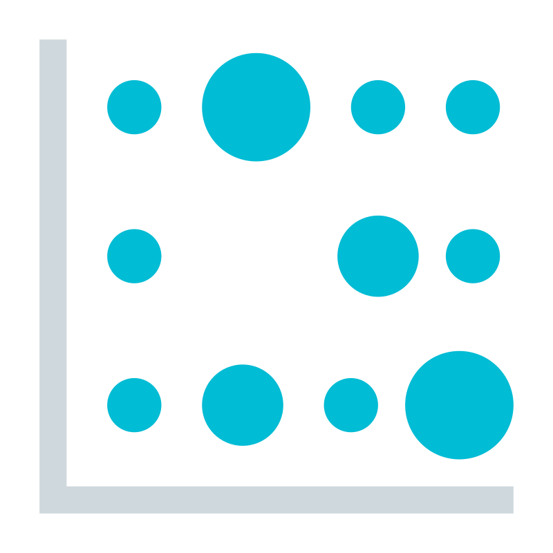

import Tabs from '@theme/Tabs';
import TabItem from '@theme/TabItem';

# Statistics: Basics

## Overview

<Tabs queryString="primary">
  <TabItem value="definition" label="Definition">
  Statistics is a branch of mathematics that deals with collecting, analyzing, interpreting, and presenting data. It provides methods for making inferences and decisions in the face of uncertainty, making it an indispensable tool for data-driven decision-making in various fields, including software development.
  </TabItem>
  <TabItem value="useCases" label="Use Cases">
  Role of Statistics in Data-Driven Decision-Making:

  - **Data Collection**: Statistics provides methods for collecting data systematically and efficiently, ensuring that the data gathered is representative and reliable
  - **Data Analysis**: Once data is collected, statistics offers a range of techniques for analyzing and summarizing the data, including descriptive statistics, inferential statistics, and data visualization
  - **Inference**: Statistical inference allows developers to draw conclusions or make predictions about a population based on a sample of data. This is essential for understanding patterns, trends, and relationships within the data
  - **Decision Making**: Statistics provides a framework for making decisions in the presence of uncertainty. By quantifying uncertainty through measures like confidence intervals and hypothesis testing, developers can make informed decisions that minimize risk and maximize opportunities

  Importance of Statistical Concepts in Software Development and Data Analysis:

  - **Performance Optimization**: Statistical techniques are used to analyze the performance of algorithms and data structures, identify bottlenecks, and optimize code for speed and efficiency
  - **Data Analysis and Machine Learning**: Statistical methods underpin many machine learning algorithms, including regression, classification, clustering, and anomaly detection. These algorithms are used for tasks such as predicting user behavior, recommending products, and detecting fraud
  - **Quality Assurance**: Statistics plays a vital role in quality assurance and testing processes. Techniques like hypothesis testing and statistical process control are used to ensure the reliability and stability of software systems
  - **User Experience (UX) Design**: Statistical analysis of user interactions and feedback is essential for improving user experience. A deep understanding of user behavior, preferences, and satisfaction levels helps developers design intuitive and user-friendly interfaces
  </TabItem>
  <TabItem value="terminology" label="Terminology">
  - **Population vs. Sample**: data analysis can involve populations, which consist of all individuals or events of interest, but analyzing entire populations is often impractical, leading to the use of samples, representative subsets of populations
  - **Descriptive vs. Inferential Statistics**: descriptive statistics summarize data, aiding in understanding and interpretation, while inferential statistics enable predictions or inferences about populations based on sample data, extending analysis beyond observed data
  - **Measures of Central Tendency** (Mean, Median, Mode): measures of central tendency describe the central or typical value of a dataset. They provide insight into where the data tends to cluster
  - **Mean**: also known as the average, is calculated by summing all the values in the dataset and dividing by the total number of values. It's sensitive to extreme values and is commonly used for normally distributed data
  - **Median**: is the middle value of a dataset when arranged in ascending or descending order. It's less affected by outliers compared to the mean and provides a better representation of the central tendency for skewed distributions
  - **Mode**: is the value that appears most frequently in the dataset. It's useful for categorical or nominal data and can indicate the most common outcome
  - **Measures of Dispersion** (Variance, Standard Deviation, Range): quantify the spread or variability of data points around the central tendency. They provide insight into the consistency and variability of the dataset
  - **Variance**: measures the average squared deviation of each data point from the mean. It gives an indication of how spread out the data points are from the mean
  - **Standard Deviation**: is the square root of the variance. It's often used as a measure of the dispersion of data points around the mean. A higher standard deviation indicates greater variability in the dataset
  - **Range**: is the difference between the maximum and minimum values in the dataset. It provides a simple measure of the spread of the data but is sensitive to outliers
  </TabItem>
</Tabs>

## Statistical Inference and Hypothesis Testing

<Tabs queryString="primary">
  <TabItem value="samplingTechniques" label="Sampling Techniques">
  **Sampling techniques** are methods used to select a subset of individuals or items from a larger population for analysis. Understanding different sampling methods is crucial for ensuring the representativeness of the sample and the validity of statistical conclusions.

  - **Simple random sampling**: involves randomly selecting individuals or items from the population, where each member has an equal chance of being chosen. It ensures unbiased representation and is often used when the population is homogeneous and easily accessible
  - **Stratified sampling**: involves dividing the population into distinct subgroups or strata based on certain characteristics and then randomly selecting samples from each stratum. It ensures representation from different segments of the population and is useful when there are significant variations within the population
  - **Cluster sampling**: involves dividing the population into clusters or groups and then randomly selecting entire clusters to form the sample. It is practical when it's difficult or costly to obtain a complete list of individuals in the population and is commonly used in geographical or organizational studies
  - **Systematic sampling**: involves selecting every `k`th individual from a list or sequence of the population. It is straightforward to implement and ensures equal probability of selection, making it suitable for large populations when a random starting point is chosen
  </TabItem>
  <TabItem value="estimation" label="Estimation">
  **Estimation** involves using sample data to make inferences or predictions about population parameters. Developers often use point estimation and interval estimation to estimate unknown population parameters.

  - **Point estimation**: involves using a single value, typically the sample mean or proportion, to estimate the population parameter. It provides a point estimate that serves as the best guess for the true value of the parameter based on the sample data
  - **Interval Estimation (Confidence Intervals)**: involves constructing a range of values, known as a confidence interval, that is likely to contain the true population parameter with a specified level of confidence. Confidence intervals provide a measure of uncertainty around the point estimate and help assess the precision of the estimate
  </TabItem>
  <TabItem value="hypothesisTesting" label="Hypothesis Testing">
  **Hypothesis testing** is a statistical method used to make decisions or draw conclusions about population parameters based on sample data. It involves formulating null and alternative hypotheses, conducting statistical tests, and interpreting the results.

  - **Null and Alternative Hypotheses**: null hypothesis $H_0$ represents the status quo or the assumption to be tested, while the alternative hypothesis $H_1$ represents the claim or hypothesis that contradicts the null hypothesis. Hypothesis testing aims to assess the evidence against the null hypothesis and determine whether there is sufficient evidence to reject it in favor of the alternative hypothesis.
  - **Types of Errors (Type I and Type II)**: there are 2 types of errors that can occur. A Type I error occurs when the null hypothesis is incorrectly rejected when it is true, leading to a false positive conclusion. A Type II error occurs when the null hypothesis is incorrectly accepted when it is false, leading to a false negative conclusion
  - **Statistical Tests (t-tests, Chi-square tests, ANOVA)**: various statistical tests are available for hypothesis testing, depending on the nature of the data and the research question. Commonly used tests include t-tests for comparing means, chi-square tests for testing independence or goodness of fit, and analysis of variance (ANOVA) for comparing multiple group means
  - **P-values and Significance Levels**: the p-value represents the probability of observing the sample data, or more extreme data, under the assumption that the null hypothesis is true. The significance level `α` is the threshold used to determine whether the p-value is sufficiently low to reject the null hypothesis. A common significance level is 0.05, indicating a 5% chance of making a Type I error
  </TabItem>
</Tabs>

## Regression Analysis and Predictive Modeling

<Tabs queryString="primary">
  <TabItem value="simpleLinearRegression" label="Simple Linear Regression">
  Simple linear regression is the most basic form of regression analysis, involving a single independent variable and a dependent variable. It aims to model the relationship between the independent variable `X` and the dependent variable `Y` using a linear equation of the form:

  $Y=β_0+β_1X+ϵ$

  - **Regression Line**: represents the best-fitting straight line through the data points, minimizing the sum of squared differences between the observed and predicted values. The coefficients $β_0$ and $β_1$ represent the intercept and slope of the line, respectively
  - **Calculating Regression Coefficients**: regression coefficients $β_0$ (intercept) and $β_1$ (slope) are estimated using the method of least squares, which minimizes the sum of squared residuals (the differences between observed and predicted values)
  - **Assessing Model Fit**: Model fit is assessed using various metrics, including $R^2$ (coefficient of determination), which measures the proportion of variance explained by the model, and residual analysis, which examines the distribution of residuals to ensure model assumptions are met
  </TabItem>
  <TabItem value="multipleLinearRegression" label="Multiple Linear Regression">
  Multiple linear regression extends simple linear regression to include multiple independent variables. It aims to model the relationship between the dependent variable and two or more independent variables using a linear equation of the form:

  $Y=β_0+β_1X_1+β_2X_2+...+β_pXp+ϵ$

  - **Extending Simple Regression to Multiple Predictors**: Multiple linear regression allows for the inclusion of multiple predictors in the model, enabling more complex relationships to be captured. Each coefficient $β_1,β_2,...,β_p$ represents the change in the dependent variable for a one-unit change in the corresponding independent variable, holding other variables constant
  - **Interpretation of Coefficients**: in multiple regression involves understanding the direction and magnitude of the relationship between each independent variable and the dependent variable. Positive coefficients indicate a positive relationship, while negative coefficients indicate a negative relationship
  - **Multicollinearity and Model Assumptions**: multicollinearity occurs when independent variables are highly correlated with each other, leading to unstable coefficient estimates and inflated standard errors. Model assumptions, including linearity, independence of errors, and homoscedasticity, should be assessed to ensure the validity of the regression model
  </TabItem>
  <TabItem value="regressionAnalysis" label="Applications of Regression Analysis in Software Development">
  **Regression analysis** has various applications in software development, including predictive modeling for software performance and regression testing for quality assurance.

  - **Predictive Modeling for Software Performance**: can be used to develop predictive models for software performance, such as predicting response times, memory usage, or system throughput based on input variables
  - **Regression Testing and Quality Assurance**: used in regression testing, a software testing technique that verifies whether recent changes to the codebase have affected the behavior of the software
  </TabItem>
</Tabs>

## Data Visualization

<Tabs queryString="primary">
  <TabItem value="principles" label="Principles">
  According to Edward Tufte, a pioneer in the field of data visualization, there are four main goals of data graphics:

  - Show the data
  - Induce the viewer to think about the substance rather than the methodology, graphic design, or technology
  - Avoid distorting what the data have to say
  - Present many numbers in a small space

  **General guidelines**

  - **Maximize the data-ink ratio**: use ink only to display data, not for decoration or redundancy
  - **Minimize chartjunk**: avoid unnecessary elements that distract from the data, such as grid lines, borders, backgrounds, or 3D effects
  - **Use appropriate scales**: choose scales that are proportional to the data and avoid misleading distortions, such as truncated axes or non-linear transformations
  - **Use appropriate colors**: use colors to highlight important features or categories, not for decoration or emphasis; avoid using too many colors or colors that are hard to distinguish
  - **Use appropriate labels**: provide clear and concise labels for axes, legends, titles, and annotations; avoid cluttering or overlapping labels
  - **Use appropriate symbols**: use symbols that are easy to recognize and interpret; avoid using too many symbols or symbols that are ambiguous or confusing

  **Charts and graphs**

  - **Bar Charts**: show categorical or numerical data using horizontal or vertical bars; useful for comparing values across categories or groups
    - 

    - 

  - **Pie & Donut Charts**: show categorical or numerical data using circular sectors; useful for showing proportions or percentages of a whole
    - 

    - 

  - **Line & Area Charts**: show numerical data using points connected by lines; useful for showing trends or changes over time
    - 

    - 

  - **Scatter Plots**: show numerical data using points on a Cartesian plane; useful for showing relationships or correlations between two variables
    - 

  - **Histograms**: show numerical data using bars whose heights represent frequencies or densities; useful for showing distributions or ranges of values
    - 

  - **Box Plots**: show numerical data using boxes whose edges represent quartiles and whiskers that represent outliers; useful for showing summary statistics or comparing distributions across groups
    - 

  - **Heat Maps**: show numerical data using colors on a grid; useful for showing patterns or variations across two dimensions
    - 

  **Chose the right visualization**

  One way is to consider the characteristics of our data and our goals for displaying it. For example:

  - What kind of data do we have? Is it categorical or numerical? Is it discrete or continuous? Is it univariate, bivariate, or multivariate?
  - What kind of information do we want to show? Do we want to show comparisons, proportions, trends, relationships, distributions, or patterns?
  - Who is our audience? What is their level of familiarity with the data and the type of chart or graph? What is their level of interest and attention span?
  </TabItem>
  <TabItem value="graphicalTechniques" label="Graphical Techniques">
  - **Histograms and Frequency Distributions**: display the distribution of numerical data by dividing it into intervals (bins) and representing the frequency of observations in each bin with bars. They provide a visual summary of the data's central tendency, spread, and shape
  - **Boxplots and Violin Plots**: Boxplots (also known as box-and-whisker plots) summarize the distribution of numerical data by displaying the median, quartiles, and outliers. Violin plots combine boxplots with kernel density estimation to provide a more detailed view of the data's distribution, especially for multimodal distributions
  - **Scatterplots and Correlation Analysis**: visualize the relationship between two numerical variables by plotting their values on a two-dimensional graph. They help identify patterns, trends, and correlations between variables. Correlation analysis quantifies the strength and direction of the linear relationship between two variables using correlation coefficients such as Pearson's correlation coefficient
  </TabItem>
  <TabItem value="eda" label="Exploratory Data Analysis (EDA)">
  - **Summary Statistics and Data Summarization**: summary statistics, such as mean, median, standard deviation, and percentiles, provide a concise overview of the data's central tendency, spread, and variability. Data summarization techniques, including pivot tables and cross-tabulations, help explore relationships between variables and identify trends or patterns
  - **Identifying Outliers and Anomalies**: outliers are data points that deviate significantly from the rest of the data and may indicate errors, anomalies, or interesting phenomena. Visual inspection, statistical methods (e.g., z-scores), and machine learning algorithms (e.g., isolation forests) can be used to detect outliers and investigate their causes
  - **Data Cleaning and Preprocessing Techniques**: involves identifying and correcting errors, missing values, and inconsistencies in the data to ensure its quality and reliability. Preprocessing techniques, such as normalization, scaling, and feature engineering, prepare the data for analysis and modeling by addressing issues such as varying scales, skewness, and multicollinearity
  </TabItem>
</Tabs>
