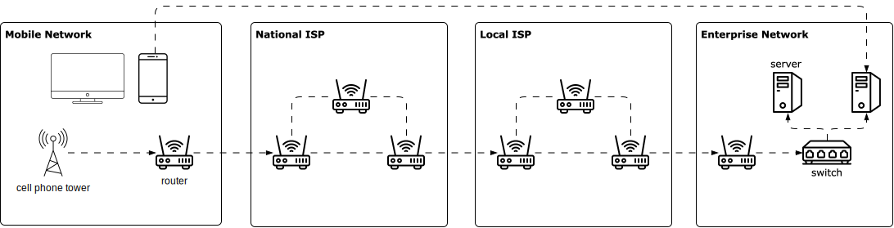
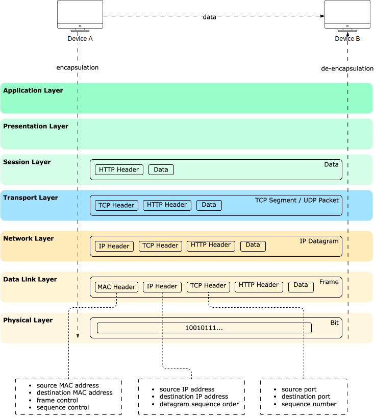
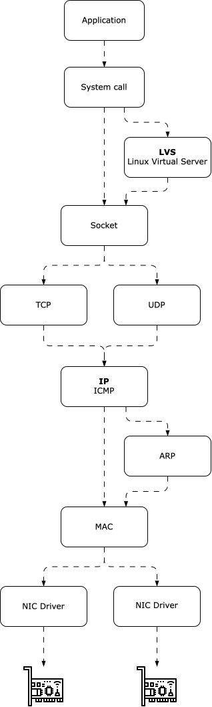

import Tabs from '@theme/Tabs';
import TabItem from '@theme/TabItem';

# Networking: Basics

## Overview

<Tabs queryString="primary">
  <TabItem value="networking" label="Networking">
    The internet connects various computing devices globally. When accessing a website from a smartphone or laptop, the connection typically goes through a cellular tower, a router, and then to
    Internet Service Providers (ISPs). Packets are forwarded through local ISPs to the network hosting the website. Within the company network, packets pass through a link-layer switch to reach the
    appropriate server.

    Routers and link-layer switches are both packet switches responsible for forwarding packets. Routers are primarily used in the network core to connect multiple networks, while link-layer switches
    are utilized in access networks to connect multiple devices within a single network.

    **Computer Networking: Top-Down Approach**

    

  </TabItem>
  <TabItem value="osi" label="OSI Model">
    **OSI (Open Systems Interconnection) model** is a conceptual framework used to understand and standardize the functions of a telecommunication or computing system.

    <table class="sticky column">
      <thead>
      <tr>
        <th style={{minWidth: '150px'}}>OSI Model Layer</th>
        <th style={{minWidth: '350px'}}>Visualization</th>
        <th style={{minWidth: '350px'}}>Description</th>
        <th>Protocols</th>
        <th>Data Format</th>
        <th>TCP/IP Model</th>
      </tr>
      </thead>
      <tbody>
      <tr>
        <td>Application Layer</td>
        <td>
          ```mermaid
          graph LR
          client(Client) -->|request| server(Server)
          server -->|response| client
          ```
        </td>
        <td>Closest to end users; where most applications reside. Requests data from backend servers without needing to understand data transmission specifics</td>
        <td>DNS, HTTP, SMTP, FTP</td>
        <td rowspan="3">Sending Data</td>
        <td rowspan="3">Application Layer</td>
      </tr>
      <tr>
        <td>Presentation Layer</td>
        <td>
          ```mermaid
          graph LR
          compression ~~~| | encryption ~~~| | encoding
          ```
        </td>
        <td>Handles data encoding, encryption, and compression for the application layer and prepares data for transmission, such as HTTPS using TLS for secure communications</td>
        <td>TLS, SSL</td>
      </tr>
      <tr>
        <td>Session Layer</td>
        <td>
          ```mermaid
          graph LR
          client(Client) <-->|session| server(Server)
          ```
        </td>
        <td>Manages opening and closing of communications between devices and sets checkpoints for large data to avoid full retransmission from the beginning</td>
        <td>Sockets</td>
      </tr>
      <tr>
        <td>Transport Layer</td>
        <td>
          ```mermaid
          graph LR
          segmentation(Data: segmentation) -->|transport| reassembly(Data: reassembly)
          ```
        </td>
        <td>Manages end-to-end communication between devices. Breaks data into segments at sender's side and reassembles at receiver's side. Implements flow control to prevent congestion</td>
        <td>TCP, UDP</td>
        <td>Sending Segments, Datagrams</td>
        <td>Transport Layer</td>
      </tr>
      <tr>
        <td>Network Layer (IP logical addressing)</td>
        <td>
          ```mermaid
          graph LR
          packets(Packets) -->|transport| assembly(Packets assembly)
          ```
        </td>
        <td>Facilitates data transfer between different networks. Divides segments or datagrams into smaller packets. Finds optimal route to destination using IP addresses (routing)</td>
        <td>IP, ICMP, IGMP, IPsec</td>
        <td>Sending Packets</td>
        <td>Internet Layer</td>
      </tr>
      <tr>
        <td>Data Link Layer (MAC physical addressing)</td>
        <td>
          ```mermaid
          graph LR
          frames(Frames) -->|transport| infra(Infra-Network Communications)
          ```
        </td>
        <td>Allows data transfer between devices on the same network. Breaks packets into frames confined to local area network</td>
        <td>Ethernet, WiFi</td>
        <td>Sending Frames</td>
        <td rowspan="2">Network Address Layer</td>
      </tr>
      <tr>
        <td>Physical Layer (cables)</td>
        <td>
          ```mermaid
          graph LR
          sending(Sending Cable) -->|bite stream: 00100111| receiving(Receiving Cable)
          ```
        </td>
        <td>Sends bitstreams over cables and switches. Closely associated with physical connection between devices</td>
        <td>Fiber</td>
        <td>Sending Bits</td>
      </tr>
      </tbody>
    </table>

    **Transfer Process**

    
    
    **Linux Kernel**

    

  </TabItem>
</Tabs>
