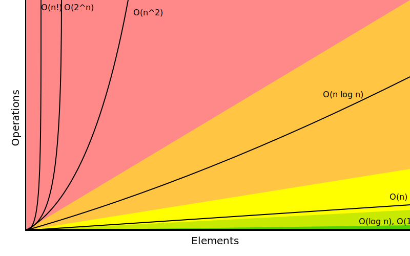

import Tabs from "@theme/Tabs";
import TabItem from "@theme/TabItem";

# Asymptotic Notation: Basics

<Tabs queryString="primary">
  <TabItem value="definition" label="Definition">
    <table>
      <thead>
      <tr>
        <th style={{minWidth: '150px'}}>Aspect</th>
        <th style={{minWidth: '300px'}}>Definition</th>
        <th>Symbol</th>
        <th>Formal Definition</th>
        <th>Representation</th>
        <th>Interpretation</th>
        <th>Common Use</th>
        <th>Relationship</th>
      </tr>
      </thead>
      <tbody>
      <tr>
        <td>Big O – Upper Bound</td>
        <td>Represents the upper bound or worst-case scenario of a function. It denotes the maximum rate of growth of the function</td>
        <td>$$O(f(n))$$</td>
        <td>
          $$O(f(n)) = \{g(n): \text{there exist positive constants} c \text{and} n_0 \text{such that} 0 \leq g(n) \leq c \cdot f(n) \text{for all} n > n_0 \}$$
        </td>
        <td>Upper bound</td>
        <td>
          It's like (**\<\=**) the function grows no faster than the specified function for large enough inputs
        </td>
        <td>Analyzing worst-case time complexity of algorithms</td>
        <td>$$O(f(n))$$ is a subset of $$\Theta(f(n))$$</td>
      </tr>
      <tr>
        <td>Big Omega (Ω) – Lower Bound</td>
        <td>Represents the lower bound or best-case scenario of a function. It denotes the minimum rate of growth of the function</td>
        <td>$$\Omega(f(n))$$</td>
        <td>$$\Omega(f(n)) = \{g(n): \text{there exist positive constants} c \text{and} n_0 \text{such that} 0 \leq c \cdot f(n) \leq g(n) \text{for all} n > n_0 \}$$</td>
        <td>Lower bound</td>
        <td>It's like (**>=**) the function grows at least as fast as the specified function for large enough inputs</td>
        <td>Analyzing best-case time complexity of algorithms</td>
        <td>$$\Omega(f(n))$$ is a subset of $$\Theta(f(n))$$</td>
      </tr>
      <tr>
        <td>Big Theta (Θ) – Tight Bound</td>
        <td>Represents both upper and lower bounds of a function. It denotes the exact growth rate of the function</td>
        <td>$$\Theta(f(n))$$</td>
        <td>
        $$\Theta(f(n)) = \{g(n): \text{there exist positive constants} c_1, c_2 \text{, and} n_0 \text{such that} 0 \leq c_1 \cdot f(n) \leq g(n) \leq c_2 \cdot f(n) \text{for all} n > n_0 \}$$
        </td>
        <td>Tight bound</td>
        <td>It's like (**==**) the function grows at the same rate as the specified function for large enough inputs</td>
        <td>When both best-case and worst-case scenarios are identical</td>
        <td>Both $$O(f(n))$$ and $$\Omega(f(n))$$ are subsets of $$\Theta(f(n))$$</td>
      </tr>
      </tbody>
    </table>

  </TabItem>
  <TabItem value="bigO" label="Big O">
    

      <code className="horrible">Horrible</code>
      <code className="bad">Bad</code>
      <code className="fair">Fair</code>
      <code className="good">Good</code>
      <code className="excellent">Excellent</code>
    

    

    **Big-O Notation** is a mathematical concept used in computer science to describe the performance or complexity of an algorithm.

    ## Complexity

    ### Time

    Time complexity measures the amount of time an algorithm takes to execute, not the actual time, but how it scales with input length. It's important for evaluating an algorithm's efficiency and
    usefulness, and it's affected by the size and magnitude of the data processed

    ### Space

    Space complexity refers to the total amount of memory used by an algorithm or program, including both the space used by input values and auxiliary space (temporary or extra space). The best
    algorithms have the lowest space complexity, as it directly impacts execution speed. However, it's important to note that underlying hardware, OS, CPU, and processor can affect space and time
    complexities, but for simplicity, these factors are often disregarded when analyzing an algorithm's performance.

    `Space Complexity = Auxiliary space + Space used by input values`

    ## Importance

    - Helps in comparing different algorithms and determining their efficiency and assists in making informed decisions about choosing the right algorithm for a specific task
    - Provides insights into the worst-case scenarios of an algorithm

    ## Analyzing Algorithms

    - Identify the main operations involved in the algorithm (e.g., loops, arithmetic operations, function calls)
    - Determine the number of times each operation is executed as a function of the input size
    - Combine the results from step 2 to obtain the overall time complexity using Big O notation

    ## Comparison Table

    <table>
      <thead>
      <tr>
        <th>Big-O Notation</th>
        <th>Time Complexity</th>
        <th>Description</th>
        <th>Example</th>
        <th>Computations for 10 elements</th>
        <th>Computations for 100 elements</th>
      </tr>
      </thead>
      <tbody>
      <tr>
        <td><code className="excellent">O(1)</code></td>
        <td>**constant**</td>
        <td>constant, regardless of input size</td>
        <td>accessing an array element by index</td>
        <td>1</td>
        <td>1</td>
      </tr>
      <tr>
        <td><code className="good">O(log n)</code></td>
        <td>**logarithmic**</td>
        <td>increases logarithmically with input size</td>
        <td>binary search</td>
        <td>3</td>
        <td>6</td>
      </tr>
      <tr>
        <td><code className="fair">O(n)</code></td>
        <td>**linear**</td>
        <td>increases linearly with input size</td>
        <td>iterating through whole array</td>
        <td>10</td>
        <td>100</td>
      </tr>
      <tr>
        <td><code className="bad">O(n log n)</code></td>
        <td>**linearithmic**</td>
        <td>linearly with input size * logarithmic factor</td>
        <td>merge sort</td>
        <td>30</td>
        <td>600</td>
      </tr>
      <tr>
        <td><code className="horrible">O(n²)</code></td>
        <td>**quadratic**</td>
        <td>increases quadratically with input size</td>
        <td>2 (double) nested loops</td>
        <td>100</td>
        <td>10 000</td>
      </tr>
      <tr>
        <td><code className="horrible">O(n³)</code></td>
        <td>**cubic**</td>
        <td>increases cubically with input size</td>
        <td>3 (triple) nested loops</td>
        <td>1000</td>
        <td>1 000 000</td>
      </tr>
      <tr>
        <td><code className="horrible">O(n²)</code></td>
        <td>**exponential**</td>
        <td>increases exponentially with input size</td>
        <td>naive recursive Fibonacci</td>
        <td>1024</td>
        <td>1.26e+29</td>
      </tr>
      <tr>
        <td><code className="horrible">O(n!)</code></td>
        <td>**factorial**</td>
        <td>increases factorially with input size</td>
        <td>generating all possible permutations. Iterating through all subsets of a set</td>
        <td>3 628 800</td>
        <td>9.3e+157</td>
      </tr>
      </tbody>
    </table>

  </TabItem>
  <TabItem value="commonDataStructureOperations" label="Common Data Structure Operations">
    <table className="sticky column">
      <tbody>
      <tr>
        <th>Data Structure</th>
        <th colspan="8">Time Complexity</th>
        <th>Space Complexity</th>
      </tr>
      <tr>
        <th></th>
        <th colspan="4">Average</th>
        <th colspan="4">Worst</th>
        <th>Worst</th>
      </tr>
      <tr>
        <th></th>
        <th>Access</th>
        <th>Lookup</th>
        <th>Insertion</th>
        <th>Deletion</th>
        <th>Access</th>
        <th>Lookup</th>
        <th>Insertion</th>
        <th>Deletion</th>
        <th></th>
      </tr>
      <tr>
        <td><a href="/en/docs/education/Computer%20Science/Data%20Structures/Basic/Array">Array</a></td>
        <td><code className="excellent">O(1)</code></td>
        <td><code className="fair">O(n)</code></td>
        <td><code className="fair">O(n)</code></td>
        <td><code className="fair">O(n)</code></td>
        <td><code className="excellent">O(1)</code></td>
        <td><code className="fair">O(n)</code></td>
        <td><code className="fair">O(n)</code></td>
        <td><code className="fair">O(n)</code></td>
        <td><code className="fair">O(n)</code></td>
      </tr>
      <tr>
        <td><a href="/en/docs/education/Computer%20Science/Data%20Structures/Basic/Stack">Stack</a></td>
        <td><code className="fair">O(n)</code></td>
        <td><code className="fair">O(n)</code></td>
        <td><code className="excellent">O(1)</code></td>
        <td><code className="excellent">O(1)</code></td>
        <td><code className="fair">O(n)</code></td>
        <td><code className="fair">O(n)</code></td>
        <td><code className="excellent">O(1)</code></td>
        <td><code className="excellent">O(1)</code></td>
        <td><code className="fair">O(n)</code></td>
      </tr>
      <tr>
        <td><a href="/en/docs/education/Computer%20Science/Data%20Structures/Basic/Queue">Queue</a></td>
        <td><code className="fair">O(n)</code></td>
        <td><code className="fair">O(n)</code></td>
        <td><code className="excellent">O(1)</code></td>
        <td><code className="excellent">O(1)</code></td>
        <td><code className="fair">O(n)</code></td>
        <td><code className="fair">O(n)</code></td>
        <td><code className="excellent">O(1)</code></td>
        <td><code className="excellent">O(1)</code></td>
        <td><code className="fair">O(n)</code></td>
      </tr>
      <tr>
        <td><a href="/en/docs/education/Computer%20Science/Data%20Structures/Basic/Linked%20List">Singly-Linked List</a></td>
        <td><code className="fair">O(n)</code></td>
        <td><code className="fair">O(n)</code></td>
        <td><code className="excellent">O(1)</code></td>
        <td><code className="excellent">O(1)</code></td>
        <td><code className="fair">O(n)</code></td>
        <td><code className="fair">O(n)</code></td>
        <td><code className="excellent">O(1)</code></td>
        <td><code className="excellent">O(1)</code></td>
        <td><code className="fair">O(n)</code></td>
      </tr>
      <tr>
        <td><a href="/en/docs/education/Computer%20Science/Data%20Structures/Basic/Doubly%20Linked%20List">Doubly-Linked List</a></td>
        <td><code className="fair">O(n)</code></td>
        <td><code className="fair">O(n)</code></td>
        <td><code className="excellent">O(1)</code></td>
        <td><code className="excellent">O(1)</code></td>
        <td><code className="fair">O(n)</code></td>
        <td><code className="fair">O(n)</code></td>
        <td><code className="excellent">O(1)</code></td>
        <td><code className="excellent">O(1)</code></td>
        <td><code className="fair">O(n)</code></td>
      </tr>
      <tr>
        <td><a href="http://en.wikipedia.org/wiki/Skip_list">Skip List</a></td>
        <td><code className="good">O(log n)</code></td>
        <td><code className="good">O(log n)</code></td>
        <td><code className="good">O(log n)</code></td>
        <td><code className="good">O(log n)</code></td>
        <td><code className="fair">O(n)</code></td>
        <td><code className="fair">O(n)</code></td>
        <td><code className="fair">O(n)</code></td>
        <td><code className="fair">O(n)</code></td>
        <td><code className="bad">O(n log n)</code></td>
      </tr>
      <tr>
        <td><a href="/en/docs/education/Computer%20Science/Data%20Structures/Basic/Hash%20Table">Hash Table</a></td>
        <td><code className="na">N/A</code></td>
        <td><code className="excellent">O(1)</code></td>
        <td><code className="excellent">O(1)</code></td>
        <td><code className="excellent">O(1)</code></td>
        <td><code className="na">N/A</code></td>
        <td><code className="fair">O(n)</code></td>
        <td><code className="fair">O(n)</code></td>
        <td><code className="fair">O(n)</code></td>
        <td><code className="fair">O(n)</code></td>
      </tr>
      <tr>
        <td><a href="/en/docs/education/Computer%20Science/Data%20Structures/Basic/Binary%20Search%20Tree">Binary Search Tree</a></td>
        <td><code className="good">O(log n)</code></td>
        <td><code className="good">O(log n)</code></td>
        <td><code className="good">O(log n)</code></td>
        <td><code className="good">O(log n)</code></td>
        <td><code className="fair">O(n)</code></td>
        <td><code className="fair">O(n)</code></td>
        <td><code className="fair">O(n)</code></td>
        <td><code className="fair">O(n)</code></td>
        <td><code className="fair">O(n)</code></td>
      </tr>
      <tr>
        <td><a href="https://en.wikipedia.org/wiki/Cartesian_tree">Cartesian Tree</a></td>
        <td><code className="na">N/A</code></td>
        <td><code className="good">O(log n)</code></td>
        <td><code className="good">O(log n)</code></td>
        <td><code className="good">O(log n)</code></td>
        <td><code className="na">N/A</code></td>
        <td><code className="fair">O(n)</code></td>
        <td><code className="fair">O(n)</code></td>
        <td><code className="fair">O(n)</code></td>
        <td><code className="fair">O(n)</code></td>
      </tr>
      <tr>
        <td><a href="http://en.wikipedia.org/wiki/B_tree">B-Tree</a></td>
        <td><code className="good">O(log n)</code></td>
        <td><code className="good">O(log n)</code></td>
        <td><code className="good">O(log n)</code></td>
        <td><code className="good">O(log n)</code></td>
        <td><code className="good">O(log n)</code></td>
        <td><code className="good">O(log n)</code></td>
        <td><code className="good">O(log n)</code></td>
        <td><code className="good">O(log n)</code></td>
        <td><code className="fair">O(n)</code></td>
      </tr>
      <tr>
        <td><a href="/en/docs/education/Computer%20Science/Data%20Structures/Basic/Red%20Black%20Tree">Red-Black Tree</a></td>
        <td><code className="good">O(log n)</code></td>
        <td><code className="good">O(log n)</code></td>
        <td><code className="good">O(log n)</code></td>
        <td><code className="good">O(log n)</code></td>
        <td><code className="good">O(log n)</code></td>
        <td><code className="good">O(log n)</code></td>
        <td><code className="good">O(log n)</code></td>
        <td><code className="good">O(log n)</code></td>
        <td><code className="fair">O(n)</code></td>
      </tr>
      <tr>
        <td><a href="https://en.wikipedia.org/wiki/Splay_tree">Splay Tree</a></td>
        <td><code className="na">N/A</code></td>
        <td><code className="good">O(log n)</code></td>
        <td><code className="good">O(log n)</code></td>
        <td><code className="good">O(log n)</code></td>
        <td><code className="na">N/A</code></td>
        <td><code className="good">O(log n)</code></td>
        <td><code className="good">O(log n)</code></td>
        <td><code className="good">O(log n)</code></td>
        <td><code className="fair">O(n)</code></td>
      </tr>
      <tr>
        <td><a href="/en/docs/education/Computer%20Science/Data%20Structures/Basic/AVL%20Tree">AVL Tree</a></td>
        <td><code className="good">O(log n)</code></td>
        <td><code className="good">O(log n)</code></td>
        <td><code className="good">O(log n)</code></td>
        <td><code className="good">O(log n)</code></td>
        <td><code className="good">O(log n)</code></td>
        <td><code className="good">O(log n)</code></td>
        <td><code className="good">O(log n)</code></td>
        <td><code className="good">O(log n)</code></td>
        <td><code className="fair">O(n)</code></td>
      </tr>
      <tr>
        <td><a href="http://en.wikipedia.org/wiki/K-d_tree">KD Tree</a></td>
        <td><code className="good">O(log n)</code></td>
        <td><code className="good">O(log n)</code></td>
        <td><code className="good">O(log n)</code></td>
        <td><code className="good">O(log n)</code></td>
        <td><code className="fair">O(n)</code></td>
        <td><code className="fair">O(n)</code></td>
        <td><code className="fair">O(n)</code></td>
        <td><code className="fair">O(n)</code></td>
        <td><code className="fair">O(n)</code></td>
      </tr>
      </tbody>
    </table>
  </TabItem>
  <TabItem value="arraySortingAlgorithms" label="Array Sorting Algorithms">
    <table>
      <tbody>
      <tr>
        <th>Algorithm</th>
        <th colspan="3">Time Complexity</th>
        <th>Space Complexity</th>
      </tr>
      <tr>
        <th></th>
        <th>Best</th>
        <th>Average</th>
        <th>Worst</th>
        <th>Worst</th>
      </tr>
      <tr>
        <td><a href="http://en.wikipedia.org/wiki/Quicksort">Quicksort</a></td>
        <td><code className="bad">O(n log n)</code></td>
        <td><code className="bad">O(n log n)</code></td>
        <td><code className="horrible">O(n²)</code></td>
        <td><code className="good">O(log n)</code></td>
      </tr>
      <tr>
        <td><a href="http://en.wikipedia.org/wiki/Merge_sort">Mergesort</a></td>
        <td><code className="bad">O(n log n)</code></td>
        <td><code className="bad">O(n log n)</code></td>
        <td><code className="bad">O(n log n)</code></td>
        <td><code className="fair">O(n)</code></td>
      </tr>
      <tr>
        <td><a href="http://en.wikipedia.org/wiki/Timsort">Timsort</a></td>
        <td><code className="fair">O(n)</code></td>
        <td><code className="bad">O(n log n)</code></td>
        <td><code className="bad">O(n log n)</code></td>
        <td><code className="fair">O(n)</code></td>
      </tr>
      <tr>
        <td><a href="http://en.wikipedia.org/wiki/Heapsort">Heapsort</a></td>
        <td><code className="bad">O(n log n)</code></td>
        <td><code className="bad">O(n log n)</code></td>
        <td><code className="bad">O(n log n)</code></td>
        <td><code className="excellent">O(1)</code></td>
      </tr>
      <tr>
        <td><a href="http://en.wikipedia.org/wiki/Bubble_sort">Bubble Sort</a></td>
        <td><code className="fair">O(n)</code></td>
        <td><code className="horrible">O(n²)</code></td>
        <td><code className="horrible">O(n²)</code></td>
        <td><code className="excellent">O(1)</code></td>
      </tr>
      <tr>
        <td><a href="http://en.wikipedia.org/wiki/Insertion_sort">Insertion Sort</a></td>
        <td><code className="fair">O(n)</code></td>
        <td><code className="horrible">O(n²)</code></td>
        <td><code className="horrible">O(n²)</code></td>
        <td><code className="excellent">O(1)</code></td>
      </tr>
      <tr>
        <td><a href="http://en.wikipedia.org/wiki/Selection_sort">Selection Sort</a></td>
        <td><code className="horrible">O(n²)</code></td>
        <td><code className="horrible">O(n²)</code></td>
        <td><code className="horrible">O(n²)</code></td>
        <td><code className="excellent">O(1)</code></td>
      </tr>
      <tr>
        <td><a href="https://en.wikipedia.org/wiki/Tree_sort">Tree Sort</a></td>
        <td><code className="bad">O(n log n)</code></td>
        <td><code className="bad">O(n log n)</code></td>
        <td><code className="horrible">O(n²)</code></td>
        <td><code className="fair">O(n)</code></td>
      </tr>
      <tr>
        <td><a href="http://en.wikipedia.org/wiki/Shellsort">Shell Sort</a></td>
        <td><code className="bad">O(n log n)</code></td>
        <td><code className="horrible">O(n log n)²</code></td>
        <td><code className="horrible">O(n log n)²</code></td>
        <td><code className="excellent">O(1)</code></td>
      </tr>
      <tr>
        <td><a rel="tooltip" title="Only for integers. k is a number of buckets" href="http://en.wikipedia.org/wiki/Bucket_sort">Bucket Sort</a></td>
        <td><code className="excellent">O(n+k)</code></td>
        <td><code className="excellent">O(n+k)</code></td>
        <td><code className="horrible">O(n²)</code></td>
        <td><code className="fair">O(n)</code></td>
      </tr>
      <tr>
        <td><a rel="tooltip" title="Constant number of digits 'k'" href="http://en.wikipedia.org/wiki/Radix_sort">Radix Sort</a></td>
        <td><code className="excellent">O(nk)</code></td>
        <td><code className="excellent">O(nk)</code></td>
        <td><code className="excellent">O(nk)</code></td>
        <td><code className="fair">O(n+k)</code></td>
      </tr>
      <tr>
        <td><a rel="tooltip" title="Difference between maximum and minimum number 'k'" href="https://en.wikipedia.org/wiki/Counting_sort">Counting Sort</a></td>
        <td><code className="excellent">O(n+k)</code></td>
        <td><code className="excellent">O(n+k)</code></td>
        <td><code className="excellent">O(n+k)</code></td>
        <td><code className="fair">O(k)</code></td>
      </tr>
      <tr>
        <td><a href="https://en.wikipedia.org/wiki/Cubesort">Cubesort</a></td>
        <td><code className="fair">O(n)</code></td>
        <td><code className="bad">O(n log n)</code></td>
        <td><code className="bad">O(n log n)</code></td>
        <td><code className="fair">O(n)</code></td>
      </tr>
      </tbody>
    </table>
  </TabItem>
</Tabs>
