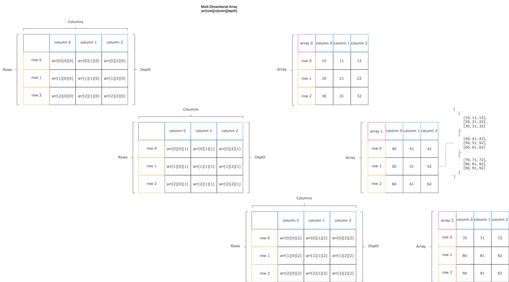

import Tabs from "@theme/Tabs";
import TabItem from "@theme/TabItem";
import CodeBlock from "@theme/CodeBlock";

import Go from "!!raw-loader!./assets/array/go.go";
import Java from "!!raw-loader!./assets/array/java.java";
import JS from "!!raw-loader!./assets/array/js.js";
import Kotlin from "!!raw-loader!./assets/array/kt.kt";
import Python from "!!raw-loader!./assets/array/py.py";
import Rust from "!!raw-loader!./assets/array/rs.rs";
import TS from "!!raw-loader!./assets/array/ts.ts";

<table>
  <thead>
    <tr>
      <th>Space</th>
      <th colspan="6">Time</th>
    </tr>
    <tr>
      <th></th>
      <th>Access</th>
      <th>Lookup</th>
      <th>Insertion</th>
      <th>Deletion</th>
    </tr>
  </thead>
  <tbody>
    <tr>
      <td>
        <code className="fair">O(n)</code>
      </td>
      <td>
        <code className="fair">O(n)</code>
      </td>
      <td>
        <code className="fair">O(n)</code>
      </td>
      <td>
        <code className="excellent">O(1)</code>
      </td>
      <td>
        <code className="excellent">O(1)</code>
      </td>
    </tr>
  </tbody>
</table>

## Definition

<Tabs queryString="primary">
  <TabItem value="short" label="Short">
    **Array** is a data structure that stores elements of the same type in contiguous memory locations, allowing for efficient indexing and retrieval.

    

      
Simplified

      It's like organized row of storage bins where you can put similar items. Each bin has a number, making it easy to find and grab what you need quickly, helping to keep things neat and orderly.
    

  </TabItem>
  <TabItem value="detailed" label="Detailed">
    **Array** is a linear data structure that stores a fixed-size collection of elements in contiguous memory locations. Elements are accessed using numerical indices, allowing for efficient
    retrieval. Arrays hold elements of the same data type and provide rapid, constant-time access. They are fundamental in algorithms and data structures, forming the basis for more complex structures
    like matrices.

    #### Advantages

    - **Fast and efficient access**: Arrays have a constant time complexity <code className="excellent">O(1)</code> for indexing, meaning that you can retrieve or update any element in an
    array with a single operation, regardless of the size of the array
    - **Low memory overhead**: Arrays only store the elements and their addresses, without any extra information or pointers, resulting in lower memory usage compared to other data structures
    - **Ease of implementation**: Most programming languages support arrays natively or provide built-in functions and libraries for working with arrays, making them easy to implement and use

    #### Disadvantages

    - **Fixed size**: The number of elements in an array must be predefined, and once declared, the size of the array cannot be changed. This makes insertion and deletion operations trickier, as the
    array stores elements in consecutive memory locations
    - **Limited data types**: Arrays can only store elements of the same data type, which can be restrictive when working with diverse data sets

    #### Variants

    ##### One-Dimensional

    

    Linear data structure that stores a fixed-size, contiguous collection of elements with the same data type.

    ##### Two-Dimensional

    

    Structured data format that arranges elements in rows and columns. It is useful for organizing and accessing data in a grid-like fashion, with fixed sizes and efficient storage in contiguous
    memory locations.

    ##### Multi-Dimensional

    

    Multi-dimensional array is a data structure that organizes elements in more than two dimensions. It enables systematic organization and access to data in structured spaces, with fixed sizes along
    each dimension and contiguous memory storage.

  </TabItem>
</Tabs>

## Practice

<Tabs queryString="primary">
  <TabItem value="practice" label="Practice">
    <table>
      <thead>
        <tr>
          <th>Aspect</th>
          <th>Pseudo Code</th>
        </tr>
      </thead>
      <tbody>
        <tr>
          <td>Reverse</td>
          <td>
            Iterate array from the end to the start, appending each element to a
            new array
          </td>
        </tr>
        <tr>
          <td>Slice</td>
          <td>
            Creating a new list, then iterating from the start to stop index in
            the input array, adding each element to the new list
          </td>
        </tr>
        <tr>
          <td>Concatenate</td>
          <td>
            Combine two arrays into one by first copying elements from the first
            array, then appending elements from the second array to a new array
          </td>
        </tr>
      </tbody>
    </table>
  </TabItem>
  <TabItem value="solution" label="Solution">
    <Tabs queryString="code">
      <TabItem
        value="go"
        label=""
        attributes={{ title: "Go Lang", className: "code_lang go m" }}
      >
        <CodeBlock language="go">{Go}</CodeBlock>
      </TabItem>
      <TabItem
        value="java"
        label=""
        attributes={{ title: "Java", className: "code_lang java m" }}
      >
        <CodeBlock language="java">{Java}</CodeBlock>
      </TabItem>
      <TabItem
        value="js"
        label=""
        attributes={{ title: "JavaScript", className: "code_lang js m" }}
      >
        <CodeBlock language="js">{JS}</CodeBlock>
      </TabItem>
      <TabItem
        value="kotlin"
        label=""
        attributes={{ title: "Kotlin", className: "code_lang kotlin m" }}
      >
        <CodeBlock language="kotlin">{Kotlin}</CodeBlock>
      </TabItem>
      <TabItem
        value="python"
        label=""
        attributes={{ title: "Python", className: "code_lang python m" }}
      >
        <CodeBlock language="python">{Python}</CodeBlock>
      </TabItem>
      <TabItem
        value="rust"
        label=""
        attributes={{ title: "Rust", className: "code_lang rust m" }}
      >
        <CodeBlock language="rust">{Rust}</CodeBlock>
      </TabItem>
      <TabItem
        value="ts"
        label=""
        attributes={{ title: "TypeScript", className: "code_lang ts m" }}
      >
        <CodeBlock language="ts">{TS}</CodeBlock>
      </TabItem>
    </Tabs>
  </TabItem>
</Tabs>
