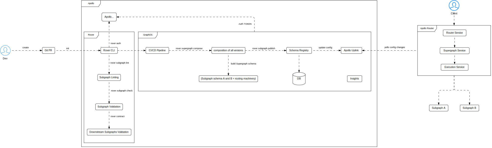

import Tabs from '@theme/Tabs';
import TabItem from '@theme/TabItem';
import Admonition from '@theme/Admonition';


<Tabs queryString="primary">
    <TabItem value="schema" label="Schema">
        <Tabs queryString="secondary">
            <TabItem value="overview" label="Overview">
                **GraphQL** is a query language for APIs and a runtime for executing those queries. It allows clients to request exactly the data they need, making it more efficient and flexible compared to traditional REST APIs. It's not tied to any specific database or storage engine and supports reading, writing, and subscribing to data changes, enabling real-time updates.

                **GraphQL Schema**: blueprint that defines the structure of the data in a GraphQL API, including types, queries, mutations, and subscriptions. It specifies how clients can interact with the data.

                GraphQL services can be written in any language, and there are various approaches to defining types in a schema:

                - might require you to construct schema types, fields, and resolver functions using the same programming language as the GraphQL implementation
                - will allow you to define types and fields using the schema definition language (SDL) and write resolver functions separately
                - will let you write and annotate resolver functions, inferring the schema from them
                - may infer both types and resolver functions based on underlying data sources

                <h3>Benefits</h3>

                - **Schema Design**
                    - schema-first Development. Design the GraphQL schema first using SDL (Schema Definition Language) to ensure a clear API contract before implementation
                - **Type Definitions**
                    - use Query, Mutation, and Subscription root types for operations
                    - define reusable input and object types for consistent and modular schema components
                - **Scalability**
                    - language Agnostic. Not tied to any specific database or storage engine
                    - modularize the schema using type extensions and federated architecture for microservices
                    - enforce Apollo Federation for distributed schemas
                - **Versioning Strategy**
                    - adopt schema deprecation strategies using `@deprecated` directives
                    - maintain backward compatibility while evolving the schema iteratively
                - **Performance Optimization**
                    - Fetching - process of retrieving specific data from a server or database. GraphQL can fetch from multiple sources in a single query and it eliminates the over-fetching and under-fetching dilemma
                        - **Over-Fetching**: occurs when clients receive more data than needed that leads to increased network traffic with resource wastage and longer response times
                        - **Under-Fetching**: occurs when insufficient data is provided for tasks that leads to inadequate information for decision-making, data inconsistencies, increased latency, and user frustration
                    - define precise field-level resolvers to minimize N+1 query problems
                    - use `DataLoader` to batch and cache backend data-fetching for optimized resolver performance
                    - implement query complexity analysis to restrict overly complex queries
                - **Developer Experience**
                    - provide a comprehensive, auto-generated GraphQL schema documentation using tools like GraphiQL
                    - implement linting rules for schema and query validation
                    - use a type-safe approach by integrating GraphQL with TypeScript
            </TabItem>
            <TabItem value="type-modifiers" label="Type Modifiers">
                <table>
                    <thead>
                        <tr>
                            <th>Modifier</th>
                            <th>Definition</th>
                            <th>Example</th>
                        </tr>
                    </thead>
                    <tbody>
                        <tr>
                            <td><b>Non-Null</b></td>
                            <td>Indicates the field is required</td>
                            <td>
                                ```graphql {2}
                                type Character {
                                    name: String!
                                }
                                ```
                            </td>
                        </tr>
                        <tr>
                            <td><b>List</b></td>
                            <td>
                                Indicates that a field can return a list of values. A list can contain zero or more items of the specified type
                            </td>
                            <td>
                                ```graphql {3,5,7}
                                type User {
                                  # return a list that can be null and contains null items
                                  friends: [User]
                                  # return a list that can be null but contains non-null items
                                  followers: [User!]
                                  # return a non-null list that contains non-null items
                                  following: [User!]!
                                }
                                ```
                            </td>
                        </tr>
                    </tbody>
                </table>

                <table>
                    <thead>
                        <tr>
                            <th>List Variant</th>
                            <th>`[1, 2]`</th>
                            <th>`[]`</th>
                            <th>`null`</th>
                            <th>`[1, null]`</th>
                            <th>`[[1], [2,3]]`</th>
                            <th>`[[]]`</th>
                            <th>`[[1], null]`</th>
                            <th>`[[null]]`</th>
                        </tr>
                    </thead>
                    <tbody>
                        <tr>
                            <td><b>`[Int]`</b></td>
                            <td>✅</td>
                            <td>✅</td>
                            <td>✅</td>
                            <td>✅</td>
                            <td>❌</td>
                            <td>❌</td>
                            <td>❌</td>
                            <td>❌</td>
                        </tr>
                        <tr>
                            <td><b>`[Int!]`</b></td>
                            <td>✅</td>
                            <td>✅</td>
                            <td>✅</td>
                            <td>❌</td>
                            <td>❌</td>
                            <td>❌</td>
                            <td>❌</td>
                            <td>❌</td>
                        </tr>
                        <tr>
                            <td><b>`[Int]!`</b></td>
                            <td>✅</td>
                            <td>✅</td>
                            <td>❌</td>
                            <td>✅</td>
                            <td>❌</td>
                            <td>❌</td>
                            <td>❌</td>
                            <td>❌</td>
                        </tr>
                        <tr>
                            <td><b>`[Int!]!`</b></td>
                            <td>✅</td>
                            <td>✅</td>
                            <td>❌</td>
                            <td>❌</td>
                            <td>❌</td>
                            <td>❌</td>
                            <td>❌</td>
                            <td>❌</td>
                        </tr>
                        <tr>
                            <td><b>`[[Int]]`</b></td>
                            <td>❌</td>
                            <td>✅</td>
                            <td>✅</td>
                            <td>❌</td>
                            <td>✅</td>
                            <td>✅</td>
                            <td>✅</td>
                            <td>✅</td>
                        </tr>
                        <tr>
                            <td><b>`[[Int!]]`</b></td>
                            <td>❌</td>
                            <td>✅</td>
                            <td>✅</td>
                            <td>❌</td>
                            <td>✅</td>
                            <td>✅</td>
                            <td>✅</td>
                            <td>❌</td>
                        </tr>
                        <tr>
                            <td><b>`[[Int!]!]`</b></td>
                            <td>❌</td>
                            <td>✅</td>
                            <td>✅</td>
                            <td>❌</td>
                            <td>✅</td>
                            <td>✅</td>
                            <td>❌</td>
                            <td>❌</td>
                        </tr>
                        <tr>
                            <td><b>`[Int!]!]!`</b></td>
                            <td>❌</td>
                            <td>✅</td>
                            <td>❌</td>
                            <td>❌</td>
                            <td>✅</td>
                            <td>✅</td>
                            <td>❌</td>
                            <td>❌</td>
                        </tr>
                    </tbody>
                </table>
            </TabItem>
            <TabItem value="structure-and-types" label="Structure & Types" attributes={{className:"tabs__vertical"}}>
                <table class="text_vertical">
                    <thead>
                        <tr>
                            <th>Type</th>
                            <th>Definition</th>
                            <th>Example</th>
                        </tr>
                    </thead>
                    <tbody>
                        <tr>
                            <td><b>Object</b></td>
                            <td>GraphQL Object type, indicating it has fields. Most schema types will be Object types</td>
                            <td>
                                ```graphql {1}
                                type Character {
                                  name: String!
                                }
                                ```
                            </td>
                        </tr>
                        <tr>
                            <td><b>Build-In Scalar Type</b></td>
                            <td>
                                <ul>
                                    <li><b>Int</b>: A signed 32‐bit integer</li>
                                    <li><b>Float</b>: A signed double-precision floating-point value</li>
                                    <li><b>String</b>: A UTF‐8 character sequence</li>
                                    <li><b>Boolean</b>: true or false</li>
                                    <li><b>ID</b>: unique identifier used to re-fetch an object or as a cache key. Although it is serialized like a String, defining it as an ID indicates that it is not meant to be human-readable</li>
                                </ul>
                            </td>
                            <td>
                                ```graphql {2,3}
                                type Character {
                                  name: String!
                                  id: ID!
                                }
                                ```
                            </td>
                        </tr>
                        <tr>
                            <td><b>Custom Scalar Type</b></td>
                            <td>User-defined data type that extends built-in scalars to represent specific formats, allowing for serialization and deserialization of complex types like dates or URLs</td>
                            <td>
                                ```graphql
                                scalar Date
                                ```
                            </td>
                        </tr>
                        <tr>
                            <td><b>Enum</b></td>
                            <td>Scalar type that can take a limited set of predefined values, helping to enforce data constraints in a GraphQL API</td>
                            <td>
                                ```graphql {1}
                                enum Month {
                                  JANUARY
                                  FEBRUARY
                                  MARCH
                                }
                                ```
                            </td>
                        </tr>
                        <tr>
                            <td><b>Input Object</b></td>
                            <td>Custom type that defines fields for input parameters in queries or mutations, enabling structured transmission of complex data</td>
                            <td>
                                ```graphql {1}
                                input CreateUserInput {
                                  username: String!
                                  email: String!
                                  password: String!
                                }
                                ```
                            </td>
                        </tr>
                        <tr>
                            <td><b>Interface</b></td>
                            <td>Abstract type that defines fields for multiple object types to implement, allowing for shared fields and enabling queries across different types through a common interface</td>
                            <td>
                                ```graphql {1}
                                interface Character {
                                  id: ID!
                                  name: String!
                                }
                                ```
                            </td>
                        </tr>
                        <tr>
                            <td><b>Union</b></td>
                            <td>Type that can represent one of several different object types, allowing for more flexible responses without requiring shared fields among the types</td>
                            <td>
                                ```graphql {13}
                                type Book {
                                  id: ID!
                                  title: String!
                                  author: String!
                                }

                                type Movie {
                                  id: ID!
                                  title: String!
                                  director: String!
                                }

                                union Media = Book | Movie
                                ```
                            </td>
                        </tr>
                        <tr>
                            <td><b>Build-In Directives</b></td>
                            <td>Directives may be provided in a specific syntactic order which may have semantic interpretation</td>
                            <td>
                                ```graphql {13}
                                directive @skip(if: Boolean!) on FIELD | FRAGMENT_SPREAD | INLINE_FRAGMENT
                                directive @include(if: Boolean!) on FIELD | FRAGMENT_SPREAD | INLINE_FRAGMENT
                                directive @specifiedBy(url: String!) on SCALAR
                                directive @deprecated(
                                  reason: String = "No longer supported"
                                ) on FIELD_DEFINITION | ARGUMENT_DEFINITION | INPUT_FIELD_DEFINITION | ENUM_VALUE
                                ```
                            </td>
                        </tr>
                        <tr>
                            <td><b>Custom Directives</b></td>
                            <td>User-defined annotations that can be applied to fields or fragments in a GraphQL schema to modify their behavior</td>
                            <td>
                                ```graphql
                                directive @auth(role: String) on FIELD_DEFINITION
                                ```
                            </td>
                        </tr>
                        <tr>
                            <td><b>Alias</b></td>
                            <td>Allows clients to rename the result of a field in a query, enabling clients to fetch the same field multiple times with different parameters</td>
                            <td>
                                ```graphql {5,6}
                                {
                                  user(id: 4) {
                                    id
                                    name
                                    smallPic: profilePic(size: 64)
                                    bigPic: profilePic(size: 1024)
                                  }
                                }
                                ```
                            </td>
                        </tr>
                        <tr>
                            <td><b>Fragments</b></td>
                            <td>Reusable units of a GraphQL query that allow clients to define a set of fields that can be included in multiple queries. Fragments help reduce duplication and improve query organization</td>
                            <td>
                                ```graphql
                                # Fragments
                                fragment userFields on User {
                                  id
                                  name
                                  email
                                }

                                query {
                                  user(id: "1") {
                                    ...userFields
                                  }
                                  user(id: "2") {
                                    ...userFields
                                  }
                                }

                                # Inline fragments
                                query {
                                  animals {
                                    ... on Dog {
                                      id
                                      name
                                      bark
                                    }
                                    ... on Cat {
                                      id
                                      name
                                      meow
                                    }
                                  }
                                }

                                # Type Conditions: fragment should only be applied to a specific type or interface
                                interface Animal {
                                  id: ID!
                                  name: String!
                                }

                                type Dog implements Animal {
                                  id: ID!
                                  name: String!
                                  bark: String!
                                }

                                type Cat implements Animal {
                                  id: ID!
                                  name: String!
                                  meow: String!
                                }

                                query {
                                  animals {
                                    ... on Dog {
                                      id
                                      name
                                      bark
                                    }
                                    ... on Cat {
                                      id
                                      name
                                      meow
                                    }
                                  }
                                }
                                ```
                            </td>
                        </tr>
                        <tr>
                            <td><b>Query</b></td>
                            <td>Read operation in GraphQL that allows clients to request specific data from the server. Queries specify the shape of the response by defining the fields to retrieve</td>
                            <td>
                                ```graphql
                                query {
                                  user(id: "1") {
                                    name
                                    email
                                  }
                                }
                                ```
                            </td>
                        </tr>
                        <tr>
                            <td><b>Mutation</b></td>
                            <td>Write operation in GraphQL that allows clients to modify server-side data. Mutations can create, update, or delete data and typically return the modified data</td>
                            <td>
                                ```graphql
                                mutation {
                                  createUser(name: "Joe", email: "joe@doe.com") {
                                    id
                                    name
                                  }
                                }
                                ```
                            </td>
                        </tr>
                        <tr>
                            <td><b>Subscription</b></td>
                            <td>Real-time operation in GraphQL that allows clients to receive updates from the server when specific events occur. Subscriptions enable clients to listen for changes to data</td>
                            <td>
                                ```graphql
                                subscription {
                                  userUpdated {
                                    id
                                    name
                                  }
                                }
                                ```
                            </td>
                        </tr>
                        <tr>
                            <td><b>Top-Level Queries</b></td>
                            <td>Queries should be well-defined and self-contained, with a focus on clear entry points</td>
                            <td>
                                ```graphql {1}
                                type Query {
                                    user(input: UserInput!): UserConnection
                                }
                                ```
                            </td>
                        </tr>
                        <tr>
                            <td><b>Entity Relationships</b></td>
                            <td>Use relationships to define nested data</td>
                            <td>
                                ```graphql {5,8}
                                type User {
                                    id: ID!
                                    name: String!
                                    email: String!
                                    orders: [Order!]!
                                }

                                type Order {
                                    id: ID!
                                    total: Float!
                                    createdAt: String!
                                    user: User!
                                }
                                ```
                            </td>
                        </tr>
                        <tr>
                            <td><b>Deeply Nested Structures</b></td>
                            <td>Limit the depth and use fragments to handle complexity</td>
                            <td>
                                ```graphql {4,10}
                                type Product {
                                    id: ID!
                                    name: String!
                                    category: Category!
                                }

                                type Category {
                                    id: ID!
                                    name: String!
                                    subCategories: [Category!]!
                                }
                                ```
                            </td>
                        </tr>
                        <tr>
                            <td><b>Descriptions</b></td>
                            <td>Comments that can be added to schema definitions to provide additional context or documentation for fields, types, or directives</td>
                            <td>
                                ```graphql
                                "This is a 1-line Descriptions"

                                """
                                This is a multi-line Descriptions
                                """
                                ```
                            </td>
                        </tr>
                        <tr>
                            <td><b>Comments</b></td>
                            <td>Used to annotate the schema or queries for clarity and documentation purposes</td>
                            <td>
                                ```graphql
                                # This is a 1-line comment
                                ```
                            </td>
                        </tr>
                    </tbody>
                </table>
            </TabItem>
            <TabItem value="pagination" label="Pagination">
                Pagination in GraphQL is done via standardized pagination model (cursor-based) using Connections

                <h3>Pagination Algorithm</h3>

                1. Server applies cursors (`before`, `after`) to filter `edges`
                2. Fetch all relevant records
                3. Slice the records based on indices (`first`, `last`)
                4. Create `edges`. For each record in the sliced list, create an edge object that includes the cursor (encoded identifier) and the node (the record itself)
                5. Determine `pageInfo`. Check for additional records after the current slice to set `hasNextPage` and, if they exist, calculate the `endCursor` for the last record in the current slice
                6. Create a `Connection` object that includes `edges` and `pageInfo`

                ```graphql
                {
                  user {
                    id
                    name
                    """
                    Slicing is done with the `first` argument to followers (get first 10 followers)
                    Pagination is achieved using the `after` argument with friends (passed a cursor to request friends following that cursor)
                    """
                    followers(first: 10, after: "opaqueCursor") {
                      """
                      For each edge, requested a cursor, an opaque string used for pagination with the `after` argument
                      """
                      edges {
                        cursor
                        node {
                          id
                          name
                        }
                      }
                      pageInfo {
                        """
                        Requested hasNextPage to determine if more edges are available or if we've reached the end of the connection
                        """
                        hasNextPage
                      }
                    }
                  }
                }
                ```

                <table>
                    <thead>
                        <tr>
                            <th>Edges to Return</th>
                            <th>Apply Cursors to Edges</th>
                        </tr>
                    </thead>
                    <tbody>
                        <tr>
                            <td>
                                ```python
                                EdgesToReturn(allEdges, before, after, first, last)
                                    edges = ApplyCursorsToEdges(allEdges, before, after)

                                    if first is set:
                                        if first < 0: throw error
                                        # If the edges list has more elements than `first`,
                                        # it truncates to the `first` elements; otherwise, it remains unchanged
                                        edges = edges[0:first] if length(edges) > first

                                    if last is set:
                                        if last < 0: throw error
                                        # If the edges list has more elements than `last`,
                                        # it retains only the `last` elements; otherwise, it remains unchanged
                                        edges = edges[length(edges) - last:length(edges)] if length(edges) > last

                                    return edges
                                ```
                            </td>
                            <td>
                                ```python
                                ApplyCursorsToEdges(allEdges, before, after):
                                    edges = allEdges

                                    if after is set:
                                        afterEdge = findEdgeByCursor(edges, after)
                                        if afterEdge exists:
                                            edges = removeBeforeAndIncluding(edges, afterEdge)

                                    if before is set:
                                        beforeEdge = findEdgeByCursor(edges, before)
                                        if beforeEdge exists:
                                            edges = removeAfterAndIncluding(edges, beforeEdge)

                                    return edges
                                ```
                            </td>
                        </tr>
                    </tbody>
                </table>

                <h3>Structure</h3>

                <Admonition type="info">
                  Including both `first` and `last` is strongly discouraged due to potential confusion in queries and results
                </Admonition>

                    ```graphql
                    type Query {
                      users(input: UserInput): UserConnection!
                    }

                    input UserInput {
                      pagination: PaginationInput
                    }

                    input PaginationInput {
                      first: Int
                      after: String
                      last: Int
                      before: String
                    }

                    type UserConnection {
                      edges: [UserEdge]!
                      pageInfo: PageInfo!
                    }

                    type PageInfo @shareable {
                      hasNextPage: Boolean!
                      hasPreviousPage: Boolean!
                      startCursor: String
                      endCursor: String
                    }

                    type UserEdge {
                      cursor: String!
                      node: User!
                    }

                    type User {
                      id: ID!
                      name: String!
                    }
                    ```

                - **Reserved Types**: GraphQL server must reserve specific types and names to support the pagination model of connections
                    - Any object ending in `Connection`
                    - An object named `PageInfo`
                - **Connection Types**: Any type ending in `Connection` is classified as a Connection Type. Connection types must be an **Object**. Must include fields named `edges` and `pageInfo`. They may also have additional fields as determined by the schema designer
                    - **Edges**: Connection Type must include a field called `edges`, which returns a list type wrapping an edge type
                    - **PageInfo**: Connection Type must include a field called `pageInfo`, which returns a non-null **PageInfo** object
                - **Edge Types**: List returned by a connection type's edges field and must be an **Object**. Must include fields named `node` and `cursor`. They may also have additional fields as determined by the schema designer
                    - **Node**: Must have a `node` field that returns a Scalar, Enum, Object, Interface, Union, or a Non-Null wrapper of those types, but not a list
                    - **Cursor**: Must have a `cursor` field that returns a type serializing as a String. This can be a String, a Non-Null String, a custom scalar that serializes as a String, or a Non-Null wrapper around such a custom scalar
                - **Arguments**: Field that returns a Connection Type must include forward pagination arguments, backward pagination arguments, or both. These arguments enable the client to slice the set of edges before it is returned
                    - **Forward pagination arguments**: Provide a non-negative integer `first` and a cursor `after` to return edges after the specified cursor, with a maximum of `first` edges
                    - **Backward pagination arguments**: Provide a non-negative integer `last` and a cursor `before` to return edges before the specified cursor, with a maximum of `last` edges
                    - **Edge Order**: Order the edges based on business logic and additional arguments, but the ordering must remain consistent across pages, ensuring that when using `first/after`, the edge closest to the cursor comes first, while with `last/before`, it comes last
                - **PageInfo**: Provides metadata about the current page of results. Must include `hasPreviousPage` and `hasNextPage` as non-null booleans, and `startCursor` and `endCursor` as opaque strings. `startCursor` and `endCursor` may be null if there are no results
                    - **hasPreviousPage**: Non-null boolean that indicates if there are more edges before the current page
                        - `last/before`: `true` if prior edges exist
                        - `first/after`: optionally `true` if edges before `after` exist
                    - **hasNextPage**: Non-null boolean that indicates if there are more edges after the current page
                        - `first/after`: `true` if more edges exist
                        - `last/before`: optionally `true` if edges after `before` exist
                    - **startCursor**:Cursors of first and last nodes in edges. Opaque strings (nullable if no results)
                    - **endCursor**: Cursors of first and last nodes in edges. Opaque strings (nullable if no results)
            </TabItem>
        </Tabs>
    </TabItem>
    <TabItem value="federated-schemas" label="Federated Schemas">
        <Tabs queryString="secondary">
            <TabItem value="gateway-vs-router" label="Gateway vs Router" attributes={{className:"tabs__vertical"}}>
                <table>
                    <thead>
                        <tr>
                            <th>Aspect</th>
                            <th>Apollo Gateway</th>
                            <th>Apollo Router</th>
                        </tr>
                    </thead>
                    <tbody>
                        <tr>
                            <td><b>Visualization</b></td>
                            <td>
                            ```mermaid
                            xychart-beta
                                title "Exponential"
                                x-axis "Requests per second" [0, 500, 1000, 1500, 2000, 2500, 3000, ..., 16000]
                                y-axis "p95 latency (ms)" 10 --> 90
                                bar [50, 50, 60, 70, 90]
                                line [50, 50, 60, 70, 90]
                            ```
                            </td>
                            <td>
                            ```mermaid
                            xychart-beta
                                title "Linear"
                                x-axis "Requests per second" [0, 500, 1000, 1500, 2000, 2500, 3000, ..., 16000]
                                y-axis "p95 latency (ms)" 10 --> 90
                                bar [20, 20, 20, 20, 20, 20, 20, 20, 20]
                                line [20, 20, 20, 20, 20, 20, 20, 20, 20]
                            ```
                            </td>
                        </tr>
                        <tr>
                            <td><b>Language</b></td>
                            <td>Node.js (JavaScript)</td>
                            <td>Rust</td>
                        </tr>
                        <tr>
                            <td><b>Latency</b></td>
                            <td>Higher latency, especially in scenarios with complex queries</td>
                            <td>Lower latency due to optimized query execution and multi-threaded design</td>
                        </tr>
                        <tr>
                            <td><b>Scalability</b></td>
                            <td>Scales effectively, but with potential bottlenecks in very high-load scenarios</td>
                            <td>Highly scalable, leveraging Rust’s ability to manage resources efficiently under heavy traffic</td>
                        </tr>
                        <tr>
                            <td><b>Memory Usage</b></td>
                            <td>Comparatively higher memory footprint due to Node.js overhead</td>
                            <td>Lower memory usage due to Rust’s fine-grained memory management</td>
                        </tr>
                        <tr>
                            <td><b>Customization</b></td>
                            <td>High level of customization using JavaScript/Node.js plugins</td>
                            <td>Customization via Apollo Router extensions, written in Rust or using predefined features</td>
                        </tr>
                        <tr>
                            <td><b>Federation Version Compatibility</b></td>
                            <td>Apollo Federation 1 and 2</td>
                            <td>Optimized for Apollo Federation 2, but also compatible with Federation 1</td>
                        </tr>
                        <tr>
                            <td><b>Concurrency Model</b></td>
                            <td>Single-threaded, event-driven (Node.js)</td>
                            <td>Multi-threaded by default, leveraging Rust’s concurrency model for better utilization of CPU resources</td>
                        </tr>
                        <tr>
                            <td><b>Resource Efficiency</b></td>
                            <td>Moderate resource efficiency, subject to Node.js limitations</td>
                            <td>High resource efficiency, using Rust’s optimized resource management</td>
                        </tr>
                        <tr>
                            <td><b>Use Case</b></td>
                            <td>Ideal for applications with moderate performance needs and developers familiar with JavaScript</td>
                            <td>Best for high-performance scenarios, large-scale federations, or teams requiring extremely low latency</td>
                        </tr>
                    </tbody>
                </table>
            </TabItem>
            <TabItem value="federation-versions" label="Federation Versions">
                <table>
                    <thead>
                        <tr>
                            <th>Aspect</th>
                            <th>Apollo Federation Version 1</th>
                            <th>Apollo Federation Version 2</th>
                        </tr>
                    </thead>
                    <tbody>
                        <tr>
                            <td><b>Core Architecture</b></td>
                            <td>Built on GraphQL schema stitching with a focus on declarative ownership of types across services</td>
                            <td>Refined architecture with improvements in query planning, security, and extensibility</td>
                        </tr>
                        <tr>
                            <td><b>Schema Composition</b></td>
                            <td>Centralized schema composed using `@key`, `@extends`, and other directives</td>
                            <td>Enhanced schema composition with streamlined support for type extensions and directives</td>
                        </tr>
                        <tr>
                            <td><b>Directive Support</b></td>
                            <td>Core directives: `@key`, `@extends`, `@external`, `@provides`, `@requires`</td>
                            <td>Expanded directive set for better flexibility; supports the same directives with optimized handling</td>
                        </tr>
                        <tr>
                            <td><b>Supergraph Schema</b></td>
                            <td>Not explicitly defined; relies on schema stitching to create a unified API gateway</td>
                            <td>Introduces the Supergraph Schema, a declarative representation of the federated schema, enhancing visibility and management</td>
                        </tr>
                        <tr>
                            <td><b>Gateway Implementation</b></td>
                            <td>Uses Apollo Gateway to execute federated queries by delegating to subgraphs</td>
                            <td>Upgraded Apollo Gateway supports Supergraph Schema, advanced query planning, and additional federation features</td>
                        </tr>
                        <tr>
                            <td><b>Query Planning</b></td>
                            <td>Basic query planner that routes subqueries based on ownership of types and fields</td>
                            <td>Enhanced query planner with more efficient routing, reduced network overhead, and support for shared ownership scenarios</td>
                        </tr>
                        <tr>
                            <td><b>Type Ownership</b></td>
                            <td>Types are owned by individual subgraphs; conflicts resolved during composition</td>
                            <td>Improved support for shared ownership, providing more granular control over type definitions</td>
                        </tr>
                        <tr>
                            <td><b>Error Handling</b></td>
                            <td>Errors are propagated to the client with limited granularity</td>
                            <td>Improved error propagation with clearer differentiation between subgraph-level and gateway-level issues</td>
                        </tr>
                        <tr>
                            <td><b>Security Enhancements</b></td>
                            <td>Basic security measures, such as authentication and authorization at the gateway level</td>
                            <td>Built-in authz and authn hooks, improved validation of schema boundaries, and enhanced cross-subgraph communication security</td>
                        </tr>
                        <tr>
                            <td><b>Performance</b></td>
                            <td>Good performance, but query planning could introduce noticeable overhead for complex schemas</td>
                            <td>Significant performance improvements due to an optimized query planner and reduced round-trip overheads</td>
                        </tr>
                        <tr>
                            <td><b>Backward Compatibility</b></td>
                            <td>Not forward-compatible with Apollo Federation 2</td>
                            <td>Backward-compatible with Federation 1 schemas; includes a migration path for upgrading</td>
                        </tr>
                        <tr>
                            <td><b>Subgraph Support</b></td>
                            <td>Basic support for subgraph APIs with ownership and dependency definitions</td>
                            <td>More flexible subgraph support, including enhanced debugging, versioning, and validation tools</td>
                        </tr>
                        <tr>
                            <td><b>Multi-Version Subgraph Support</b></td>
                            <td>Limited support; requires careful schema management</td>
                            <td>Full multi-version support, making it easier to manage versioned APIs across subgraphs</td>
                        </tr>
                    </tbody>
                </table>
            </TabItem>
            <TabItem value="graph-types" label="Graph Types">
                <table>
                    <thead>
                        <tr>
                            <th>Aspect</th>
                            <th>Monograph</th>
                            <th>Supergraph</th>
                        </tr>
                    </thead>
                    <tbody>
                        <tr>
                            <td><b>Visualization</b></td>
                            <td>
                            ```mermaid
                                graph LR

                                subgraph Clients
                                    direction LR

                                    API(API)
                                    Mobile(Mobile)
                                    Web(Web)
                                end

                                subgraph Monograph
                                    direction LR

                                    graphQL(GraphQL Server)
                                end

                                Clients --> graphQL
                            ```
                            </td>
                            <td>
                            ```mermaid
                                graph LR

                                subgraph Clients
                                    direction LR

                                    API(API)
                                    Mobile(Mobile)
                                    Web(Web)
                                end

                                subgraph Supergraph
                                    direction LR

                                    router{{Router}}

                                    product(Product Subgraph)
                                    users(Users Subgraph)
                                end

                                Clients --> router
                                router -->|sub-query| product & users
                            ```
                            </td>
                        </tr>
                        <tr>
                            <td><b>Definition</b></td>
                            <td>Graph that represents a single domain, team, or service</td>
                            <td>Federated graph that unifies multiple monographs under a single API schema</td>
                        </tr>
                        <tr>
                            <td><b>Architecture Style</b></td>
                            <td>Typically decentralized, focusing on individual domain responsibilities</td>
                            <td>Centralized or federated with a unified schema and gateway</td>
                        </tr>
                        <tr>
                            <td><b>Scalability</b></td>
                            <td>Scales horizontally within the specific domain</td>
                            <td>Scales across domains by delegating queries to appropriate subgraphs</td>
                        </tr>
                        <tr>
                            <td><b>Implementation Complexity</b></td>
                            <td>Relatively simple; involves defining schemas and resolvers for one domain</td>
                            <td>High; involves federation, schema stitching, and cross-team collaboration</td>
                        </tr>
                        <tr>
                            <td><b>Data Ownership</b></td>
                            <td>Clear ownership, as each graph is tied to a single team or service</td>
                            <td>Ownership is distributed across teams but unified under shared governance</td>
                        </tr>
                        <tr>
                            <td><b>Team Collaboration</b></td>
                            <td>Limited to the domain team</td>
                            <td>Requires cross-domain collaboration and clear ownership agreements</td>
                        </tr>
                        <tr>
                            <td><b>Query Execution</b></td>
                            <td>Queries are resolved locally within the monograph</td>
                            <td>Queries are resolved across multiple subgraphs and federated</td>
                        </tr>
                        <tr>
                            <td><b>Use Cases</b></td>
                            <td>Isolated domains (e.g., User Management, Inventory, Orders)</td>
                            <td>Enterprise-wide APIs (e.g., unified e-commerce, connected healthcare)</td>
                        </tr>
                    </tbody>
                </table>
            </TabItem>
            <TabItem value="apollo-graphos-architecture" label="Apollo GraphOS">
                
            </TabItem>
            <TabItem value="namespace" label="Namespace">
                <Admonition type="info">
                    While the current approach works in a GraphQL server, it fails to meet the spec requirement that field resolutions, except for top-level mutations, must be side effect-free and idempotent. It is recommended that GraphQL mutations be defined at the root level for serial execution in line with the specification. Currently, the only way to group related mutations is through field naming conventions and careful ordering, as there is no spec-compliant solution for managing numerous fields on the root mutation type
                </Admonition>

                <h3>Query: Root-Level Operation Fields</h3>

                ```graphql
                # Define all query fields for User objects in a UsersQueries namespace
                type UsersQueries {
                  all: [User!]!
                }

                # Define all query fields for Comment objects in a CommentsQueries namespace
                type CommentsQueries {
                  byUser(user: ID!): [Comment!]!
                }

                # Add a single root-level namespace-type which wraps other queries
                type Query {
                  users: UsersQueries!
                  comments: CommentsQueries!
                }

                # Fetch all users
                query FetchAllUsers {
                  users {
                    all {
                      id
                      firstName
                      lastName
                    }
                  }
                }
                ```

                <h3>Mutation: Root-Level Operation Fields</h3>

                ```graphql
                # Define all mutation fields for User objects in a UsersMutations namespace
                type UsersMutations {
                  create(profile: UserProfileInput!): User!
                  block(id: ID!): User!
                }

                # Define all mutation fields for Comment objects in a CommentsMutations namespace
                type CommentsMutations {
                  create(comment: CommentInput!): Comment!
                  delete(id: ID!): Comment!
                }

                # Add a single root-level namespace-type which wraps other mutations
                type Mutation {
                  users: UsersMutations!
                  comments: CommentsMutations!
                }

                # Create a new user and return it
                mutation CreateNewUser($userProfile: UserProfileInput!) {
                  users {
                    create(profile: $userProfile) {
                      id
                      firstName
                      lastName
                    }
                  }
                }
                ```

                <h3>Serial Mutations</h3>

                Root-level Mutation fields must be resolved serially to prevent simultaneous interactions with the same data, avoiding race conditions

                ```graphql
                mutation Transaction {
                  user {
                    success
                  }
                  # `payment` field resolves only after `user`,
                  # and won't resolve if `user` encounters an error
                  payment {
                    success
                  }
                }
                ```

                With namespaces, mutation fields that modify data are no longer root-level fields, allowing them to be resolved in parallel. To ensure transactional consistency use saga orchestrator in your mutation resolvers

                ```graphql
                mutation ParallelMutations (
                  $createInput: CreateReviewInput!
                  $deleteInput: DeleteReviewInput!
                ) {
                  reviews {
                    create(input: $createInput) {
                      success
                    }

                    # resolved in parallel with `create`
                    delete(input: $deleteInput) {
                      success
                    }
                  }
                }
                ```

                To ensure serial execution in a specific operation, you can use client-side aliases to create two root fields that resolve serially

                ```graphql
                mutation SerialMutations(
                  $createInput: CreateReviewInput!
                  $deleteInput: DeleteReviewInput!
                ) {
                  createReviews: reviews {
                    create(input: $createInput) {
                      success
                    }
                  }

                  # resolved serially after `createReviews` is resolved
                  deletedReviews: reviews {
                    delete(input: $deleteInput) {
                      success
                    }
                  }
                }
                ```
            </TabItem>
            <TabItem value="apq-pql" label="APQ & PQL">
                <table>
                    <thead>
                        <tr>
                            <th>Aspect</th>
                            <th>Automatic Persisted Query (APQ)</th>
                            <th>Registered Persisted Query (RPQ)</th>
                        </tr>
                    </thead>
                    <tbody>
                        <tr>
                            <td><b>Visualization</b></td>
                            <td>
                                ```mermaid
                                sequenceDiagram

                                participant client as Client App
                                participant server as Apollo Server

                                client ->> server: Sends SHA-256 hash of query string to execute
                                Note over server: Fails to find persisted query string
                                server ->> client: Responds with error
                                client ->> server: Sends both query string AND hash
                                Note over server: Persists query string and hash
                                server ->> client: Executes query and returns result
                                Note over client: Time passes
                                client ->> server: Sends SHA-256 hash of query string to execute
                                Note over server: Finds persisted query string
                                server ->> client: Executes query and returns result
                                ```
                            </td>
                            <td>
                                ```mermaid
                                graph LR

                                subgraph Supergraph
                                    direction LR

                                    subgraph Router
                                        direction LR
                                        router{{Graph Router}}
                                        pql[[PQL]]

                                        router <--> pql
                                    end

                                    subgraph Subgraphs
                                        direction LR

                                        users(Users Subgraph)
                                        product(Product Subgraph)
                                    end

                                    Router ---->|Router executes<br/>registered operations| Subgraphs
                                    Subgraphs -...->|Router blocks<br/>unregistered operations| Router
                                end

                                subgraph apps[First-party apps]
                                    direction LR

                                    web(Web Client)
                                    mobile(Mobile Client)
                                end

                                apps -->|Registered operations<br/>#40;build time#41;| Router
                                apps -->|Register<br/>trusted operations<br/>#40;at runtime#41;| pql
                                ```
                            </td>
                        </tr>
                        <tr>
                            <td><b>Definition</b></td>
                            <td>Query strings cached on the server side with a unique identifier (SHA-256 hash)</td>
                            <td>Pre-registered queries stored in a persisted query list (PQL) and identified by a unique ID</td>
                        </tr>
                        <tr>
                            <td><b>Performance</b></td>
                            <td>Reduces request sizes by sending identifiers instead of full query strings</td>
                            <td>Shares APQ's performance benefits and includes query plan cache warm-ups for even faster performance</td>
                        </tr>
                        <tr>
                            <td><b>Registration</b></td>
                            <td>Queries are registered at runtime; the server must receive the query string at least once</td>
                            <td>Queries are registered at build-time, allowing immediate execution using their PQL-specified ID</td>
                        </tr>
                        <tr>
                            <td><b>Safelisting</b></td>
                            <td>Does not provide safelisting capabilities as the cache is populated dynamically</td>
                            <td>Enables safelisting by rejecting operations not present in the PQL, enhancing security</td>
                        </tr>
                        <tr>
                            <td><b>Flexibility</b></td>
                            <td>Offers more flexibility as new queries can be added on the fly</td>
                            <td>Less flexible as changes to queries require updating the PQL at build time</td>
                        </tr>
                        <tr>
                            <td><b>Security</b></td>
                            <td>Less secure as it accepts any query that is sent at least once</td>
                            <td>More secure as it only accepts pre-registered queries, preventing malicious requests</td>
                        </tr>
                        <tr>
                            <td><b>Use Case</b></td>
                            <td>Suitable for improving network performance for large query strings without additional security concerns</td>
                            <td>Ideal for applications that require both performance optimization and enhanced security measures</td>
                        </tr>
                    </tbody>
                </table>
            </TabItem>
            <TabItem value="federated-entities" label="Federated Entities">
                **Entity**: Resolves fields across multiple subgraphs, where each subgraph contributes unique fields and resolves only its own; only object types can be entities, and each contributing subgraph must define a reference resolver

                <h3>Keys</h3>

                - Keys (best to use non-nullable fields) must uniquely identify the entity and can be a combination of one or more fields
                - Cannot include fields that return a union, interface, or fields that take arguments

                ```graphql {2,9}
                # Products Subgraph
                type Product @key(fields: "upc") {
                  upc: ID!
                  name: String!
                  price: Int
                }

                # Reviews Subgraph
                type Product @key(fields: "productUpc") {
                  productUpc: ID!
                  rating: Int!
                }
                ```

                <h3>Key Variants</h3>

                <table class="text_vertical">
                    <thead>
                        <tr>
                            <th>Aspect</th>
                            <th>Definition</th>
                            <th>Example</th>
                        </tr>
                    </thead>
                    <tbody>
                        <tr>
                            <td><b>Compound `@keys`</b></td>
                            <td>Combine multiple fields to uniquely identify an entity</td>
                            <td>
                            ```graphql
                            type User @key(fields: "username domain") {
                              username: String!
                              domain: String!
                            }
                            ```
                            </td>
                        </tr>
                        <tr>
                            <td><b>Nested Fields in Compound `@keys`</b></td>
                            <td>Nested fields can be used in compound keys</td>
                            <td>
                            ```graphql
                            type User @key(fields: "id organization { id }") {
                              id: ID!
                              organization: Organization!
                            }
                            ```
                            </td>
                        </tr>
                        <tr>
                            <td><b>Multiple `@keys`</b></td>
                            <td>Define multiple `@keys` when different subgraphs interact with different fields</td>
                            <td>
                            ```graphql
                            type Product @key(fields: "id") @key(fields: "sku") {
                              id: ID!
                              sku: String!
                              name: String!
                              price: Int
                            }
                            ```
                            </td>
                        </tr>
                        <tr>
                            <td><b>Referencing Entities with Multiple Keys</b></td>
                            <td>Subgraphs can reference an entity using any `@key` fields</td>
                            <td>
                            ```graphql
                            type Product @key(fields: "id", resolvable: false) {
                              id: ID!
                            }
                            ```
                            </td>
                        </tr>
                        <tr>
                            <td><b>Differing `@keys` Across Subgraphs</b></td>
                            <td>Different subgraphs can use different `@keys` for the same entity</td>
                            <td>
                            ```graphql
                            # Products subgraph
                            type Product @key(fields: "sku") @key(fields: "upc") {
                              sku: ID!
                              upc: String!
                              name: String!
                              price: Int
                            }

                            # Inventory subgraph
                            type Product @key(fields: "upc") {
                              upc: String!
                              inStock: Boolean!
                            }
                            ```
                            </td>
                        </tr>
                        <tr>
                            <td><b>Merging Entities</b></td>
                            <td>Entities must share at least one field in their `@key` selection set to merge</td>
                            <td>
                            ```graphql
                            # Products subgraph
                            type Product @key(fields: "sku") {
                              sku: ID!
                              name: String!
                              price: Int
                            }

                            # Inventory subgraph
                            type Product @key(fields: "upc") {
                              upc: String!
                              inStock: Boolean!
                            }
                            ```
                            </td>
                        </tr>
                        <tr>
                            <td><b>Operations with Differing `@keys`</b></td>
                            <td>Differing keys affect which fields can be resolved from each subgraph</td>
                            <td>
                            ```graphql
                            # Products Subgraph
                            type Product @key(fields: "sku") {
                                sku: ID!
                                upc: String!
                                name: String!
                                price: Int
                            }

                            # Inventory Subgraph
                            type Product @key(fields: "upc") {
                                upc: String!
                                inStock: Boolean!
                            }
                            ```
                            </td>
                        </tr>
                        <tr>
                            <td><b>Query Resolution</b></td>
                            <td>Queries in the Products subgraph can resolve all product fields, while queries in the Inventory subgraph can only resolve fields from the Products subgraph if both share a key</td>
                            <td>
                            ```graphql
                            # Products subgraph
                            type Product @key(fields: "sku") @key(fields: "upc") {
                              sku: ID!
                              upc: String!
                              name: String!
                              price: Int
                            }

                            # Inventory subgraph
                            type Product @key(fields: "upc") {
                              upc: String!
                              inStock: Boolean!
                            }
                            ```
                            </td>
                        </tr>
                    </tbody>
                </table>

                <h3>Contribute Fields</h3>

                Subgraphs in a federated GraphQL architecture can contribute to and reference fields from shared entities.

                **Router Processing of Computed Fields**: When a query requests a computed field, the router queries the relevant subgraph for required fields, then for the computed field, and finally passes the required fields to the resolver.

                <table class="text_vertical">
                    <thead>
                        <tr>
                            <th>Aspect</th>
                            <th>Definition</th>
                            <th>Example</th>
                        </tr>
                    </thead>
                    <tbody>
                        <tr>
                            <td><b>Contributing Entity Fields</b></td>
                            <td>Multiple subgraphs can contribute different fields to an entity</td>
                            <td>
                            ```graphql
                            # Each subgraph must define a reference resolver for contributed fields

                            # Products subgraph
                            type Product @key(fields: "id") {
                              id: ID!
                              name: String!
                              price: Int
                            }

                            # Inventory subgraph
                            type Product @key(fields: "id") {
                              id: ID!
                              inStock: Boolean!
                            }
                            ```
                            </td>
                        </tr>
                        <tr>
                            <td><b>Contributing Computed Entity Fields</b></td>
                            <td>Subgraphs can define fields computed from other entity fields</td>
                            <td>
                            ```graphql
                            # Shipping subgraph
                            type Product @key(fields: "id") {
                              id: ID!
                              # @external marks fields that exist but cannot be resolved by the current subgraph
                              size: Int @external
                              weight: Int @external
                              # @requires indicates required fields from other subgraphs
                              shippingEstimate: String @requires(fields: "size weight")
                            }

                            # Products subgraph
                            type Product @key(fields: "id") {
                              id: ID!
                              name: String!
                              price: Int
                              size: Int
                              weight: Int
                            }
                            ```
                            </td>
                        </tr>
                        <tr>
                            <td><b>sing `@requires` with Object Subfields</b></td>
                            <td>Specify subfields required from an object type</td>
                            <td>
                            ```graphql
                            type Product @key(fields: "id") {
                              id: ID!
                              dimensions: ProductDimensions @external
                              shippingEstimate: String @requires(fields: "dimensions { size weight }")
                            }
                            ```
                            </td>
                        </tr>
                        <tr>
                            <td><b>Using `@requires` with Fields that Take Arguments</b></td>
                            <td>`@requires` can include fields with arguments</td>
                            <td>
                            ```graphql
                            type Product @key(fields: "id") {
                              id: ID!
                              weight(units: String): Int @external
                              # The router provides specified argument values,
                              # requiring static values for non-nullable arguments
                              shippingEstimate: String @requires(fields: "weight(units:\"KG\")")
                            }
                            ```
                            </td>
                        </tr>
                        <tr>
                            <td><b>Referencing an Entity Without Contributing Fields</b></td>
                            <td>Subgraphs can reference an entity without contributing fields</td>
                            <td>
                            ```graphql
                            # Products subgraph
                            type Product @key(fields: "id") {
                              id: ID!
                              name: String!
                              price: Int
                            }

                            # Reviews subgraph
                            type Review {
                              product: Product!
                              score: Int!
                            }
                            ```

                            ```graphql

                            # To reference the Product entity, add a stub definition
                            type Review {
                              product: Product!
                              score: Int!
                            }

                            # Stub definition includes only the @key fields
                            # and indicates that no reference resolver is defined
                            type Product @key(fields: "id", resolvable: false) {
                              id: ID!
                            }
                            ```
                            </td>
                        </tr>
                    </tbody>

                    <h3>Resolve another subgraph's fields</h3>

                    - **Resolving the Same Entity Field from Different Subgraphs**: By default, only one subgraph resolves each field in the supergraph schema, except for entity `@key` fields; however, multiple subgraphs can resolve the same field if they share access to a common data store
                    - **Enabling Multiple Subgraphs to Resolve the Same Field**: Use the `@shareable` directive to allow multiple subgraphs to resolve a specific entity field, and the `@provides` directive to indicate that a field can be resolved by a subgraph only from certain query paths
                    - **Choosing the Right Directive**: Use `@shareable` if the subgraph can always resolve the field, and `@provides` if the subgraph can resolve the field only under certain conditions
                    - **Ensuring Resolver Consistency**: When multiple subgraphs resolve a field, ensure that each resolver behaves identically to avoid inconsistent results, watching for common inconsistencies such as different default return values and varying error handling in the same scenarios

                    <table class="text_vertical">
                        <thead>
                            <tr>
                                <th>Directive</th>
                                <th>Description</th>
                                <th>Example</th>
                            </tr>
                        </thead>
                        <tbody>
                            <tr>
                                <td><b>`@shareable`</b></td>
                                <td>Allows multiple subgraphs to resolve a field; if a field is marked as `@shareable` in any subgraph, it must also be marked as `@shareable` or `@external` in all subgraphs that define it</td>
                                <td>
                                ```graphql
                                # Products subgraph
                                type Product @key(fields: "id") {
                                  id: ID!
                                  name: String! @shareable
                                  price: Int
                                }

                                # Inventory subgraph
                                type Product @key(fields: "id") {
                                  id: ID!
                                  name: String! @shareable
                                  inStock: Boolean!
                                }
                                ```
                                </td>
                            </tr>
                            <tr>
                                <td><b>`@provides`</b></td>
                                <td>
                                    Indicates that a field can be resolved by a subgraph at a specific query path

                                    Rules:

                                    <ul>
                                        <li>if a subgraph uses `@provides` for a field, it must also mark that field as `@external` and not as `@shareable`</li>
                                        <li>`@shareable` field can always be resolved, negating the need for `@provides`</li>
                                        <li>all subgraphs defining a field in a `@provides` directive must mark that field as `@shareable` or `@external`</li>
                                    </ul>
                                </td>
                                <td>
                                ```graphql
                                # Inventory subgraph
                                type InStockCount {
                                  # `@provides` indicates that the subgraph
                                  # can resolve the field when certain conditions are met
                                  product: Product! @provides(fields: "name")
                                  quantity: Int!
                                }

                                type Product @key(fields: "id") {
                                  id: ID!
                                  # `@external` indicates that the subgraph
                                  # cannot resolve the field independently
                                  name: String! @external
                                  inStock: Boolean!
                                }
                                ```
                                </td>
                            </tr>
                        </tbody>
                    </table>

                    <h3>Entity Interfaces</h3>

                    Rules:

                    - **Interface Definition**
                      - Must include at least one `@key` directive
                      - Subgraph that owns all entities implementing the interface
                    - **`@interfaceObject` Definitions**
                      - Must reference an existing interface with `@key`
                      - Cannot define the interface as an object type in the same subgraph
                    - **Resolvers**
                        - **Reference Resolver**: Needed for entity interfaces
                        - **Field Resolvers**: Required for new fields in object types
                    - **`@interfaceObject`**
                        - Prevents maintenance issues by allowing subgraphs to generically add fields without needing to redefine entities
                        - Avoids composition errors when new entities are added
                </table>
            </TabItem>
            <TabItem value="migration" label="Migration">
                Migrate entity or root fields from one subgraph to another as the supergraph evolves

                <table>
                    <tbody>
                        <tr>
                            <td>
                            ```graphql
                            # Initial Payments Subgraph
                            type Bill @key(fields: "id") {
                                id: ID!
                                amount: Int!
                                payment: Payment
                            }

                            type Payment {
                                # ...
                            }
                            ```
                            </td>
                            <td>
                            ```graphql
                            # Target Billing Subgraph
                            type Bill @key(fields: "id") {
                                id: ID!
                                amount: Int!
                            }
                            ```
                            </td>
                        </tr>
                    </tbody>
                </table>

                <h3>Migration Process with `@override`</h3>

                1. Import @override Directive

                ```graphql
                extend schema
                    @link(url: "https://specs.apollo.dev/federation/v2.7",
                       import: ["@key", "@shareable", "@override"])
                ```

                2. Update Billing Subgraph. Add the `amount` field with `@override`

                ```graphql
                type Bill @key(fields: "id") {
                    id: ID!
                    amount: Int! @override(from: "Payments")
                }
                ```

                3. Publish Updated Billing Schema. The router resolves `Bill.amount` from the Billing subgraph while still resolving `Bill.payment` from Payments

                4. Remove Field from Payments Subgraph

                ```graphql
                type Bill @key(fields: "id") {
                    id: ID!
                    payment: Payment
                }
                ```

                5. Update Billing Subgraph. Remove the `@override` directive

                ```graphql
                type Bill @key(fields: "id") {
                    id: ID!
                    amount: Int!
                }
                ```
            </TabItem>
        </Tabs>
    </TabItem>
    <TabItem value="best-practices" label="Best Practices">
        <Tabs queryString="secondary">
            <TabItem value="core-principles" label="Core Principles" attributes={{className:"tabs__vertical" }}>
                - **Use Clear Naming Conventions**: adopt consistent naming conventions like `camelCase` for fields and `PascalCase` for types to make the schema self-documenting and easy to follow
                - **Keep the Schema Simple**: start with a basic schema and evolve it as needed. Over-engineering from the start can lead to unnecessary complexity
                - **Utilize Interfaces and Unions**: these allow for the representation of shared features and the combination of different types, providing flexibility in the schema design
                - **Versioning**: GraphQL takes a strong opinion on avoiding versioning by providing the tools for the continuous evolution of a GraphQL schema. This means new capabilities can be added without creating breaking changes
                - **Nullability**: properly use nullability to indicate whether a field can be null. This helps with the predictability and reliability of the API responses
                - **Abstract Types**: Use abstract types like interfaces and unions to model shared characteristics between entities
                - **Caching**: Implement caching mechanisms for frequently accessed data to reduce server load and improve response times
                - **Object Types**: Define object types to represent data entities with well-defined properties
                - **Input Object Types**: Use input object types to structure data for mutations
                - **Complex Data Structures**: Define object types for complex data structures
                - **Custom Scalars**: Define custom scalar types for specialized data formats to improve type safety and expressiveness
                - **Entity Identification**: Ensure each entity has a unique identifier, typically an ID field
                - **Enums**: Employ enums for defining finite sets of possible values
                - **Field-Level Resolution**: Implement field-level resolvers to optimize data fetching and avoid over-fetching unnecessary data
                - **GraphQL Variables**: Use GraphQL variables to avoid query string manipulation to improve cache effectiveness and information privacy
                - **Type Extensions**: Utilize GraphQL type extensions to add additional fields or functionality to existing types without modifying their original definition
                - **Language Agnostic**: The schema should be independent of programming language
            </TabItem>
            <TabItem value="performance" label="Performance">
                - **Batching**: Consider server-side batching to improve performance by fetching related data in a single request
                - **Data Pagination**: Implement cursor-based pagination for large datasets to improve query performance and reduce memory overhead
                - **Dynamic Discovery**: Consider using a registry or service mesh for dynamic discovery
                - **Optimized Resolvers**: Write efficient resolver functions to minimize data fetching latency and optimize query execution
                - **Query Complexity Analysis**: Perform query complexity analysis to prevent costly or inefficient queries from impacting system performance
            </TabItem>
            <TabItem value="nesting-in-graphql-schemas" label="Nesting in GraphQL Schemas">
                - **Limit Depth of Nesting**: deeply nested queries can lead to performance issues. It's important to limit the depth of nesting to what is necessary for the application's functionality
                - **Use Batch Loading**: to prevent the N+1 problem, where multiple nested queries cause a cascade of database calls, use batch loading techniques like DataLoader to batch requests to the database
                - **Designing for Clarity**: when nesting, ensure that the structure is clear and logical. The relationships between types should be intuitive, allowing developers to easily understand the schema and build queries
                - **Federated Schemas**: for complex schemas it can be used to combine multiple schemas into one. This allows for a modular approach to schema design, where each module can be developed independently and then stitched together
            </TabItem>
            <TabItem value="design-principles" label="Design Principles">
                - **Schema Definition Language (SDL)**: Utilize GraphQL SDL (Schema Definition Language) to define types, queries, mutations, and subscriptions with clear and concise naming conventions
                - **Flat Structure Preference**: minimize deep nesting by promoting a flat schema structure where possible. This reduces complexity and improves performance
                - **Simplicity**: Schema should be designed with both simplicity and flexibility in mind. It should be easy to understand and navigate, avoiding overly complex or deeply nested structures that can become difficult to maintain
                - **Entity Normalization**: break down complex entities into smaller, normalized types to allow reuse and easier resolution. Use references (IDs) and separate queries for resolving deeply nested data
                - **Pagination and Limits**: implement pagination (edges and nodes) for nested lists to prevent overwhelming the server
                - **Avoid N+1 Problem**: design resolvers with batching mechanisms (e.g., `DataLoader`) to mitigate N+1 query issues in nested relationships
                - **Error Handling and Partial Responses**: ensure the schema can handle errors gracefully, especially in nested cases, by leveraging GraphQL’s error format for partial responses
                - **Client-Driven Design**: Focus on the specific needs of client applications. Prioritize functionality used by multiple clients, but avoid bloating the schema with features for a single client
                - **Demand-Oriented**: Add functionalities gradually based on client requirements to lean and efficient schema
                - **Evolvable Schema**: Design for future growth. Consider potential use cases and data needs that may arise
                - **Demand Oriented (abstract)**: Design demand-oriented schemas by shifting to a common graph for simplified client data access via GraphQL, ensuring schemas are abstract and not tightly coupled to specific clients or services, despite GraphQL's client-driven design not guaranteeing usability
                - **Prioritize Client Needs**: Consult client teams early in the API design process, conducting ongoing research to adapt to evolving requirements, and engaging them in defining data needs and ideal data shapes
                - **Avoid Service Implementation Details**: Prevent schema design from being influenced by backing services, using federation to express natural relationships between types, and refraining from exposing unnecessary fields and implementation details in the schema
                - **Enhance Schema Expressiveness**: Convey meaning about nodes and relationships, standardizing naming and formatting conventions across services, and ensuring consistent pagination experiences throughout the graph
                - **Design Fields for Specific Use Cases**: Create single-purpose fields for clarity, utilizing finer-grained mutations and queries to avoid ambiguity, and thoroughly documenting types, fields, and arguments for transparency
                - **Document Schema Effectively**: Treat documentation as a first-class feature in GraphQL, using SDL-supported description syntax for clarity, and establishing standards and governance for consistency
            </TabItem>
            <TabItem value="security" label="Security">
                - **Transport Layer Security**: Implement TLS (Transport Layer Security) for secure communication over the network
                - **Authentication and Authorization**: Implement authentication and authorization mechanisms to ensure secure access to the GraphQL API
                - **Depth limiting**: Restrict the maximum number of nested levels in queries. It helps prevent denial-of-service (DoS) attacks and excessive resource consumption by rejecting overly complex queries, ensuring better performance and resource management for the server
                - **Breadth Limiting** restricts the number of fields requested at a single level in a GraphQL query
                - **Batch Limiting** controls the number of operations sent in a single request to prevent server overload
                - **Rate Limiting**: Implement rate limiting to prevent abuse and ensure proper usage of the GraphQL API
                - **Error Handling**: Define a consistent error handling strategy to provide meaningful error messages to clients
            </TabItem>
            <TabItem value="federation" label="Federation">
                - **Automatic Persisted Queries (APQ)**: Use APQ to improve query performance by caching queries and responses
                - **Registered Persisted Query (RPQ)**: Accepts pre-registered queries, preventing malicious requests
                - **Federated Supergraph**: Leverage tools like Apollo Router for simplified federation setup and management
                - **Federation**: Align subgraphs with business domains for ownership and maintainability
                - **Gateway Configuration**: Use GraphQL Gateway to orchestrate requests across federated services
                - **Modular Schema**: Encourage a modular approach to schema design, where each domain or microservice defines its own GraphQL schema
                - **Schema Stitching**: Foster collaboration between teams to align on a unified graph schema that reflects the entire organization's data model
                - **Service Configuration**: Configure each service to participate in the federation, including endpoint URLs and schemas
                - **Service Discovery**: Implement a robust service discovery mechanism for the federation gateway to locate subgraphs
                - **Service Implementation**: Develop individual GraphQL services responsible for serving specific types or subsets of types
                - **Subgraphs**: Define clear boundaries between subgraphs to avoid overlap and conflicts
                - **Type Definitions**: Define entity types and their relationships in each service's GraphQL schema
                - **`@external` Directive**: Mark fields from other services as external using `@external` directive
                - **`@key` Directive**: Annotate entity fields with `@key` directive to declare them as federation keys
                - **`@requires` and `@provides` Directives**: Specify field dependencies using these directives to enable automatic query planning
            </TabItem>
        </Tabs>
    </TabItem>
</Tabs>
