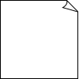
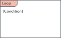

import Tabs from "@theme/Tabs";
import TabItem from "@theme/TabItem";

# Design Patterns: Definition

## Overview

<Tabs>
  <TabItem value="representation" label="Representation">
    <table>
      <thead>
      <tr>
        <th>Aspect</th>
        <th>Unified Modeling Language (UML)</th>
        <th>Business Process Model and Notation (BPMN)</th>
      </tr>
      </thead>
      <tbody>
      <tr>
        <td>Definition</td>
        <td>
          standardized visual language used in software engineering to model
          and describe software systems through graphical notations,
          facilitating communication and visualization of system structure,
          behavior, interactions, and architecture among project stakeholders
        </td>
        <td>
          standardized graphical notation for modeling business processes and
          workflows. It provides symbols and conventions to represent tasks,
          events, gateways, and flows, enabling stakeholders to document,
          analyze, and improve business processes visually
        </td>
      </tr>
      <tr>
        <td>Purpose</td>
        <td>modeling software systems/components</td>
        <td>modeling business processes/workflows</td>
      </tr>
      <tr>
        <td>Scope</td>
        <td>applicable in software engineering across industries</td>
        <td>focuses on business process modeling/automation</td>
      </tr>
      <tr>
        <td>Diagram Types</td>
        <td>
          <ul>
            <li>
              <b>Structural</b>
              <ul>
                <li>Class Diagram</li>
                <li>Component Diagram</li>
                <li>Composite Structure Diagram</li>
                <li>Deployment Diagram</li>
                <li>Object Diagram</li>
                <li>Package Diagram</li>
                <li>Profile Diagram</li>
              </ul>
            </li>
            <li>
              <b>Behavioral</b>
              <ul>
                <li>Activity Diagrams</li>
                <li>
                  <b>Interaction Diagram</b>
                  <ul>
                    <li>Communication Diagram</li>
                    <li>Interaction Overview Diagram</li>
                    <li>Sequence Diagram</li>
                    <li>Timing Diagram</li>
                  </ul>
                </li>
                <li>State Diagram</li>
                <li>Use Case Diagram</li>
              </ul>
            </li>
          </ul>
        </td>
        <td>
          <ul>
            <li>process</li>
            <li>collaboration</li>
            <li>choreography</li>
          </ul>
        </td>
      </tr>
      <tr>
        <td>audience</td>
        <td>software engineers, architects, developers</td>
        <td>architects, business analysts, managers</td>
      </tr>
      <tr>
        <td>Level of Detail</td>
        <td>detailed system modeling</td>
        <td>high-level abstraction of business processes</td>
      </tr>
      </tbody>
    </table>
  </TabItem>
  <TabItem value="oop" label="OOP Terms">

    - **Abstract Class**: A blueprint for other classes to inherit from, often containing common methods and properties
    - **Abstraction**: Simplifying complex systems by focusing on essential characteristics while hiding unnecessary details
    - **Aggregation Hierarchy**: A structure that organizes classes based on their aggregation relationships, forming a hierarchy of dependencies
    - **Aggregation**: A relationship where one class contains references to other classes, but the referenced classes can exist independently
    - **Association**: A relationship between classes where one class is related to another, typically indicating a usage or dependency
    - **Attribute**: A characteristic or property that describes an object
    - **Class**: A blueprint for creating objects that defines their structure and behavior
    - **Cohesion**: The degree to which the elements within a module belong together and work together towards a common purpose
    - **Collaboration**: Interaction among objects to achieve a common goal, often involving passing messages between objects
    - **Composition**: A stronger form of aggregation where the contained objects are part of the whole and have a lifecycle dependent on the container
    - **Concrete Class**: A class that can be instantiated to create objects directly
    - **Coupling**: The degree of interdependence between modules or classes within a system
    - **Encapsulation**: Bundling data and methods that operate on the data into a single unit, hiding the internal state of an object from the outside
    - **Information Hiding**: Restricting access to certain parts of an object, protecting its internal details from external interference
    - **Inheritance Hierarchy**: A structure that organizes classes based on their inheritance relationships, forming a hierarchy of specialization
    - **Inheritance**: A mechanism where a new class inherits properties and behavior from an existing class
    - **Instance**: A specific realization of a class, representing a unique object in memory
    - **Instantiate**: Creating an instance of a class, allocating memory for the object and initializing its properties
    - **Interface**: A set of methods that define the behavior expected from a class, providing a contract for how a class should interact with the outside world
    - **Message**: Communication between objects, often invoking a method on another object
    - **Messaging**: The process of sending and receiving messages between objects to achieve desired behaviors -
    - **Multiple Inheritance**: A feature in some programming languages where a class can inherit properties and behavior from multiple parent classes
    - **Multiplicity**: The cardinality of relationships, indicating how many instances of one class are associated with instances of another clas
    - **Object Space Database**: A database system that stores objects rather than traditional rows and columns
    - **Object**: An instance of a class representing a unique entity with its own state and behavior
    - **Object Oriented Programming (OOP)**: A programming paradigm centered around the concept of "objects," which are instances of classes representing real-world entities. OOP focuses on organizing code into modular units (objects) that encapsulate data and behavior. It promotes concepts like inheritance, polymorphism, and encapsulation to create reusable and maintainable code
    - **Operation**: A function or method that can be performed on an object
    - **Override**: Providing a new implementation for a method inherited from a superclass in a subclass
    - **Pattern**: A reusable solution to a common problem in software design
    - **Persistence**: The ability of data to outlast the execution of the program, typically achieved through storage in databases or files
    - **Persistent Object**: An object whose state is stored beyond the lifetime of the program execution
    - **Polymorphism**: The ability of objects to be treated as instances of their parent class or any of its subclasses
    - **Single Inheritance**: A restriction where a class can inherit properties and behavior from only one parent class
    - **Stereotype**: A fixed idea or image of a particular type of person or thing, often used in the context of classifying objects or behaviors
    - **Subclass**: A class that inherits properties and behavior from a superclass
    - **Superclass**: A class from which other classes inherit properties and behavior
    - **Transient Object**: An object that exists temporarily and is not stored permanently

  </TabItem>
</Tabs>

## UML

<Tabs>
  <TabItem value="umlTypes" label="UML Types">
    <Tabs>
      <TabItem value="class" label="Class Diagram" attributes={{className: "tabs__vertical"}}>
        The most commonly used UML diagram, representing classes, attributes, operations, and their relationships within a system.

        **Basic Components of a Class Diagram:**

        - **Upper Section**: Contains the class name, always required
        - **Middle Section**: Lists class attributes, necessary for specific instances
        - **Bottom Section**: Displays class operations (methods) in list format

        **Member Access Modifiers:**

        - Public (`+`)
        - Private (`-`)
        - Protected (`#`)
        - Package (`~`)
        - Derived (`/`)
        - Static (underlined)

        **Member Scopes:**

        - **Classifiers**: Static members
        - **Instances**: Specific class instances

        **Additional Class Diagram Components:**

        - **Classes**: Templates for object creation and behavior implementation
        - **Name, Attributes, Methods**: Key components of a class shape
        - **Signals, Data Types, Packages, Interfaces, Enumerations, Objects, Artifacts**: Various elements to represent system entities

        **Interactions:**

        - **Inheritance**: Child classes inheriting functionality from parent classes
        - **Bidirectional Association**: Mutual awareness between classes
        - **Unidirectional Association**: One-way interaction between classes
        <table>
          <thead>
          <tr>
            <th>Relationship Type</th>
            <th style={{minWidth: '350px'}}>Visualization</th>
            <th>Definition</th>
          </tr>
          </thead>
          <tbody>
          <tr>
            <td>Inheritance (Generalization)</td>
            <td>
              ```mermaid
              classDiagram
              direction LR
              classA --|> classB : Inheritance
              ```
              <p>**A** inherits properties and behavior from **B**</p>
            </td>
            <td>Represents "is-a" relationship. Parent-child relationship where the child class is based on the parent class, but with more specific functionality</td>
          </tr>
          <tr>
            <td>Composition</td>
            <td>
              ```mermaid
              classDiagram
              direction LR
              classA --* classB : Composition
              ```
              <p>**A** owns and manages the lifecycle of **B** (**B** cannot exist without **A**)</p>
            </td>
            <td>strong type of aggregation where the whole and part have a strong life cycle dependency. The part cannot exist without the whole</td>
          </tr>
          <tr>
            <td>Aggregation</td>
            <td>
              ```mermaid
              classDiagram
              direction LR
              classA --o classB : Aggregation
              ```
              <p>**A** owns and manages the lifecycle of **B** (**B** can exist independently)</p>
            </td>
            <td>special form of association where the whole and part have a relationship. The part can exist independently of the whole. It is also called a "has-a" relationship</td>
          </tr>
          <tr>
            <td>Association</td>
            <td>
              ```mermaid
              classDiagram
              direction LR
              classA --> classB : Association
              ```
              <p>**A** and **B** can access each other's methods and properties</p>
            </td>
            <td>relationship between two classes where one class uses the functionality of another class. It is usually bi-directional with a multiplicity of one or many</td>
          </tr>
          <tr>
            <td>Dependency</td>
            <td>
              ```mermaid
              classDiagram
              direction LR
              classA ..> classB: Dependency
              ```
              <p>**A** depends on **B** to function properly</p>
            </td>
            <td>relationship between two classes when changes to one class may cause changes to the other</td>
          </tr>
          <tr>
            <td>Realization</td>
            <td>
              ```mermaid
              classDiagram
              direction LR
              classA ..|> classB : Realization
              ```
              <p>**A** implements the behavior of **B**</p>
            </td>
            <td>relationship between two classes where one class implements the behavior specified by another. It is typically used in the context of interfaces</td>
          </tr>
          </tbody>
        </table>
      </TabItem>
      <TabItem value="complement" label="Component Diagram">
        Displays structural relationships of software system elements, particularly useful for complex systems with multiple components communicating via interfaces

        <table>
          <thead>
          <tr>
            <th>Type</th>
            <th style={{minWidth: '150px'}}>Visualization</th>
            <th>Definition</th>
          </tr>
          </thead>
          <tbody>
          <tr>
            <td>Component</td>
            <td></td>
            <td>represents a modular, reusable, and replaceable part of a system that encapsulates its behavior and data</td>
          </tr>
          <tr>
            <td>Node</td>
            <td></td>
            <td>
              represents hardware or software objects, which are of a higher level than components. It defines a boundary through which entities communicate with each other, facilitating interaction
              between different parts of a system
            </td>
          </tr>
          <tr>
            <td>Interface</td>
            <td></td>
            <td>represents a contract specifying a set of operations or behaviors that a class or component must implement</td>
          </tr>
          <tr>
            <td>Port</td>
            <td></td>
            <td>
              represents a point of interaction between a component and its environment or between different components within a system. Ports facilitate communication by providing access to
              services, data, or behavior offered by a component or required by another component. They serve as connection points through which messages can be sent and received, enabling the
              exchange of information and control between various parts of the system
            </td>
          </tr>
          <tr>
            <td>Package</td>
            <td></td>
            <td>
              represents a namespace for organizing and grouping elements, such as classes, components, and diagrams, into a cohesive unit. It serves as a container for organizing and managing the
              elements of a model, providing a way to structure and modularize complex systems
            </td>
          </tr>
          <tr>
            <td>Notes</td>
            <td></td>
            <td>
              annotations or comments that provide additional information about elements within a diagram. They are used to convey explanations, descriptions, constraints, or other important details
              that may not be readily apparent from the diagram itself
            </td>
          </tr>
          <tr>
            <td>Dependency</td>
            <td></td>
            <td>
              relationship between two elements in which a change in one element may affect the other element. It signifies that one element, called the client, relies on another element, called the
              supplier, in some way. Dependencies can be used to represent various types of relationships, such as the usage of one element by another, the inclusion of one element within another, or
              the reliance of one element on the services provided by another
            </td>
          </tr>
          <tr>
            <td>Provided Interface</td>
            <td></td>
            <td>
              offered or implemented by a component, class, or other architectural element. It specifies a set of operations or services that the element makes available for use by other elements in
              the system. Provided interfaces define the contract or protocol that clients can use to interact with the element, specifying the methods or behaviors that clients can invoke
            </td>
          </tr>
          <tr>
            <td>Required Interface</td>
            <td></td>
            <td>
              interface that a component, class, or other architectural element needs in order to function properly. It specifies a set of operations or services that the element expects to be
              provided by other elements in the system. Required interfaces define the dependencies or collaborations that the element relies on to fulfill its responsibilities or perform its tasks
            </td>
          </tr>
          </tbody>
        </table>
      </TabItem>
      <TabItem value="Composite" label="Composite Structure Diagram">
        Shows the internal structure of a class

        <table>
          <thead>
          <tr>
            <th>Type</th>
            <th style={{minWidth: '150px'}}>Visualization</th>
            <th>Definition</th>
          </tr>
          </thead>
          <tbody>
          <tr>
            <td>Terminator</td>
            <td></td>
            <td>indicates start and end points</td>
          </tr>
          <tr>
            <td>Node</td>
            <td>
              
              
            </td>
            <td>represents events or milestones and contain numbers</td>
          </tr>
          <tr>
            <td>Actor</td>
            <td></td>
            <td>interacts with the system from outside of the system (person, equipment, etc.)</td>
          </tr>
          <tr>
            <td>Class</td>
            <td></td>
            <td>groups objects with common properties or behaviors (common operations, parameters, attributes, etc.)</td>
          </tr>
          <tr>
            <td>Part</td>
            <td></td>
            <td>acts as a runtime instance of classes or interfaces</td>
          </tr>
          <tr>
            <td>Port</td>
            <td></td>
            <td>acts as an interaction point between a classifier instance (or its behavior) and its environment</td>
          </tr>
          <tr>
            <td>Interface</td>
            <td></td>
            <td>specifies behavior that the implementor agrees to meet</td>
          </tr>
          </tbody>
        </table>
      </TabItem>
      <TabItem value="deployment" label="Deployment Diagram">
        Illustrates system hardware and software deployment across multiple machines with unique configurations

        <table>
          <thead>
          <tr>
            <th>Type</th>
            <th style={{minWidth: '150px'}}>Visualization</th>
            <th>Definition</th>
          </tr>
          </thead>
          <tbody>
          <tr>
            <td>Package</td>
            <td></td>
            <td>organizes elements, such as components or nodes, into logical groups to manage complexity and enhance clarity in system design</td>
          </tr>
          <tr>
            <td>Object</td>
            <td></td>
            <td>represents an instance of a class or entity in a system, displaying its state and behavior</td>
          </tr>
          <tr>
            <td>Node</td>
            <td></td>
            <td>physical or virtual computing resource in a system, such as a server, workstation, or device</td>
          </tr>
          <tr>
            <td>Component</td>
            <td></td>
            <td>modular, reusable, and replaceable part of a system that encapsulates its behavior and data</td>
          </tr>
          <tr>
            <td>Interface</td>
            <td></td>
            <td>defines a contract for communication or interaction between components, nodes, or systems</td>
          </tr>
          </tbody>
        </table>
      </TabItem>
      <TabItem value="object" label="Object Diagram">
        Illustrates object relationships using real-world examples, depicting the system's state at a given time

        <table>
            <thead>
                <tr>
                    <th>Type</th>
                    <th style={{minWidth: '150px'}}>Visualization</th>
                    <th>Definition</th>
                </tr>
            </thead>
            <tbody>
                <tr>
                    <td>Object</td>
                    <td></td>
                    <td>represents an instance of a class or entity in a system, displaying its state and behavior</td>
                </tr>
            </tbody>
        </table>
      </TabItem>
      <TabItem value="package" label="Package Diagram">
        Represents package dependencies and system architecture levels using package import and merge mechanisms

        <table>
            <thead>
                <tr>
                    <th>Type</th>
                    <th style={{minWidth: '150px'}}>Visualization</th>
                    <th>Definition</th>
                </tr>
            </thead>
            <tbody>
                <tr>
                    <td>Package</td>
                    <td></td>
                    <td>organizes elements, such as components or nodes, into logical groups to manage complexity and enhance clarity in system design</td>
                </tr>
            </tbody>
        </table>
      </TabItem>
      <TabItem value="activity" label="Activity Diagram">
        Graphical representation of business or operational workflows, an alternative to State Machine diagrams

        **Key aspects**

        - **Action**: A step in the activity wherein the users or software perform a given task
        - **Decision node**: A conditional branch in the flow that is represented by a diamond. It includes a single input and two or more outputs
        - **Control flows**: Another name for the connectors that show the flow between steps in the diagram
        - **Start node**: Symbolizes the beginning of the activity. The start node is represented by a black circle
        - **End node**: Represents the final step in the activity. The end node is represented by an outlined black circle

        <table>
            <thead>
                <tr>
                    <th>Type</th>
                    <th style={{minWidth: '150px'}}>Visualization</th>
                    <th>Definition</th>
                </tr>
            </thead>
            <tbody>
                <tr>
                    <td>Start</td>
                    <td></td>
                    <td>Represents the beginning of a process or workflow in an activity diagram. It can be used by itself or with a note symbol that explains the starting point</td>
                </tr>
                <tr>
                    <td>Activity</td>
                    <td></td>
                    <td>Indicates the activities that make up a modeled process. These symbols, which include short descriptions within the shape, are the main building blocks of an activity diagram</td>
                </tr>
                <tr>
                    <td>Connector</td>
                    <td></td>
                    <td>Shows the directional flow, or control flow, of the activity. An incoming arrow starts a step of an activity; once the step is completed, the flow continues with the outgoing arrow</td>
                </tr>
                <tr>
                    <td>Joint symbol/ Synchronization bar</td>
                    <td></td>
                    <td>Combines two concurrent activities and re-introduces them to a flow where only one activity occurs at a time</td>
                </tr>
                <tr>
                    <td>Fork</td>
                    <td></td>
                    <td>Splits a single activity flow into two concurrent activities</td>
                </tr>
                <tr>
                    <td>Decision</td>
                    <td></td>
                    <td>Represents a decision and always has at least two paths branching out with condition text to allow users to view options. This symbol represents the branching or merging of various flows with the symbol acting as a frame or container</td>
                </tr>
                <tr>
                    <td>Note</td>
                    <td></td>
                    <td>Allows the diagram creators or collaborators to communicate additional messages that don't fit within the diagram itself. Leave notes for added clarity and specification</td>
                </tr>
                <tr>
                    <td>Send signal</td>
                    <td></td>
                    <td>Indicates that a signal is being sent to a receiving activity</td>
                </tr>
                <tr>
                    <td>Receive signal</td>
                    <td></td>
                    <td>Demonstrates the acceptance of an event. After the event is received, the flow that comes from this action is completed</td>
                </tr>
                <tr>
                    <td>Shallow history pseudostate</td>
                    <td></td>
                    <td>Represents a transition that invokes the last active state</td>
                </tr>
                <tr>
                    <td>Option loop</td>
                    <td></td>
                    <td>Allows the creator to model a repetitive sequence within the option loop</td>
                </tr>
                <tr>
                    <td>Flow final</td>
                    <td></td>
                    <td>Represents the end of a specific process flow. This symbol shouldn’t represent the end of all flows in an activity; in that instance, you would use the end symbol. The flow final symbol should be placed at the end of a process in a single activity flow</td>
                </tr>
                <tr>
                    <td>Condition text</td>
                    <td></td>
                    <td>Placed next to a decision marker to let you know under what condition an activity flow should split off in that direction</td>
                </tr>
                <tr>
                    <td>End</td>
                    <td></td>
                    <td>Marks the end state of an activity and represents the completion of all flows of a process</td>
                </tr>
            </tbody>
        </table>
      </TabItem>
      <TabItem value="communication" label="Communication Diagram">
        Focuses on messages passed between objects, similar to sequence diagrams but emphasizing communication.

        Communication diagrams provide a deeper insight into how components interact, prioritizing communication flow over event sequencing.

        Unlike sequence diagrams, they excel at illustrating:

        - **Procedure Logic Modeling**: Depicting complex procedures, functions, or operations logically
        - **Command Exchange**: Clarifying how commands traverse between process components or objects
        - **Interaction Consequences**: Visualizing the outcomes resulting from component interactions
        - **Functionality Planning**: Assisting in comprehending intricate functionalities of current or prospective scenarios

        In essence, communication diagrams emphasize component interaction dynamics, aiding in comprehensive understanding and planning within programs
      </TabItem>
      <TabItem value="sequence" label="Sequence Diagram">
        Represents object interactions and their order of occurrence for a particular scenario

        <table>
            <thead>
                <tr>
                    <th>Type</th>
                    <th style={{minWidth: '150px'}}>Visualization</th>
                    <th>Definition</th>
                </tr>
            </thead>
            <tbody>
            <tr>
                <td>Object</td>
                <td></td>
                <td>Represents a class or object in UML. The object symbol demonstrates how an object will behave in the context of the system. Class attributes should not be listed in this shape</td>
            </tr>
            <tr>
                <td>Activation</td>
                <td></td>
                <td>Represents the time needed for an object to complete a task. The longer the task will take, the longer the activation box becomes</td>
            </tr>
            <tr>
                <td>Actor</td>
                <td></td>
                <td>Shows entities that interact with or are external to the system</td>
            </tr>
            <tr>
                <td>Package</td>
                <td></td>
                <td>Used to contain interactive elements of the diagram. Also known as a frame</td>
            </tr>
            <tr>
                <td>Lifeline</td>
                <td></td>
                <td>Represents the passage of time as it extends downward. This dashed vertical line shows the sequential events that occur to an object during the charted process. Lifelines may begin with a labeled rectangle shape or an actor symbol</td>
            </tr>
            <tr>
                <td>Option loop</td>
                <td></td>
                <td>Used to model if/then scenarios, i.e., a circumstance that will only occur under certain conditions</td>
            </tr>
            <tr>
                <td>Alternative</td>
                <td></td>
                <td>Symbolizes a choice (that is usually mutually exclusive) between two or more message sequences</td>
            </tr>
            <tr>
                <td>Synchronous message</td>
                <td></td>
                <td>Used when a sender must wait for a response to a message before it continues. The diagram should show both the call and the reply</td>
            </tr>
            <tr>
                <td>Asynchronous message</td>
                <td></td>
                <td>Asynchronous messages don't require a response before the sender continues. Only the call should be included in the diagram</td>
            </tr>
            <tr>
                <td>Asynchronous return message</td>
                <td></td>
                <td>Represented by a dashed line with a lined arrowhead</td>
            </tr>
            <tr>
                <td>Asynchronous create message</td>
                <td></td>
                <td>This message creates a new object</td>
            </tr>
            <tr>
                <td>Delete message</td>
                <td></td>
                <td>This message destroys an object</td>
            </tr>
            </tbody>
        </table>
      </TabItem>
      <TabItem value="state" label="State Machine Diagram">
        Describes the behavior of objects in different states, similar to activity diagrams
      </TabItem>
      <TabItem value="useCase" label="Use Case Diagram">
        Represents system functionalities and their relationships, illustrating internal/external controllers (actors)

        **Use Cases**

        - Representing the goals of system-user interactions
        - Defining and organizing functional requirements in a system
        - Specifying the context and requirements of a system
        - Modeling the basic flow of events in a use case

        **Common Components**

        - **Actors**: Users interacting with the system, including people, organizations, or external systems
        - **System**: Represents the sequence of actions and interactions involving actors and the system
        - **Goals**: End results of use cases, described through activities and variants leading to achievement
      </TabItem>
    </Tabs>

  </TabItem>
  <TabItem value="bestPractices" label="Best Practices">
    - **Use Consistent Naming Conventions**: Always use standard naming conventions for your UML diagrams. This will ensure that all stakeholders understand the diagrams without any confusion
    - **Avoid Using Excessive Details**: UML diagrams should be simple and not cluttered with unnecessary information. If the diagram becomes too complex, it will be difficult to understand
    - **Use Correct Symbols and Notations**: UML has a set of standard symbols and notations. Make sure you use the correct ones for the appropriate elements in your diagrams
    - **Keep Diagrams Small**: Large diagrams can be difficult to read and understand. Break down complex processes into smaller, manageable diagrams
    - **Use Color Coding**: Color coding can be used to highlight different elements or differentiate between different types of information
    - **Use Notes and Comments**: Use notes and comments to explain complex parts of the diagrams or to provide additional information
    - **Use Layers**: If your diagram is complex, use layers to separate different parts of the diagram. This makes it easier to understand the diagram
    - **Use Diagrams to Complement Text**: Diagrams should not replace text, but complement it. Use diagrams to illustrate complex processes or structures that are difficult to explain in words
    - **Use Real-world Examples**: Whenever possible, use real-world examples in your diagrams. This makes the diagrams more relatable and easier to understand
    - **Validate Your Diagrams**: Always validate your diagrams to ensure that they accurately represent the system or process you are modeling
    - **Use the Right Type of Diagram**: UML has several types of diagrams. Make sure you use the right type for the task at hand
    - **Use a Standardized Layout**: Use a standardized layout for your diagrams. This makes it easier for others to understand your diagrams
    - **Collaborate with Others**: Collaborate with other stakeholders when creating your diagrams. This ensures that all perspectives are considered and that the diagrams are understood by all
    - **Use Version Control**: As your system evolves, so too will your diagrams. Use version control to keep track of changes and maintain a history of your diagrams
    - **Regularly Review and Update Your Diagrams**: Regularly review and update your diagrams to ensure they accurately represent the current state of your system or process
    - **Use Abstraction and Generalization**: Use abstraction and generalization to simplify complex systems and make them easier to understand
    - **Avoid Redundancy**: Do not duplicate elements or information in your diagrams
    - **Use Association, Aggregation, and Composition Wisely**: Understand and use these relationships appropriately in your diagrams
    - **Make Effective Use of Stereotypes**: Stereotypes can help to clarify the meaning of elements in your diagrams. Use them effectively
  </TabItem>
  <TabItem value="prosAndCons" label="Pros and Cons">
    **Pros:**
    - **Standardization**: uniform method to portray system models, ensuring consistent communication among developers and stakeholders
    - **Communication**: act as a robust communication medium among stakeholders, simplifying the exchange of intricate concepts
    - **Visualization**: aid in visualizing system components, relationships, and processes, enhancing comprehension and system design
    - **Documentation**: serve as efficient documentation tools, systematically capturing various system aspects such as architecture, design, and behavior
    - **Analysis and Design**: supports both software analysis and design phases, facilitating the modeling of system requirements and their transformation into implementable designs

    **Cons:**
    - **Complexity**: is intricate, especially for newcomers, requiring substantial time and effort to master its various aspects
    - **Overhead**: detailed UML diagrams can be time-consuming to create and maintain, potentially outweighing their benefits for small or straightforward projects
    - **Ambiguity**: interpretation can be subjective, leading to potential confusion as different individuals may perceive them differently
    - **Learning Curve**: UML's extensive features necessitate a steep learning curve, often requiring training and experience for effective utilization by teams
    - **Over-Modeling or Under-Modeling**: risk either excessive detail (over-modeling) or omission of crucial information (under-modeling), necessitating a delicate balance for optimal effectiveness

  </TabItem>
</Tabs>

## Clean Code

<Tabs>
    <TabItem value="overview" label="Overview">
      
    </TabItem>
    <TabItem value="principles" label="Principles">
      - **Elegant**: Pleasing to read with clear structure and logic
      - **Efficient**: Doesn't waste resources, performs well, and avoids complexity
      - **Error-free**: Minimizes bugs, handles errors gracefully
      - **Expressive**: Clearly communicates intent using meaningful names and comments
      - **Extensible**: Easily adaptable to changing requirements
      - **Modular**: Composed of small, reusable units following the single responsibility principle
    </TabItem>
    <TabItem value="benefits" label="Benefits">
      - **Productivity**: Simplifies writing, reading, debugging, testing, and maintenance, reducing time and effort for new features, bug fixes, and refactoring
      - **Quality**: Enhances user experience and satisfaction by meeting both functional and non-functional software requirements such as performance, security, reliability, and usability
      - **Collaboration**: Facilitates teamwork and knowledge sharing, enabling quick understanding of code and effective collaboration on complex projects
      - **Learning**: Aids developers in skill improvement and technology acquisition through exposure to best practices, design patterns, and coding standards, enhancing coding abilities
    </TabItem>
    <TabItem value="guidelines" label="Guidelines">
       **General**

       - Follow standard conventions
       - Keep it simple stupid
       - Follow the Boy Scout Rule
       - Always identify the root cause

       **Design**

       - Keep configurable data at high levels
       - Favor polymorphism over if/else or switch/case statements
       - Separate multi-threading code
       - Avoid over-configurability
       - Use dependency injection
       - Adhere to the Law of Demeter

       **Understandability**

       - Be consistent
       - Use explanatory variables
       - Encapsulate boundary conditions
       - Favor dedicated value objects over primitive types
       - Avoid logical dependencies
       - Avoid negative conditionals

       **Naming Conventions**

       - Opt for descriptive and unambiguous names
       - Make meaningful distinctions
       - Use pronounceable names
       - Use searchable names
       - Replace magic numbers with named constants
       - Don’t append prefixes or type information

       **Function**

       - Keep functions small
       - Ensure functions do one thing only
       - Use descriptive names
       - Favor fewer arguments
       - Functions should not have side effects
       - Avoid flag arguments

       **Comments**

       - Strive to explain yourself in code, not comments
       - Avoid redundancy in comments
       - Don’t add unnecessary noise through comments
       - Don’t use closing brace comments
       - Don’t comment out code, just remove it
       - Use comments to explain intent, clarify code, and warn of consequences

       **Source Code Structure**

       - Separate concepts vertically
       - Related code should appear vertically dense
       - Declare variables close to where they are used
       - Dependent functions should be close together in your code structure
       - Similar functions should be grouped together in your code structure
       - Place functions in a downward direction in your code structure
       - Keep lines of code short for readability purposes
       - Avoid horizontal alignment in your code structure
       - Use white space to associate related things and disassociate weakly related things in your code structure
       - Maintain consistent indentation throughout your code structure

       **Objects and Data Structures**

       - Internal structure should be hidden within objects and data structures
       - Favor data structures over objects when possible
       - Avoid hybrid structures (half object and half data)
       - Objects and data structures should be small and do one thing only
       - They should have a small number of instance variables
       - Base classes should not know anything about their derivatives
       - It’s better to have many functions than to pass some code into a function to select a behavior
       - Non-static methods are generally preferable to static methods

       **Testing**

       - One assert per test
       - Readable
       - Fast
       - Independent
       - Repeatable

       **Code Smells**

       - Rigidity
       - Fragility
       - Immobility
       - Needless Complexity
       - Needless Repetition
       - Clearness
    </TabItem>
</Tabs>

## Architectural Styles

<Tabs>
    <TabItem value="definition" label="Definition">
        Architectural style is a framework of guidelines dictating the structure and organization of a software system, encompassing component roles, interactions, and dependencies. It also addresses non-functional aspects like scalability, performance, security, testability, and maintainability. While not rigid, it offers a flexible approach adaptable to project requirements. There's no one-size-fits-all solution; instead, various trade-offs and considerations must be weighed to select the most suitable style for a given scenario
    </TabItem>
    <TabItem value="benefits" label="Benefits">
        - **Modularity**: breaking down a complex system into smaller and simpler components that can be developed, tested, deployed, and maintained independently
        - **Reusability**: avoiding duplication of code and logic by creating reusable components that can be shared across different parts of the system or even across different systems
        - **Extensibility**: allowing the system to evolve and adapt to changing requirements and new features by adding or modifying components without affecting the existing ones
        - **Testability**: making the system easier to test by isolating the components and their dependencies and providing clear interfaces and contracts between them
        - **Maintainability**: making the system easier to understand, modify, debug, and refactor by following consistent and coherent conventions and principles
        - **Decoupling**: reducing the coupling or dependency between components by minimizing the amount of information and behavior they share or expose to each other
    </TabItem>
    <TabItem value="performance" label="Software Performance">
        Software performance refers to the ability of a software system to execute its intended functions within a certain time frame and with optimal use of resources. It is a critical aspect of software development and maintenance, as it directly impacts the user experience, system reliability, and overall efficiency.

        Software performance can be defined as the measure of how well a software system executes its intended functions and responds to user input within a specified time frame.

        It encompasses various aspects, including:

        - **Response** time: The time it takes for the system to respond to user input or queries
        - **Throughput**: The number of tasks or requests the system can process within a given time frame
        - **Resource** utilization: The efficiency with which the system uses hardware and software resources, such as CPU, memory, disk I/O, and network bandwidth
        - **Scalability**: The system’s ability to handle increased workload or user traffic without a significant decrease in performance
        - **Reliability**: The system’s ability to perform its intended functions consistently and without errors or failures

        **Key Performance Indicators (KPIs) for Software Systems**

        Key Performance Indicators (KPIs) are measurable values that demonstrate how effectively a software system is achieving its intended goals.

        Some common KPIs for software performance include:

        - **Response** time: Average response time, response time variability, and response time distribution
        - **Throughput**: Number of requests processed per unit time, such as requests per second (RPS) or transactions per minute (TPM)
        - **Resource utilization**: CPU usage, memory usage, disk I/O, network bandwidth, and database queries per second
        - **Scalability**: Number of users, concurrent connections, or requests handled by the system without significant performance degradation
        - **Reliability**: Mean time between failures (MTBF), mean time to recover (MTTR), and error rates

        **Factors that Affect Software Performance**

        - **Hardware resources**: Availability, utilization, and performance of hardware components, such as CPU, memory, storage, and network interfaces
        - **Software architecture**: Design and structure of the software system, including the number of layers, components, and interactions between them
        - **Algorithmic complexity**: The time and space complexity of algorithms used in the software, which can impact response time and resource utilization
        - **Data size and growth**: The amount of data processed and stored by the system, which can affect performance as the data set grows
        - **User behavior**: Patterns and intensity of user activity, such as the number of concurrent users, frequency of requests, and usage patterns
        - **Network and I/O performance**: Network latency, packet loss, and I/O operations can impact the system’s ability to retrieve and process data
        - **Resource contention**: Competition for shared resources, such as CPU, memory, and I/O devices, which can lead to performance bottlenecks
        - **Interference and noise**: Interference from other systems or background processes, as well as random fluctuations in system performance, can affect software performance

        **Methods for Measuring and Monitoring Software Performance**

        - **Synthetic transactions**: Simulating user interactions to measure response time, throughput, and resource utilization
        - **Real-user monitoring**: Tracking actual user interactions to assess performance from the end-user perspective
        - **Load testing**: Testing the system under varying loads to evaluate its scalability and performance under different workloads
        - **Stress testing**: Testing the system under extreme conditions, such as high concurrency or large data sets, to identify performance bottlenecks
        - **End-user experience monitoring**: Monitoring user experience metrics, such as page load times, error rates, and user satisfaction
        - **Performance modeling**: Creating mathematical models of the system to predict performance under different conditions and optimize system configuration
        - **Performance benchmarking**: Comparing the system’s performance to industry-standard benchmarks or competing systems
        - **Root cause analysis**: Identifying the underlying causes of performance issues through techniques such as profiling, tracing, and logging
    </TabItem>
    <TabItem value="styles" label="Architectural Styles">
        **Ways to Apply Architectural Style**

        - **Entire system**: defining the high-level structure and organization of the system as a whole, such as how it is divided into subsystems or modules, how they communicate with each other, and how they interact with external systems or services
        - **Subsystem or module**: defining the internal structure and organization of a subsystem or module within the system, such as how it is divided into components or classes, how they collaborate with each other, and how they expose their functionality to other subsystems or modules
        - **Component or class**: defining the internal structure and organization of a component or class within a subsystem or module, such as how it is divided into methods or functions, how they implement the logic and behavior of the component or class, and how they access data or resources

        **Overview**

        <table>
            <thead>
                <tr>
                    <th>Architectural Style</th>
                    <th>Definition</th>
                    <th>Technical Concepts</th>
                </tr>
            </thead>
            <tbody>
                <tr>
                    <td>Asynchronous Messaging</td>
                    <td>Pattern where the sender and receiver of a message don't need to interact with the message queue at the same time</td>
                    <td>
                        <ul>
                            <li><b>Decoupling</b>: This refers to the lack of a direct connection between the sender and receiver, allowing them to operate independently</li>
                            <li><b>Message Exchange Architectures</b>: These are structures designed for transferring messages between a sender and receiver</li>
                            <li><b>Eventual Consistency</b>: This concept suggests that changes made to one service may potentially lead to unintended and negative consequences in other parts of the system</li>
                        </ul>
                    </td>
                </tr>
                <tr>
                    <td>Blackboard</td>
                    <td>Decentralized problem-solving model that uses a modular approach. It’s designed to tackle complex problems that don’t have a clear algorithm or pre-set architecture</td>
                    <td>
                        <ul>
                          <li><b>Initialization:</b> The blackboard is prepared with the initial problem statement and any available input data</li>
                          <li><b>Activation:</b> Based on the current state of the problem and the data on the blackboard, the controller selects and activates one or more knowledge sources</li>
                          <li><b>Execution:</b> The activated knowledge sources independently analyze the problem, apply their specialized algorithms or techniques, and produce partial solutions or hypotheses</li>
                          <li><b>Conflict resolution:</b> If multiple knowledge sources generate conflicting or overlapping solutions, a conflict resolution mechanism is used to reconcile the differences and select the most appropriate solution(s)</li>
                          <li><b>Update:</b> The knowledge sources update the blackboard with their outputs, such as new constraints, proposed solutions, or intermediate results</li>
                          <li><b>Iteration:</b> The controller repeats the activation and execution steps until a satisfactory solution is reached, convergence criteria are met, or a predefined time limit is exceeded</li>
                        </ul>
                    </td>
                </tr>
                <tr>
                    <td>Client-Server</td>
                    <td>Model of interaction in a distributed system where software runs on local client devices and connects to remote server resources</td>
                    <td>
                        <ul>
                          <li><b>Loose coupling:</b> Clients and servers are separate entities that communicate over a network</li>
                          <li><b>Horizontal scaling:</b> Servers can be added to handle increased load</li>
                          <li><b>Distributed database:</b> Data can be stored across multiple servers, improving availability and performance</li>
                          <li><b>Asynchronous communication:</b> Clients make requests to servers and continue processing until the server responds</li>
                          <li><b>Stateless or stateful:</b> Servers can be designed to be stateless for scalability or stateful for simplicity</li>
                        </ul>
                    </td>
                </tr>
                <tr>
                    <td>Cloud Computing Patterns</td>
                    <td>Adapting to the many new possibilities but very different set of architectural constraints offered by the cloud compared to traditional on-premises infrastructure</td>
                    <td>
                        <ul>
                          <li><b>Functional requirements:</b> What the system should do</li>
                          <li><b>Non-functional requirements:</b> How the system should perform</li>
                          <li><b>Constraints:</b> What is out-of-scope to change</li>
                          <li><b>Self-healing:</b> The system should be able to recover from failures automatically</li>
                          <li><b>Cost efficient:</b> The system should make optimal use of resources to minimize costs</li>
                          <li><b>Continuous Integration/Continuous Delivery (CI/CD):</b> The system should be easily updated and maintained</li>
                        </ul>
                    </td>
                </tr>
                <tr>
                    <td>Component-Based</td>
                    <td>Framework for building software based on reusable components. It provides a higher level of abstraction and divides the problem into sub-problems, each associated with component partitions</td>
                    <td>
                        <ul>
                          <li><b>Components:</b> The building blocks that are highly flexible, modular, and reused across several projects. They follow repeatable conventions and can be used across other interfaces and modules without compromising the integrity of your code or UX</li>
                          <li><b>Interfaces:</b> Well-defined communication interfaces containing methods, events, and properties</li>
                          <li><b>Contracts:</b> Define the functionality provided by the component and the functionality required from the system to be operational</li>
                          <li><b>Component models and frameworks:</b> Define standards for component implementation, composition, and deployment</li>
                          <li><b>Composition:</b> The way components are assembled to form a system</li>
                          <li><b>Certification:</b> The process of verifying that a component meets its specification</li>
                        </ul>
                    </td>
                </tr>
                <tr>
                    <td>Database-Centric</td>
                    <td>Treats data as a valuable and versatile asset, acknowledging its role in the larger enterprise and industry ecosystem</td>
                    <td>
                        <ul>
                          <li><b>Centralized Data:</b> Refers to data collected and stored in one place, allowing frequent access and modification by various components</li>
                          <li><b>Security, Integration, Portability, and Analysis:</b> Significantly simplified in a data-centric approach, facilitating faster insights across the entire data value chain</li>
                          <li><b>Interoperability and Versatility:</b> By freeing data from a single monolithic stack, there are greater opportunities for accelerating digital transformation</li>
                        </ul>
                    </td>
                </tr>
                <tr>
                    <td>Domain-Driven Design (DDD)</td>
                    <td>Architecture style that focuses on modeling business domains and their logic in code</td>
                    <td>
                        <ul>
                          <li><b>Domain model:</b> A central, conceptual model of the business domain that guides the design of the application</li>
                          <li><b>Bounded context:</b> A self-contained model representing a specific aspect of the business domain</li>
                          <li><b>Ubiquitous language:</b> A shared language used across the entire development team to describe the domain model</li>
                        </ul>
                    </td>
                </tr>
                <tr>
                    <td>Event-Driven</td>
                    <td>Design pattern that organizes the application around the production, transformation, and consumption of events</td>
                    <td>
                        <ul>
                          <li><b>Event sources:</b> Services or systems that generate events</li>
                          <li><b>Event processors:</b> Services or systems that consume and process events</li>
                          <li><b>Event stores:</b> Systems that store events for later processing</li>
                        </ul>
                    </td>
                </tr>
                <tr>
                    <td>Layered</td>
                    <td>Architecture that separates the application into distinct layers, each with its own set of responsibilities</td>
                    <td>
                        <ul>
                          <li><b>Logical separation of components:</b> Components that are related or similar are usually placed on the same layers</li>
                          <li><b>Layers of isolation:</b> Layers can be modified and the change won't affect other layers</li>
                          <li><b>Separation of concerns:</b> The modules on a single layer together perform a single function</li>
                        </ul>
                    </td>
                </tr>
                <tr>
                    <td>Microkernel</td>
                    <td>A type of operating system kernel that is designed to provide only the most basic services required for an operating system to function</td>
                    <td>
                        <ul>
                          <li><b>Minimal functional core:</b> Only essential services run in kernel space, such as low-level address space management, thread management, and inter-process communication (IPC)</li>
                          <li><b>User-level processes:</b> Services like device drivers and file systems are implemented as user-level processes, communicating with the microkernel via message passing</li>
                          <li><b>Modularity and flexibility:</b> The system is designed to easily add, remove, or replace services without affecting other parts of the system</li>
                        </ul>
                    </td>
                </tr>
                <tr>
                    <td>Model–View–Controller</td>
                    <td>Design pattern that separates an application into 3 interconnected components: the model, the view, and the controller</td>
                    <td>
                        <ul>
                          <li><b>Model:</b> The heart of the system, managing the data, logic, and rules of the application</li>
                          <li><b>View:</b> Represents any output of information</li>
                          <li><b>Controller:</b> Accepts input and transforms it into commands for either the model or view</li>
                        </ul>
                    </td>
                </tr>
                <tr>
                    <td>Monolithic Application</td>
                    <td>Single, self-contained unit that includes all the components and functionality of the application</td>
                    <td>
                        <ul>
                          <li><b>Tight coupling:</b> Components are closely integrated and communicate directly with each other</li>
                          <li><b>Vertical scaling:</b> The entire application is deployed and scaled as a single unit</li>
                          <li><b>Shared database:</b> A single database is used to store all data for the application</li>
                        </ul>
                    </td>
                </tr>
                <tr>
                    <td>Multitier Architecture</td>
                    <td>Client–server architecture in which presentation, application processing, and data management functions are physically separated</td>
                    <td>
                        <ul>
                          <li><b>N-tier architecture:</b> Software engineering approach where processing, data management, and presentation functions are physically and logically separated</li>
                          <li><b>Three-tier architecture:</b> Consists of 3 components: a presentation tier, a logic tier, and a data tier</li>
                          <li><b>Layer vs Tier:</b> A layer refers to the logical structure of elements in a software solution, while a tier refers to the physical structure of hardware elements in the system infrastructure</li>
                        </ul>
                    </td>
                </tr>
                <tr>
                    <td>Object Request Broker</td>
                    <td>Middleware architecture used in distributed computing to coordinate and enable communication between registered servers and clients</td>
                    <td>
                        <ul>
                          <li><b>Language Independence:</b> CORBA is not associated with a particular programming language, and any language with a CORBA binding can be used to call and implement CORBA objects</li>
                          <li><b>Interface Definition Language (IDL):</b> Objects are described in a syntax called IDL</li>
                          <li><b>Object Request Broker (ORB):</b> The ORB handles communication, marshaling, and unmarshaling of parameters, making parameter handling transparent for CORBA server and client applications</li>
                          <li><b>Naming Service:</b> The naming service holds references to CORBA objects</li>
                        </ul>
                    </td>
                </tr>
                <tr>
                    <td>Peer-to-Peer</td>
                    <td>Network architecture where each workstation, or node, has the same capabilities and responsibilities</td>
                    <td>
                        <ul>
                          <li><b>Decentralized:</b> Tasks are distributed among all peers, eliminating the need for a central server</li>
                          <li><b>Equal Contribution:</b> Every device in the network functions as both a client and a server</li>
                          <li><b>Resilience to Change:</b> The network can adapt to changes in its participants</li>
                          <li><b>Elimination of Single Points of Failure:</b> The dual role of peers as both clients and servers helps avoid single points of failure, making this architecture useful for applications that require high reliability</li>
                          <li><b>Resource Sharing:</b> The network allows for the sharing of resources among peers</li>
                        </ul>
                    </td>
                </tr>
                <tr>
                    <td>Pipes and Filters</td>
                    <td>Architectural pattern for stream processing. It consists of one or more components called filters</td>
                    <td>
                        <ul>
                          <li><b>Filters:</b> Components that transform or filter data, such as sorting and counting functions</li>
                          <li><b>Pipes:</b> Connectors that pass data from one filter to another</li>
                          <li><b>Independent Processing:</b> Filters do not share state with other filters, allowing them to work independently without needing to know the identity of their upstream or downstream filters</li>
                          <li><b>Change Resilience:</b> New filters can be added to existing systems since filters are separate from each other and connected by explicit connectors</li>
                        </ul>
                    </td>
                </tr>
                <tr>
                    <td>Presentation–Abstraction–Control (PAC)</td>
                    <td>Interaction-oriented software architecture that separates an interactive system into 3 types of components</td>
                    <td>
                        <ul>
                          <li><b>Abstraction Component:</b> Retrieves and processes data</li>
                          <li><b>Presentation Component:</b> Formats the visual and audio presentation of data</li>
                          <li><b>Control Component:</b> Handles the flow of control and communication between the other two components</li>
                        </ul>
                    </td>
                </tr>
                <tr>
                    <td>Publish-Subscribe</td>
                    <td>Messaging system where publishers categorize messages into classes without knowing the subscribers. Subscribers, on the other hand, show interest in certain classes of messages and receive only those, without knowing the publishers</td>
                    <td>
                        <ul>
                          <li><b>Decoupling:</b> Publishers and subscribers are independent entities, connected only through a message queue</li>
                          <li><b>Asynchronous communication:</b> Messages are exchanged without requiring immediate acknowledgement, allowing tasks to continue uninterrupted</li>
                          <li><b>Scalability:</b> The system can easily accommodate new publishers and subscribers without disruption</li>
                          <li><b>Fault tolerance:</b> If a message isn't processed successfully, it can be retried or moved to a separate queue for handling errors</li>
                        </ul>
                    </td>
                </tr>
                <tr>
                    <td>Reflection</td>
                    <td>Architectural style based on the concept of reflection, which allows a system to observe and modify its own structure and behavior</td>
                    <td>
                        <ul>
                          <li><b>Reification:</b> The process of making something real, bringing something into being, or making something concrete</li>
                          <li><b>Structural Language:</b> A declarative language that defines an architecture’s static skeleton</li>
                          <li><b>Dynamic Language:</b> An imperative language that appears as a set of constraining rules written in a concurrent language</li>
                          <li><b>Behavioral and structural reflection:</b> Involves agent computation and structure</li>
                          <li><b>Pre-reflective architecture:</b> There exists a particular precognitive communication between an architectural work and the body, which shapes the overall (embodied) experience of an architectural setting</li>
                        </ul>
                    </td>
                </tr>
                <tr>
                    <td>Representational State Transfer (REST)</td>
                    <td>Architectural style that uses a subset of HTTP. It is commonly used to create interactive applications that use Web services</td>
                    <td>
                        <ul>
                          <li><b>Stateless:</b> Each request from client to server must contain all the information needed to understand and process the request</li>
                          <li><b>Client-Server:</b> The client and server are separate entities that communicate over a network</li>
                          <li><b>Cacheable:</b> Clients can cache responses to improve performance</li>
                          <li><b>Layered System:</b> The architecture is composed of hierarchical layers, providing a high level of abstraction</li>
                          <li><b>Uniform Interface:</b> The method of communication between the client and server is standardized</li>
                        </ul>
                    </td>
                </tr>
                <tr>
                    <td>Rule-Based</td>
                    <td>Architectural style where the system’s behavior is dictated by a set of rules</td>
                    <td>
                        <ul>
                          <li><b>Rule Engine:</b> The core component that interprets and executes rules</li>
                          <li><b>Rules:</b> Defined in a specific format, often IF-THEN-ELSE statements</li>
                          <li><b>Fact Model:</b> The data on which rules operate</li>
                          <li><b>Rulebase:</b> The storage of rules</li>
                          <li><b>Inference Engine:</b> Applies the rules to the known facts to deduce new facts</li>
                          <li><b>Working Memory:</b> Stores the facts the system currently knows</li>
                        </ul>
                    </td>
                </tr>
                <tr>
                    <td>Sensor–Controller–Actuator</td>
                    <td>Architectural pattern that helps with actuating in face of several input senses</td>
                    <td>
                        <ul>
                          <li><b>Sensing:</b> Responsible for collecting sensor data</li>
                          <li><b>Planning:</b> Processes sensor data and passes information to the controller</li>
                          <li><b>Execution:</b> Also known as the controller, sends actuator commands based on information received from the planner</li>
                          <li><b>Sequential organization:</b> Components are organized sequentially, with sensor data passed to the planner, who then passes information to the controller, which sends actuator commands</li>
                        </ul>
                    </td>
                </tr>
                <tr>
                    <td>Service-Oriented Architecture (SOA)</td>
                    <td>Design pattern that organizes the application into a collection of interconnected services</td>
                    <td>
                        <ul>
                          <li><b>Service contracts:</b> Services communicate through well-defined interfaces</li>
                          <li><b>Service discovery:</b> Services are registered and discovered at runtime</li>
                          <li><b>Service composition:</b> Services are combined to form complex business processes</li>
                        </ul>
                    </td>
                </tr>
                <tr>
                    <td>Shared Nothing Architecture (SNA)</td>
                    <td>Distributed computing architecture that consists of multiple separated nodes that don’t share resources</td>
                    <td>
                        <ul>
                          <li><b>Independent Nodes:</b> Each node in the system is independent and self-sufficient with its own disk space and memory</li>
                          <li><b>Data Partitioning:</b> The data set/workload is split into smaller sets (nodes) distributed into different parts of the system</li>
                          <li><b>High-Speed Interconnect Network:</b> Nodes communicate and synchronize through a high-speed interconnect network</li>
                          <li><b>Scalability:</b> The system supports incremental growth. New nodes can be added to scale the distributed system horizontally</li>
                          <li><b>No Shared Resources:</b> Unlike other architectures, SNA has no shared resources</li>
                        </ul>
                    </td>
                </tr>
                <tr>
                    <td>Space-Based Architecture (SBA)</td>
                    <td>Distributed-computing architecture for achieving linear scalability of stateful, high-performance applications</td>
                    <td>
                        <ul>
                          <li><b>Tuple Space Paradigm:</b> Components interact by exchanging tuples or entries via shared spaces</li>
                          <li><b>Processing Units (PUs):</b> Self-sufficient units independent of each other, encapsulating business logic and required data</li>
                          <li><b>Space:</b> A distributed, shared memory data grid where all data resides and is accessible to every processing unit</li>
                          <li><b>Router:</b> Routes client requests to the appropriate processing unit</li>
                          <li><b>Shared Nothing System:</b> Achieves scalability by distributing both processing and storage across multiple servers</li>
                        </ul>
                    </td>
                </tr>
            </tbody>
        </table>
    </TabItem>
</Tabs>
