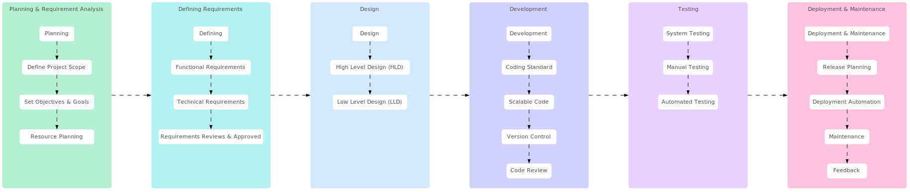

import Tabs from "@theme/Tabs";
import TabItem from "@theme/TabItem";

<Tabs queryString="primary">
    <TabItem value="sdlc" label="SDLC">
        **Software Development Lifecycle (SDLC)** is a cost-effective and time-efficient process utilized by development teams to design and build high-quality software. It aims to minimize project risks through proactive planning, ensuring that software meets customer expectations both during production and in the long term.

        

        **Benefits**

        - Increased visibility of the development process for all stakeholders involved
        - Efficient estimation, planning, and scheduling
        - Improved risk management and cost estimation
        - Systematic software delivery and better customer satisfaction

        **Workflow**

        <table className="sticky column" style={{textWrap: "nowrap"}}>
            <thead>
                <tr>
                    <th>Aspect</th>
                    <th>Planning & Requirement Analysis</th>
                    <th>Defining Requirements</th>
                    <th>Design</th>
                    <th>Development</th>
                    <th>Testing</th>
                    <th>Deployment & Maintenance</th>
                </tr>
            </thead>
            <tbody>
                <tr>
                    <td><b>Purpose</b></td>
                    <td>
                        <ul>
                            <li>Define the objectives and scope of the project</li>
                            <li>Identify stakeholders and understand their requirements</li>
                            <li>Establish a clear understanding of what needs to be developed</li>
                        </ul>
                    </td>
                    <td>
                        <ul>
                            <li>Define objectives and scope</li>
                            <li>Understand stakeholders' needs</li>
                            <li>Create a detailed requirements document</li>
                        </ul>
                    </td>
                    <td>
                        <ul>
                            <li>To design the system architecture, components, modules, and interfaces based on the gathered requirements</li>
                        </ul>
                    </td>
                    <td>
                        <ul>
                            <li>To implement the design specifications and requirements, and to develop and integrate individual software components and modules</li>
                        </ul>
                    </td>
                    <td>
                        <ul>
                            <li>To verify and validate the functionality, usability, reliability, performance, and security of the software</li>
                        </ul>
                    </td>
                    <td>
                        <ul>
                            <li>To deploy the developed software to production environments and maintain it to ensure its functionality, reliability, and security</li>
                        </ul>
                    </td>
                </tr>
                <tr>
                    <td><b>Key Activities</b></td>
                    <td>
                        <ul>
                            <li>Stakeholder Identification</li>
                            <li>Requirement Elicitation</li>
                            <li>Requirement Analysis</li>
                            <li>Requirement Documentation</li>
                            <li>Requirement Validation</li>
                            <li>Scope Definition</li>
                            <li>Resource Planning</li>
                            <li>Risk Assessment</li>
                            <li>Communication Plan</li>
                        </ul>
                    </td>
                    <td>
                        <ul>
                            <li>Stakeholder Identification</li>
                            <li>Requirement Elicitation</li>
                            <li>Requirement Analysis</li>
                            <li>Requirement Documentation</li>
                            <li>Requirement Validation</li>
                            <li>Requirement Management</li>
                        </ul>
                    </td>
                    <td>
                        <ul>
                            <li>Architectural Design</li>
                            <li>Detailed Design</li>
                            <li>User Interface (UI) Design</li>
                            <li>Database Design</li>
                            <li>Security Design</li>
                            <li>Integration Design</li>
                        </ul>
                    </td>
                    <td>
                        <ul>
                            <li>Coding</li>
                            <li>Unit Testing</li>
                            <li>Integration</li>
                            <li>Debugging and Troubleshooting</li>
                            <li>Optimization and Performance Tuning</li>
                        </ul>
                    </td>
                    <td>
                        <ul>
                            <li>Test Planning</li>
                            <li>Test Execution</li>
                            <li>Defect Management</li>
                            <li>Regression Testing</li>
                            <li>Performance Testing</li>
                            <li>Security Testing</li>
                        </ul>
                    </td>
                    <td>
                        <ul>
                            <li>Deployment</li>
                            <li>Monitoring and Management</li>
                            <li>Maintenance and Support</li>
                            <li>Documentation and Knowledge Management</li>
                            <li>User Training and Communication</li>
                        </ul>
                    </td>
                </tr>
                <tr>
                    <td><b>Deliverables</b></td>
                    <td>
                        <ul>
                            <li>Requirements Specification Document</li>
                            <li>Use Cases/User Stories</li>
                            <li>Requirement Traceability Matrix</li>
                            <li>Project Scope Statement</li>
                            <li>Resource Plan</li>
                            <li>Risk Management Plan</li>
                            <li>Communication Plan</li>
                        </ul>
                    </td>
                    <td>
                        <ul>
                            <li>Requirements Specification Document</li>
                            <li>Use Cases/User Stories</li>
                            <li>Functional Specifications</li>
                            <li>Non-Functional Requirements Documentation</li>
                            <li>Requirement Traceability Matrix</li>
                        </ul>
                    </td>
                    <td>
                        <ul>
                            <li>Architectural Design Document</li>
                            <li>Detailed Design Documents</li>
                            <li>Prototypes, Wireframes, and Mockups</li>
                            <li>Integration Specifications</li>
                        </ul>
                    </td>
                    <td>
                        <ul>
                            <li>Source Code Files</li>
                            <li>Unit Test Cases and Results</li>
                            <li>Integrated Software System</li>
                            <li>Debugging and Troubleshooting Reports</li>
                            <li>Performance Optimization Reports</li>
                        </ul>
                    </td>
                    <td>
                        <ul>
                            <li>Test Plans</li>
                            <li>Test Cases and Scenarios</li>
                            <li>Test Results and Reports</li>
                            <li>Defect Tracking Reports</li>
                            <li>Performance Testing Reports</li>
                            <li>Security Testing Reports</li>
                        </ul>
                    </td>
                    <td>
                        <ul>
                            <li>Deployment Plans and Documentation</li>
                            <li>Monitoring and Management Tools and Reports</li>
                            <li>Maintenance and Support Agreements</li>
                            <li>Patch and Update Releases</li>
                            <li>Documentation Updates and Knowledge Base Entries</li>
                        </ul>
                    </td>
                </tr>
                <tr>
                    <td><b>Techniques and Tools</b></td>
                    <td>
                        <ul>
                            <li>Interviews</li>
                            <li>Questionnaires/Surveys</li>
                            <li>Workshops/Focus Groups</li>
                            <li>Brainstorming Sessions</li>
                            <li>Prototyping</li>
                        </ul>
                    </td>
                    <td>
                        <ul>
                            <li>Interviews</li>
                            <li>Surveys/Questionnaires</li>
                            <li>Workshops/Focus Groups</li>
                            <li>Prototyping</li>
                            <li>Requirement Management Tools</li>
                            <li>Collaboration Tools</li>
                        </ul>
                    </td>
                    <td>
                        <ul>
                            <li>Unified Modeling Language (UML)</li>
                            <li>Design tools (e.g., Enterprise Architect, Lucidchart)</li>
                            <li>Database design tools</li>
                            <li>Collaboration tools</li>
                        </ul>
                    </td>
                    <td>
                        <ul>
                            <li>Programming Languages</li>
                            <li>Integrated Development Environments (IDEs)</li>
                            <li>Version Control Systems</li>
                            <li>Automated Testing Tools</li>
                            <li>Debugging Tools</li>
                            <li>Profiling Tools</li>
                        </ul>
                    </td>
                    <td>
                        <ul>
                            <li>Test Management Tools</li>
                            <li>Automated Testing Tools</li>
                            <li>Performance Testing Tools</li>
                            <li>Security Testing Tools</li>
                        </ul>
                    </td>
                    <td>
                        <ul>
                            <li>Deployment Automation Tools</li>
                            <li>Monitoring and Alerting Tools</li>
                            <li>Ticketing and Issue Tracking Systems</li>
                            <li>Version Control and Configuration Management Systems</li>
                            <li>Collaboration and Communication Tools</li>
                        </ul>
                    </td>
                </tr>
                <tr>
                    <td><b>Best Practices</b></td>
                    <td>
                        <ul>
                            <li>Involve stakeholders from the beginning to ensure their needs are addressed</li>
                            <li>Use multiple techniques for requirement elicitation to gather comprehensive requirements</li>
                            <li>Document requirements thoroughly and keep them updated throughout the project lifecycle</li>
                            <li>Prioritize requirements to focus on delivering essential features first</li>
                            <li>Regularly validate and verify requirements with stakeholders to ensure alignment</li>
                        </ul>
                    </td>
                    <td>
                        <ul>
                            <li>Involve stakeholders</li>
                            <li>Use multiple techniques</li>
                            <li>Maintain open communication</li>
                            <li>Document requirements iteratively</li>
                            <li>Establish clear acceptance criteria</li>
                        </ul>
                    </td>
                    <td>
                        <ul>
                            <li>Follow modular design principles</li>
                            <li>Document design decisions</li>
                            <li>Conduct design reviews and walkthroughs</li>
                            <li>Ensure alignment with quality attributes</li>
                            <li>Involve stakeholders in the design process</li>
                        </ul>
                    </td>
                    <td>
                        <ul>
                            <li>Follow coding standards and conventions</li>
                            <li>Write modular and reusable code</li>
                            <li>Adopt test-driven development (TDD) or behavior-driven development (BDD) practices</li>
                            <li>Conduct regular code reviews and pair programming sessions</li>
                            <li>Continuously refactor and improve the codebase</li>
                        </ul>
                    </td>
                    <td>
                        <ul>
                            <li>Start testing early in the development process</li>
                            <li>Use a combination of manual and automated testing techniques</li>
                            <li>Involve stakeholders in the testing process</li>
                            <li>Continuously monitor and update test plans and test cases</li>
                            <li>Conduct root cause analysis</li>
                        </ul>
                    </td>
                    <td>
                        <ul>
                            <li>Use automated deployment tools and scripts</li>
                            <li>Implement proactive monitoring and alerting systems</li>
                            <li>Establish SLAs and support processes</li>
                            <li>Regularly review and update documentation</li>
                            <li>Foster a culture of continuous improvement and learning</li>
                        </ul>
                    </td>
                </tr>
                <tr>
                    <td><b>Challenges</b></td>
                    <td>
                        <ul>
                            <li>Ambiguous or changing requirements</li>
                            <li>Conflicting requirements from different stakeholders</li>
                            <li>Incomplete or inaccurate requirements documentation</li>
                            <li>Limited availability or involvement of stakeholders</li>
                            <li>Balancing scope, time, and cost constraints</li>
                        </ul>
                    </td>
                    <td>
                        <ul>
                            <li>Ambiguity in stakeholder expectations</li>
                            <li>Conflicting requirements</li>
                            <li>Changing requirements</li>
                            <li>Prioritizing conflicting requirements</li>
                            <li>Addressing non-functional requirements</li>
                        </ul>
                    </td>
                    <td>
                        <ul>
                            <li>Balancing conflicting design constraints</li>
                            <li>Addressing evolving requirements</li>
                            <li>Ensuring consistency and coherence</li>
                            <li>Managing dependencies</li>
                            <li>Integrating third-party components</li>
                        </ul>
                    </td>
                    <td>
                        <ul>
                            <li>Managing complexity and dependencies</li>
                            <li>Addressing interoperability issues</li>
                            <li>Ensuring compatibility and consistency</li>
                            <li>Balancing time constraints and project deadlines</li>
                            <li>Dealing with changing requirements and scope creep</li>
                        </ul>
                    </td>
                    <td>
                        <ul>
                            <li>Managing test environments and test data</li>
                            <li>Addressing time and resource constraints</li>
                            <li>Identifying and prioritizing test cases for regression testing</li>
                            <li>Ensuring effective communication and collaboration</li>
                            <li>Dealing with complex and dynamic software systems</li>
                        </ul>
                    </td>
                    <td>
                        <ul>
                            <li>Smooth and error-free deployment</li>
                            <li>Frequency of updates vs. stability</li>
                            <li>Managing user expectations and communication</li>
                            <li>Addressing security concerns and compliance requirements</li>
                            <li>Legacy systems or dependencies</li>
                        </ul>
                    </td>
                </tr>
                <tr>
                    <td><b>Key Success Factors</b></td>
                    <td>
                        <ul>
                            <li>Clear understanding of project objectives and stakeholder requirements</li>
                            <li>Effective communication and collaboration among stakeholders</li>
                            <li>Comprehensive and well-documented requirements</li>
                            <li>Adequate resource allocation and planning</li>
                            <li>Proactive identification and management of risks</li>
                        </ul>
                    </td>
                    <td>
                        <ul>
                            <li>Active stakeholder involvement</li>
                            <li>Clear communication</li>
                            <li>Well-documented requirements</li>
                            <li>Flexibility and adaptability</li>
                            <li>Regular validation and verification</li>
                        </ul>
                    </td>
                    <td>
                        <ul>
                            <li>Clear understanding of requirements</li>
                            <li>Well-defined architecture and design</li>
                            <li>Effective communication and collaboration</li>
                            <li>Thorough testing and validation</li>
                            <li>Adherence to industry best practices</li>
                        </ul>
                    </td>
                    <td>
                        <ul>
                            <li>Clear understanding of requirements and design specifications</li>
                            <li>Adherence to coding standards and best practices</li>
                            <li>Effective collaboration and communication</li>
                            <li>Comprehensive testing and validation</li>
                            <li>Continuous improvement and adaptation</li>
                        </ul>
                    </td>
                    <td>
                        <ul>
                            <li>Clear understanding of testing objectives, scope, and requirements</li>
                            <li>Effective test planning and execution</li>
                            <li>Comprehensive test coverage</li>
                            <li>Timely identification and resolution of defects</li>
                            <li>Continuous improvement and refinement of testing processes</li>
                        </ul>
                    </td>
                    <td>
                        <ul>
                            <li>Effective collaboration and coordination</li>
                            <li>Clear communication and transparency</li>
                            <li>Adoption of automation and tooling</li>
                            <li>Timely response and resolution of issues</li>
                            <li>Continuous improvement and adaptation</li>
                        </ul>
                    </td>
                </tr>
            </tbody>
        </table>
    </TabItem>
    <TabItem value="models" label="Models">
        <table>
          <thead>
            <tr>
              <th>SDLC Model</th>
              <th>Description</th>
              <th>Advantages</th>
              <th>Disadvantages</th>
              <th>Best Suited Scenarios</th>
            </tr>
          </thead>
          <tbody>
            <tr>
              <td><b>Waterfall Model</b></td>
              <td>Sequential approach with distinct phases: Requirements, Design, Implementation, Testing, Deployment, and Maintenance</td>
              <td>Clear and simple to understand. Well-suited for projects with stable requirements</td>
              <td>Lack of flexibility, difficulty accommodating changes late in the process</td>
              <td>Projects with well-defined requirements and minimal expected changes</td>
            </tr>
            <tr>
              <td><b>V-Model (Verification and Validation Model)</b></td>
              <td>Corresponds each stage of the development life cycle with a corresponding testing phase</td>
              <td>Early and rigorous testing, traceability between requirements and tests</td>
              <td>Inflexible to changes, requires detailed documentation</td>
              <td>Projects with well-understood requirements and stringent quality standards</td>
            </tr>
            <tr>
              <td><b>Iterative Model</b></td>
              <td>Breaks down the development process into smaller iterations. Each iteration goes through the phases of planning, requirements, design, implementation, testing, and deployment</td>
              <td>Allows for early delivery of a usable product, flexibility to incorporate changes, and continuous improvement</td>
              <td>Requires clear and stable requirements for each iteration</td>
              <td>Projects with evolving or unclear requirements, where stakeholders are open to iterative refinement</td>
            </tr>
            <tr>
              <td><b>Spiral Model</b></td>
              <td>Combines iterative development with elements of the waterfall model. Progresses through multiple cycles, each including risk analysis, planning, implementation, and evaluation</td>
              <td>Allows for extensive risk analysis and mitigation, accommodates changes during development</td>
              <td>Complex and time-consuming, requires expertise in risk management</td>
              <td>High-risk projects where risk assessment and mitigation are critical</td>
            </tr>
            <tr>
              <td><b>Agile Model</b></td>
              <td>Emphasizes flexibility, collaboration, and customer feedback. Focuses on iterative development, continuous improvement, and adapting to changing requirements</td>
              <td>Delivers value early and frequently, accommodates changing requirements, enhances customer satisfaction</td>
              <td>Requires active customer involvement, may be challenging for larger teams or complex projects</td>
              <td>Projects with rapidly changing requirements, where customer collaboration is crucial</td>
            </tr>
            <tr>
              <td><b>Scrum</b></td>
              <td>An iterative and incremental framework that emphasizes teamwork, accountability, and iterative progress. Divides the project into fixed-length iterations called sprints, with a focus on delivering a potentially shippable product increment</td>
              <td>Enhances team collaboration and transparency, fosters adaptability to changing requirements</td>
              <td>Requires experienced Scrum Master and Product Owner, may lack predictability in scope and timeline</td>
              <td>Projects where requirements may evolve, and rapid delivery of working software is essential</td>
            </tr>
            <tr>
              <td><b>Extreme Programming (XP)</b></td>
              <td>Focuses on short development cycles, continuous testing, and frequent releases. Emphasizes customer satisfaction, simplicity, and teamwork</td>
              <td>Enhances software quality through continuous testing, accommodates changing requirements</td>
              <td>Requires a high level of customer involvement and close collaboration among team members</td>
              <td>Projects with evolving requirements and a need for high-quality software</td>
            </tr>
            <tr>
              <td><b>Lean Software Development</b></td>
              <td>Draws from lean manufacturing principles to eliminate waste, optimize efficiency, and deliver value to customers. Emphasizes continuous improvement, respect for people, and delivering fast</td>
              <td>Reduces waste and inefficiency, improves workflow and productivity</td>
              <td>May require significant cultural and organizational changes, may not be suitable for all project types</td>
              <td>Projects aiming for efficiency, continuous improvement, and rapid delivery of value</td>
            </tr>
            <tr>
              <td><b>Feature-Driven Development (FDD)</b></td>
              <td>Emphasizes iterative and incremental development based on building features. Focuses on domain object modeling, regular inspections, and progress reporting</td>
              <td>Enhances productivity through feature-based development, emphasizes iterative progress</td>
              <td>Requires well-defined and stable domain models, may not be suitable for projects with highly volatile requirements</td>
              <td>Projects with a need for frequent releases and a focus on feature delivery</td>
            </tr>
            <tr>
              <td><b>Rapid Application Development (RAD)</b></td>
              <td>Emphasizes rapid prototyping and iterative development. Involves close collaboration between developers and end-users to quickly develop and refine prototypes</td>
              <td>Accelerates development time, improves user involvement and satisfaction</td>
              <td>May sacrifice scalability and long-term maintainability for speed, requires skilled developers and users</td>
              <td>Projects with tight deadlines, where user involvement and rapid prototyping are critical</td>
            </tr>
            <tr>
              <td><b>Joint Application Development (JAD)</b></td>
              <td>Involves workshops and collaborative sessions with stakeholders to gather requirements, define scope, and design solutions</td>
              <td>Enhances stakeholder involvement and consensus, accelerates decision-making</td>
              <td>May require extensive resources and time commitment from stakeholders, may not be suitable for all project types</td>
              <td>Projects with diverse stakeholder groups, where consensus-building and rapid decision-making are critical</td>
            </tr>
            <tr>
              <td><b>Dynamic Systems Development Method (DSDM)</b></td>
              <td>An Agile method that emphasizes frequent delivery of working software, active user involvement, and empowerment of the development team</td>
              <td>Enhances user involvement and collaboration, delivers value early and frequently</td>
              <td>May require significant cultural and organizational changes, may not be suitable for all project types</td>
              <td>Projects with rapidly changing requirements and a need for close collaboration with users</td>
            </tr>
            <tr>
              <td><b>Prototype Model</b></td>
              <td>Involves creating a preliminary version of the software to gather feedback and validate requirements</td>
              <td>Enhances user involvement and feedback, reduces development risks</td>
              <td>May lead to misunderstandings about the nature of prototypes, may require additional effort to transition from prototype to production</td>
              <td>Projects with unclear or evolving requirements, where user feedback is essential</td>
            </tr>
            <tr>
              <td><b>Incremental Model</b></td>
              <td>Divides the project into smaller, manageable modules that are developed and delivered incrementally. Each increment adds new functionality to the system</td>
              <td>Allows for early delivery of partial functionality, reduces development risks</td>
              <td>Requires careful planning and integration, may increase complexity</td>
              <td>Projects with well-understood requirements, where early delivery of core functionality is essential</td>
            </tr>
            <tr>
              <td><b>Rational Unified Process (RUP)</b></td>
              <td>An iterative software development process framework that provides a disciplined approach to assigning tasks and responsibilities</td>
              <td>Emphasizes iterative development, component-based architecture, and continuous verification</td>
              <td>Requires significant upfront planning and documentation, may be complex to implement</td>
              <td>Projects with large development teams, where comprehensive planning and coordination are essential</td>
            </tr>
            <tr>
              <td><b>Crystal Methods</b></td>
              <td>A family of Agile methodologies that emphasize communication, collaboration, and simplicity. Tailored to specific project characteristics, such as team size, criticality, and priorities</td>
              <td>Enhances team collaboration and communication, adapts to project needs and constraints</td>
              <td>May lack prescriptive guidance, may require experienced practitioners for effective implementation</td>
              <td>Projects with diverse characteristics and a need for flexible methodologies</td>
            </tr>
            <tr>
              <td><b>Cleanroom Software Engineering</b></td>
              <td>Focuses on rigorous formal methods, mathematical analysis, and statistical testing to ensure software correctness and reliability</td>
              <td>Enhances software quality and reliability, reduces defects through formal methods</td>
              <td>Requires specialized skills and expertise, may be time-consuming and expensive</td>
              <td>Projects with stringent quality and reliability requirements, such as safety-critical systems</td>
            </tr>
            <tr>
              <td><b>Six Sigma</b></td>
              <td>A data-driven approach to process improvement that aims to reduce defects and variation in software development processes. Involves statistical analysis, process mapping, and continuous improvement</td>
              <td>Improves process efficiency and quality, reduces defects and waste</td>
              <td>Requires a significant investment in training and infrastructure, may not be suitable for all project types</td>
              <td>Projects where process efficiency and quality are paramount, such as large-scale enterprise applications</td>
            </tr>
            <tr>
              <td><b>Kanban</b></td>
              <td>A visual workflow management method that emphasizes incremental, evolutionary changes to improve efficiency and throughput. Involves visualizing work, limiting work in progress, and continuous improvement</td>
              <td>Improves workflow visibility and efficiency, reduces bottlenecks and waste</td>
              <td>May require cultural and organizational changes, may not be suitable for all project types</td>
              <td>Projects with dynamic requirements and a need for adaptive planning and workflow management</td>
            </tr>
            <tr>
              <td><b>DevOps</b></td>
              <td>Integrates development and operations teams to improve collaboration, automation, and efficiency throughout the software delivery lifecycle. Focuses on continuous integration, delivery, deployment, and monitoring</td>
              <td>Accelerates software delivery, improves quality and reliability, enhances collaboration between teams</td>
              <td>Requires cultural and organizational changes, may increase complexity initially</td>
              <td>Projects aiming for rapid and reliable software delivery, with a focus on automation and collaboration</td>
            </tr>
            <tr>
              <td><b>Continuous Integration (CI)</b></td>
              <td>A software development practice that involves frequently integrating code changes into a shared repository, followed by automated build and test processes</td>
              <td>Improves software quality and reliability, detects integration issues early, accelerates feedback cycles</td>
              <td>Requires investment in automation and infrastructure, may increase complexity initially</td>
              <td>Projects with multiple developers contributing code, where early detection of integration issues is essential</td>
            </tr>
            <tr>
              <td><b>Continuous Delivery (CD)</b></td>
              <td>Extends continuous integration to automatically deploy code changes to production or staging environments. Focuses on automating the deployment process to ensure reliable and rapid releases</td>
              <td>Accelerates software delivery, reduces deployment risks, enhances collaboration between teams</td>
              <td>Requires investment in automation and infrastructure, may require changes to existing processes</td>
              <td>Projects aiming for rapid, reliable, and automated software delivery, with a focus on deployment automation</td>
            </tr>
            <tr>
              <td><b>Model-Driven Development (MDD)</b></td>
              <td>Focuses on creating software models as primary artifacts, which are automatically transformed into executable code. Emphasizes abstraction, automation, and code generation</td>
              <td>Improves productivity and consistency, enhances maintainability and reusability</td>
              <td>Requires expertise in modeling languages and tools, may be challenging for certain types of applications</td>
              <td>Projects with well-defined domain models and a need for rapid development and code generation</td>
            </tr>
            <tr>
              <td><b>Big Bang Model</b></td>
              <td>A non-linear approach where all development activities, such as planning, design, implementation, and testing, occur simultaneously</td>
              <td>Allows for rapid development and experimentation, accommodates changing requirements</td>
              <td>May lack structure and control, increases risk of scope creep and quality issues</td>
              <td>Small projects with highly uncertain requirements, where flexibility and experimentation are valued</td>
            </tr>
            <tr>
              <td><b>Component-Based Development (CBD)</b></td>
              <td>Involves building software systems from reusable software components. Focuses on component identification, specification, integration, and testing</td>
              <td>Improves productivity and maintainability, enhances reusability and scalability</td>
              <td>Requires well-defined interfaces and standards, may increase complexity initially</td>
              <td>Projects with common functionality or where reuse of existing components is feasible</td>
            </tr>
            <tr>
              <td><b>Evolutionary Prototyping Model</b></td>
              <td>Involves developing a basic prototype quickly, gathering feedback from users, and iteratively refining the prototype based on feedback</td>
              <td>Enhances user involvement and satisfaction, reduces development risks</td>
              <td>May lead to misunderstandings about the nature of prototypes, requires effective management of scope and expectations</td>
              <td>Projects with evolving or unclear requirements, where user feedback is essential</td>
            </tr>
            <tr>
              <td><b>Formal Methods</b></td>
              <td>Involves mathematical techniques for specifying, designing, and verifying software systems. Focuses on rigorous analysis and proof of correctness</td>
              <td>Improves software reliability and correctness, reduces defects and vulnerabilities</td>
              <td>Requires specialized skills and expertise, may be time-consuming and expensive</td>
              <td>Projects with stringent safety, security, or reliability requirements, such as critical infrastructure or aerospace systems</td>
            </tr>
            <tr>
              <td><b>Object-Oriented Development (OOD)</b></td>
              <td>Emphasizes modeling software systems as a collection of interacting objects. Focuses on encapsulation, inheritance, and polymorphism for building modular and reusable software</td>
              <td>Improves software maintainability, enhances reusability and scalability</td>
              <td>Requires a paradigm shift in thinking, may increase complexity initially</td>
              <td>Projects with complex domain models or where reuse and scalability are important</td>
            </tr>
            <tr>
              <td><b>Service-Oriented Development (SOD)</b></td>
              <td>Focuses on building software systems as a collection of loosely coupled, interoperable services. Emphasizes modularity, reusability, and composability</td>
              <td>Improves system flexibility and scalability, enhances interoperability and integration</td>
              <td>Requires well-defined service contracts and standards, may increase complexity initially</td>
              <td>Projects with distributed architectures or where interoperability and flexibility are important</td>
            </tr>
            <tr>
              <td><b>Scaled Agile Framework (SAFe)</b></td>
              <td>A framework for scaling Agile practices across large organizations. Provides guidance on roles, responsibilities, ceremonies, and artifacts at various levels of the organization</td>
              <td>Improves alignment, collaboration, and transparency across teams and stakeholders</td>
              <td>Requires significant cultural and organizational changes, may increase complexity initially</td>
              <td>Large-scale projects or organizations transitioning to Agile practices, where coordination and alignment are essential</td>
            </tr>
            <tr>
              <td><b>Disciplined Agile Delivery (DAD)</b></td>
              <td>An Agile framework that provides guidance on end-to-end delivery, from project initiation to delivery and beyond. Emphasizes flexibility, pragmatism, and tailoring based on context</td>
              <td>Adapts Agile practices to various project situations, improves collaboration and decision-making</td>
              <td>Requires expertise in tailoring practices and artifacts, may be challenging to implement initially</td>
              <td>Projects with diverse characteristics and environments, where flexibility and pragmatism are valued</td>
            </tr>
            <tr>
              <td><b>Agile Unified Process (AUP)</b></td>
              <td>A simplified version of the Rational Unified Process (RUP) tailored for Agile development. Emphasizes iterative and incremental development, risk management, and continuous improvement</td>
              <td>Improves software quality and adaptability, enhances team collaboration and stakeholder involvement</td>
              <td>Requires expertise in tailoring practices and artifacts, may be challenging to implement initially</td>
              <td>Projects with evolving requirements and a need for iterative development and risk management</td>
            </tr>
            <tr>
              <td><b>Lean Software Development (LSD)</b></td>
              <td>Draws from lean manufacturing principles to eliminate waste, optimize efficiency, and deliver value to customers. Emphasizes continuous improvement, respect for people, and delivering fast</td>
              <td>Reduces waste and inefficiency, improves workflow and productivity</td>
              <td>May require significant cultural and organizational changes, may not be suitable for all project types</td>
              <td>Projects aiming for efficiency, continuous improvement, and rapid delivery of value</td>
            </tr>
            <tr>
              <td><b>PRINCE2 (PRojects IN Controlled Environments)</b></td>
              <td>A structured project management methodology that provides a framework for managing projects effectively. Emphasizes governance, risk management, and stage-based planning and control</td>
              <td>Improves project governance and accountability, enhances risk management and control</td>
              <td>Requires comprehensive documentation and formal processes, may be bureaucratic for smaller projects</td>
              <td>Projects with complex requirements, multiple stakeholders, and a need for formal project management practices</td>
            </tr>
            <tr>
              <td><b>PMBOK (Project Management Body of Knowledge)</b></td>
              <td>A framework for project management developed by the Project Management Institute (PMI). Provides guidelines, best practices, and standard processes for managing projects effectively</td>
              <td>Enhances project management knowledge and skills, provides a common language and approach for project management</td>
              <td>Requires comprehensive training and certification, may be overly prescriptive for certain projects</td>
              <td>Projects with a need for standardized project management practices and processes</td>
            </tr>
          </tbody>
        </table>
    </TabItem>
    <TabItem value="methodologies" label="Agile methodologies">
      <Tabs queryString="secondary">
        <TabItem value="overview" label="Overview" attributes={{className:"tabs__vertical"}}>
          <table>
            <thead>
              <tr>
                <th>Aspect</th>
                <th>Agile</th>
                <th>Scrum</th>
                <th>Kanban</th>
              </tr>
            </thead>
            <tbody>
              <tr>
                <td>Definition</td>
                <td>Agile is a set of principles for software development in which requirements and solutions evolve through the collaborative effort of cross-functional teams</td>
                <td>Scrum is an iterative and incremental Agile framework for managing complex projects</td>
                <td>Kanban is a visual system for managing work as it moves through a process</td>
              </tr>
              <tr>
                <td>Key Principles</td>
                <td>Collaboration, customer feedback, flexible response to changes</td>
                <td>Time-boxed sprints, cross-functional teams, daily stand-up meetings</td>
                <td>Visualize work, limit work in progress, measure and manage flow</td>
              </tr>
              <tr>
                <td>Methodology</td>
                <td>Agile methodology is a practice that helps continuous iteration of development and testing in the software development process</td>
                <td>Scrum is a type of Agile methodology that allows a team to self-organize and make changes quickly, in accordance with Agile principles</td>
                <td>Kanban is a scheduling system for lean and just-in-time manufacturing, developed by Toyota</td>
              </tr>
              <tr>
                <td>Roles</td>
                <td>No specific roles in Agile - everyone contributes as a team</td>
                <td>Scrum Master, Product Owner, Development Team</td>
                <td>No specific roles - everyone contributes as a team</td>
              </tr>
              <tr>
                <td>Communication</td>
                <td>High level of communication required for collaboration</td>
                <td>Daily stand-ups, sprint reviews, and retrospectives for communication</td>
                <td>Communication happens around the Kanban board, with regular reviews of the board and process</td>
              </tr>
              <tr>
                <td>Change Philosophy</td>
                <td>Welcomes changes at any stage of the project</td>
                <td>Changes are discouraged during the sprint</td>
                <td>Changes can be made at any time</td>
              </tr>
              <tr>
                <td>Work Organization</td>
                <td>Work is organized into small manageable units and prioritized</td>
                <td>Work is organized into sprints</td>
                <td>Work is visualized on a Kanban board</td>
              </tr>
              <tr>
                <td>Focus</td>
                <td>Agile focuses on continuous delivery</td>
                <td>Scrum focuses on the delivery of complete, shippable increments within each sprint</td>
                <td>Kanban focuses on continuous improvement, productivity, and efficiency</td>
              </tr>
              <tr>
                <td>Ideal for</td>
                <td>Complex projects where requirements often change</td>
                <td>Projects with clearly defined sprints and where changes are minimal during the sprint</td>
                <td>Ongoing projects with continuous delivery or where priorities often change</td>
              </tr>
              <tr>
                <td>Delivery</td>
                <td>Agile aims to deliver working software frequently, with a preference for the shorter timescale</td>
                <td>Scrum delivers after each sprint which is usually 2-4 weeks long</td>
                <td>Kanban allows for continuous delivery</td>
              </tr>
              <tr>
                <td>Work in Progress Limits</td>
                <td>No explicit limit on work in progress</td>
                <td>Work is limited by the length and capacity of the sprint</td>
                <td>Work in progress is limited at each stage of the workflow</td>
              </tr>
              <tr>
                <td>Key Metrics</td>
                <td>Velocity, cycle time, business value delivered</td>
                <td>Velocity, sprint burndown, release burndown</td>
                <td>Lead time, cycle time, throughput</td>
              </tr>
              <tr>
                <td>Advantages</td>
                <td>Flexibility, customer satisfaction, increased quality</td>
                <td>Transparency, increased quality, predictable delivery</td>
                <td>Flexibility, reduced waste, continuous delivery</td>
              </tr>
              <tr>
                <td>Disadvantages</td>
                <td>Less predictability, can lead to scope creep if not managed well</td>
                <td>Can be rigid, not suitable for every team, requires commitment</td>
                <td>Can lead to too much multitasking, requires discipline</td>
              </tr>
            </tbody>
          </table>
        </TabItem>
        <TabItem value="agile" label="Agile">
            ```mermaid
                graph LR

                plan(Plan) --> design(Design)
                design --> develop(Develop)
                develop --> test(Test)
                test --> deploy(Deploy)
                deploy --> review(Review)
                review --> plan
             ```

            ## 4 pillars

            - **Individuals over processes and tools** (people over processes): Prioritizes team collaboration over rigid procedures
            - **Working software over comprehensive documentation** (functional software over docs): Values working software over extensive documentation
            - **Customer collaboration over contract negotiation** (customer collaboration over contracts): Emphasizes customer involvement in shaping software
            - **Responding to change over following a plan** (adaptation over adherence): Enables quick adjustments to plans over strict adherence to initial plans

            ## 12 principles

            - **Satisfy customers early and continuously**: Regular updates make customers happier and boost revenue
            - **Embrace changing requirements**: Agile thrives on adaptability, rigid plans hinder progress
            - **Deliver value frequently**: Regular delivery reduces customer churn
            - **Break project silos**: Collaboration enhances Agile effectiveness
            - **Motivate team members**: Agile success hinges on committed teams
            - **Prioritize face-to-face communication**: Direct communication fosters better understanding
            - **Focus on working software**: Functionality is the primary progress indicator
            - **Maintain sustainable pace**: Avoid burnout by balancing speed and sustainability
            - **Pursue continuous excellence**: Build on past successes for future efficiency
            - **Embrace simplicity**: Avoid overcomplicating solutions
            - **Empower self-organizing teams**: Proactive teams drive value creation
            - **Reflect and adjust regularly**: Adaptation enhances effectiveness through retrospective meetings

            ## Use cases

            - Most companies typically don't adhere to all principles or procedures, thus each company adopts its own version of "Lean Agile" that best suits their needs
        </TabItem>
        <TabItem value="scrum" label="Scrum">
            ```mermaid
                graph LR

                stakeholders --> vision(Vision)
                vision ---> userStories(User Stories)
                userStories --> |Product Owner| productBacklog(Product Backlog)

                subgraph planning [Sprint Planning: Scrum Master]
                    direction LR

                    productBacklog --> selectedProductBacklog(Selected Product Backlog)
                    selectedProductBacklog --> sprintBacklog(Sprint Backlog)
                end

                subgraph sprint [Sprint: 2-4 Weeks - Development Team]
                    direction LR

                    dailyScrum(Daily Scrum) --> |24 hours| dailyScrum
                end

                sprintBacklog --> sprint

                sprint --> newFunctionality(New Functionality)
                newFunctionality --> sprintReview(Sprint Review)
                sprintReview --> retrospective(Retrospective)
                retrospective --> productBacklog
            ```

            ## Finance

            - **Calculate Project Costs**: Estimating project costs involves determining the budget required for team salaries, equipment, licenses, and other resources needed for product delivery. This is done collaboratively by the Scrum Team during Sprint Planning
            - **Select Project Investments**: Product Owner prioritizes investments in the Product Backlog based on factors like market demand, customer feedback, and return on investment. Decision-making between buying and building solutions occurs during Sprint Review and Sprint Retrospective meetings
                - **The Payback Period**: Time taken for a project to recoup its initial investment is assessed based on the frequency of delivering product increments, potentially shorter due to incremental value delivery
                - **Buy Versus Build**: Choice between purchasing external solutions or developing in-house is made considering factors like time to market, customization needs, and long-term strategic goals
                - **Net Present Value (NPV)**: Is evaluated for each product increment, comparing the present value of expected benefits with development costs. This guides prioritization in the Product Backlog
                - **Internal Rate of Return (IRR), or Return on Investment (ROI)**: Profitability of features is assessed by comparing benefits with development costs, aiding prioritization decisions during Sprint Reviews
            - **Monitor Project Performance**
                - **Cost Performance**: Development Team tracks actual costs during Sprints, and the Scrum Master facilitates discussions to address budgetary concerns and deviations from the planned budget
                - **Schedule Performance**: Progress is monitored using Sprint and Release Burndown Charts. Delays or impediments are addressed in Daily Scrums and Sprint Retrospectives to ensure project timelines are met
                - **Project Budget Forecasting**: Future costs are estimated collaboratively by the Product Owner, Scrum Master, and Development Team based on velocity, scope changes, and uncertainties. Regular reviews ensure accuracy and inform resource adjustments

            ## Values:

            - **Commitment**: Dedication to Sprint and project goals (ensures alignment and motivates high-quality delivery)
                - Team, Product Owner, and Scrum Master commitment
            - **Courage**: Willingness to tackle challenges and take risks (fosters innovation, resilience, and continuous improvement)
                - Transparency, adaptability, and self-organization
            - **Focus**: Concentration on valuable tasks and Sprint Goals (enables regular delivery of working product increments)
                - Sprint Goal, prioritization, and time management
            - **Openness**: Transparency, honesty, and communication (builds trust, fosters collaboration, and supports problem-solving)
                - Transparency, feedback, and collaboration
            - **Respect**: Valuing contributions, opinions, and diversity (fosters trust, motivation, and positive work environment)
                - Team dynamics, stakeholder engagement, and conflict resolution

            ## Principles

            - **Empirical Process Control**: Relies on transparency, inspection, and adaptation
            - **Self-Organization**: Scrum Team determines how to accomplish work and improve processes
            - **Collaboration**: Essential between stakeholders for maximizing product value
            - **Value-Based Prioritization**: Product Backlog items prioritized based on value
            - **Time-Boxing**: Scrum events are time-boxed for focus and adaptation
            - **Iterative Development**: Promotes incremental delivery of potentially shippable increments
            - **Visibility**: Progress and product made visible through artifacts
            - **Adaptation**: Inspect progress and adapt plans to maximize value

            ## Roles

            ### Product Owner

            - **Responsibilities**
                - **Product Backlog Management**: Prioritize, refine, and order items in the Product Backlog
                - **Stakeholder Communication**: Ensure alignment on product vision and goals among stakeholders
                - **Acceptance Criteria**: Define clear acceptance criteria for backlog items
                - **Release Planning**: Collaborate on planning and prioritizing releases
                - **Maximizing Value**: Make decisions to maximize product value
            - **Skills and Qualities**
                - **Visionary**: Clearly communicate product vision
                - **Prioritization**: Prioritize backlog items effectively
                - **Communication**: Strong communication for requirements and feedback
                - **Negotiation**: Balance priorities and negotiate with stakeholders
                - **Domain Knowledge**: Understand market trends and user needs
                - **Decision-Making**: Confidently make decisions based on data
            - **Interaction with Stakeholders**
                - **Regular Updates**: Provide regular progress updates
                - **Feedback Gathering**: Actively seek stakeholder feedback
                - **Expectations Management**: Manage stakeholder expectations
                - **Prioritization Discussions**: Engage stakeholders in prioritization
                - **Conflict Resolution**: Resolve conflicts among stakeholders

            ### Scrum Master

            - **Responsibilities**
                - **Facilitate Scrum Events**: Ensure effectiveness of Scrum events
                - **Coaching and Mentoring**: Coach teams on Scrum and Agile principles
                - **Removing Impediments**: Identify and remove obstacles for the team
                - **Promote Self-Organization**: Empower teams to make decisions
                - **Servant Leadership**: Lead by serving the team
                - **Ensure Transparency**: Maintain transparency in Scrum artifacts
            - **Servant Leadership**
                - **Supporting the Team**: Prioritize team needs
                - **Empowering Others**: Encourage autonomy within the team
                - **Active Listening**: Listen to team concerns
                - **Removing Obstacles**: Clear impediments for the team
                - **Building Trust**: Foster trust within the team
            - **Removing Impediments**
                - **Identify Impediments**: Monitor team progress
                - **Problem-Solving**: Collaborate on solutions
                - **Escalate Issues**: Raise unresolved impediments
                - **Continuous Improvement**: Foster a culture of learning
                - **Documentation and Reporting**: Document and report impediments

            ### Development Team

            - **Responsibilities**
                - **Deliver Increments**: Produce shippable increments
                - **Estimate Work**: Collaborate on effort estimation
                - **Self-Organization**: Organize work within the team
                - **Collaboration**: Work closely with PO and SM
                - **Quality Assurance**: Ensure product quality
                - **Continuous Improvement**: Seek process improvements
            - **Self-Organization**
                - **Autonomy**: Make decisions independently
                - **Ownership**: Take responsibility for commitments
                - **Collaboration**: Share knowledge and skills
                - **Adaptability**: Be flexible in response to changes
                - **Continuous Learning**: Pursue ongoing development
            - **Cross-Functionality**
                - **Diverse Skill Set**: Possess varied expertise
                - **T-shaped Skills**: Combine depth with breadth of knowledge
                - **Shared Responsibility**: Collaborate on all aspects of the product
                - **Swarm Behavior**: Address challenges collectively
                - **Flexibility**: Adapt roles as needed

            ## Events

            - **Sprint**: Time-boxed iteration for completing specific work
                - **Duration**: Fixed, typically not exceeding one calendar month
                - **Purpose**: Deliver potentially shippable product increment, provide cadence, enable feedback loops, foster transparency
            - **Sprint Planning**: Define Sprint goal, select backlog items
                - **Participants**: Product Owner, Development Team, Scrum Master
            - **Daily Scrum**: Synchronize activities, identify impediments, adapt plans
                - **Format**: Three questions (yesterday, today, impediments), time-boxed to 15 minutes
                - **Timebox**: 15 minutes
            - **Sprint Review**: Demonstrate work, gather feedback, assess Sprint Goal
                - **Stakeholder Involvement**: Invite stakeholders, present product increment
                - **Outputs**: Demonstrated product increment, feedback, updated backlog
            - **Sprint Retrospective**: Encourage improvement, reflect on Sprint process
                - **Conducting Retrospectives**: Facilitate discussion, identify improvements
                - **Continuous Improvement**: Actionable items, commitment to change, iterative process

            ## Artifacts

            - **Product Backlog**: Dynamic list of all work needed for the project, owned by Product Owner
                - **Content**: Includes user stories, technical tasks, bugs, enhancements, epics, and acceptance criteria
                - **Prioritization**: Items prioritized based on value, often using techniques like MoSCoW
            - **Sprint Backlog**: Subset of Product Backlog for current sprint, owned by Development Team
                - **Contents**: Includes selected user stories, sprint goal, estimates, definition of ready, and dependencies
                - **Updating**: Updated throughout sprint based on progress and changes, discussed in Daily Standup meetings
            - **Increment**: Sum of completed Product Backlog items, potentially releasable at end of each sprint
                - **Quality Standards**: Must meet quality standards defined by Definition of Done, covering functionality, performance
                - **Definition of Done**: Set of criteria for an item to be considered complete, agreed upon by Scrum Team

            ## Scaling Scrum

            - **Scrum of Scrums**: Technique for coordinating multiple Scrum teams
                - **Structure**: Meetings held daily or as needed, representatives from each team share progress, dependencies, and impediments
                - **Benefits**: Facilitates inter-team communication, identifies and resolves dependencies, provides visibility into project progress
            - **Large Scale Scrum (LeSS)**: Scaling Scrum while retaining simplicity and core principles
                - **Key Principles**: Single Product Backlog, Whole Team Approach, Minimal Roles and Artifacts
                - **Structure**: Teams organized around feature areas, Sprint Planning ensures alignment, Daily Scrum of Scrums for synchronization
                - **Benefits**: Preserves Scrum principles, simplifies coordination, adapts to changing requirements
            - **Scaled Agile Framework (SAFe)**: Comprehensive framework for scaling agile practices across the organization
               - **Key Components**: Three Levels of Scale, Agile Release Train (ART), Lean Portfolio Management, Scaled Agile Roles
               - **Implementation**: Launch ARTs, focus on continuous improvement through Inspect and Adapt workshops
               - **Benefits**: Provides structured scaling framework, aligns strategy with execution, facilitates collaboration across different levels
        </TabItem>
        <TabItem value="kanban" label="Kanban">
          ## Visualization

          | To-Do | In Progress | Done  |
          |-------|-------------|-------|
          | Task1 | Task2       | Task3 |
          | Task4 | Task5       |       |
          | Task6 |             |       |

          ## Principles

             - **Start with what you do now**: Begin with the existing workflow, making gradual changes over time
             - **Agree to pursue incremental, evolutionary change**: Aim for small, continuous improvements instead of drastic changes
             - **Respect the current process, roles, responsibilities, and titles**: Acknowledge the value in current systems and improve on them without discarding them
             - **Encourage acts of leadership at all levels**: Foster shared responsibility and continuous learning by promoting leadership at all levels

          ## Practices

             - **Visualize the workflow**: Use a Kanban board to map out work items and their status for transparency and understanding
             - **Limit work in progress (WIP)**: Focus on task completion by limiting ongoing tasks, reducing multitasking and improving productivity
             - **Flow Management**: Monitor and manage the pace and smoothness of work
             - **Making Policies Explicit**: Make all process-related rules visible to all team members
             - **Implement Feedback Loops**: Regular meetings to review work and discuss ways to improve
             - **Collaborative or Experimental Evolution**: Experiment with processes and learn from the results collectively
             - **Understanding the principles: Case Studies and Examples**: Provide insights into the principles and examples in action

          ## Kanban board

          Kanban boards are visual tools for managing workflow. Each column represents a stage of work, with cards representing individual tasks. They help improve workflow transparency, limit work in progress, and improve efficiency.

          Basic Kanban boards have 3 columns: **To-Do** (new tasks), **In-Progress** (tasks being worked on), and **Done** (completed tasks).

          Kanban cards are visual tools used in the Kanban system to track work progress. Their main purpose is to ensure a smooth workflow and limit WIP.

          ## Implementing WIP Limits

          - WIP limits prevent overloading, promote focus, and highlight bottlenecks in the workflow
          - To set WIP limits, consider team capacity, work nature, and goals. Adjust based on team feedback and historical data
          - WIP limits enhance productivity by reducing multitasking and context switching. They improve efficiency by making bottlenecks visible
          - WIP limits should be regularly reviewed and adjusted based on team capacity and business priorities
        </TabItem>
      </Tabs>
    </TabItem>
</Tabs>
