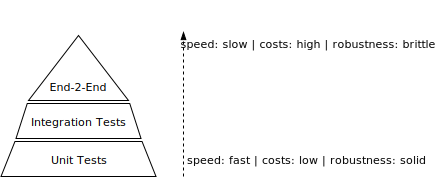

import Tabs from "@theme/Tabs";
import TabItem from "@theme/TabItem";

<Tabs queryString="primary">
    <TabItem value="stlc-overview" label="Overview">
      <Tabs queryString="secondary">
        <TabItem value="overview-lifecycle" label="Lifecycle" attributes={{className:"tabs__vertical"}}>
          **Software Testing Lifecycle (STLC)**: structured process for testing software to ensure quality and functionality throughout its development life cycle

          ```mermaid
              graph LR


              requirement(Requirement Analysis) --> planning(Test Planning)
              planning --> testCase(Test Case Development)
              testCase --> environment(Environment Setup)
              environment --> execution(Test Execution)
              execution --> closure(Test Closure)
              closure --> requirement
          ```
        </TabItem>
        <TabItem value="overview-stages" label="Stages">
          <table class="sticky column text_vertical" style={{textWrap: "nowrap"}}>
              <thead>
                  <tr>
                      <th>STLC Stage</th>
                      <th>Entry Criteria</th>
                      <th>Activity</th>
                      <th>Exit Criteria</th>
                      <th>Deliverables</th>
                  </tr>
              </thead>
              <tbody>
                  <tr>
                      <td><b>Requirement Analysis</b></td>
                      <td>
                          <ul>
                              <li>Requirements Document available (both functional and non functional)</li>
                              <li>Acceptance criteria defined</li>
                              <li>Application architectural document available</li>
                          </ul>
                      </td>
                      <td>
                          <ul>
                              <li>Analyse business functionality to know the business modules and module specific functionalities</li>
                              <li>Identify all transactions in the modules</li>
                              <li>Identify all the user profiles</li>
                              <li>Gather user interface/authentication, geographic spread requirements</li>
                              <li>Identify types of tests to be performed</li>
                              <li>Gather details about testing priorities and focus</li>
                              <li>Prepare Requirement Traceability Matrix (RTM)</li>
                              <li>Identify test environment details where testing is supposed to be carried out</li>
                              <li>Automation feasibility analysis</li>
                          </ul>
                      </td>
                      <td>
                          <ul>
                              <li>Signed off RTM</li>
                              <li>Test automation feasibility report signed off by the client</li>
                          </ul>
                      </td>
                      <td>
                          <ul>
                            <li>RTM</li>
                            <li>Automation feasibility report</li>
                          </ul>
                      </td>
                  </tr>
                  <tr>
                      <td><b>Test Planning</b></td>
                      <td>
                          <ul>
                            <li>Requirements Documents</li>
                            <li>Requirement Traceability Matrix</li>
                            <li>Test Automation Feasibility Document</li>
                          </ul>
                      </td>
                      <td>
                          <ul>
                            <li>Analyze various testing approaches available</li>
                            <li>Finalize on the best-suited approach</li>
                            <li>Preparation of test plan/strategy document for various types of testing</li>
                            <li>Test tool selection</li>
                            <li>Test effort estimation</li>
                            <li>Resource planning and determining roles and responsibilities</li>
                          </ul>
                      </td>
                      <td>
                          <ul>
                            <li>Approved test plan/strategy document</li>
                            <li>Effort estimation document signed off</li>
                          </ul>
                      </td>
                      <td>
                          <ul>
                            <li>Test plan/strategy document</li>
                            <li>Effort estimation document</li>
                          </ul>
                      </td>
                  </tr>
                  <tr>
                      <td><b>Test Case Development</b></td>
                      <td>
                          <ul>
                            <li>Requirements Documents</li>
                            <li>RTM and test plan</li>
                            <li>Automation analysis report</li>
                          </ul>
                      </td>
                      <td>
                          <ul>
                            <li>Create test cases, test design, automation scripts</li>
                            <li>Review and baseline test cases and scripts</li>
                            <li>Create test data</li>
                          </ul>
                      </td>
                      <td>
                          <ul>
                            <li>Reviewed and signed test cases/scripts</li>
                            <li>Reviewed and signed test data</li>
                          </ul>
                      </td>
                      <td>
                          <ul>
                            <li>Test cases/scripts</li>
                            <li>Test data</li>
                          </ul>
                      </td>
                  </tr>
                  <tr>
                      <td><b>Test Environment Setup</b></td>
                      <td>
                          <ul>
                            <li>System Design and architecture documents are available</li>
                            <li>Environment set-up plan is available</li>
                          </ul>
                      </td>
                      <td>
                          <ul>
                            <li>Understand the required architecture, environment set-up</li>
                            <li>Prepare hardware and software development requirement list</li>
                            <li>Finalize connectivity requirements</li>
                            <li>Prepare environment setup checklist</li>
                            <li>Setup test Environment and test data</li>
                            <li>Perform smoke test on the build</li>
                            <li>Accept/reject the build depending on smoke test result</li>
                          </ul>
                      </td>
                      <td>
                          <ul>
                            <li>Environment setup is working as per the plan and checklist</li>
                            <li>Test data setup is complete</li>
                            <li>Smoke test is successful</li>
                          </ul>
                      </td>
                      <td>
                          <ul>
                            <li>Environment ready with test data set up</li>
                            <li>Smoke Test Results</li>
                          </ul>
                      </td>
                  </tr>
                  <tr>
                      <td><b>Test Execution</b></td>
                      <td>
                          <ul>
                            <li>Baselined RTM, Test Plan, Test case/scripts are available</li>
                            <li>Test environment is ready</li>
                            <li>Test data set up is done</li>
                            <li>Unit/Integration test report for the build to be tested is available</li>
                          </ul>
                      </td>
                      <td>
                          <ul>
                            <li>Execute tests as per plan</li>
                            <li>Document test results, and log defects for failed cases</li>
                            <li>Update test plans/test cases, if necessary</li>
                            <li>Map defects to test cases in RTM</li>
                            <li>Retest the defect fixes</li>
                            <li>Regression Testing of application</li>
                            <li>Track the defects to closure</li>
                          </ul>
                      </td>
                      <td>
                          <ul>
                            <li>All tests planned are executed</li>
                            <li>Defects logged and tracked to closure</li>
                          </ul>
                      </td>
                      <td>
                          <ul>
                            <li>Completed RTM with execution status</li>
                            <li>Test cases updated with results</li>
                            <li>Defect reports</li>
                          </ul>
                      </td>
                  </tr>
                  <tr>
                      <td><b>Test Cycle Closure</b></td>
                      <td>
                          <ul>
                            <li>Testing has been completed</li>
                            <li>Test results are available</li>
                            <li>Defect logs are available</li>
                          </ul>
                      </td>
                      <td>
                          <ul>
                            <li>Evaluate cycle completion criteria based on - Time, Test coverage, Cost, Software Quality, Critical Business Objectives</li>
                            <li>Prepare test metrics based on the above parameters</li>
                            <li>Document the learning out of the project</li>
                            <li>Prepare Test closure report</li>
                            <li>Qualitative and quantitative reporting of quality of the work product to the customer</li>
                            <li>Test result analysis to find out the defect distribution by type and severity</li>
                          </ul>
                      </td>
                      <td>
                          <ul>
                            <li>Test Closure report signed off by client</li>
                          </ul>
                      </td>
                      <td>
                          <ul>
                            <li>Test Closure report</li>
                            <li>Test metrics</li>
                          </ul>
                      </td>
                  </tr>
              </tbody>
          </table>
        </TabItem>
        <TabItem value="overview-principles" label="Principles">
          - **Defect Detection**: Testing reveals defects but cannot guarantee their absence
          - **Limited Coverage**: It's impossible to test every scenario; focus on high-risk areas
          - **Early Initiation**: Begin testing as soon as possible to catch defects early
          - **Defect Clustering**: A few modules usually contain most defects; focus testing there
          - **Pesticide Paradox**: Repeated tests find the same defects; update tests regularly
          - **Context Sensitivity**: Choose testing strategies based on project context
          - **No Absence-of-Errors Fallacy**: No defects found doesn't mean there are none
          - **Risk-Based Approach**: Prioritize testing in high-risk areas
          - **No Proof of Correctness**: Testing can't prove software is error-free
          - **Continuous Improvement**: Constantly improve testing processes
          - **Traceability**: Ensure test cases trace back to requirements
          - **Independence**: Conduct testing independently from development
          - **Realistic Environment**: Test in environments resembling production
          - **Multiple Perspectives**: Test for functionality, usability, performance
          - **Validation & Verification**: Confirm requirements and specifications are met
          - **Feedback Loop**: Provide timely feedback to stakeholders
        </TabItem>
      </Tabs>
    </TabItem>
    <TabItem value="stlc-detailed" label="Detailed">
      <Tabs queryString="secondary">
        <TabItem value="stlc-detailed-overview" label="High Overview" attributes={{className:"tabs__vertical"}}>
          ```mermaid
              graph LR

              requirements(Requirements Stage)
              requirements ~~~|<ul style="text-align:left"><li>Functional Requirements</li><li>Non-Functional Requirements</li><li>Requirement Analysis</li></ul>| requirements

              design(Design Stage)
              design ~~~|<ul style="text-align:left"><li>Architectural Review</li><li>Data Flow</li><li>Design Verification and Validation</li><li>High-Level Design Review</li><li>Interface</li><li>Low-Level Design Review</li><li>Prototype Testing</li><li>System Design Review</li></ul><br/>| design

              development(Development Stage)
              development ~~~|<ul style="text-align:left"><li>Static Code Analysis</li></ul>| development

              testing(Testing Stage)
              testing ~~~|<ul style="text-align:left"><li>Accessibility</li><li>Acceptance</li><li>API</li><li>Code Review</li><li>Component</li><li>Compatibility</li><li>Compliance</li><li>Configuration</li><li>Data Retrieval/Restoration/Purging/Migration</li><li>Database</li><li>Disaster Recovery</li><li>End-to-End: E2E</li><li>Functional</li><li>Globalization</li><li>Integration</li><li>Load</li><li>Localization</li><li>Maintainability</li><li>Mobile</li><li>Regression</li><li>Recovery</li><li>Reliability</li><li>Requirements Review</li><li>Rollback</li><li>Scalability</li><li>Security</li><li>Service Level Agreement: SLA</li><li>Smoke</li><li>Spike</li><li>State Transition</li><li>Stress</li><li>Unit</li><li>Usability</li><li>User Acceptance: UAT</li><li>User Interface</li><li>Web</li></ul><br/><br/><br/><br/><br/><br/>| testing

              deployment(Deployment Stage)
              deployment ~~~|<ul style="text-align:left"><li>Beta</li><li>Pilot</li><li>Rollback</li></ul>| deployment

              maintenance(Maintenance Stage)
              maintenance ~~~|<ul style="text-align:left"><li>Chaos Engineering</li></ul><br/>| maintenance

              requirements --> design
              design --> development
              development ---> testing
              testing ---> deployment
              deployment --> maintenance
          ```
        </TabItem>
        <TabItem value="stlc-detailed-requirements" label="Requirements">
          <table>
              <thead>
                <tr>
                  <th>Aspect</th>
                  <th>Purpose</th>
                  <th>Characteristics</th>
                  <th>Key Activities	</th>
                </tr>
              </thead>
              <tbody>
                <tr>
                    <td><b>Functional Requirements</b></td>
                    <td>Define the specific functions the software must perform</td>
                    <td>
                        <ul>
                            <li>Describes what the software should do from a user's perspective</li>
                            <li>Defines input, processing, and output of the system</li>
                        </ul>
                    </td>
                    <td>
                      <ul>
                        <li>Eliciting requirements through interviews, workshops, surveys</li>
                        <li>Documenting requirements in a structured format (e.g., use cases, user stories)</li>
                        <li>Validating requirements with stakeholders</li>
                      </ul>
                    </td>
                </tr>
                <tr>
                    <td><b>Non-Functional Requirements</b></td>
                    <td>Specify the quality attributes and constraints of the system</td>
                    <td>
                        <ul>
                            <li>Specifies attributes such as performance, usability, reliability, security</li>
                            <li>Typically expressed as constraints or qualities the system must possess</li>
                        </ul>
                    </td>
                    <td>
                      <ul>
                        <li>Identifying and categorizing non-functional requirements (NFRs)</li>
                        <li>Quantifying NFRs wherever possible (e.g., response time should be under 2 seconds)</li>
                        <li>Prioritizing NFRs based on criticality</li>
                      </ul>
                    </td>
                </tr>
                <tr>
                    <td><b>Requirement Analysis</b></td>
                    <td>Understand and document the needs and expectations of stakeholders</td>
                    <td>
                        <ul>
                            <li>Involves gathering, analyzing, and documenting requirements</li>
                            <li>Requires collaboration with stakeholders to ensure all needs are captured</li>
                        </ul>
                    </td>
                    <td>
                      <ul>
                        <li>Identifying stakeholders and their roles</li>
                        <li>Gathering initial requirements through various techniques (interviews, questionnaires)</li>
                        <li>Analyzing requirements for completeness, consistency, and feasibility</li>
                        <li>Resolving conflicts or ambiguities in requirements</li>
                      </ul>
                    </td>
                </tr>
              </tbody>
          </table>
        </TabItem>
        <TabItem value="stlc-detailed-design" label="Design">
          <table>
            <thead>
              <tr>
                <th>Component</th>
                <th>Purpose</th>
                <th>Characteristics</th>
                <th>Key Activities</th>
              </tr>
            </thead>
            <tbody>
              <tr>
                <td><b>Architectural Review</b></td>
                <td>To assess and validate the overall structure and design of the software system at a high level</td>
                <td>
                  <ul>
                    <li>Evaluates the system's architecture to ensure it aligns with requirements and standards</li>
                    <li>Identifies potential risks and issues related to architecture early in the development process</li>
                  </ul>
                </td>
                <td>
                  <ul>
                    <li>Review architectural diagrams, such as high-level design documents and system architecture models</li>
                    <li>Conduct discussions with architects and developers to understand design decisions</li>
                    <li>Verify compliance with architectural principles and standards</li>
                  </ul>
                </td>
              </tr>
              <tr>
                <td><b>Data Flow</b></td>
                <td>To analyze and validate the flow of data within the system, ensuring that it meets functional requirements and operates efficiently</td>
                <td>
                  <ul>
                    <li>Focuses on understanding how data moves through the system</li>
                    <li>Identifies potential bottlenecks or vulnerabilities in data flow</li>
                  </ul>
                </td>
                <td>
                  <ul>
                    <li>Create data flow diagrams illustrating the movement of data within the system</li>
                    <li>Verify that data flows correctly between components and modules</li>
                    <li>Assess data security measures to ensure compliance with regulations and protection against threats</li>
                  </ul>
                </td>
              </tr>
              <tr>
                <td><b>Design Verification and Validation</b></td>
                <td>To confirm that the software design meets the specified requirements and is feasible for implementation</td>
                <td>
                  <ul>
                    <li>Validates the design against requirements to ensure completeness and accuracy</li>
                    <li>Verifies that the design is implementable within technical constraints</li>
                  </ul>
                </td>
                <td>
                  <ul>
                    <li>Conduct reviews of design documents to verify alignment with requirements</li>
                    <li>Perform walkthroughs and inspections to identify design flaws and inconsistencies</li>
                    <li>Use modeling tools to simulate and validate design behavior</li>
                    <li>Collaborate with stakeholders to gather feedback and refine the design</li>
                  </ul>
                </td>
              </tr>
              <tr>
                <td><b>High-Level Design Review</b></td>
                <td>To evaluate and refine the high-level design of the software system before proceeding to detailed design</td>
                <td>
                  <ul>
                    <li>Focuses on the overall structure and organization of the software components</li>
                    <li>Identifies potential design flaws or inefficiencies at a conceptual level</li>
                  </ul>
                </td>
                <td>
                  <ul>
                    <li>Review high-level design documents, such as architecture diagrams and system specifications</li>
                    <li>Assess design patterns and architectural styles for suitability and coherence</li>
                    <li>Evaluate scalability and performance considerations at the system level</li>
                    <li>Identify dependencies and interfaces between system components</li>
                  </ul>
                </td>
              </tr>
              <tr>
                <td><b>Interface</b></td>
                <td>To design, document, and validate the interfaces between various system components and external entities</td>
                <td>
                  <ul>
                    <li>Defines communication protocols and data formats for interactions between system elements</li>
                    <li>Ensures compatibility and consistency across interfaces</li>
                  </ul>
                </td>
                <td>
                  <ul>
                    <li>Design interface specifications detailing the methods, parameters, and protocols for communication</li>
                    <li>Verify interoperability by testing interface interactions between components</li>
                    <li>Document interface requirements and constraints for developers and stakeholders</li>
                    <li>Conduct compatibility testing with external systems or APIs</li>
                  </ul>
                </td>
              </tr>
              <tr>
                <td><b>Low-Level Design Review</b></td>
                <td>To refine and finalize the detailed design of individual components or modules within the software system</td>
                <td>
                  <ul>
                    <li>Focuses on the implementation details and internal structure of system components</li>
                    <li>Ensures that detailed designs adhere to architectural guidelines and standards</li>
                  </ul>
                </td>
                <td>
                  <ul>
                    <li>Review detailed design documents, such as class diagrams and module specifications</li>
                    <li>Assess design patterns and coding conventions for consistency and maintainability</li>
                    <li>Verify traceability between high-level and low-level design elements</li>
                    <li>Conduct code walkthroughs and inspections to identify design defects and optimization opportunities</li>
                  </ul>
                </td>
              </tr>
              <tr>
                <td><b>Prototype Testing</b></td>
                <td>To evaluate a preliminary version of the software system to gather feedback, validate design assumptions, and identify areas for improvement</td>
                <td>
                  <ul>
                    <li>Involves testing a functional prototype or mock-up of the software system</li>
                    <li>Focuses on user experience, functionality, and performance</li>
                  </ul>
                </td>
                <td>
                  <ul>
                    <li>Develop prototype versions of the software to demonstrate key features and interactions</li>
                    <li>Conduct usability testing to gather feedback from end-users and stakeholders</li>
                    <li>Evaluate system performance and scalability under simulated usage scenarios</li>
                    <li>Iterate on the prototype based on user feedback and testing results</li>
                  </ul>
                </td>
              </tr>
              <tr>
                <td><b>System Design Review</b></td>
                <td>To review and validate the overall system design, encompassing both high-level architecture and detailed component designs</td>
                <td>
                  <ul>
                    <li>Integrates feedback from previous design stages to ensure coherence and completeness of the system design</li>
                    <li>Identifies any remaining design issues or risks before proceeding to implementation</li>
                  </ul>
                </td>
                <td>
                  <ul>
                    <li>Conduct comprehensive review sessions covering all aspects of the system design</li>
                    <li>Verify alignment with overall project goals and requirements</li>
                    <li>Assess design trade-offs and risks to inform decision-making</li>
                    <li>Prepare design documentation and artifacts for approval and reference</li>
                    <li>Obtain stakeholder sign-off on the system design before proceeding to implementation</li>
                  </ul>
                </td>
              </tr>
            </tbody>
          </table>
        </TabItem>
        <TabItem value="stlc-detailed-development" label="Development">
          <table>
            <thead>
              <tr>
                <th>Component</th>
                <th>Purpose</th>
                <th>Characteristics</th>
                <th>Key Activities</th>
              </tr>
            </thead>
            <tbody>
              <tr>
                <td><b>Static Code Analysis</b></td>
                <td>To analyze the source code without executing it, detecting potential defects, vulnerabilities, and adherence to coding standards</td>
                <td>
                  <ul>
                    <li>Automatically reviews code for bugs, security vulnerabilities, and compliance with coding standards</li>
                    <li>Identifies potential performance bottlenecks and code smells</li>
                    <li>Provides insights into code complexity and maintainability</li>
                  </ul>
                </td>
                <td>
                  <ul>
                    <li>Configure static code analysis tools to scan the codebase for issues</li>
                    <li>Review analysis results to prioritize and address identified issues</li>
                    <li>Set up rules and policies for coding standards and best practices</li>
                    <li>Integrate static code analysis into the continuous integration/continuous deployment (CI/CD) pipeline</li>
                  </ul>
                </td>
              </tr>
            </tbody>
          </table>
        </TabItem>
        <TabItem value="stlc-detailed-testing" label="Testing">
          <table>
            <thead>
              <tr>
                <th>Component</th>
                <th>Purpose</th>
                <th>Characteristics</th>
                <th>Key Activities</th>
              </tr>
            </thead>
            <tbody>
              <tr>
                <td><b>Accessibility Testing</b></td>
                <td>To ensure that the software is usable by people with disabilities and conforms to accessibility standards</td>
                <td>
                  <ul>
                    <li>Evaluates software for compliance with accessibility guidelines such as WCAG</li>
                    <li>Tests various aspects including keyboard navigation, screen reader compatibility, and color contrast</li>
                  </ul>
                </td>
                <td>
                  <ul>
                    <li>Conduct manual and automated accessibility audits</li>
                    <li>Use assistive technologies to simulate user experiences</li>
                    <li>Address accessibility issues found during testing</li>
                  </ul>
                </td>
              </tr>
              <tr>
                <td><b>Acceptance Testing</b></td>
                <td>To verify that the software meets the acceptance criteria and is ready for deployment</td>
                <td>
                  <ul>
                    <li>Performed by end-users or stakeholders to validate the software against business requirements</li>
                    <li>Tests are typically conducted in a production-like environment</li>
                  </ul>
                </td>
                <td>
                  <ul>
                    <li>Define acceptance criteria based on user stories and requirements</li>
                    <li>Execute test cases representing real-world scenarios</li>
                    <li>Obtain user feedback and approval for the software</li>
                  </ul>
                </td>
              </tr>
              <tr>
                <td><b>API Testing</b></td>
                <td>To verify the functionality, reliability, performance, and security of the application programming interfaces (APIs)</td>
                <td>
                  <ul>
                    <li>Tests the integration points and communication between different software systems</li>
                    <li>Validates inputs, outputs, and error handling of APIs</li>
                  </ul>
                </td>
                <td>
                  <ul>
                    <li>Design test cases covering various API functionalities</li>
                    <li>Execute API calls and verify responses</li>
                    <li>Perform security testing to identify vulnerabilities</li>
                  </ul>
                </td>
              </tr>
              <tr>
                <td><b>Code Review</b></td>
                <td>To identify defects, improve code quality, and ensure adherence to coding standards through manual inspection of source code</td>
                <td>
                  <ul>
                    <li>Reviews code for bugs, readability, maintainability, and performance</li>
                    <li>Provides feedback to developers to improve code quality</li>
                  </ul>
                </td>
                <td>
                  <ul>
                    <li>Conduct peer code reviews using tools or manual inspection</li>
                    <li>Identify potential improvements and areas for refactoring</li>
                    <li>Address issues raised during code review</li>
                  </ul>
                </td>
              </tr>
              <tr>
                <td><b>Component Testing</b></td>
                <td>To validate the individual components or modules of the software system in isolation</td>
                <td>
                  <ul>
                    <li>Focuses on testing the functionality and behavior of individual units of code</li>
                    <li>Uses stubs or mocks to simulate dependencies</li>
                  </ul>
                </td>
                <td>
                  <ul>
                    <li>Write test cases to verify the functionality of each component</li>
                    <li>Execute component tests in an isolated environment</li>
                    <li>Verify interactions with external dependencies using stubs or mocks</li>
                  </ul>
                </td>
              </tr>
              <tr>
                <td><b>Compatibility Testing</b></td>
                <td>To ensure that the software functions correctly across different devices, browsers, operating systems, and environments</td>
                <td>
                  <ul>
                    <li>Tests software compatibility with various hardware and software configurations</li>
                    <li>Identifies any issues related to platform-specific features or behaviors</li>
                  </ul>
                </td>
                <td>
                  <ul>
                    <li>Identify target platforms and configurations for testing</li>
                    <li>Execute test cases on different devices, browsers, and operating systems</li>
                    <li>Verify functionality, layout, and performance across various environments</li>
                  </ul>
                </td>
              </tr>
              <tr>
                <td><b>Compliance Testing</b></td>
                <td>To ensure that the software complies with legal, regulatory, and industry standards</td>
                <td>
                  <ul>
                    <li>Verifies adherence to specific regulations, standards, or guidelines</li>
                    <li>Includes testing for data privacy, security, and accessibility requirements</li>
                  </ul>
                </td>
                <td>
                  <ul>
                    <li>Identify relevant compliance requirements for the software</li>
                    <li>Execute test cases to verify compliance with regulations and standards</li>
                    <li>Document compliance test results for audit and regulatory purposes</li>
                  </ul>
                </td>
              </tr>
              <tr>
                <td><b>Configuration Testing</b></td>
                <td>To validate the software's behavior under different configurations and settings</td>
                <td>
                  <ul>
                    <li>Tests the impact of configuration changes on system functionality and performance</li>
                    <li>Verifies compatibility with various hardware and software configurations</li>
                  </ul>
                </td>
                <td>
                  <ul>
                    <li>Identify key system configurations to test</li>
                    <li>Create test cases covering different configuration scenarios</li>
                    <li>Execute tests with varying configurations and settings</li>
                  </ul>
                </td>
              </tr>
              <tr>
                <td><b>Data Retrieval/Restoration/Purging/Migration Testing</b></td>
                <td>To ensure the accuracy, reliability, and efficiency of data retrieval, restoration, purging, and migration processes</td>
                <td>
                  <ul>
                    <li>Tests data retrieval, restoration, purging, and migration processes for accuracy and completeness</li>
                    <li>Verifies data integrity and consistency after migration or purging operations</li>
                  </ul>
                </td>
                <td>
                  <ul>
                    <li>Define test scenarios for data retrieval, restoration, purging, and migration</li>
                    <li>Execute tests to verify data accuracy and integrity</li>
                    <li>Validate performance and efficiency of data operations</li>
                  </ul>
                </td>
              </tr>
              <tr>
                <td><b>Database Testing</b></td>
                <td>To verify the functionality, performance, and reliability of database systems and related operations</td>
                <td>
                  <ul>
                    <li>Validates database schema, data integrity, and transactions</li>
                    <li>Tests database CRUD operations (Create, Read, Update, Delete)</li>
                    <li>Verifies SQL queries, stored procedures, and triggers</li>
                  </ul>
                </td>
                <td>
                  <ul>
                    <li>Design test cases to cover database functionality and operations</li>
                    <li>Execute tests to validate database performance and reliability</li>
                    <li>Verify data consistency and accuracy</li>
                  </ul>
                </td>
              </tr>
              <tr>
                <td><b>Disaster Recovery Testing</b></td>
                <td>To evaluate the readiness and effectiveness of disaster recovery procedures and mechanisms</td>
                <td>
                  <ul>
                    <li>Tests backup and recovery processes under various disaster scenarios</li>
                    <li>Evaluates data loss prevention and continuity of operations</li>
                  </ul>
                </td>
                <td>
                  <ul>
                    <li>Simulate disaster scenarios to test recovery procedures</li>
                    <li>Verify data backup integrity and accessibility</li>
                    <li>Assess recovery time objectives (RTO) and recovery point objectives (RPO)</li>
                  </ul>
                </td>
              </tr>
              <tr>
                <td><b>End-to-End Testing (E2E)</b></td>
                <td>To validate the entire software system from start to finish, including all integrated components and interfaces</td>
                <td>
                  <ul>
                    <li>Tests the application workflow across multiple systems and components</li>
                    <li>Verifies end-user scenarios from initiation to completion</li>
                  </ul>
                </td>
                <td>
                  <ul>
                    <li>Define end-to-end test scenarios covering user journeys and system interactions</li>
                    <li>Execute tests in a production-like environment</li>
                    <li>Verify system behavior and data flow across integrated components</li>
                  </ul>
                </td>
              </tr>
              <tr>
                <td><b>Functional Testing</b></td>
                <td>To validate the functional requirements of the software application and ensure that it behaves as expected</td>
                <td>
                  <ul>
                    <li>Tests individual functions and features of the software</li>
                    <li>Verifies input validation, data processing, and output generation</li>
                  </ul>
                </td>
                <td>
                  <ul>
                    <li>Develop test cases based on functional specifications and user stories</li>
                    <li>Execute tests to validate each functional requirement</li>
                    <li>Verify system behavior under different input conditions</li>
                  </ul>
                </td>
              </tr>
              <tr>
                <td><b>Globalization Testing</b></td>
                <td>To ensure that the software application can function correctly in different languages, regions, and cultural settings</td>
                <td>
                  <ul>
                    <li>Tests the software's ability to adapt to various cultural and regional conventions</li>
                    <li>Verifies support for multilingual content and locale-specific formats</li>
                  </ul>
                </td>
                <td>
                  <ul>
                    <li>Test the application with different language settings and regional configurations</li>
                    <li>Verify text translations, date/time formats, and currency symbols</li>
                    <li>Check for proper handling of cultural preferences and conventions</li>
                  </ul>
                </td>
              </tr>
              <tr>
                <td><b>Integration Testing</b></td>
                <td>To validate the interactions and interfaces between different software components and systems</td>
                <td>
                  <ul>
                    <li>Tests the integration points and data exchanges between modules, services, or systems</li>
                    <li>Verifies interoperability and communication protocols</li>
                  </ul>
                </td>
                <td>
                  <ul>
                    <li>Define integration test scenarios covering interactions between system components</li>
                    <li>Execute tests to verify data flow and communication between integrated systems</li>
                    <li>Check for proper error handling and fault tolerance</li>
                  </ul>
                </td>
              </tr>
              <tr>
                <td><b>Load Testing</b></td>
                <td>To evaluate the software's performance under expected and peak load conditions</td>
                <td>
                  <ul>
                    <li>Tests the software's response time, throughput, and resource utilization under load</li>
                    <li>Verifies scalability and capacity planning</li>
                  </ul>
                </td>
                <td>
                  <ul>
                    <li>Define load test scenarios based on expected usage patterns and peak loads</li>
                    <li>Execute tests to simulate concurrent user interactions and data processing</li>
                    <li>Monitor system metrics and analyze performance bottlenecks</li>
                  </ul>
                </td>
              </tr>
              <tr>
                <td><b>Localization Testing</b></td>
                <td>To ensure that the software application is adapted and culturally appropriate for specific target markets</td>
                <td>
                  <ul>
                    <li>Tests the software's linguistic and cultural adaptation for specific locales</li>
                    <li>Verifies compliance with language, currency, and legal requirements</li>
                  </ul>
                </td>
                <td>
                  <ul>
                    <li>Test the application with localized content and settings</li>
                    <li>Verify translations, date/time formats, and regulatory compliance for target markets</li>
                    <li>Check for alignment with local cultural norms and conventions</li>
                  </ul>
                </td>
              </tr>
              <tr>
                <td><b>Maintainability Testing</b></td>
                <td>To evaluate the ease with which the software can be modified, enhanced, and maintained over time</td>
                <td>
                  <ul>
                    <li>Tests the codebase for readability, modularity, and extensibility</li>
                    <li>Identifies areas of code that are prone to defects and difficult to maintain</li>
                  </ul>
                </td>
                <td>
                  <ul>
                    <li>Assess code quality metrics such as cyclomatic complexity and code duplication</li>
                    <li>Review coding conventions and best practices</li>
                    <li>Identify refactoring opportunities to improve maintainability</li>
                  </ul>
                </td>
              </tr>
              <tr>
                <td><b>Mobile Testing</b></td>
                <td>To validate the functionality, usability, and performance of mobile applications across different devices and platforms</td>
                <td>
                  <ul>
                    <li>Tests mobile-specific features such as touch gestures, device orientation, and offline capabilities</li>
                    <li>Verifies compatibility with various mobile operating systems and screen resolutions</li>
                  </ul>
                </td>
                <td>
                  <ul>
                    <li>Test the application on different mobile devices and platforms</li>
                    <li>Verify user experience and performance on mobile devices</li>
                    <li>Address platform-specific issues and limitations</li>
                  </ul>
                </td>
              </tr>
              <tr>
                <td><b>Regression Testing</b></td>
                <td>To ensure that recent code changes have not adversely affected existing functionalities</td>
                <td>
                  <ul>
                    <li>Re-executes test cases to verify that previously developed and tested software still performs correctly</li>
                    <li>Identifies unintended side effects and regression defects introduced by new changes</li>
                  </ul>
                </td>
                <td>
                  <ul>
                    <li>Automate regression test suites to ensure efficient and comprehensive testing</li>
                    <li>Execute regression tests after each software build or release</li>
                    <li>Verify that fixed defects do not reappear in subsequent releases</li>
                  </ul>
                </td>
              </tr>
              <tr>
                <td><b>Recovery Testing</b></td>
                <td>To verify the software's ability to recover from failures and resume normal operations</td>
                <td>
                  <ul>
                    <li>Tests recovery mechanisms such as data backup, rollback procedures, and fault tolerance</li>
                    <li>Verifies data integrity and system stability after recovery</li>
                  </ul>
                </td>
                <td>
                  <ul>
                    <li>Simulate system failures and errors to trigger recovery procedures</li>
                    <li>Verify the effectiveness of backup and restore processes</li>
                    <li>Assess recovery time and data consistency</li>
                  </ul>
                </td>
              </tr>
              <tr>
                <td><b>Reliability Testing</b></td>
                <td>To assess the software's ability to consistently perform its intended functions under specified conditions</td>
                <td>
                  <ul>
                    <li>Tests the software for failure rates, error handling, and fault tolerance</li>
                    <li>Verifies system stability and uptime</li>
                  </ul>
                </td>
                <td>
                  <ul>
                    <li>Define test scenarios to simulate various failure conditions</li>
                    <li>Execute tests to measure system reliability and stability</li>
                    <li>Assess error recovery mechanisms and fault tolerance</li>
                  </ul>
                </td>
              </tr>
              <tr>
                <td><b>Requirements Review</b></td>
                <td>To validate that the software requirements are complete, consistent, and accurately captured</td>
                <td>
                  <ul>
                    <li>Reviews software requirements documentation for clarity, accuracy, and feasibility</li>
                    <li>Ensures alignment with stakeholder expectations and project goals</li>
                  </ul>
                </td>
                <td>
                  <ul>
                    <li>Conduct requirements walkthroughs and inspections</li>
                    <li>Verify traceability between requirements and test cases</li>
                    <li>Address ambiguities and inconsistencies in requirements</li>
                  </ul>
                </td>
              </tr>
              <tr>
                <td><b>Rollback Testing</b></td>
                <td>To verify the software's ability to revert to a previous state or version in case of deployment failures or issues</td>
                <td>
                  <ul>
                    <li>Tests rollback procedures and data restoration mechanisms</li>
                    <li>Verifies the integrity and consistency of data after rollback</li>
                  </ul>
                </td>
                <td>
                  <ul>
                    <li>Simulate deployment failures or issues to trigger rollback procedures</li>
                    <li>Verify data consistency and system stability after rollback</li>
                    <li>Assess the effectiveness of rollback mechanisms</li>
                  </ul>
                </td>
              </tr>
              <tr>
                <td><b>Scalability Testing</b></td>
                <td>To assess the software's ability to handle increasing workload and user demand without compromising performance or stability</td>
                <td>
                  <ul>
                    <li>Tests the software's ability to scale up or down based on changing load conditions</li>
                    <li>Verifies system performance under various load levels and concurrent user interactions</li>
                  </ul>
                </td>
                <td>
                  <ul>
                    <li>Define scalability test scenarios covering different usage patterns and load levels</li>
                    <li>Execute tests to measure system performance and scalability</li>
                    <li>Assess system response time, throughput, and resource utilization under load</li>
                  </ul>
                </td>
              </tr>
              <tr>
                <td><b>Security Testing</b></td>
                <td>To identify vulnerabilities and weaknesses in the software's security mechanisms and ensure protection against threats</td>
                <td>
                  <ul>
                    <li>Tests for common security vulnerabilities such as injection attacks, cross-site scripting (XSS), and authentication flaws</li>
                    <li>Verifies compliance with security standards and best practices</li>
                  </ul>
                </td>
                <td>
                  <ul>
                    <li>Conduct security assessments using automated tools and manual penetration testing</li>
                    <li>Identify and prioritize security vulnerabilities based on severity</li>
                    <li>Implement security controls and countermeasures to mitigate risks</li>
                  </ul>
                </td>
              </tr>
              <tr>
                <td><b>Service Level Agreement (SLA) Testing</b></td>
                <td>To verify that the software meets the agreed-upon service level agreements regarding performance, availability, and other criteria</td>
                <td>
                  <ul>
                    <li>Tests the software's ability to meet specified SLA metrics such as response time and uptime</li>
                    <li>Verifies compliance with contractual obligations and quality standards</li>
                  </ul>
                </td>
                <td>
                  <ul>
                    <li>Define SLA metrics and performance targets</li>
                    <li>Execute tests to measure system performance and availability</li>
                    <li>Monitor SLA compliance and report deviations</li>
                  </ul>
                </td>
              </tr>
              <tr>
                <td><b>Smoke Testing</b></td>
                <td>To quickly assess the basic functionality of the software after changes or updates, ensuring that critical functionalities work as expected</td>
                <td>
                  <ul>
                    <li>Tests fundamental functionalities to determine if the software is stable enough for further testing</li>
                    <li>Verifies basic user interactions and system behaviors</li>
                  </ul>
                </td>
                <td>
                  <ul>
                    <li>Execute a set of predefined test cases covering core functionalities</li>
                    <li>Verify essential features such as login, navigation, and basic operations</li>
                    <li>Assess system stability and readiness for comprehensive testing</li>
                  </ul>
                </td>
              </tr>
              <tr>
                <td><b>Spike Testing</b></td>
                <td>To evaluate the software's performance and behavior under sudden and extreme increases in workload or user traffic</td>
                <td>
                  <ul>
                    <li>Tests the software's ability to handle rapid fluctuations in user demand</li>
                    <li>Verifies system scalability and resource management under peak loads</li>
                  </ul>
                </td>
                <td>
                  <ul>
                    <li>Create scenarios to simulate sudden spikes in user traffic or workload</li>
                    <li>Execute tests to measure system response time and throughput</li>
                    <li>Assess system performance under stress conditions</li>
                  </ul>
                </td>
              </tr>
              <tr>
                <td><b>State Transition Testing</b></td>
                <td>To validate the transitions between different states or modes of the software application</td>
                <td>
                  <ul>
                    <li>Tests the behavior of the software as it transitions between different states or modes</li>
                    <li>Verifies proper state management and data integrity</li>
                  </ul>
                </td>
                <td>
                  <ul>
                    <li>Identify possible states and transitions within the software</li>
                    <li>Develop test cases to validate state transitions and associated behaviors</li>
                    <li>Execute tests to verify proper state management</li>
                  </ul>
                </td>
              </tr>
              <tr>
                <td><b>Stress Testing</b></td>
                <td>To evaluate the software's stability and performance under extreme workload conditions</td>
                <td>
                  <ul>
                    <li>Tests the software's response time, throughput, and resource utilization under high load</li>
                    <li>Verifies system behavior and stability under stress conditions</li>
                  </ul>
                </td>
                <td>
                  <ul>
                    <li>Create test scenarios to simulate high load conditions</li>
                    <li>Execute tests to measure system performance metrics</li>
                    <li>Assess system behavior and identify performance bottlenecks</li>
                  </ul>
                </td>
              </tr>
              <tr>
                <td><b>Unit Testing</b></td>
                <td>To validate the individual units or components of the software application in isolation</td>
                <td>
                  <ul>
                    <li>Tests the smallest testable parts of the software, such as functions, methods, or classes</li>
                    <li>Verifies the correctness of individual units of code</li>
                  </ul>
                </td>
                <td>
                  <ul>
                    <li>Write test cases to cover each unit of code</li>
                    <li>Execute unit tests in an isolated environment</li>
                    <li>Verify the functionality and behavior of individual units</li>
                  </ul>
                </td>
              </tr>
              <tr>
                <td><b>Usability Testing</b></td>
                <td>To evaluate the software's user interface (UI) design, ease of use, and overall user experience</td>
                <td>
                  <ul>
                    <li>Tests the software from the end user's perspective to assess its usability and intuitiveness</li>
                    <li>Verifies alignment with user expectations and preferences</li>
                  </ul>
                </td>
                <td>
                  <ul>
                    <li>Define user personas and typical usage scenarios</li>
                    <li>Conduct usability tests with representative users</li>
                    <li>Collect feedback and observations on user interactions and experiences</li>
                  </ul>
                </td>
              </tr>
            </tbody>
          </table>
        </TabItem>
        <TabItem value="stlc-detailed-deployment" label="Deployment">
          <table>
            <thead>
              <tr>
                <th>Component</th>
                <th>Purpose</th>
                <th>Characteristics</th>
                <th>Key Activities</th>
              </tr>
            </thead>
            <tbody>
              <tr>
                <td><b>Beta Deployment</b></td>
                <td>To release a pre-production version of the software to a limited audience for testing and feedback</td>
                <td>
                  <ul>
                    <li>Provides an opportunity to gather real-world feedback from a select group of users</li>
                    <li>Helps identify issues and gather insights before a full release</li>
                  </ul>
                </td>
                <td>
                  <ul>
                    <li>Select a group of beta testers representing target users or stakeholders</li>
                    <li>Deploy the beta version of the software to the test environment</li>
                    <li>Collect feedback and bug reports from beta testers</li>
                    <li>Analyze feedback and make necessary improvements before the final release</li>
                  </ul>
                </td>
              </tr>
              <tr>
                <td><b>Pilot Deployment</b></td>
                <td>To deploy the software to a limited production environment or user group for further testing and validation</td>
                <td>
                  <ul>
                    <li>Tests the software in a real-world production-like environment with actual users</li>
                    <li>Verifies performance, scalability, and reliability under production conditions</li>
                  </ul>
                </td>
                <td>
                  <ul>
                    <li>Select a pilot group representing typical users or business processes</li>
                    <li>Deploy the software to the pilot environment or user group</li>
                    <li>Monitor system performance and user feedback during the pilot phase</li>
                    <li>Address any issues or concerns raised during the pilot deployment</li>
                  </ul>
                </td>
              </tr>
              <tr>
                <td><b>Rollback Procedure</b></td>
                <td>To revert to a previous version of the software in case of deployment failures or issues</td>
                <td>
                  <ul>
                    <li>Provides a mechanism to undo changes and restore the system to a known stable state</li>
                    <li>Minimizes downtime and impact on users in case of deployment issues</li>
                  </ul>
                </td>
                <td>
                  <ul>
                    <li>Define rollback procedures and criteria for triggering rollback</li>
                    <li>Automate rollback steps where possible to ensure consistency and reliability</li>
                    <li>Test rollback procedures in advance to ensure effectiveness</li>
                    <li>Execute rollback in case of deployment failures or issues</li>
                  </ul>
                </td>
              </tr>
            </tbody>
          </table>
        </TabItem>
        <TabItem value="stlc-detailed-maintenance" label="Maintenance">
          <table>
            <thead>
              <tr>
                <th>Component</th>
                <th>Purpose</th>
                <th>Characteristics</th>
                <th>Key Activities</th>
              </tr>
            </thead>
            <tbody>
              <tr>
                <td><b>Chaos Engineering</b></td>
                <td>To proactively identify weaknesses and vulnerabilities in a software system by intentionally injecting failures and disturbances</td>
                <td>
                  <ul>
                    <li>Simulates real-world failures and disruptions to test system resilience</li>
                    <li>Helps uncover hidden system weaknesses and improve overall reliability</li>
                  </ul>
                </td>
                <td>
                  <ul>
                    <li>Identify critical system components and failure scenarios</li>
                    <li>Introduce controlled failures or disturbances into the system</li>
                    <li>Monitor system behavior and response to failures</li>
                    <li>Analyze results and make necessary improvements to enhance system resilience</li>
                  </ul>
                </td>
              </tr>
            </tbody>
          </table>
        </TabItem>
      </Tabs>
    </TabItem>
    <TabItem value="stlc-distinction" label="Distinction">
      <table>
        <thead>
          <tr>
            <th>Tests Type</th>
            <th>Details</th>
          </tr>
        </thead>
        <tbody>
          <tr>
            <td><b>Acceptance</b></td>
            <td>
              <ul>
                <li>Validation activity</li>
                <li>Did we build the right thing? Is this what the customer really needs?</li>
                <li>Verify the product actually solves the problem it was made to solve</li>
              </ul>
            </td>
          </tr>
          <tr>
            <td><b>Functional</b></td>
            <td>
              <ul>
                <li>Verification activity</li>
                <li>Did we build a correctly working product? Does the software meet the business requirements?</li>
                <li>Verifies that the product actually works as the developer think it does</li>
                <li>Functional (Integration Test), testing a slice of functionality in a system. Test many methods and may interact with dependencies like Databases or Web Services</li>
              </ul>
            </td>
          </tr>
          <tr>
            <td><b>Load</b></td>
            <td>
              <ul>
                <li>To recognize the upper limit of the system, set SLA of the app and check how the system can handle a heavy load</li>
                <li>Load limit is a threshold of a break</li>
                <li>Find bugs which are not possible with any other testing method. Such as memory management memory leaks, bugs, buffer overflows</li>
                <li>Determine the operating capacity of an application</li>
                <li>Check out that current infrastructure is sufficient to run the application</li>
                <li>Application's capacity for concurrent users and it's scalability for handling increased user demand</li>
              </ul>
            </td>
          </tr>
          <tr>
            <td><b>Performance</b></td>
            <td>
              <ul>
                <li>Helps to set the benchmark and standards for the application</li>
                <li>How an application behaves under regular parameters</li>
                <li>Conform the performance needs of the business</li>
              </ul>
            </td>
          </tr>
          <tr>
            <td><b>Stress</b></td>
            <td>
              <ul>
                <li>To check out how the system behaves under extreme loads and how it recovers from failure</li>
                <li>Ensure that under a sudden high load for a considerable duration the servers don’t crash</li>
                <li>Load limit is above the threshold of a break</li>
                <li>System has saved the data before crashing</li>
                <li>Test the system in the situation of failures</li>
              </ul>
            </td>
          </tr>
          <tr>
            <td><b>Unit</b></td>
            <td>
              <ul>
                <li>Testing an individual unit, such as a method (function) in a class, with all dependencies mocked up (objects that simulate the behavior of real objects)</li>
              </ul>
            </td>
          </tr>
        </tbody>
      </table>
    </TabItem>
    <TabItem value="stlc-test-pyramid" label="Test Pyramid">
      

      **Shift-Left Paradigm**

      It's a concept derived from the Agile and DevOps methodologies, which advocate for early and continuous testing throughout the SDLC including writing more unit tests that will cover/overlap integration tests. The same applies to other tests in the test pyramid. This will lead to minimal time-to-market and e2e tests.

      The traditional approach to software testing involved testing towards the end of the development cycle, often in a dedicated testing phase. However, this approach has limitations, such as late defect detection, higher costs of fixing defects, and longer time-to-market.

      ```mermaid
          graph RL

          e2e(End-2-End) --> integration(Integration Tests)
          integration --> unit(Unit Tests)
      ```
    </TabItem>
</Tabs>
