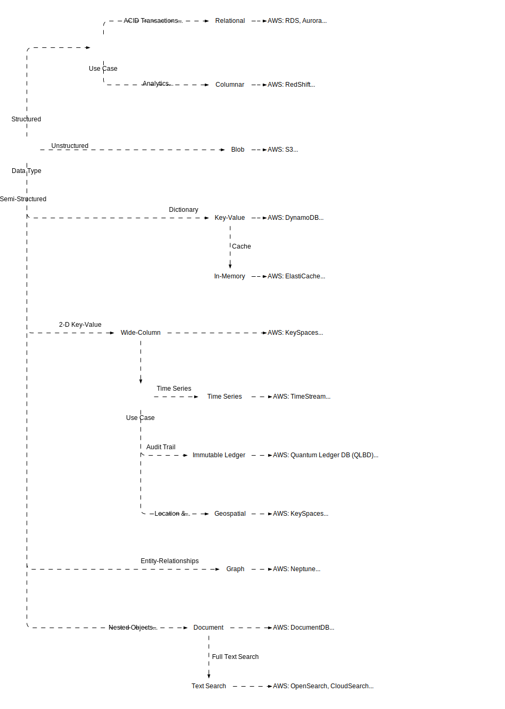
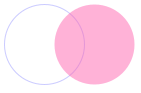

import Tabs from "@theme/Tabs";
import TabItem from "@theme/TabItem";

<Tabs queryString="primary">
  <TabItem value="db-overview" label="Overview">
      <table class="text_vertical">
        <thead>
          <tr>
            <th>DB Type</th>
            <th>Features</th>
            <th>Use Cases</th>
          </tr>
        </thead>
        <tbody>
          <tr>
            <td><b>Columnar</b></td>
            <td>
                <ul>
                    <li>Schema Evolution</li>
                    <li>Column-Oriented Storage</li>
                    <li>Column-Level Compression</li>
                    <li>Column-Wise Indexing</li>
                    <li>Analytical Query Performance</li>
                    <li>Slice-and-Dice: efficiently analyze data by selecting columns (slice) and breaking it down further (dice), allowing complex queries and aggregations on large datasets with speed and flexibility</li>
                </ul>
            </td>
            <td>
                <ul>
                    <li>Data Warehousing</li>
                    <li>Analytics</li>
                    <li>Log Processing</li>
                </ul>
            </td>
          </tr>
          <tr>
            <td><b>Document</b></td>
            <td>
                <ul>
                    <li>Efficient Query Performance</li>
                    <li>Document Versioning</li>
                    <li>Flexible Schema</li>
                </ul>
            </td>
            <td>
                <ul>
                    <li>Content Management</li>
                    <li>IoT</li>
                </ul>
            </td>
          </tr>
          <tr>
            <td><b>Graph</b></td>
            <td>
                <ul>
                    <li>Relationship Focus</li>
                    <li>Deep Insight</li>
                </ul>
            </td>
            <td>
                <ul>
                    <li>Social Networks</li>
                    <li>Fraud Detection</li>
                    <li>LLMs</li>
                </ul>
            </td>
          </tr>
          <tr>
            <td><b>Key-Value</b></td>
            <td>
                <ul>
                    <li>Data Partitioning</li>
                    <li>Simple Data Model</li>
                    <li>High-Write & Query Performance</li>
                    <li>Developer Friendly</li>
                </ul>
            </td>
            <td>
                <ul>
                    <li>Caching</li>
                    <li>Session Store</li>
                </ul>
            </td>
          </tr>
          <tr>
            <td><b>NewSQL</b></td>
            <td>
                <ul>
                    <li>Transactions & ACID</li>
                    <li>Support SQL</li>
                </ul>
            </td>
            <td>
                <ul>
                    <li>High-Transaction</li>
                    <li>Real-time</li>
                </ul>
            </td>
          </tr>
          <tr>
            <td><b>NoSQL</b></td>
            <td>
                <ul>
                    <li>Horizontal Scalability</li>
                    <li>High Availability</li>
                    <li>Distributed Architecture</li>
                    <li>Flexible Data Model</li>
                </ul>
            </td>
            <td>
                <ul>
                    <li>Big Data</li>
                    <li>Real-time</li>
                </ul>
            </td>
          </tr>
          <tr>
            <td><b>Object-Oriented</b></td>
            <td>
                <ul>
                    <li>Complex Querying & Navigation</li>
                    <li>Complex Data Models</li>
                    <li>Object Persistence</li>
                    <li>Encapsulation & Data Abstraction</li>
                    <li>Object Versioning</li>
                    <li>Inheritance & Polymorphism</li>
                </ul>
            </td>
            <td>
                <ul>
                    <li>Object Persistence</li>
                </ul>
            </td>
          </tr>
          <tr>
            <td><b>Relational / SQL</b></td>
            <td>
                <ul>
                    <li>Indexing & Optimization</li>
                    <li>Security Features</li>
                    <li>Relationship & Referential Integrity</li>
                    <li>Structured Data</li>
                    <li>Transactions & ACID</li>
                    <li>SQL Support</li>
                </ul>
            </td>
            <td>
                <ul>
                    <li>Online Transaction Processing (OLTP)</li>
                    <li>Online Analytical Processing (OLAP)</li>
                </ul>
            </td>
          </tr>
          <tr>
            <td><b>Spatial</b></td>
            <td>
                <ul>
                    <li>Spatial Types & Indexing</li>
                    <li>Topology & Network Analysis</li>
                    <li>Geospatial Query Language</li>
                    <li>Integration with GIS</li>
                </ul>
            </td>
            <td>
                <ul>
                    <li>Geographic Information Systems (GIS)</li>
                    <li>Spatial Analysis</li>
                </ul>
            </td>
          </tr>
          <tr>
            <td><b>Time-Series</b></td>
            <td>
                <ul>
                    <li>Retention Policies</li>
                    <li>Efficient Storage</li>
                    <li>Time-Window Aggregation</li>
                    <li>High Write & Query Performance</li>
                </ul>
            </td>
            <td>
                <ul>
                    <li>Sensor Data</li>
                    <li>Financial Data</li>
                    <li>Industrial IoT</li>
                </ul>
            </td>
          </tr>
          <tr>
            <td><b>Vector DB</b></td>
            <td>
                <ul>
                    <li>High-dimensional vector storage</li>
                    <li>Similarity search</li>
                    <li>Approximate nearest neighbor (ANN) search</li>
                    <li>Scalability</li>
                    <li>Metadata management: Stores and manages additional information associated with vectors for filtering and contextualization</li>
                </ul>
            </td>
            <td>
                <ul>
                    <li>Generative AI</li>
                    <li>Natural language processing (NLP)</li>
                    <li>Recommender systems</li>
                    <li>Image and video search</li>
                    <li>Fraud detection</li>
                </ul>
            </td>
          </tr>
        </tbody>
      </table>
  </TabItem>
  <TabItem value="db-selection" label="Selection Process">
    <Tabs queryString="secondary">
        <TabItem value="process-selection" label="Selection" attributes={{className:"tabs__vertical"}}>
            
        </TabItem>
        <TabItem value="process-choice" label="Choice">
            
        </TabItem>
    </Tabs>
  </TabItem>
  <TabItem value="db-transactions" label="Transactions">
    <table>
        <thead>
          <tr>
            <th>Type</th>
            <th>Definition</th>
            <th>Priority</th>
            <th>Transaction Failure</th>
            <th>Data Consistency</th>
            <th>Use Cases</th>
          </tr>
        </thead>
        <tbody>
          <tr>
            <td><b>ACID</b></td>
            <td>
                <ul>
                    <li>**Atomicity**: Each transaction is completed or aborted</li>
                    <li>**Consistency**: Guarantees committed transaction state (store valid data)</li>
                    <li>**Isolation**: Transactions are independent</li>
                    <li>**Durability**: Committed data is never lost</li>
                </ul>
            </td>
            <td>Consistency</td>
            <td>Entire transaction rolls back</td>
            <td>Guaranteed immediately</td>
            <td>Financial Transactions (Banking, Stock Trading)</td>
          </tr>
          <tr>
            <td><b>BASE</b></td>
            <td>
                <ul>
                    <li>**Basically Available**: System remains available for read and write operations despite failures</li>
                    <li>**Soft state**: System may be temporarily inconsistent but eventually becomes consistent</li>
                    <li>**Eventual consistency**: Over time, all data replicas converge to the same state</li>
                </ul>
            </td>
            <td>Availability</td>
            <td>May proceed with eventual consistency</td>
            <td>Eventual, but not always immediate</td>
            <td>Social Media Platforms</td>
          </tr>
        </tbody>
    </table>
  </TabItem>
  <TabItem value="db-locking" label="Locking">
    <Tabs queryString="secondary">
      <TabItem value="locking-hierarchy" label="Locking Hierarchy" attributes={{className:"tabs__vertical"}}>
          ```mermaid
              graph LR

              db(Database) --> table(Table)
              table --> page(Page)
              page --> row(Row)

              db ~~~|"Data Query: Shared Lock (S)<br/>Data Manipulation: Shared Lock (S)"| db
              table ~~~|"Data Query: Intention Shared Lock (IS)<br/>Data Manipulation: Intention Exclusive or Intent Update"| table
              page ~~~|"Data Query: Intention Shared Lock (IS)<br/>Data Manipulation: Intention Exclusive or Intent Update"| page
              row ~~~|"Data Query: Shared Lock (S)<br/>Data Manipulation: Exclusive or Update Lock"| row
          ```

          <table>
            <thead>
              <tr>
                <th>Aspect</th>
                <th>Intent Shared (IS)</th>
                <th>Exclusive (X)</th>
                <th>Intent Exclusive (IX)</th>
                <th>Shared with Intent Exclusive (SIX)</th>
              </tr>
            </thead>
            <tbody>
              <tr>
                <td><b>Definition</b></td>
                <td>Allows multiple readers but prevents updates. Signals intent to acquire an exclusive lock later</td>
                <td>Prevents all other users from accessing the data (reading or writing)</td>
                <td>Signals intent to acquire an exclusive lock and prevents other users from acquiring any locks (read or write)</td>
                <td>Allows multiple readers but prevents updates. Signals intent to acquire an exclusive lock and prevents other users from acquiring any locks (read or write)</td>
              </tr>
              <tr>
                <td><b>Usage</b></td>
                <td>
                  <ul>
                    <li>Initial read access before acquiring X lock</li>
                    <li>Improve concurrency for read-heavy workloads</li>
                  </ul>
                </td>
                <td>
                  <ul>
                    <li>Update operations (write, delete)</li>
                  </ul>
                </td>
                <td>
                  <ul>
                    <li>Prevent other users from acquiring any locks before acquiring X lock</li>
                    <li>Useful for long-running transactions</li>
                  </ul>
                </td>
                <td>
                  <ul>
                    <li>Similar to IS but signals future X lock acquisition</li>
                    <li>Useful for scenarios where initial read might be followed by update</li>
                  </ul>
                </td>
              </tr>
              <tr>
                <td><b>Impact on Concurrency</b></td>
                <td>Improves read concurrency</td>
                <td>Reduces write concurrency</td>
                <td>Blocks all access, impacting overall concurrency</td>
                <td>Improves read concurrency initially, reduces write concurrency later</td>
              </tr>
              <tr>
                <td><b>Scalability</b></td>
                <td>Scales well with read-heavy workloads</td>
                <td>May impact performance with high write concurrency</td>
                <td>May impact performance due to blocking all access</td>
                <td>Can provide a balance between read and write concurrency</td>
              </tr>
            </tbody>
          </table>
      </TabItem>
      <TabItem value="locking-types" label="Types">
          <table>
            <thead>
              <tr>
                <th>Feature</th>
                <th>Pessimistic Locking</th>
                <th>Optimistic Locking</th>
              </tr>
            </thead>
            <tbody>
              <tr>
                <td><b>Visualization</b></td>
                <td>
                    ```mermaid
                       sequenceDiagram
                       autonumber

                      participant User1
                      participant Database
                      participant User2

                      User1->>Database: Begin Transaction
                      User2->>Database: Begin Transaction
                      alt User1 reads record
                          Database->>User1: Return record
                          alt User2 tries to read/update same record
                              Database-->>User2: Record locked
                              User2->>Database: Rollback Transaction
                          else User2 waits
                              activate Database
                              Database->>Database: Lock record
                              User1->>Database: Update record
                              Database-->>User1: Record updated
                              Database->>User1: Commit Transaction
                              User1-->>Database: Commit acknowledged
                              Database->>Database: Release Lock record
                              deactivate Database
                          end
                      else User1 waits
                          alt User2 reads record
                              Database->>User2: Return record
                              alt User1 tries to read/update same record
                                  Database-->>User1: Record locked
                                  User1->>Database: Rollback Transaction
                              else User1 waits
                                  activate Database
                                  Database->>Database: Lock record
                                  User2->>Database: Update record
                                  Database-->>User2: Record updated
                                  Database->>User2: Commit Transaction
                                  User2-->>Database: Commit acknowledged
                                  Database->>Database: Release Lock record
                                  deactivate Database
                              end
                          else User2 waits
                              activate Database
                              Database->>Database: Lock record
                              User1->>Database: Update record
                              Database-->>User1: Record updated
                              Database->>User1: Commit Transaction
                              User1-->>Database: Commit acknowledged
                              Database->>Database: Release Lock record
                              deactivate Database
                          end
                      end
                    ```
                </td>
                <td>
                    ```mermaid
                      sequenceDiagram
                      autonumber

                      participant User1
                      participant Database
                      participant User2

                      User1->>Database: Request to read record
                      Database->>User1: Returns record
                      alt Record is not locked
                          User1->>Database: Request to update record
                          Database->>User1: Locks record for User1
                          activate Database
                          User1->>Database: Send updated record
                          Database->>User1: Updates record, unlocks it
                          deactivate Database
                          Database->>User2: Notification of record update
                      else Record is locked
                          Database->>User1: Sends lock notification
                      end

                      User2->>Database: Request to read record
                      Database->>User2: Returns record
                      alt Record is not locked
                          User2->>Database: Request to update record
                          Database->>User2: Locks record for User2
                          activate Database
                          User2->>Database: Send updated record
                          Database->>User2: Updates record, unlocks it
                          deactivate Database
                          Database->>User1: Notification of record update
                      else Record is locked
                          Database->>User2: Sends lock notification
                      end
                    ```
                </td>
              </tr>
              <tr>
                <td><b>Locking Mechanism</b></td>
                <td>Acquires locks on database records before any read/write operation</td>
                <td>No explicit locks; relies on versioning or timestamps</td>
              </tr>
              <tr>
                <td><b>Transaction Isolation</b></td>
                <td>Guarantees serializability (transactions appear to execute one after another)</td>
                <td>Relies on conflict detection during commit</td>
              </tr>
              <tr>
                <td><b>Concurrency</b></td>
                <td>Lower concurrency due to exclusive access</td>
                <td>Higher concurrency as multiple transactions can read data concurrently</td>
              </tr>
              <tr>
                <td><b>Data Integrity</b></td>
                <td>High; ensures only one transaction modifies data at a time</td>
                <td>Lower; potential for "lost updates" if conflicts occur</td>
              </tr>
              <tr>
                <td><b>Implementation</b></td>
                <td>Database-managed; different lock types (shared, exclusive) available</td>
                <td>Application-level; relies on versioning mechanisms (e.g., version numbers, timestamps) in the database</td>
              </tr>
              <tr>
                <td><b>Error Handling</b></td>
                <td>Rollback transactions that encounter locked records</td>
                <td>Retry transactions that encounter conflicts during commit</td>
              </tr>
              <tr>
                <td><b>Use Cases</b></td>
                <td>
                  <ul>
                    <li>High contention environments (frequent updates)</li>
                    <li>Critical data operations (financial transactions)</li>
                    <li>Applications requiring strict data consistency</li>
                  </ul>
                </td>
                <td>
                  <ul>
                    <li>Low contention environments (read-heavy systems)</li>
                    <li>Non-critical data updates</li>
                    <li>Short-lived transactions</li>
                  </ul>
                </td>
              </tr>
            </tbody>
          </table>
      </TabItem>
    </Tabs>
  </TabItem>
</Tabs>

## Data Storage Solutions

<Tabs queryString="primary">
  <TabItem value="storage-solutions-overview" label="Overview">
    ### Key Points for Considerations

    - **Data Volume and Growth**: How much data do you currently store, and what's the anticipated growth rate?
    - **Performance Requirements**:  How critical is fast access and retrieval of data for your operations?
    - **Data Security and Compliance**:  What security measures are necessary to safeguard sensitive data? Are there industry regulations to adhere to?
    - **Accessibility and Sharing Needs**:  Do you require remote access to data or collaboration features?
    - **Budgetary Constraints**:  What is your allocated budget for data storage solutions?
  </TabItem>
  <TabItem value="storage-solutions-processingTypes" label="Processing Types">
    <table>
        <thead>
            <tr>
                <th>Feature</th>
                <th>Online Analytical Processing (OLAP)</th>
                <th>Online Transaction Processing (OLTP)</th>
            </tr>
        </thead>
        <tbody>
            <tr>
                <td><b>Purpose</b></td>
                <td>Analytical processing for decision-making</td>
                <td>Transaction processing for day-to-day operations</td>
            </tr>
            <tr>
                <td><b>Data Usage</b></td>
                <td>Aggregates historical data for reporting and analysis</td>
                <td>Processes real-time transactions and updates</td>
            </tr>
            <tr>
                <td><b>Data Schema</b></td>
                <td>Star or snowflake schemas, denormalized</td>
                <td>Normalized schemas, reducing redundancy</td>
            </tr>
            <tr>
                <td><b>Query Complexity</b></td>
                <td>Complex queries with aggregations and joins</td>
                <td>Simple queries with frequent read/write operations</td>
            </tr>
            <tr>
                <td><b>Data Granularity</b></td>
                <td>Summarized, aggregated data</td>
                <td>Detailed, individual transactions</td>
            </tr>
            <tr>
                <td><b>Data Size</b></td>
                <td>Huge data volumes, typically in terabytes or more</td>
                <td>Smaller data volumes, typically in gigabytes or less</td>
            </tr>
            <tr>
                <td><b>Performance</b></td>
                <td>Designed for high throughput, slower write speeds</td>
                <td>Optimized for fast write speeds and low latency reads</td>
            </tr>
            <tr>
                <td><b>Examples</b></td>
                <td>Amazon Redshift, Google BigQuery, Snowflake</td>
                <td>MySQL, PostgreSQL</td>
            </tr>
        </tbody>
    </table>
  </TabItem>
  <TabItem value="storage-solutions-processingData" label="Data Processing">
    <table>
      <thead>
        <tr>
          <th>Aspect</th>
          <th>ETL</th>
          <th>ELT</th>
        </tr>
      </thead>
      <tbody>
        <tr>
          <td><b>Visualization</b></td>
          <td>
            ```mermaid
                graph LR

                subgraph Extract
                    direction TB

                    lob[(LOB)]
                    crm[(CRM)]
                    erp[(ERP)]
                end

                subgraph Load
                    direction TB

                    warehouse[(Data Warehouse)]
                end

                Extract --> transform([Transform])
                transform --> Load
            ```
          </td>
          <td>
            ```mermaid
                graph LR

                subgraph Extract
                    direction TB

                    lob[(LOB)]
                    crm[(CRM)]
                    erp[(ERP)]
                end

                subgraph Load
                    direction TB

                    lake[(Data Lake)]
                end

                Extract --> Load
                Load --> transform([Transform])
            ```
          </td>
        </tr>
        <tr>
          <td><b>Process Flow</b></td>
          <td>Extract data first, then transform and load into the target system</td>
          <td>Extract data first, load into the target system, then transform within the target system</td>
        </tr>
        <tr>
          <td><b>Data Transformation</b></td>
          <td>Transformation occurs before loading into the target system</td>
          <td>Transformation occurs after loading into the target system</td>
        </tr>
        <tr>
          <td><b>Performance</b></td>
          <td>Typically slower due to data transformation overhead during the ETL process</td>
          <td>Generally faster because loading raw data is faster than transforming it during the ETL process</td>
        </tr>
        <tr>
          <td><b>Scalability</b></td>
          <td>Limited scalability due to the need for substantial transformation before loading data</td>
          <td>Highly scalable as it can leverage the processing power of the target system for transformations</td>
        </tr>
        <tr>
          <td><b>Storage Requirements</b></td>
          <td>Higher storage requirements as both raw and transformed data need to be stored</td>
          <td>Lower storage requirements as only raw data needs to be stored initially, and transformation occurs within the target system</td>
        </tr>
        <tr>
          <td><b>Data Integrity</b></td>
          <td>Higher data integrity as data is cleaned and transformed before loading into the target system</td>
          <td>May require additional checks and controls within the target system to ensure data integrity post-transformation</td>
        </tr>
        <tr>
          <td><b>Complexity</b></td>
          <td>Typically more complex due to the need for designing and managing transformation logic</td>
          <td>Generally less complex as it leverages the capabilities of the target system for transformations</td>
        </tr>
        <tr>
          <td><b>Flexibility</b></td>
          <td>May be less flexible as transformation logic is predefined and applied uniformly to all data</td>
          <td>More flexible as transformations can be tailored to specific use cases within the target system</td>
        </tr>
        <tr>
          <td><b>Real-time Processing</b></td>
          <td>Less suitable for real-time processing due to batch-oriented nature</td>
          <td>More suitable for real-time processing as data can be loaded into the target system immediately and transformed on-the-fly</td>
        </tr>
        <tr>
          <td><b>Examples</b></td>
          <td>Apache Spark, Apache Flink, Google Cloud Dataproc</td>
          <td>GCS → Spark jobs, Dataflow → BigQuery</td>
        </tr>
        <tr>
          <td><b>Use Cases</b></td>
          <td>For well-defined data models and reporting needs</td>
          <td>For big data, data lakes, and agile analytics environments</td>
        </tr>
      </tbody>
    </table>
  </TabItem>
  <TabItem value="storage-solutions-repositories" label="Data Repositories">
    <table>
      <thead>
        <tr>
          <th>Feature</th>
          <th>Data Mart</th>
          <th>Data Warehouse</th>
          <th>Data Lake</th>
          <th>Data Lakehouse</th>
        </tr>
      </thead>
      <tbody>
        <tr>
          <td>Visualization</td>
          <td>
            ```mermaid
                graph BT

                subgraph data[Data Sources]
                    direction TB

                    data1[( )]
                    data2[( )]
                    data3[( )]
                end

                data --> staging[(Staging Area)]

                subgraph warehouse[Data Warehouse]
                    direction TB

                    warehouse1[(Metadata)]
                    warehouse2[(Raw Data)]
                    warehouse3[(Summary Data)]
                end

                subgraph marts[Data Marts]
                    direction TB

                    marts1[(Purchasing)]
                    marts2[(sales)]
                    marts3[(Inventory)]
                end

                staging --> warehouse
                warehouse --> marts

                marts --> analytics(Analytics)
                marts --> reporting(Reporting)
                marts --> mining(Mining)
            ```
          </td>
          <td>
            ```mermaid
                graph BT

                subgraph data[Structured Data]
                    direction TB

                    data1[( )]
                    data2[( )]
                    data3[( )]
                end

                data --> etl([ETL])

                subgraph warehouses[Data Warehouses]
                    direction TB

                    mart1[(Data Mart)]
                    mart2[(Data Mart)]
                end

                etl --> warehouses

                warehouses --> bi(BI)
                warehouses --> reports(Reports)
            ```
          </td>
          <td>
            ```mermaid
                graph BT

                subgraph data [Structured, Unstructured, Semi-structured]
                    direction TB

                    data1[(DB)]
                    data2[(Images)]
                    data3[(Files)]
                end

                data --> dataLake[[Data Lake]]

                dataLake <--> etl([ETL])

                dataLake --> dataPrep(Data Preparation & Validation)
                dataPrep --> dataScience(Data Science)
                dataLake --> machineLearning(Machine Learning)

                subgraph warehouses[Data Warehouses]
                    direction TB

                    mart1[(Data Mart)]
                    mart2[(Data Mart)]
                end

                etl --> warehouses

                warehouses --> bi(BI)
                warehouses --> reports(Reports)
                warehouses --> dataScience
            ```
          </td>
          <td>
            ```mermaid
                graph BT

                subgraph data [Structured, Unstructured, Semi-structured]
                    direction TB

                    data1[(DB)]
                    data2[(Images)]
                    data3[(Files)]
                end

                subgraph dataLake[Data Lake: Metadata & Governance Layer]
                    direction TB

                    etl([ETL])
                end

                data --> dataLake

                dataLake --> bi(BI)
                dataLake --> reports(Reports)
                dataLake --> dataScience(Data Science)
                dataLake --> machineLearning(Machine Learning)
            ```
          </td>
        </tr>
        <tr>
          <td>Definition</td>
          <td>A subset of a Data Warehouse containing specific data focused on a particular business function or department</td>
          <td>A central repository for structured, organized, and processed data, optimized for querying and analysis</td>
          <td>A vast repository of raw, unstructured, or semi-structured data stored in its native format</td>
          <td>An architecture combining the features of a Data Lake and a Data Warehouse, providing unified analytics on both raw and processed data</td>
        </tr>
        <tr>
          <td>Data Type</td>
          <td>Structured data tailored for specific business needs</td>
          <td>Structured data, typically from operational systems</td>
          <td>Raw, unstructured, semi-structured data</td>
          <td>Raw, semi-structured, and structured data</td>
        </tr>
        <tr>
          <td>Data Storage</td>
          <td>Similar to Data Warehouse, stored in relational databases or columnar stores</td>
          <td>Stored in a structured format like relational databases (e.g., SQL Server, PostgreSQL) or columnar stores (e.g., Redshift, BigQuery)</td>
          <td>Typically stored in distributed file systems like HDFS, AWS S3, or Azure Data Lake Storage</td>
          <td>Usually stored in a combination of Data Lake storage and structured data formats like Parquet, Delta Lake, or Apache Iceberg</td>
        </tr>
        <tr>
          <td>Data Processing</td>
          <td>Similar to Data Warehouse, batch processing is prevalent, with ETL tools used for data transformation</td>
          <td>Primarily batch processing. Data transformation and ETL processes are well-defined and structured. Tools like Informatica, Talend, or Apache Airflow are commonly used</td>
          <td>Supports batch and real-time processing. Processing is done on raw data, often using technologies like Hadoop, Spark, or Apache Flink</td>
          <td>Combines batch and real-time processing capabilities. Data is transformed and unified using tools like Apache Spark, Databricks, or Delta Lake</td>
        </tr>
        <tr>
          <td>Use Cases</td>
          <td>Tailored for specific business functions or departments requiring localized analytics and reporting. Commonly used in finance, sales, or marketing</td>
          <td>Best suited for structured reporting, business intelligence, and historical analysis. Ideal for organizations with well-defined data requirements</td>
          <td>Suitable for exploratory analytics, machine learning, and big data processing where flexibility and scalability are critical</td>
          <td>Ideal for organizations looking to combine the benefits of Data Lakes and Data Warehouses for unified analytics on both raw and processed data</td>
        </tr>
        <tr>
          <td>Examples</td>
          <td>Sales Data Mart, Finance Data Mart, HR Data Mart</td>
          <td>Amazon Redshift, Google BigQuery, Snowflake</td>
          <td>Hadoop Distributed File System (HDFS), Amazon S3, Azure Data Lake Storage</td>
          <td>Databricks Delta Lake, AWS Glue, Google BigQuery Omni</td>
        </tr>
      </tbody>
    </table>
  </TabItem>
  <TabItem value="storage-solutions-file-storage" label="File Storage">
    <table>
      <thead>
        <tr>
          <th>Feature</th>
          <th>Parquet</th>
          <th>Avro</th>
        </tr>
      </thead>
      <tbody>
        <tr>
          <td><strong>Data Storage</strong></td>
          <td>Columnar</td>
          <td>Row-based</td>
        </tr>
        <tr>
          <td><strong>Schema</strong></td>
          <td>Self-describing, stored in file metadata</td>
          <td>Stored with data, language-independent</td>
        </tr>
        <tr>
          <td><strong>Compression</strong></td>
          <td>Highly compressed, supports multiple compression codecs (Snappy, Gzip, LZO, etc.)</td>
          <td>Compressed, supports Deflate and Snappy codecs</td>
        </tr>
        <tr>
          <td><strong>Performance</strong></td>
          <td>Optimized for analytical (OLAP) workloads, fast data retrieval and processing</td>
          <td>Optimized for write-intensive, big data operations, efficient for accessing all fields</td>
        </tr>
        <tr>
          <td><strong>Language Support</strong></td>
          <td>Language-agnostic, supported by many big data frameworks (Spark, Hive, Impala)</td>
          <td>Language-independent, can be used across different programming languages</td>
        </tr>
        <tr>
          <td><strong>Advantages</strong></td>
          <td>
            <ul>
              <li>Highly compressed, efficient storage</li>
              <li>Columnar format enables fast data retrieval and processing</li>
              <li>Supports schema evolution and complex data types</li>
              <li>Widely adopted and integrated with major big data frameworks</li>
            </ul>
          </td>
          <td>
            <ul>
              <li>Language-independent, can be used across different programming languages</li>
              <li>Efficient for write-intensive, big data operations</li>
              <li>Supports schema evolution and complex data types</li>
              <li>Compact binary format reduces storage requirements</li>
            </ul>
          </td>
        </tr>
        <tr>
          <td><strong>Disadvantages</strong></td>
          <td>
            <ul>
              <li>Not human-readable</li>
              <li>Difficulties in applying updates, requires deleting and recreating the file</li>
            </ul>
          </td>
          <td>
            <ul>
              <li>Data is not human-readable</li>
              <li>Not as widely integrated as Parquet in some big data frameworks</li>
            </ul>
          </td>
        </tr>
        <tr>
          <td><strong>Use Cases</strong></td>
          <td>
            <ul>
              <li>Large-scale data analytics and business intelligence</li>
              <li>Efficient storage and processing of structured, semi-structured, and unstructured data</li>
              <li>Integration with cloud-based data warehousing and processing services (AWS Athena, Amazon Redshift Spectrum)</li>
            </ul>
          </td>
          <td>
            <ul>
              <li>Efficient storage and processing of big data workloads</li>
              <li>Data exchange and serialization between different systems and applications</li>
              <li>Streaming and real-time data processing (Apache Kafka)</li>
            </ul>
          </td>
        </tr>
      </tbody>
    </table>
  </TabItem>
</Tabs>

## Database Federation

<Tabs>
  <TabItem value="db-federation-overview" label="Overview">
    Data Federation is a technique used to integrate data from disparate sources and provide a unified, coherent view of data to the user. Often used in enterprise applications where data is distributed across multiple databases or systems.

    ```mermaid
      graph LR

      user(User) & service(Service) --> federated[[Federated Query Processor]]
      federated --> |subquery| source1{{Data Source}} & source2{{Data Source}}
      source1 --> db1[(DB)]
      source2 --> db2[(DB)]
    ```
  </TabItem>
  <TabItem value="db-federation-features" label="Features">
    - **Transparent**: Users see one database, not separate sources
    - **Heterogeneous**: Handles different data formats and systems
    - **Extensible**: Easily add new data sources as needed
    - **Autonomous**: Leaves existing databases unchanged
    - **Integrates data**: Combines data from various sources
  </TabItem>
  <TabItem value="db-federation-pros-cons" label="Pros & Cons">
    ### Pros

    - Flexible data sharing
    - Autonomy among the database components
    - Access heterogeneous data in a unified way
    - No tight coupling of applications with legacy databases

    ### Cons

    - Adds more hardware and additional complexity
    - Joining data from two databases is complex
    - Data federation's strength of preserving data can be a disadvantage for companies needing regular updates as it prevents data alteration that can lead to issues with disaster recovery
  </TabItem>
</Tabs>

## Relational Database

<Tabs queryString="primary">
    <TabItem value="relational-db-overview" label="Overview">
        Structured Query Language (**SQL**) is a programming language used for managing and manipulating relational databases.

        ### Query Flow

        ```mermaid
            graph LR

            from(FROM + JOIN) --> where(WHERE)
            where --> group(GROUP)
            group --> having(HAVING)
            having --> select(SELECT)
            select --> orderBy(ORDER BY)
            orderBy --> limit(LIMIT)
        ```

        ### Key Concepts

        - **Attribute**: A property or characteristic of an entity
        - **Column**: A vertical data element in a table
        - **Constraint**: A condition that must be met for a row to be inserted into a table, such as a column being non-null or unique values (column/table constraints)
        - **Database Management System (DBMS)**:  Database Management System, the software that manages and controls access to a database
        - **Default**: Default allows to add values to the column if the value of that column is not set
        - **Primary Key**: Non-null unique identifier for a row
        - **Foreign Key**: Field or combination of fields that establishes a link between two tables. It enforces referential integrity by ensuring that values in one table's key match with values in another table's key. This relationship allows for data consistency and facilitates queries across related tables
        - **Record**: A row in a table
        - **Schema**: The structure or blueprint of the database, defining the tables, columns, and relationships
        - **Table**: A collection of related data
        - **View**: Virtual table that is made up of elements of multiple physical or "real" tables
    </TabItem>
    <TabItem value="relational-db-detailed" label="Detailed">
        <Tabs queryString="secondary">
            <TabItem value="relational-db-detailed-subsets" label="Subsets of SQL" attributes={{className:"tabs__vertical"}}>
                <table>
                  <thead>
                    <tr>
                      <th>Language</th>
                      <th>Purpose</th>
                      <th>Examples</th>
                      <th>Features</th>
                    </tr>
                  </thead>
                  <tbody>
                    <tr>
                      <td><b>DCL (Data Control Language)</b></td>
                      <td>Manages access and permissions to data</td>
                      <td>`GRANT`, `REVOKE`</td>
                      <td>Controls who can access, manipulate, or delete data</td>
                    </tr>
                    <tr>
                      <td><b>DDL (Data Definition Language)</b></td>
                      <td>Defines and manages database structure</td>
                      <td>`CREATE`, `ALTER`, `DROP`</td>
                      <td>Used to define tables, indexes, constraints, etc</td>
                    </tr>
                    <tr>
                      <td><b>DML (Data Manipulation Language)</b></td>
                      <td>Manipulates data within the database</td>
                      <td>`INSERT`, `UPDATE`, `DELETE`</td>
                      <td>Allows adding, modifying, and removing data</td>
                    </tr>
                    <tr>
                      <td><b>DQL (Data Query Language)</b></td>
                      <td>Retrieves data from the database</td>
                      <td>`SELECT`</td>
                      <td>Primarily used for querying data from tables</td>
                    </tr>
                  </tbody>
                </table>
            </TabItem>
            <TabItem value="relational-db-detailed-having" label="WHERE vs HAVING">
                <table>
                  <thead>
                    <tr>
                      <th>Aspect</th>
                      <th>WHERE Clause</th>
                      <th>HAVING Clause</th>
                    </tr>
                  </thead>
                  <tbody>
                    <tr>
                      <td><b>Purpose</b></td>
                      <td>Filters individual rows based on specific conditions</td>
                      <td>Filters groups of rows after aggregation (using `GROUP BY`)</td>
                    </tr>
                    <tr>
                      <td><b>Data Considered</b></td>
                      <td>All rows in the table</td>
                      <td>Groups created by the `GROUP BY` clause</td>
                    </tr>
                    <tr>
                      <td><b>Condition Type</b></td>
                      <td>Can use any comparison operators, logical operators</td>
                      <td>Must use aggregate functions (`SUM`, `COUNT`, `AVG`, `MIN`, `MAX`) or expressions involving them</td>
                    </tr>
                    <tr>
                      <td><b>Execution Timing</b></td>
                      <td>Applied before rows are grouped (more efficient)</td>
                      <td>Applied after rows are grouped (less efficient)</td>
                    </tr>
                    <tr>
                      <td><b>Requirement</b></td>
                      <td>Can be used with or without `GROUP BY`</td>
                      <td>Requires a `GROUP BY` clause</td>
                    </tr>
                    <tr>
                      <td><b>Compatibility</b></td>
                      <td>Can be used with `SELECT`, `UPDATE`, and `DELETE` statements</td>
                      <td>Can only be used with `SELECT` statements</td>
                    </tr>
                    <tr>
                      <td><b>Filtering Logic</b></td>
                      <td>Filters rows that meet the condition, excluding others</td>
                      <td>Filters groups that meet the condition, excluding others</td>
                    </tr>
                  </tbody>
                </table>
            </TabItem>
            <TabItem value="relational-db-detailed-truncate" label="TRUNCATE vs DELETE">
                <table>
                  <thead>
                    <tr>
                      <th>Feature</th>
                      <th>TRUNCATE</th>
                      <th>DELETE</th>
                    </tr>
                  </thead>
                  <tbody>
                    <tr>
                      <td><b>Category</b></td>
                      <td>DDL (Data Definition Language)</td>
                      <td>DML (Data Manipulation Language)</td>
                    </tr>
                    <tr>
                      <td><b>Function</b></td>
                      <td>Removes all rows from a table</td>
                      <td>Removes specific rows based on conditions (`WHERE` clause)</td>
                    </tr>
                    <tr>
                      <td><b>Filtering</b></td>
                      <td>Not possible</td>
                      <td>Possible using `WHERE` clause</td>
                    </tr>
                    <tr>
                      <td><b>Transaction</b></td>
                      <td>Cannot be used within a transaction</td>
                      <td>Can be used within a transaction</td>
                    </tr>
                    <tr>
                      <td><b>Constraints</b></td>
                      <td>Disables foreign key constraints temporarily</td>
                      <td>Triggers foreign key constraints and other constraints</td>
                    </tr>
                    <tr>
                      <td><b>Transaction Log</b></td>
                      <td>Records only deallocated data pages</td>
                      <td>Records each deleted row</td>
                    </tr>
                    <tr>
                      <td><b>Rollback</b></td>
                      <td>Not possible</td>
                      <td>Possible (if transaction is active)</td>
                    </tr>
                    <tr>
                      <td><b>Speed</b></td>
                      <td>Faster</td>
                      <td>Slower</td>
                    </tr>
                    <tr>
                      <td><b>Locking</b></td>
                      <td>Exclusive lock on the table</td>
                      <td>Locks individual rows being deleted</td>
                    </tr>
                    <tr>
                      <td><b>Identity Columns</b></td>
                      <td>Resets auto-incrementing values</td>
                      <td>Preserves existing values</td>
                    </tr>
                    <tr>
                      <td><b>Triggers</b></td>
                      <td>Does not fire triggers</td>
                      <td>May fire triggers (depending on definition)</td>
                    </tr>
                    <tr>
                      <td><b>Permissions Required</b></td>
                      <td>`ALTER` on the table</td>
                      <td>`DELETE` on the table</td>
                    </tr>
                    <tr>
                      <td><b>Use Cases</b></td>
                      <td>
                        <ul>
                          <li>Clearing temporary or staging tables</li>
                          <li>Removing all data before reloading</li>
                          <li>Fast data deletion for large tables</li>
                        </ul>
                      </td>
                      <td>
                        <ul>
                          <li>Deleting specific records based on criteria</li>
                          <li>Selective data removal with rollback possibility</li>
                          <li>Maintaining existing identity column values</li>
                        </ul>
                      </td>
                    </tr>
                  </tbody>
                </table>
            </TabItem>
            <TabItem value="relational-db-detailed-keys" label="Table Keys">
                <table>
                  <thead>
                    <tr>
                      <th>Feature</th>
                      <th>Primary Key</th>
                      <th>Unique Key</th>
                      <th>Foreign Key</th>
                    </tr>
                  </thead>
                  <tbody>
                    <tr>
                      <td><b>Purpose</b></td>
                      <td>Uniquely identifies each row</td>
                      <td>Ensures uniqueness for a set of columns</td>
                      <td>Links data between two tables</td>
                    </tr>
                    <tr>
                      <td><b>Uniqueness</b></td>
                      <td>Mandatory (one and only one)</td>
                      <td>Enforced (no duplicates)</td>
                      <td>Enforced (references unique values)</td>
                    </tr>
                    <tr>
                      <td><b>Null Values</b></td>
                      <td>Not allowed</td>
                      <td>Allowed (one per column)</td>
                      <td>Not allowed</td>
                    </tr>
                    <tr>
                      <td><b>Number per Table</b></td>
                      <td>One</td>
                      <td>Multiple</td>
                      <td>Can reference multiple tables</td>
                    </tr>
                    <tr>
                      <td><b>Indexes</b></td>
                      <td>Typically creates a clustered index</td>
                      <td>May or may not create an index</td>
                      <td>Typically does not create an index</td>
                    </tr>
                    <tr>
                      <td><b>Auto Increment</b></td>
                      <td>Supported</td>
                      <td>Not supported</td>
                      <td>Not supported</td>
                    </tr>
                    <tr>
                      <td><b>Foreign Key Reference</b></td>
                      <td>Can be referenced by foreign keys</td>
                      <td>Can be referenced by foreign keys</td>
                      <td>References a primary or unique key</td>
                    </tr>
                  </tbody>
                </table>
            </TabItem>
            <TabItem value="relational-db-detailed-sql" label="Aggregation vs Window Function">
                <table>
                  <thead>
                    <tr>
                      <th>Feature</th>
                      <th>Aggregation</th>
                      <th>Window Function</th>
                    </tr>
                  </thead>
                  <tbody>
                    <tr>
                      <td><b>Functionality</b></td>
                      <td>Applies to entire groups of data</td>
                      <td>Applies to each row within a group</td>
                    </tr>
                    <tr>
                      <td><b>Purpose</b></td>
                      <td>Summarizes data by reducing it to a single value per group</td>
                      <td>Calculates running totals, subtotals, ranking, percentiles, on a defined partition of data</td>
                    </tr>
                    <tr>
                      <td><b>Common Functions</b></td>
                      <td>`SUM`, `COUNT`, `AVG`, `MIN`, `MAX`</td>
                      <td>`CUMSUM`, `ROW_NUMBER`, `DENSE_RANK`, `PERCENT_RANK`, `LAG`, `LEAD`</td>
                    </tr>
                    <tr>
                      <td><b>Output Format</b></td>
                      <td>Reduced DataFrame with one row per group</td>
                      <td>Maintains the original DataFrame structure with the same number of rows</td>
                    </tr>
                    <tr>
                      <td><b>Example</b></td>
                      <td>`SELECT department, COUNT(*) FROM employees GROUP BY department`</td>
                      <td>`SELECT name, salary, AVG(salary) OVER (PARTITION BY department ORDER BY hire_date ROWS BETWEEN 1 PRECEDING AND 1 FOLLOWING) FROM employees`</td>
                    </tr>
                    <tr>
                      <td><b>Use Cases</b></td>
                      <td>Suitable for summarizing data across groups, such as calculating total sales per region or average order value per customer segment</td>
                      <td>Ideal for analytical tasks requiring comparisons between rows, like calculating moving averages, cumulative sums, or identifying top N values within groups</td>
                    </tr>
                  </tbody>
                </table>
            </TabItem>
            <TabItem value="relational-db-detailed-set" label="Set Theory">
                <table>
                    <thead>
                      <tr>
                        <th>Feature</th>
                        <th>UNION</th>
                        <th>UNION ALL</th>
                        <th>INTERSECT</th>
                        <th>EXCEPT</th>
                      </tr>
                    </thead>
                    <tbody>
                      <tr>
                        <td><b>Purpose</b></td>
                        <td>Combines the results of two or more sets and removes duplicates</td>
                        <td>Combines the results of two or more sets without removing duplicates</td>
                        <td>Returns elements common to both sets</td>
                        <td>Returns elements present in the first set but not in the second</td>
                      </tr>
                      <tr>
                        <td><b>Syntax</b></td>
                        <td>`SELECT id FROM A UNION SELECT id FROM B`</td>
                        <td>`SELECT id FROM A UNION ALL SELECT id FROM B`</td>
                        <td>`SELECT id FROM A INTERSECT SELECT id FROM B`</td>
                        <td>`SELECT id FROM A EXCEPT SELECT id FROM B`</td>
                      </tr>
                      <tr>
                        <td><b>Example</b></td>
                        <td>`A = {1, 2, 3}, B = {2, 4, 5}` → `{1, 2, 3, 4, 5}` (w/o duplicates)</td>
                        <td>`A = {1, 2, 3}, B = {2, 4, 5}` → `{1, 2, 2, 3, 4, 5}` (w/ duplicates)</td>
                        <td>`A = {1, 2, 3}, B = {2, 4, 5}` → `{2}` (elements common to both sets)</td>
                        <td>`A = {1, 2, 3}, B = {2, 4, 5}` → `{1, 3}` (elements in A but not B)</td>
                      </tr>
                    </tbody>
                  </table>
            </TabItem>
        </Tabs>
    </TabItem>
    <TabItem value="relational-db-structures" label="Data Structures">
      <table class="text_vertical">
        <thead>
          <tr>
            <th>Type</th>
            <th>Visualization</th>
            <th>Definition</th>
            <th>Features</th>
            <th>Use Cases</th>
          </tr>
        </thead>
        <tbody>
          <tr>
            <td><b>Skip List</b></td>
            <td></td>
            <td>Probabilistic data structure for ordered sets or maps, offering efficient search and insertion with average case complexity better than balanced trees</td>
            <td>Used in Redis</td>
            <td>In-memory</td>
          </tr>
          <tr>
            <td><b>Hash Index</b></td>
            <td></td>
            <td>Uses a hash function to quickly map data keys to their locations, ideal for fast lookups</td>
            <td>Most common in-memory index solution</td>
            <td>In-memory</td>
          </tr>
          <tr>
            <td><b>SSTable</b></td>
            <td></td>
            <td>File format for storing data in sorted order on disk, enabling efficient retrieval operations</td>
            <td>Immutable data structure. Seldom used alone</td>
            <td>Disk-based</td>
          </tr>
          <tr>
            <td><b>LSM Tree</b></td>
            <td></td>
            <td>Data structure that combines in-memory and disk-based storage for ordered data, optimizing write performance and later merging for efficient reads</td>
            <td>High write throughput. Disk compaction may impact performance</td>
            <td>Memory + Disk</td>
          </tr>
          <tr>
            <td><b>B-Tree</b></td>
            <td></td>
            <td>Self-balancing tree data structure for sorted data, allowing efficient search, insertion, and deletion operations</td>
            <td>Most popular database index implementation</td>
            <td>Disk-based</td>
          </tr>
          <tr>
            <td><b>Inverted Index</b></td>
            <td></td>
            <td>Used for text retrieval, where words are mapped to documents they appear in, facilitating fast full-text searches</td>
            <td>Used in document search engine such as Lucene</td>
            <td>Search document</td>
          </tr>
          <tr>
            <td><b>Suffix Tree</b></td>
            <td></td>
            <td>Stores suffixes of words, enabling efficient searches for patterns and substrings within a text</td>
            <td>Used in string search, such as string suffix match</td>
            <td>Search string</td>
          </tr>
          <tr>
            <td><b>R-Tree</b></td>
            <td></td>
            <td>Stores spatial data like points, rectangles, or polygons, allowing efficient searches for objects within a specific area</td>
            <td>Nearest neighbor</td>
            <td>Search multi-dimension shape</td>
          </tr>
        </tbody>
      </table>
    </TabItem>
    <TabItem value="relational-db-syntax" label="Syntax">
        <table>
            <thead>
                <tr>
                    <th>Type</th>
                    <th>Definition</th>
                    <th>Example</th>
                </tr>
            </thead>
            <tbody>
                <tr>
                    <td><b>SELECT</b></td>
                    <td>Retrieves data from a database</td>
                    <td>`SELECT column1, column2 FROM table_name`</td>
                </tr>
                <tr>
                    <td><b>INSERT</b></td>
                    <td>Adds new records to a table</td>
                    <td>`INSERT INTO table_name (column1, column2) VALUES (value1, value2)`</td>
                </tr>
                <tr>
                    <td><b>UPDATE</b></td>
                    <td>Modifies existing records in a table</td>
                    <td>`UPDATE table_name SET column1 = value1, column2 = value2 WHERE condition`</td>
                </tr>
                <tr>
                    <td><b>DELETE</b></td>
                    <td>Deletes records from a table</td>
                    <td>`DELETE FROM table_name WHERE condition`</td>
                </tr>
                <tr>
                    <td><b>JOIN</b></td>
                    <td>Combines rows from two or more tables based on a related column</td>
                    <td>`SELECT * FROM table1 INNER JOIN table2 ON table1.column = table2.column`</td>
                </tr>
                <tr>
                    <td><b>GROUP BY</b></td>
                    <td>Groups rows with identical values into summary rows</td>
                    <td>`SELECT column1, COUNT(*) FROM table_name GROUP BY column1`</td>
                </tr>
                <tr>
                    <td><b>HAVING</b></td>
                    <td>Filters records grouped by GROUP BY clause</td>
                    <td>`SELECT column1, COUNT(*) FROM table_name GROUP BY column1 HAVING COUNT(*) > 10`</td>
                </tr>
                <tr>
                    <td><b>ORDER BY</b></td>
                    <td>Sorts the result set in ascending or descending order</td>
                    <td>`SELECT * FROM table_name ORDER BY column1 DESC`</td>
                </tr>
                <tr>
                    <td><b>WHERE</b></td>
                    <td>Filters records based on specified conditions</td>
                    <td>`SELECT * FROM table_name WHERE condition`</td>
                </tr>
                <tr>
                    <td><b>DISTINCT</b></td>
                    <td>Returns only distinct (different) values</td>
                    <td>`SELECT DISTINCT column1 FROM table_name`</td>
                </tr>
                <tr>
                    <td><b>UNION</b></td>
                    <td>Combines the result sets of two or more SELECT statements</td>
                    <td>`SELECT column1 FROM table1 UNION SELECT column1 FROM table2`</td>
                </tr>
                <tr>
                    <td><b>TRANSACTION</b></td>
                    <td>Groups a set of SQL statements into a single unit of work</td>
                    <td>`BEGIN TRANSACTION; ... COMMIT; or ROLLBACK;`</td>
                </tr>
                <tr>
                    <td><b>INDEX</b></td>
                    <td>Creates an index on a table</td>
                    <td>`CREATE INDEX index_name ON table_name (column1)`</td>
                </tr>
                <tr>
                    <td><b>VIEW</b></td>
                    <td>Virtual table derived from one or more tables</td>
                    <td>`CREATE VIEW view_name AS SELECT column1, column2 FROM table_name WHERE condition`</td>
                </tr>
                <tr>
                    <td><b>TRIGGER</b></td>
                    <td>Executes a set of actions when a certain event occurs on a table</td>
                    <td>`CREATE TRIGGER trigger_name BEFORE INSERT ON table_name FOR EACH ROW BEGIN ... END`</td>
                </tr>
                <tr>
                    <td><b>SUBQUERY</b></td>
                    <td>Nested query inside another query</td>
                    <td>`SELECT column1 FROM table_name WHERE column1 IN (SELECT column1 FROM table2 WHERE condition)`</td>
                </tr>
                <tr>
                    <td><b>CASE</b></td>
                    <td>Provides conditional logic within a query</td>
                    <td>`SELECT column1, CASE WHEN condition THEN result1 ELSE result2 END AS result FROM table_name`</td>
                </tr>
            </tbody>
        </table>
    </TabItem>
    <TabItem value="relational-db-normalization" label="Normalization">
        Process of organizing data in a relational database to minimize redundancy and improve data integrity.

        - **Reduce data duplication**: This saves storage space and minimizes maintenance headaches
        - **Enhance data consistency**: When a piece of data changes, it only needs to be updated in one place, ensuring consistency across the database
        - **Improve data retrieval efficiency**: Normalized databases allow for faster and more efficient querying of data

        Normalization is achieved through a series of steps, each referred to as a Normal Form (**NF**) Each subsequent form builds upon the previous one, progressively reducing redundancy

        <table class="text_vertical">
            <thead>
              <tr>
                <th>Normal Form</th>
                <th>Key Points</th>
                <th>Steps</th>
                <th>Example</th>
              </tr>
            </thead>
            <tbody>
              <tr>
                <td><b>0NF</b></td>
                <td>Non-normalized data</td>
                <td></td>
                <td>
                    <table>
                        <thead>
                          <tr>
                            <th>Name</th>
                            <th>Address</th>
                            <th>Movie</th>
                            <th>Salutation</th>
                          </tr>
                        </thead>
                        <tbody>
                            <tr>
                                <td>Jane Doe</td>
                                <td>1st Street</td>
                                <td>Pirates of the Caribbean, Game of Thrones</td>
                                <td>Ms</td>
                            </tr>
                            <tr>
                                <td>Joe Doe</td>
                                <td>38 Street</td>
                                <td>Kung Fu Panda, Squid Game</td>
                                <td>Mr</td>
                            </tr>
                            <tr>
                                <td>Joe Doe</td>
                                <td>8th Ave</td>
                                <td>Game of Thrones</td>
                                <td>Mr</td>
                            </tr>
                        </tbody>
                    </table>
                </td>
              </tr>
              <tr>
                <td><b>1NF</b></td>
                <td>
                    <ul>
                        <li>Each table cell should contain a single value</li>
                        <li>Each record has to be unique</li>
                    </ul>
                </td>
                <td>
                    <ul>
                        <li>Identify repeating groups within a table</li>
                        <li>Create separate tables for these groups</li>
                        <li>Establish relationships between tables using primary and foreign keys. (A foreign key in one table references the primary key of another table, linking related data)</li>
                    </ul>
                </td>
                <td>
                    <ul>
                        <li>Flatten the table by storing in a cell a single value</li>
                        <li>
                            <table>
                                <thead>
                                  <tr>
                                    <th>Name</th>
                                    <th>Address</th>
                                    <th>Movie</th>
                                    <th>Salutation</th>
                                  </tr>
                                </thead>
                                <tbody>
                                    <tr>
                                        <td>Jane Doe</td>
                                        <td>1st Street</td>
                                        <td>Pirates of the Caribbean</td>
                                        <td>Ms</td>
                                    </tr>
                                    <tr>
                                        <td>Jane Doe</td>
                                        <td>1st Street</td>
                                        <td>Game of Thrones</td>
                                        <td>Ms</td>
                                    </tr>
                                    <tr>
                                        <td>Joe Doe</td>
                                        <td>38 Street</td>
                                        <td>Squid Game</td>
                                        <td>Mr</td>
                                    </tr>
                                    <tr>
                                        <td>Joe Doe</td>
                                        <td>38 Street</td>
                                        <td>Squid Game</td>
                                        <td>Mr</td>
                                    </tr>
                                    <tr>
                                        <td>Joe Doe</td>
                                        <td>8th Ave</td>
                                        <td>Game of Thrones</td>
                                        <td>Mr</td>
                                    </tr>
                                </tbody>
                            </table>
                        </li>
                    </ul>
                </td>
              </tr>
              <tr>
                <td><b>2NF</b></td>
                <td>
                    <ul>
                        <li>The table must already be in 1NF</li>
                        <li>Single column Primary Key that doesn't functionally dependant on any subset of candidate key relation</li>
                    </ul>
                </td>
                <td>
                    <ul>
                        <li>Identify non-key attributes that depend only on a part of the primary key</li>
                        <li>Create separate tables for these attributes, with a new primary key formed by the relevant part of the original key and any additional attributes that determine the value of the dependent attribute(s)</li>
                        <li>Establish foreign key relationships between the new table and the original table</li>
                    </ul>
                </td>
                <td>
                    <ul>
                        <li>
                            <table>
                                <thead>
                                  <tr>
                                    <th>Membership ID</th>
                                    <th>Name</th>
                                    <th>Address</th>
                                    <th>Salutation</th>
                                  </tr>
                                </thead>
                                <tbody>
                                    <tr>
                                        <td>1</td>
                                        <td>Jane Doe</td>
                                        <td>1st Street</td>
                                        <td>Ms</td>
                                    </tr>
                                    <tr>
                                        <td>2</td>
                                        <td>Joe Doe</td>
                                        <td>38 Street</td>
                                        <td>Mr</td>
                                    </tr>
                                    <tr>
                                        <td>3</td>
                                        <td>Joe Doe</td>
                                        <td>8th Ave</td>
                                        <td>Mr</td>
                                    </tr>
                                </tbody>
                            </table>
                        </li>
                        <li>
                            <table>
                                <thead>
                                  <tr>
                                    <th>Membership ID</th>
                                    <th>Movie</th>
                                  </tr>
                                </thead>
                                <tbody>
                                    <tr>
                                        <td>1</td>
                                        <td>Pirates of the Caribbean</td>
                                    </tr>
                                    <tr>
                                        <td>1</td>
                                        <td>Game of Thrones</td>
                                    </tr>
                                    <tr>
                                        <td>2</td>
                                        <td>Squid Game</td>
                                    </tr>
                                    <tr>
                                        <td>2</td>
                                        <td>Squid Game</td>
                                    </tr>
                                    <tr>
                                        <td>3</td>
                                        <td>Game of Thrones</td>
                                    </tr>
                                </tbody>
                            </table>
                        </li>
                    </ul>
                </td>
              </tr>
              <tr>
                <td><b>3NF</b></td>
                <td>
                    <ul>
                        <li>The table must already be in 2NF</li>
                        <li>
                        Has no transitive functional dependencies
                        <ul>
                            <li>If an A functionally determines B (A → B; or B is dependant on A, or B comes from an A ) and simultaneously B determines C (B → C), then A is transitively dependant on C (A → C)</li>
                            <li>birth code → name, age; name, age → address; birth code → address</li>
                        </ul>
                        </li>
                    </ul>
                </td>
                <td>
                    <ul>
                        <li>**Identify transitive dependencies**: Analyze the relationships between non-key attributes. Look for situations where one non-key attribute depends on another non-key attribute, which ultimately depends on the primary key</li>
                        <li>**Decompose the table**: If you find transitive dependencies, create a new table to isolate the dependent attribute(s) and any other attributes that determine their values</li>
                        <li>**Establish foreign key relationships**: Link the new table back to the original table using a foreign key that references the relevant determining attribute(s)</li>
                    </ul>
                </td>
                <td>
                    <ul>
                        <li>
                            <table>
                                <thead>
                                  <tr>
                                    <th>Membership ID</th>
                                    <th>Name</th>
                                    <th>Address</th>
                                    <th>Salutation ID</th>
                                  </tr>
                                </thead>
                                <tbody>
                                    <tr>
                                        <td>1</td>
                                        <td>Jane Doe</td>
                                        <td>1st Street</td>
                                        <td>2</td>
                                    </tr>
                                    <tr>
                                        <td>2</td>
                                        <td>Joe Doe</td>
                                        <td>38 Street</td>
                                        <td>1</td>
                                    </tr>
                                    <tr>
                                        <td>3</td>
                                        <td>Joe Doe</td>
                                        <td>8th Ave</td>
                                        <td>1</td>
                                    </tr>
                                </tbody>
                            </table>
                        </li>
                        <li>
                            <table>
                                <thead>
                                  <tr>
                                    <th>Membership ID</th>
                                    <th>Movie</th>
                                  </tr>
                                </thead>
                                <tbody>
                                    <tr>
                                        <td>1</td>
                                        <td>Pirates of the Caribbean</td>
                                    </tr>
                                    <tr>
                                        <td>1</td>
                                        <td>Game of Thrones</td>
                                    </tr>
                                    <tr>
                                        <td>2</td>
                                        <td>Squid Game</td>
                                    </tr>
                                    <tr>
                                        <td>2</td>
                                        <td>Squid Game</td>
                                    </tr>
                                    <tr>
                                        <td>3</td>
                                        <td>Game of Thrones</td>
                                    </tr>
                                </tbody>
                            </table>
                        </li>
                        <li>
                            <table>
                                <thead>
                                  <tr>
                                    <th>Salutation ID</th>
                                    <th>Salutation</th>
                                  </tr>
                                </thead>
                                <tbody>
                                    <tr>
                                        <td>1</td>
                                        <td>Mr</td>
                                    </tr>
                                    <tr>
                                        <td>2</td>
                                        <td>Ms</td>
                                    </tr>
                                </tbody>
                            </table>
                        </li>
                    </ul>
                </td>
              </tr>
              <tr>
                <td><b>Boyce-Codd Normal Form (BCNF)</b></td>
                <td>
                    <ul>
                        <li>The table must already be in 3NF</li>
                        <li>Decompose non-trivial functional dependencies by separating them into a new tables and link them with foreign keys (FK)</li>
                        <li>Ensure that every determinant is a candidate key</li>
                    </ul>
                </td>
                <td></td>
                <td></td>
              </tr>
              <tr>
                <td><b>4NF</b></td>
                <td>
                    <ul>
                        <li>The table must already be in BCNF</li>
                        <li>If no database table instance contains 2 or more, independent and multivalued data describing the relevant entity</li>
                    </ul>
                </td>
                <td></td>
                <td></td>
              </tr>
              <tr>
                <td><b>5NF</b></td>
                <td>
                    <ul>
                        <li>The table must already be in 4NF</li>
                        <li>Decompose join dependencies by separating them into a new tables and link them with foreign keys (FK)</li>
                    </ul>
                </td>
                <td></td>
                <td></td>
              </tr>
              <tr>
                <td><b>6NF</b></td>
                <td>
                    <ul>
                        <li>The table must already be in 5NF</li>
                        <li>Decompose temporal dependencies which involve time-varying relationships between attributes</li>
                    </ul>
                </td>
                <td></td>
                <td></td>
              </tr>
            </tbody>
        </table>
    </TabItem>
    <TabItem value="relational-db-joins" label="Joins">
        <table class="sticky column text_vertical" style={{textWrap: "nowrap"}}>
            <thead>
              <tr>
                <th>Type</th>
                <th style={{minWidth: '350px'}}>Visualization</th>
                <th>Definition</th>
                <th>Syntax</th>
                <th style={{minWidth: '350px'}}>Example</th>
              </tr>
            </thead>
            <tbody>
              <tr>
                <td><b>Left Join / Left Outer Join</b></td>
                <td></td>
                <td>Everything on the left + everything on the right that matches</td>
                <td>`SELECT * FROM table1 LEFT JOIN table2 ON table1.key = table2.key`</td>
                <td>
                    ```mermaid
                        graph TB

                        user(User) --> result(Result)
                        order(Order) --> result

                        user ~~~|<table><thead><tr><th>User ID</th><th>User Name</th></tr></thead><tbody><tr><td>1</td><td>John</td></tr><tr><td>2</td><td>Joe</td></tr><tr><td>3</td><td>Jane</td></tr></tbody></table>| user
                        order ~~~|<table><thead><tr><th>User ID</th><th>Order ID</th></tr></thead><tbody><tr><td>1</td><td>111</td></tr><tr><td>2</td><td>222</td></tr><tr><td>8</td><td>888</td></tr></tbody></table>| order
                        result ~~~|<table><thead><tr><th>User ID</th><th>User Name</th><th>Order ID</th></tr></thead><tbody><tr><td>1</td><td>John</td><td>111</td></tr><tr><td>2</td><td>Joe</td><td>222</td></tr><tr><td>3</td><td>Jane</td><td>NULL</td></tr></tbody></table>| result
                    ```
                </td>
              </tr>
              <tr>
                <td><b>Anti Left Join</b></td>
                <td></td>
                <td>Everything on the left that is NOT on the right</td>
                <td>`SELECT * FROM table1 LEFT JOIN table2 ON table1.key = table2.key WHERE table2.key IS NULL`</td>
                <td>
                    ```mermaid
                        graph TB

                        user(User) --> result(Result)
                        order(Order) --> result

                        user ~~~|<table><thead><tr><th>User ID</th><th>User Name</th></tr></thead><tbody><tr><td>1</td><td>John</td></tr><tr><td>2</td><td>Joe</td></tr><tr><td>3</td><td>Jane</td></tr></tbody></table>| user
                        order ~~~|<table><thead><tr><th>User ID</th><th>Order ID</th></tr></thead><tbody><tr><td>1</td><td>111</td></tr><tr><td>2</td><td>222</td></tr><tr><td>8</td><td>888</td></tr></tbody></table>| order
                        result ~~~|<table><thead><tr><th>User ID</th><th>User Name</th><th>Order ID</th></tr></thead><tbody><tr><td>3</td><td>Jane</td><td>NULL</td></tr></tbody></table>| result
                    ```
                </td>
              </tr>
              <tr>
                <td><b>Right Join / Right Outer Join</b></td>
                <td></td>
                <td>Everything on the right + everything on the left that matches</td>
                <td>`SELECT * FROM table1 RIGHT JOIN table2 ON table1.key = table2.key`</td>
                <td>
                    ```mermaid
                        graph TB

                        user(User) --> result(Result)
                        order(Order) --> result

                        user ~~~|<table><thead><tr><th>User ID</th><th>User Name</th></tr></thead><tbody><tr><td>1</td><td>John</td></tr><tr><td>2</td><td>Joe</td></tr><tr><td>3</td><td>Jane</td></tr></tbody></table>| user
                        order ~~~|<table><thead><tr><th>User ID</th><th>Order ID</th></tr></thead><tbody><tr><td>1</td><td>111</td></tr><tr><td>2</td><td>222</td></tr><tr><td>8</td><td>888</td></tr></tbody></table>| order
                        result ~~~|<table><thead><tr><th>User ID</th><th>User Name</th><th>Order ID</th></tr></thead><tbody><tr><td>1</td><td>John</td><td>111</td></tr><tr><td>2</td><td>Joe</td><td>222</td></tr><tr><td>8</td><td>NULL</td><td>888</td></tr></tbody></table>| result
                    ```
                </td>
              </tr>
              <tr>
                <td><b>Anti Right Join</b></td>
                <td></td>
                <td>Everything on the right that is NOT on the left</td>
                <td>`SELECT * FROM table1 RIGHT JOIN table2 ON table1.key = table2.key WHERE table1.key IS NULL`</td>
                <td>
                    ```mermaid
                        graph TB

                        user(User) --> result(Result)
                        order(Order) --> result

                        user ~~~|<table><thead><tr><th>User ID</th><th>User Name</th></tr></thead><tbody><tr><td>1</td><td>John</td></tr><tr><td>2</td><td>Joe</td></tr><tr><td>3</td><td>Jane</td></tr></tbody></table>| user
                        order ~~~|<table><thead><tr><th>User ID</th><th>Order ID</th></tr></thead><tbody><tr><td>1</td><td>111</td></tr><tr><td>2</td><td>222</td></tr><tr><td>8</td><td>888</td></tr></tbody></table>| order
                        result ~~~|<table><thead><tr><th>User ID</th><th>User Name</th><th>Order ID</th></tr></thead><tbody><tr><td>NULL</td><td>NULL</td><td>888</td></tr></tbody></table>| result
                    ```
                </td>
              </tr>
              <tr>
                <td><b>Full Outer Join</b></td>
                <td></td>
                <td>Everything on the left + everything on the right</td>
                <td>`SELECT * FROM table1 FULL OUTER JOIN table2 ON table1.key = table2.key`</td>
                <td>
                    ```mermaid
                        graph TB

                        user(User) --> result(Result)
                        order(Order) --> result

                        user ~~~|<table><thead><tr><th>User ID</th><th>User Name</th></tr></thead><tbody><tr><td>1</td><td>John</td></tr><tr><td>2</td><td>Joe</td></tr><tr><td>3</td><td>Jane</td></tr></tbody></table>| user
                        order ~~~|<table><thead><tr><th>User ID</th><th>Order ID</th></tr></thead><tbody><tr><td>1</td><td>111</td></tr><tr><td>2</td><td>222</td></tr><tr><td>8</td><td>888</td></tr></tbody></table>| order
                        result ~~~|<table><thead><tr><th>User ID</th><th>User Name</th><th>Order ID</th></tr></thead><tbody><tr><td>1</td><td>John</td><td>111</td></tr><tr><td>2</td><td>Joe</td><td>222</td></tr><tr><td>3</td><td>Jane</td><td>NULL</td></tr><tr><td>8</td><td>NULL</td><td>888</td></tr></tbody></table>| result
                    ```
                </td>
              </tr>
              <tr>
                <td><b>Anti Outer Join</b></td>
                <td></td>
                <td>Everything on the left and right that is unique to each other</td>
                <td>`SELECT * FROM table1 FULL OUTER JOIN table2 ON table1.key = table2.key WHERE table1.key IS NULL OR table2.key IS NULL`</td>
                <td>
                    ```mermaid
                        graph TB

                        user(User) --> result(Result)
                        order(Order) --> result

                        user ~~~|<table><thead><tr><th>User ID</th><th>User Name</th></tr></thead><tbody><tr><td>1</td><td>John</td></tr><tr><td>2</td><td>Joe</td></tr><tr><td>3</td><td>Jane</td></tr></tbody></table>| user
                        order ~~~|<table><thead><tr><th>User ID</th><th>Order ID</th></tr></thead><tbody><tr><td>1</td><td>111</td></tr><tr><td>2</td><td>222</td></tr><tr><td>8</td><td>888</td></tr></tbody></table>| order
                        result ~~~|<table><thead><tr><th>User ID</th><th>User Name</th><th>Order ID</th></tr></thead><tbody><tr><td>NULL</td><td>NULL</td><td>888</td></tr></tbody></table>| result
                    ```
                </td>
              </tr>
              <tr>
                <td><b>Join / Inner Join</b></td>
                <td></td>
                <td>Only the things that are common</td>
                <td>`SELECT * FROM table1 INNER JOIN table2 ON table1.key = table2.key`</td>
                <td>
                    ```mermaid
                        graph TB

                        user(User) --> result(Result)
                        order(Order) --> result

                        user ~~~|<table><thead><tr><th>User ID</th><th>User Name</th></tr></thead><tbody><tr><td>1</td><td>John</td></tr><tr><td>2</td><td>Joe</td></tr><tr><td>3</td><td>Jane</td></tr></tbody></table>| user
                        order ~~~|<table><thead><tr><th>User ID</th><th>Order ID</th></tr></thead><tbody><tr><td>1</td><td>111</td></tr><tr><td>1</td><td>222</td></tr><tr><td>5</td><td>1</td></tr></tbody></table>| order
                        result ~~~|<table><thead><tr><th>User ID</th><th>User Name</th><th>Order ID</th></tr></thead><tbody><tr><td>1</td><td>John</td><td>111</td></tr><tr><td>1</td><td>John</td><td>222</td></tr></tbody></table>| result
                    ```
                </td>
              </tr>
              <tr>
                <td><b>Cross Join</b></td>
                <td></td>
                <td>All combinations of rows from both tables (Cartesian Product)</td>
                <td>`SELECT * FROM table1 CROSS JOIN table2`</td>
                <td>
                    ```mermaid
                        graph TB

                        user(User) --> result(Result)
                        order(Order) --> result

                        user ~~~|<table><thead><tr><th>User ID</th><th>User Name</th></tr></thead><tbody><tr><td>1</td><td>John</td></tr><tr><td>2</td><td>Joe</td></tr><tr><td>3</td><td>Jane</td></tr></tbody></table>| user
                        order ~~~|<table><thead><tr><th>User ID</th><th>Order ID</th></tr></thead><tbody><tr><td>1</td><td>111</td></tr><tr><td>2</td><td>222</td></tr><tr><td>8</td><td>888</td></tr></tbody></table>| order
                        result ~~~|<table><thead><tr><th>User ID</th><th>User Name</th><th>Order ID</th></tr></thead><tbody><tr><td>1</td><td>John</td><td>111</td></tr><tr><td>1</td><td>John</td><td>222</td></tr><tr><td>1</td><td>John</td><td>888</td></tr><tr><td>2</td><td>Joe</td><td>111</td></tr><tr><td>2</td><td>Joe</td><td>222</td></tr><tr><td>2</td><td>Joe</td><td>888</td></tr><tr><td>3</td><td>Jane</td><td>111</td></tr><tr><td>3</td><td>Jane</td><td>222</td></tr><tr><td>3</td><td>Jane</td><td>888</td></tr></tbody></table>| result
                    ```
                </td>
              </tr>
              <tr>
                <td><b>Self Join</b></td>
                <td></td>
                <td>The table is joined with itself</td>
                <td>`SELECT * FROM table1 AS t1 INNER JOIN table1 AS t2 ON t1.key = t2.key`</td>
                <td>
                    ```mermaid
                        graph TB

                        user1(User) --> result(Result)
                        user2(User) --> result

                        user1 ~~~|<table><thead><tr><th>User ID</th><th>User Name</th></tr></thead><tbody><tr><td>1</td><td>John</td></tr><tr><td>2</td><td>Joe</td></tr><tr><td>3</td><td>Jane</td></tr></tbody></table>| user1
                        user2 ~~~|<table><thead><tr><th>User ID</th><th>User Name</th></tr></thead><tbody><tr><td>1</td><td>John</td></tr><tr><td>2</td><td>Joe</td></tr><tr><td>3</td><td>Jane</td></tr></tbody></table>| user2
                        result ~~~|"<table><thead><tr><th>User ID (User1)</th><th>User Name (User1)</th><th>User ID (User2)</th><th>User Name (User2)</th></tr></thead><tbody><tr><td>1</td><td>John</td><td>1</td><td>John</td></tr><tr><td>1</td><td>John</td><td>2</td><td>Joe</td></tr><tr><td>1</td><td>John</td><td>3</td><td>Jane</td></tr><tr><td>2</td><td>Joe</td><td>1</td><td>John</td></tr><tr><td>2</td><td>Joe</td><td>2</td><td>Joe</td></tr><tr><td>2</td><td>Joe</td><td>3</td><td>Jane</td></tr><tr><td>3</td><td>Jane</td><td>1</td><td>John</td></tr><tr><td>3</td><td>Jane</td><td>2</td><td>Joe</td></tr><tr><td>3</td><td>Jane</td><td>3</td><td>Jane</td></tr></tbody></table>"| result
                    ```
                </td>
              </tr>
            </tbody>
        </table>
    </TabItem>
    <TabItem value="relational-db-relations" label="Relations">
        <table>
            <thead>
                <tr>
                    <th>Feature</th>
                    <th>One-to-One</th>
                    <th>One-to-Many</th>
                    <th>Many-to-Many</th>
                </tr>
            </thead>
            <tbody>
                <tr>
                    <td><b>Visualization</b></td>
                    <td>
                        ```mermaid
                        erDiagram
                            Person ||--o| Passport : "1..0-1"
                        ````
                    </td>
                    <td>
                        ```mermaid
                        erDiagram
                            DepartmentsA ||--|{ EmployeeA : "1..1-*"
                        ````
                    </td>
                    <td>
                        ```mermaid
                        erDiagram
                            Students o|--|{ Students-Courses : "0-1..1-*"
                            Courses ||--o{ Students-Courses : "1..0-*"
                        ````
                    </td>
                </tr>
                <tr>
                    <td><b>Definition</b></td>
                    <td>Each record in one table is associated with exactly one record in another</td>
                    <td>Each record in one table can be associated with one or more records in another</td>
                    <td>Records in both tables can be associated with multiple records in the other</td>
                </tr>
                <tr>
                    <td><b>Example</b></td>
                    <td>Person → Passport</td>
                    <td>Department → Employee</td>
                    <td>Student → Course</td>
                </tr>
            </tbody>
        </table>
    </TabItem>
    <TabItem value="relational-db-common-issues" label="Common Issues">
      <table class="text_vertical">
        <thead>
          <tr>
            <th>Issue</th>
            <th>Definition</th>
            <th>Impact</th>
            <th>Solutions</th>
          </tr>
        </thead>
        <tbody>
          <tr>
            <td><b>Cartesian Products</b></td>
            <td>Occurs when 2 or more tables are joined without a proper `WHERE` clause, resulting in huge datasets</td>
            <td>
              <ul>
                <li>High resource consumption</li>
                <li>Slow query performance</li>
                <li>Database server overload</li>
              </ul>
            </td>
            <td>
              <ul>
                <li>Ensure `WHERE` clause in `JOIN` queries</li>
                <li>Optimize query design and indexing</li>
                <li>Limit result set size</li>
              </ul>
            </td>
          </tr>
          <tr>
            <td><b>Connections overhead</b></td>
            <td>Establishing multiple connections to the same database</td>
            <td>
              <ul>
                <li>Resource wastage</li>
                <li>Decreased performance due to connection establishment overhead</li>
                <li>Scalability issues</li>
              </ul>
            </td>
            <td>
              <ul>
                <li>Implement connection pooling mechanism</li>
                <li>Tune connection timeout settings</li>
              </ul>
            </td>
          </tr>
          <tr>
            <td><b>Data Inconsistency</b></td>
            <td>Same data exists in different forms across the database</td>
            <td>
              <ul>
                <li>Incorrect query results</li>
                <li>Application errors</li>
                <li>Data corruption</li>
              </ul>
            </td>
            <td>
              <ul>
                <li>Use transactions and locking mechanisms</li>
                <li>Implement referential integrity constraints</li>
                <li>Regular data validation and cleansing</li>
              </ul>
            </td>
          </tr>
          <tr>
            <td><b>Deadlocks</b></td>
            <td>2 or more transactions are waiting for each other to release locks</td>
            <td>
              <ul>
                <li>Transaction failure</li>
                <li>Resource wastage</li>
                <li>System deadlock</li>
              </ul>
            </td>
            <td>
              <ul>
                <li>Analyze and optimize transaction isolation levels</li>
                <li>Minimize transaction duration</li>
              </ul>
            </td>
          </tr>
          <tr>
            <td><b>Full Table Scans</b></td>
            <td>Scanning the entire table to satisfy a query instead of using indexes</td>
            <td>
              <ul>
                <li>Slow query performance</li>
                <li>High I/O load</li>
              </ul>
            </td>
            <td>
              <ul>
                <li>Create appropriate indexes</li>
                <li>Tune SQL queries to leverage existing indexes</li>
                <li>Partition large tables for better performance</li>
              </ul>
            </td>
          </tr>
          <tr>
            <td><b>Missing Indexes</b></td>
            <td>Indexes that are required to satisfy a query are missing</td>
            <td>
              <ul>
                <li>Slow query performance</li>
                <li>High CPU and I/O utilization</li>
              </ul>
            </td>
            <td>
              <ul>
                <li>Analyze query execution plans</li>
                <li>Create indexes based on query patterns and workload characteristics</li>
              </ul>
            </td>
          </tr>
          <tr>
            <td><b>N+1</b></td>
            <td>Initial query fetches N rows, and then N additional queries are executed to fetch related data for each row</td>
            <td>
              <ul>
                <li>Increased number of queries</li>
                <li>Poor performance</li>
                <li>High resource consumption</li>
              </ul>
            </td>
            <td>
              <ul>
                <li>Use eager loading or batch loading in ORMs</li>
                <li>Optimize data access patterns</li>
                <li>Implement custom data retrieval methods</li>
              </ul>
            </td>
          </tr>
          <tr>
            <td><b>Over/Under fetching</b></td>
            <td>Overfetching occurs when unnecessary data is fetched from the database, while underfetching occurs when necessary data is not fetched</td>
            <td>
              <ul>
                <li>Wastage of network bandwidth and server resources</li>
                <li>Reduced application responsiveness</li>
                <li>Increased latency</li>
              </ul>
            </td>
            <td>
              <ul>
                <li>Optimize SQL queries to fetch only required data</li>
                <li>Use pagination and filtering to limit result set size</li>
                <li>Normalize data to reduce redundancy and improve query efficiency</li>
              </ul>
            </td>
          </tr>
          <tr>
            <td><b>Poorly Designed Schema</b></td>
            <td>Lacks normalization, proper data types, and relationships, leading to inefficient data access</td>
            <td>
              <ul>
                <li>Data redundancy</li>
                <li>Update anomalies</li>
                <li>Inefficient queries and joins</li>
              </ul>
            </td>
            <td>
              <ul>
                <li>Normalize the database schema</li>
                <li>Choose appropriate data types</li>
                <li>Define relationships and constraints</li>
                <li>Analyze and refactor existing schema structures</li>
              </ul>
            </td>
          </tr>
          <tr>
            <td><b>Subquery Inefficiency</b></td>
            <td>Subqueries are used inefficiently, resulting in poor query performance</td>
            <td>
              <ul>
                <li>Slow query execution</li>
                <li>Resource contention</li>
              </ul>
            </td>
            <td>
              <ul>
                <li>Rewrite subqueries as joins where possible</li>
                <li>Use correlated subqueries judiciously</li>
                <li>Ensure subquery optimization through proper indexing and query tuning</li>
              </ul>
            </td>
          </tr>
        </tbody>
      </table>
    </TabItem>
</Tabs>
