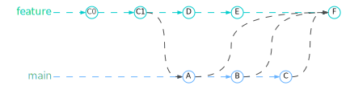

import Tabs from "@theme/Tabs";
import TabItem from "@theme/TabItem";

<Tabs queryString="primary">
  <TabItem value="inner-workflow" label="Inner Workflow">
    <table>
      <thead>
        <tr>
          <th style={{width: '50%', width: '650px'}}>Git</th>
          <th style={{width: '50%', width: '650px'}}>Git Commands</th>
        </tr>
      </thead>
      <tbody>
        <tr>
            <td>
                ```mermaid
                  graph TB

                  subgraph Local1 [Local]
                    direction BT

                    localRepo1[(Local Repository)]
                    stagingArea1[[Staging Area]]
                    workingDir1{{Working Directory}}
                    developer1(Developer)

                    developer1 --> |edit| workingDir1
                    workingDir1 --> |git add| stagingArea1
                    stagingArea1 --> |git commit| localRepo1
                  end

                  subgraph Local2 [Local]
                    direction BT

                    localRepo2[(Local Repository)]
                    stagingArea2[[Staging Area]]
                    workingDir2{{Working Directory}}
                    developer2(Developer)

                    developer2 --> |edit| workingDir2
                    workingDir2 --> |git add| stagingArea2
                    stagingArea2 --> |git commit| localRepo2
                  end

                  subgraph Remote
                    direction TB

                    remote[(Remote Repository)]
                  end

                  Local1 --> |git push| Remote
                  Remote --> |git fetch| Local1

                  Local2 --> |git push| Remote
                  Remote --> |git fetch| Local2
                ```
            </td>
            <td>
                ```mermaid
                  sequenceDiagram

                  participant Working Directory
                  participant Staging Area
                  participant Local Repository
                  participant Remote Repository

                  alt Push to Remote
                    Working Directory->>Staging Area: git add
                    Staging Area->>Local Repository: git commit
                    Local Repository->>Remote Repository: git push
                  end

                  alt Merge
                    Remote Repository->>Local Repository: git fetch
                    Local Repository->>Working Directory: git merge
                  end

                  alt Pull
                    Remote Repository->>Working Directory: git pull
                  end

                  alt Checkout
                    Remote Repository->>Local Repository: git clone
                    Local Repository->>Working Directory: git checkout
                  end
                ```
            </td>
        </tr>
      </tbody>
    </table>
  </TabItem>
  <TabItem value="ci-cd" label="CI/CD">
    ```mermaid
      graph LR

      subgraph agile[Agile Development]
        direction LR

       plan(Plan) --> code(Code) --> build(Build)
      end

      subgraph integration[Continuous Integration]
        direction LR

        integrate(Integrate) --> test(Test)
      end

      subgraph delivery[Continuous Delivery]
        direction LR

        release(Release)
      end

      subgraph deployment[Continuous Deployment]
        direction LR

        deploy(Deploy)
      end

      agile --> integration --> delivery --> deployment
    ```

    ### Benefits

    - Higher efficiency
    - Reduced risk of defects
    - Faster product delivery
    - Log generation
    - Rollback
  </TabItem>
  <TabItem value="git-branching-strategies" label="Branching Strategies">
    <table class="text_vertical">
        <thead>
            <tr>
                <th>Strategy</th>
                <th style={{ minWidth: '350px' }}>Visualization</th>
                <th>Definition</th>
                <th>Branches</th>
                <th>Pros</th>
                <th>Cons</th>
                <th>Use Cases</th>
            </tr>
        </thead>
        <tbody>
            <tr>
                <td><b>Git Flow</b></td>
                <td></td>
                <td>Complex branching strategy for parallel development. Developers create `feature` branches from a `develop` branch, then merge them back for `release`. It uses multiple branch types: `master`, `develop`, `feature`, `release`, and `hotfix`. `Master` and `develop` are long-lived, while others are short-lived and for supporting development</td>
                <td>
                    <ul>
                        <li><b>master</b>: Stable production code</li>
                        <li><b>develop</b>: Ongoing development</li>
                        <li><b>feature</b>: New features (short-lived)</li>
                        <li><b>release</b>: Preparing for release (from develop)</li>
                        <li><b>hotfix</b>: Urgent bug fixes (from master)</li>
                    </ul>
                </td>
                <td>
                    <ul>
                        <li>Stable releases: separate `dev` branches protect `main` branch</li>
                        <li>Organized work: clear branch types for specific tasks</li>
                        <li>Manages multiple versions</li>
                    </ul>
                </td>
                <td>
                    <ul>
                        <li>Complex merging: multiple branches to manage</li>
                        <li>Debugging difficulty: many commits make finding issues hard</li>
                        <li>Slower development: complexity slows down process</li>
                    </ul>
                </td>
                <td>Large teams, complex projects</td>
            </tr>
            <tr>
                <td><b>GitHub Flow</b></td>
                <td></td>
                <td>No `release` branches. Developers work on `feature` branches from `main`, then merge back and delete the branch. `Main` branch stays deployable</td>
                <td>
                    <ul>
                        <li><b>main</b>: Production-ready code</li>
                        <li><b>feature</b>: New features and bug fixes (short-lived)</li>
                    </ul>
                </td>
                <td>
                    <ul>
                        <li>Fast, streamlined: Agile principles, short cycles, frequent releases</li>
                        <li>Faster feedback: quick identification and resolution of issues</li>
                        <li>Efficient deploys: single branch for testing/automation</li>
                    </ul>
                </td>
                <td>
                    <ul>
                        <li>No multiple versions</li>
                        <li>Unstable code risk: no `dev` branch, requires thorough testing</li>
                        <li>Merge conflicts: for larger teams & transparency issues</li>
                    </ul>
                </td>
                <td>Small teams, rapid development</td>
            </tr>
            <tr>
                <td><b>GitLab Flow</b></td>
                <td></td>
                <td>Simplifies branching with direct `main` branch use. Great in multi-environment development, isolating versions and prioritizing stability with internal testing before production deployments</td>
                <td>
                    <ul>
                        <li><b>master</b>: Production-ready code</li>
                        <li><b>environments</b>: staging / testing/ pre-production / production</li>
                        <li><b>feature</b>: New features and bug fixes (short-lived)</li>
                    </ul>
                </td>
                <td>
                    <ul>
                        <li>Good balance between simplicity and release management</li>
                    </ul>
                </td>
                <td>
                    <ul>
                        <li>Requires strong emphasis on CI/CD practices</li>
                    </ul>
                </td>
                <td>Small teams, rapid development</td>
            </tr>
            <tr>
                <td><b>Trunked Based</b></td>
                <td></td>
                <td>Developers commit directly to a shared, always-releasable `trunk` multiple times a day. This fosters CI/CD by enabling frequent integration and faster releases. <b>Feature flags</b> help by decoupling deployment from release, keeping unfinished features hidden while complete ones are released quickly</td>
                <td>
                    <ul>
                        <li><b>trunk</b>: Single branch for all development</li>
                        <li><b>feature</b>: New features and bug fixes (short-lived)</li>
                    </ul>
                </td>
                <td>
                    <ul>
                        <li>Enables CI with frequent trunk updates</li>
                        <li>Improves collaboration with direct trunk commits (better visibility)</li>
                        <li>Reduces merge conflicts with frequent small pushes</li>
                        <li>Faster releases with constantly releasable trunk</li>
                    </ul>
                </td>
                <td>
                    <ul>
                        <li>Requires experienced devs for shared trunk management</li>
                    </ul>
                </td>
                <td>Continuous delivery pipelines</td>
            </tr>
        </tbody>
    </table>

    ### Best Practices

    - Keep branch strategy simple
      - Use feature branches for your work: Use `feature` branches for all new features and bug fixes
      - Name your feature branches by convention
        - `users/username/work-item`
        - `bugfix/work-item`
        - `feature/feature-name`
        - `feature/feature-area/feature-name`
        - `hotfix/description`
      - Use feature flags to manage long-running branches
      - Merge `feature` branches into the `main` branch using pull requests
      - Keep a high quality, up-to-date `main` branch
      - Manage releases
        - Use release branches & omit using tags for releases: Tags for releases add complexity. They require extra steps and can be missed, causing issues for developers. Release branches offer a simpler workflow
        - Port changes back to the main branch
  </TabItem>
  <TabItem value="git-workflow" label="Git Workflow">
    <table>
      <thead>
        <tr>
          <th>Workflow</th>
          <th style={{ minWidth: '350px' }}>Visualization</th>
          <th>Definition</th>
          <th>Impact on History</th>
          <th>Use Cases</th>
        </tr>
      </thead>
      <tbody>
        <tr>
          <td><b>Merge</b></td>
          <td></td>
          <td>Combines changes from one branch into another</td>
          <td>Preserves the commit history of both branches</td>
          <td>Integrating changes from feature branches</td>
        </tr>
        <tr>
          <td><b>Rebase</b></td>
          <td></td>
          <td>Transfers commits from one branch to another, maintaining a linear history</td>
          <td>Rewrites the commit history, making it linear and removes original branch's existence</td>
          <td>Preferred for creating a clean and linear history, often used for feature branches before merging</td>
        </tr>
        <tr>
          <td><b>Squash</b></td>
          <td></td>
          <td>Condenses multiple commits into a single commit</td>
          <td>Creates a new commit with a concise history</td>
          <td>For cleaning up history before merging into the main branch, especially for pull requests</td>
        </tr>
      </tbody>
    </table>
  </TabItem>
<TabItem value="roles-responsibilities" label="Roles & Responsibilities">
    <table>
      <thead>
        <tr>
          <th>Role</th>
          <th style={{ minWidth: '350px' }}>Visualization</th>
          <th>Focus</th>
          <th>Goals</th>
          <th>Responsibilities</th>
          <th>Key Metrics</th>
          <th>Challenges</th>
        </tr>
      </thead>
      <tbody>
        <tr>
          <td><b>DevOps</b></td>
          <td></td>
          <td>Collaboration & Automation of Dev & Ops</td>
          <td>
            <ul>
              <li>Faster software delivery</li>
              <li>Improved communication & collaboration</li>
              <li>Reduced silos between Dev & Ops</li>
            </ul>
          </td>
          <td>
            <ul>
              <li>Automating infrastructure provisioning and configuration</li>
              <li>Managing deployment pipelines</li>
              <li>Monitoring system performance</li>
              <li>Facilitating collaboration between development and operations teams</li>
            </ul>
          </td>
          <td>
            <ul>
              <li>Mean Time to Deploy (MTTD)</li>
              <li>Mean Time to Recovery (MTTR)</li>
              <li>Change Failure Rate (CFR)</li>
              <li>Deployment Frequency</li>
              <li>Lead Time for Changes</li>
            </ul>
          </td>
          <td>
            <ul>
              <li>Siloed organizational culture</li>
              <li>Resistance to change</li>
              <li>Tool sprawl</li>
              <li>Lack of collaboration and communication between teams</li>
              <li>Balancing speed of delivery with stability and reliability</li>
            </ul>
          </td>
        </tr>
        <tr>
          <td><b>Site Reliability Engineer (SRE)</b></td>
          <td></td>
          <td>Application Reliability & Performance</td>
          <td>
            <ul>
              <li>High availability & scalability</li>
              <li>Reduced downtime</li>
              <li>Improved incident response</li>
            </ul>
          </td>
          <td>
            <ul>
              <li>Setting and enforcing reliability targets</li>
              <li>Defining Service Level Objectives (SLOs) and Service Level Indicators (SLIs)</li>
              <li>Designing and implementing monitoring and alerting systems</li>
              <li>Conducting postmortems and root cause analysis</li>
            </ul>
          </td>
          <td>
            <ul>
              <li>Service Level Objectives (SLOs)</li>
              <li>Service Level Indicators (SLIs)</li>
              <li>Error Budgets</li>
              <li>Availability</li>
              <li>Reliability</li>
              <li>Incident Response Time</li>
            </ul>
          </td>
          <td>
            <ul>
              <li>Balancing feature development with reliability improvements</li>
              <li>Managing complex distributed systems</li>
              <li>Dealing with alert fatigue and false positives</li>
              <li>Aligning incentives between development and operations teams</li>
            </ul>
          </td>
        </tr>
        <tr>
          <td><b>Platform Engineering</b></td>
          <td></td>
          <td>Building & Maintaining Developer Platform</td>
          <td>
            <ul>
              <li>Streamlined development workflow</li>
              <li>Self-service infrastructure for developers</li>
              <li>Increased developer productivity</li>
            </ul>
          </td>
          <td>
            <ul>
              <li>Designing and implementing scalable and resilient infrastructure</li>
              <li>Managing cloud resources</li>
              <li>Building and maintaining internal platforms and tooling</li>
              <li>Providing support for development teams</li>
            </ul>
          </td>
          <td>
            <ul>
              <li>Infrastructure Availability</li>
              <li>Scalability</li>
              <li>Performance</li>
              <li>Cost Efficiency</li>
              <li>Time to Provision Resources</li>
            </ul>
          </td>
          <td>
            <ul>
              <li>Managing infrastructure complexity at scale</li>
              <li>Optimizing resource utilization and cost</li>
              <li>Ensuring security and compliance requirements are met</li>
              <li>Evolving platform capabilities to support changing business needs</li>
            </ul>
          </td>
        </tr>
      </tbody>
    </table>
  </TabItem>
</Tabs>
