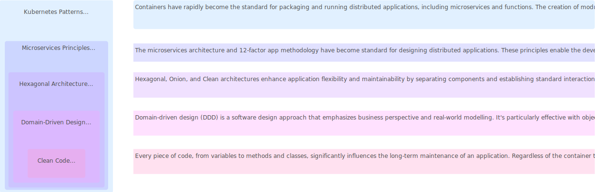

import Tabs from "@theme/Tabs";
import TabItem from "@theme/TabItem";

<Tabs>
    <TabItem value="overview" label="Overview">
      
    </TabItem>
    <TabItem value="principles" label="Principles">
      - **Elegant**: Pleasing to read with clear structure and logic
      - **Efficient**: Doesn't waste resources, performs well, and avoids complexity
      - **Error-free**: Minimizes bugs, handles errors gracefully
      - **Expressive**: Clearly communicates intent using meaningful names and comments
      - **Extensible**: Easily adaptable to changing requirements
      - **Modular**: Composed of small, reusable units following the single responsibility principle
    </TabItem>
    <TabItem value="benefits" label="Benefits">
      - **Productivity**: Simplifies writing, reading, debugging, testing, and maintenance, reducing time and effort for new features, bug fixes, and refactoring
      - **Quality**: Enhances user experience and satisfaction by meeting both functional and non-functional software requirements such as performance, security, reliability, and usability
      - **Collaboration**: Facilitates teamwork and knowledge sharing, enabling quick understanding of code and effective collaboration on complex projects
      - **Learning**: Aids developers in skill improvement and technology acquisition through exposure to best practices, design patterns, and coding standards, enhancing coding abilities
    </TabItem>
    <TabItem value="guidelines" label="Guidelines">
       **General**

       - Follow standard conventions
       - Keep it simple stupid
       - Follow the Boy Scout Rule
       - Always identify the root cause

       **Design**

       - Keep configurable data at high levels
       - Favor polymorphism over if/else or switch/case statements
       - Separate multi-threading code
       - Avoid over-configurability
       - Use dependency injection
       - Adhere to the Law of Demeter

       **Understandability**

       - Be consistent
       - Use explanatory variables
       - Encapsulate boundary conditions
       - Favor dedicated value objects over primitive types
       - Avoid logical dependencies
       - Avoid negative conditionals

       **Naming Conventions**

       - Opt for descriptive and unambiguous names
       - Make meaningful distinctions
       - Use pronounceable names
       - Use searchable names
       - Replace magic numbers with named constants
       - Don’t append prefixes or type information

       **Function**

       - Keep functions small
       - Ensure functions do one thing only
       - Use descriptive names
       - Favor fewer arguments
       - Functions should not have side effects
       - Avoid flag arguments

       **Comments**

       - Strive to explain yourself in code, not comments
       - Avoid redundancy in comments
       - Don’t add unnecessary noise through comments
       - Don’t use closing brace comments
       - Don’t comment out code, just remove it
       - Use comments to explain intent, clarify code, and warn of consequences

       **Source Code Structure**

       - Separate concepts vertically
       - Related code should appear vertically dense
       - Declare variables close to where they are used
       - Dependent functions should be close together in your code structure
       - Similar functions should be grouped together in your code structure
       - Place functions in a downward direction in your code structure
       - Keep lines of code short for readability purposes
       - Avoid horizontal alignment in your code structure
       - Use white space to associate related things and disassociate weakly related things in your code structure
       - Maintain consistent indentation throughout your code structure

       **Objects and Data Structures**

       - Internal structure should be hidden within objects and data structures
       - Favor data structures over objects when possible
       - Avoid hybrid structures (half object and half data)
       - Objects and data structures should be small and do one thing only
       - They should have a small number of instance variables
       - Base classes should not know anything about their derivatives
       - It’s better to have many functions than to pass some code into a function to select a behavior
       - Non-static methods are generally preferable to static methods

       **Testing**

       - One assert per test
       - Readable
       - Fast
       - Independent
       - Repeatable

       **Code Smells**

       - Rigidity
       - Fragility
       - Immobility
       - Needless Complexity
       - Needless Repetition
       - Clearness
    </TabItem>

</Tabs>
