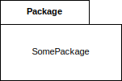
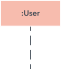

import Tabs from "@theme/Tabs";
import TabItem from "@theme/TabItem";

<Tabs queryString="primary">
  <TabItem value="diagram-representation" label="Representation">
    <table>
      <thead>
      <tr>
        <th>Aspect</th>
        <th>Unified Modeling Language (UML)</th>
        <th>Business Process Model and Notation (BPMN)</th>
      </tr>
      </thead>
      <tbody>
      <tr>
        <td>Definition</td>
        <td>
          standardized visual language used in software engineering to model
          and describe software systems through graphical notations,
          facilitating communication and visualization of system structure,
          behavior, interactions, and architecture among project stakeholders
        </td>
        <td>
          standardized graphical notation for modeling business processes and
          workflows. It provides symbols and conventions to represent tasks,
          events, gateways, and flows, enabling stakeholders to document,
          analyze, and improve business processes visually
        </td>
      </tr>
      <tr>
        <td>Purpose</td>
        <td>modeling software systems/components</td>
        <td>modeling business processes/workflows</td>
      </tr>
      <tr>
        <td>Scope</td>
        <td>applicable in software engineering across industries</td>
        <td>focuses on business process modeling/automation</td>
      </tr>
      <tr>
        <td>Diagram Types</td>
        <td>
          <ul>
            <li>
              <b>Structural</b>
              <ul>
                <li>Class Diagram</li>
                <li>Component Diagram</li>
                <li>Composite Structure Diagram</li>
                <li>Deployment Diagram</li>
                <li>Object Diagram</li>
                <li>Package Diagram</li>
                <li>Profile Diagram</li>
              </ul>
            </li>
            <li>
              <b>Behavioral</b>
              <ul>
                <li>Activity Diagrams</li>
                <li>
                  <b>Interaction Diagram</b>
                  <ul>
                    <li>Communication Diagram</li>
                    <li>Interaction Overview Diagram</li>
                    <li>Sequence Diagram</li>
                    <li>Timing Diagram</li>
                  </ul>
                </li>
                <li>State Diagram</li>
                <li>Use Case Diagram</li>
              </ul>
            </li>
          </ul>
        </td>
        <td>
          <ul>
            <li>process</li>
            <li>collaboration</li>
            <li>choreography</li>
          </ul>
        </td>
      </tr>
      <tr>
        <td>audience</td>
        <td>software engineers, architects, developers</td>
        <td>architects, business analysts, managers</td>
      </tr>
      <tr>
        <td>Level of Detail</td>
        <td>detailed system modeling</td>
        <td>high-level abstraction of business processes</td>
      </tr>
      </tbody>
    </table>
  </TabItem>
  <TabItem value="diagram-umlTypes" label="UML Types">
    <Tabs queryString="secondary">
      <TabItem value="diagram-uml-class" label="Class Diagram" attributes={{className: "tabs__vertical"}}>
        The most commonly used UML diagram, representing classes, attributes, operations, and their relationships within a system.

        **Basic Components of a Class Diagram**:

        - **Upper Section**: Contains the class name, always required
        - **Middle Section**: Lists class attributes, necessary for specific instances
        - **Bottom Section**: Displays class operations (methods) in list format

        **Member Access Modifiers**:

        - Public (`+`)
        - Private (`-`)
        - Protected (`#`)
        - Package (`~`)
        - Derived (`/`)
        - Static (underlined)

        **Member Scopes**:

        - **Classifiers**: Static members
        - **Instances**: Specific class instances

        **Additional Class Diagram Components**:

        - **Classes**: Templates for object creation and behavior implementation
        - **Name, Attributes, Methods**: Key components of a class shape
        - **Signals, Data Types, Packages, Interfaces, Enumerations, Objects, Artifacts**: Various elements to represent system entities

        **Interactions**:

        - **Inheritance**: Child classes inheriting functionality from parent classes
        - **Bidirectional Association**: Mutual awareness between classes
        - **Unidirectional Association**: One-way interaction between classes
        <table>
          <thead>
          <tr>
            <th>Relationship Type</th>
            <th style={{minWidth: '350px'}}>Visualization</th>
            <th>Definition</th>
          </tr>
          </thead>
          <tbody>
          <tr>
            <td>Inheritance (Generalization)</td>
            <td>
              ```mermaid
              classDiagram
              direction LR
              classA --|> classB : Inheritance
              ```
              <p>**A** inherits properties and behavior from **B**</p>
            </td>
            <td>Represents "is-a" relationship. Parent-child relationship where the child class is based on the parent class, but with more specific functionality</td>
          </tr>
          <tr>
            <td>Composition</td>
            <td>
              ```mermaid
              classDiagram
              direction LR
              classA --* classB : Composition
              ```
              <p>**A** owns and manages the lifecycle of **B** (**B** cannot exist without **A**)</p>
            </td>
            <td>strong type of aggregation where the whole and part have a strong life cycle dependency. The part cannot exist without the whole</td>
          </tr>
          <tr>
            <td>Aggregation</td>
            <td>
              ```mermaid
              classDiagram
              direction LR
              classA --o classB : Aggregation
              ```
              <p>**A** owns and manages the lifecycle of **B** (**B** can exist independently)</p>
            </td>
            <td>special form of association where the whole and part have a relationship. The part can exist independently of the whole. It is also called a "has-a" relationship</td>
          </tr>
          <tr>
            <td>Association</td>
            <td>
              ```mermaid
              classDiagram
              direction LR
              classA --> classB : Association
              ```
              <p>**A** and **B** can access each other's methods and properties</p>
            </td>
            <td>relationship between two classes where one class uses the functionality of another class. It is usually bi-directional with a multiplicity of one or many</td>
          </tr>
          <tr>
            <td>Dependency</td>
            <td>
              ```mermaid
              classDiagram
              direction LR
              classA ..> classB: Dependency
              ```
              <p>**A** depends on **B** to function properly</p>
            </td>
            <td>relationship between two classes when changes to one class may cause changes to the other</td>
          </tr>
          <tr>
            <td>Realization</td>
            <td>
              ```mermaid
              classDiagram
              direction LR
              classA ..|> classB : Realization
              ```
              <p>**A** implements the behavior of **B**</p>
            </td>
            <td>relationship between two classes where one class implements the behavior specified by another. It is typically used in the context of interfaces</td>
          </tr>
          </tbody>
        </table>
      </TabItem>
      <TabItem value="diagram-uml-complement" label="Component Diagram">
        Displays structural relationships of software system elements, particularly useful for complex systems with multiple components communicating via interfaces

        <table>
          <thead>
          <tr>
            <th>Type</th>
            <th style={{minWidth: '150px'}}>Visualization</th>
            <th>Definition</th>
          </tr>
          </thead>
          <tbody>
          <tr>
            <td>Component</td>
            <td></td>
            <td>represents a modular, reusable, and replaceable part of a system that encapsulates its behavior and data</td>
          </tr>
          <tr>
            <td>Node</td>
            <td></td>
            <td>
              represents hardware or software objects, which are of a higher level than components. It defines a boundary through which entities communicate with each other, facilitating interaction
              between different parts of a system
            </td>
          </tr>
          <tr>
            <td>Interface</td>
            <td></td>
            <td>represents a contract specifying a set of operations or behaviors that a class or component must implement</td>
          </tr>
          <tr>
            <td>Port</td>
            <td></td>
            <td>
              represents a point of interaction between a component and its environment or between different components within a system. Ports facilitate communication by providing access to
              services, data, or behavior offered by a component or required by another component. They serve as connection points through which messages can be sent and received, enabling the
              exchange of information and control between various parts of the system
            </td>
          </tr>
          <tr>
            <td>Package</td>
            <td></td>
            <td>
              represents a namespace for organizing and grouping elements, such as classes, components, and diagrams, into a cohesive unit. It serves as a container for organizing and managing the
              elements of a model, providing a way to structure and modularize complex systems
            </td>
          </tr>
          <tr>
            <td>Notes</td>
            <td></td>
            <td>
              annotations or comments that provide additional information about elements within a diagram. They are used to convey explanations, descriptions, constraints, or other important details
              that may not be readily apparent from the diagram itself
            </td>
          </tr>
          <tr>
            <td>Dependency</td>
            <td></td>
            <td>
              relationship between two elements in which a change in one element may affect the other element. It signifies that one element, called the client, relies on another element, called the
              supplier, in some way. Dependencies can be used to represent various types of relationships, such as the usage of one element by another, the inclusion of one element within another, or
              the reliance of one element on the services provided by another
            </td>
          </tr>
          <tr>
            <td>Provided Interface</td>
            <td></td>
            <td>
              offered or implemented by a component, class, or other architectural element. It specifies a set of operations or services that the element makes available for use by other elements in
              the system. Provided interfaces define the contract or protocol that clients can use to interact with the element, specifying the methods or behaviors that clients can invoke
            </td>
          </tr>
          <tr>
            <td>Required Interface</td>
            <td></td>
            <td>
              interface that a component, class, or other architectural element needs in order to function properly. It specifies a set of operations or services that the element expects to be
              provided by other elements in the system. Required interfaces define the dependencies or collaborations that the element relies on to fulfill its responsibilities or perform its tasks
            </td>
          </tr>
          </tbody>
        </table>
      </TabItem>
      <TabItem value="diagram-uml-Composite" label="Composite Structure Diagram">
        Shows the internal structure of a class

        <table>
          <thead>
          <tr>
            <th>Type</th>
            <th style={{minWidth: '150px'}}>Visualization</th>
            <th>Definition</th>
          </tr>
          </thead>
          <tbody>
          <tr>
            <td>Terminator</td>
            <td></td>
            <td>indicates start and end points</td>
          </tr>
          <tr>
            <td>Node</td>
            <td>
              
              
            </td>
            <td>represents events or milestones and contain numbers</td>
          </tr>
          <tr>
            <td>Actor</td>
            <td></td>
            <td>interacts with the system from outside of the system (person, equipment, etc.)</td>
          </tr>
          <tr>
            <td>Class</td>
            <td></td>
            <td>groups objects with common properties or behaviors (common operations, parameters, attributes, etc.)</td>
          </tr>
          <tr>
            <td>Part</td>
            <td></td>
            <td>acts as a runtime instance of classes or interfaces</td>
          </tr>
          <tr>
            <td>Port</td>
            <td></td>
            <td>acts as an interaction point between a classifier instance (or its behavior) and its environment</td>
          </tr>
          <tr>
            <td>Interface</td>
            <td></td>
            <td>specifies behavior that the implementor agrees to meet</td>
          </tr>
          </tbody>
        </table>
      </TabItem>
      <TabItem value="diagram-uml-deployment" label="Deployment Diagram">
        Illustrates system hardware and software deployment across multiple machines with unique configurations

        <table>
          <thead>
          <tr>
            <th>Type</th>
            <th style={{minWidth: '150px'}}>Visualization</th>
            <th>Definition</th>
          </tr>
          </thead>
          <tbody>
          <tr>
            <td>Package</td>
            <td></td>
            <td>organizes elements, such as components or nodes, into logical groups to manage complexity and enhance clarity in system design</td>
          </tr>
          <tr>
            <td>Object</td>
            <td></td>
            <td>represents an instance of a class or entity in a system, displaying its state and behavior</td>
          </tr>
          <tr>
            <td>Node</td>
            <td></td>
            <td>physical or virtual computing resource in a system, such as a server, workstation, or device</td>
          </tr>
          <tr>
            <td>Component</td>
            <td></td>
            <td>modular, reusable, and replaceable part of a system that encapsulates its behavior and data</td>
          </tr>
          <tr>
            <td>Interface</td>
            <td></td>
            <td>defines a contract for communication or interaction between components, nodes, or systems</td>
          </tr>
          </tbody>
        </table>
      </TabItem>
      <TabItem value="diagram-uml-object" label="Object Diagram">
        Illustrates object relationships using real-world examples, depicting the system's state at a given time

        <table>
            <thead>
                <tr>
                    <th>Type</th>
                    <th style={{minWidth: '150px'}}>Visualization</th>
                    <th>Definition</th>
                </tr>
            </thead>
            <tbody>
                <tr>
                    <td>Object</td>
                    <td></td>
                    <td>represents an instance of a class or entity in a system, displaying its state and behavior</td>
                </tr>
            </tbody>
        </table>
      </TabItem>
      <TabItem value="diagram-uml-package" label="Package Diagram">
        Represents package dependencies and system architecture levels using package import and merge mechanisms

        <table>
            <thead>
                <tr>
                    <th>Type</th>
                    <th style={{minWidth: '150px'}}>Visualization</th>
                    <th>Definition</th>
                </tr>
            </thead>
            <tbody>
                <tr>
                    <td>Package</td>
                    <td></td>
                    <td>organizes elements, such as components or nodes, into logical groups to manage complexity and enhance clarity in system design</td>
                </tr>
            </tbody>
        </table>
      </TabItem>
      <TabItem value="diagram-uml-activity" label="Activity Diagram">
        Graphical representation of business or operational workflows, an alternative to State Machine diagrams

        **Key aspects**

        - **Action**: A step in the activity wherein the users or software perform a given task
        - **Decision node**: A conditional branch in the flow that is represented by a diamond. It includes a single input and two or more outputs
        - **Control flows**: Another name for the connectors that show the flow between steps in the diagram
        - **Start node**: Symbolizes the beginning of the activity. The start node is represented by a black circle
        - **End node**: Represents the final step in the activity. The end node is represented by an outlined black circle

        <table>
            <thead>
                <tr>
                    <th>Type</th>
                    <th style={{minWidth: '150px'}}>Visualization</th>
                    <th>Definition</th>
                </tr>
            </thead>
            <tbody>
                <tr>
                    <td>Start</td>
                    <td></td>
                    <td>Represents the beginning of a process or workflow in an activity diagram. It can be used by itself or with a note symbol that explains the starting point</td>
                </tr>
                <tr>
                    <td>Activity</td>
                    <td></td>
                    <td>Indicates the activities that make up a modeled process. These symbols, which include short descriptions within the shape, are the main building blocks of an activity diagram</td>
                </tr>
                <tr>
                    <td>Connector</td>
                    <td></td>
                    <td>Shows the directional flow, or control flow, of the activity. An incoming arrow starts a step of an activity; once the step is completed, the flow continues with the outgoing arrow</td>
                </tr>
                <tr>
                    <td>Joint symbol/ Synchronization bar</td>
                    <td></td>
                    <td>Combines two concurrent activities and re-introduces them to a flow where only one activity occurs at a time</td>
                </tr>
                <tr>
                    <td>Fork</td>
                    <td></td>
                    <td>Splits a single activity flow into two concurrent activities</td>
                </tr>
                <tr>
                    <td>Decision</td>
                    <td></td>
                    <td>Represents a decision and always has at least two paths branching out with condition text to allow users to view options. This symbol represents the branching or merging of various flows with the symbol acting as a frame or container</td>
                </tr>
                <tr>
                    <td>Note</td>
                    <td></td>
                    <td>Allows the diagram creators or collaborators to communicate additional messages that don't fit within the diagram itself. Leave notes for added clarity and specification</td>
                </tr>
                <tr>
                    <td>Send signal</td>
                    <td></td>
                    <td>Indicates that a signal is being sent to a receiving activity</td>
                </tr>
                <tr>
                    <td>Receive signal</td>
                    <td></td>
                    <td>Demonstrates the acceptance of an event. After the event is received, the flow that comes from this action is completed</td>
                </tr>
                <tr>
                    <td>Shallow history pseudostate</td>
                    <td></td>
                    <td>Represents a transition that invokes the last active state</td>
                </tr>
                <tr>
                    <td>Option loop</td>
                    <td></td>
                    <td>Allows the creator to model a repetitive sequence within the option loop</td>
                </tr>
                <tr>
                    <td>Flow final</td>
                    <td></td>
                    <td>Represents the end of a specific process flow. This symbol shouldn’t represent the end of all flows in an activity; in that instance, you would use the end symbol. The flow final symbol should be placed at the end of a process in a single activity flow</td>
                </tr>
                <tr>
                    <td>Condition text</td>
                    <td></td>
                    <td>Placed next to a decision marker to let you know under what condition an activity flow should split off in that direction</td>
                </tr>
                <tr>
                    <td>End</td>
                    <td></td>
                    <td>Marks the end state of an activity and represents the completion of all flows of a process</td>
                </tr>
            </tbody>
        </table>
      </TabItem>
      <TabItem value="diagram-uml-communication" label="Communication Diagram">
        Focuses on messages passed between objects, similar to sequence diagrams but emphasizing communication.

        Communication diagrams provide a deeper insight into how components interact, prioritizing communication flow over event sequencing.

        Unlike sequence diagrams, they excel at illustrating:

        - **Procedure Logic Modeling**: Depicting complex procedures, functions, or operations logically
        - **Command Exchange**: Clarifying how commands traverse between process components or objects
        - **Interaction Consequences**: Visualizing the outcomes resulting from component interactions
        - **Functionality Planning**: Assisting in comprehending intricate functionalities of current or prospective scenarios

        In essence, communication diagrams emphasize component interaction dynamics, aiding in comprehensive understanding and planning within programs
      </TabItem>
      <TabItem value="diagram-uml-sequence" label="Sequence Diagram">
        Represents object interactions and their order of occurrence for a particular scenario

        <table>
            <thead>
                <tr>
                    <th>Type</th>
                    <th style={{minWidth: '150px'}}>Visualization</th>
                    <th>Definition</th>
                </tr>
            </thead>
            <tbody>
            <tr>
                <td>Object</td>
                <td></td>
                <td>Represents a class or object in UML. The object symbol demonstrates how an object will behave in the context of the system. Class attributes should not be listed in this shape</td>
            </tr>
            <tr>
                <td>Activation</td>
                <td></td>
                <td>Represents the time needed for an object to complete a task. The longer the task will take, the longer the activation box becomes</td>
            </tr>
            <tr>
                <td>Actor</td>
                <td></td>
                <td>Shows entities that interact with or are external to the system</td>
            </tr>
            <tr>
                <td>Package</td>
                <td></td>
                <td>Used to contain interactive elements of the diagram. Also known as a frame</td>
            </tr>
            <tr>
                <td>Lifeline</td>
                <td></td>
                <td>Represents the passage of time as it extends downward. This dashed vertical line shows the sequential events that occur to an object during the charted process. Lifelines may begin with a labeled rectangle shape or an actor symbol</td>
            </tr>
            <tr>
                <td>Option loop</td>
                <td></td>
                <td>Used to model if/then scenarios, i.e., a circumstance that will only occur under certain conditions</td>
            </tr>
            <tr>
                <td>Alternative</td>
                <td></td>
                <td>Symbolizes a choice (that is usually mutually exclusive) between two or more message sequences</td>
            </tr>
            <tr>
                <td>Synchronous message</td>
                <td></td>
                <td>Used when a sender must wait for a response to a message before it continues. The diagram should show both the call and the reply</td>
            </tr>
            <tr>
                <td>Asynchronous message</td>
                <td></td>
                <td>Asynchronous messages don't require a response before the sender continues. Only the call should be included in the diagram</td>
            </tr>
            <tr>
                <td>Asynchronous return message</td>
                <td></td>
                <td>Represented by a dashed line with a lined arrowhead</td>
            </tr>
            <tr>
                <td>Asynchronous create message</td>
                <td></td>
                <td>This message creates a new object</td>
            </tr>
            <tr>
                <td>Delete message</td>
                <td></td>
                <td>This message destroys an object</td>
            </tr>
            </tbody>
        </table>
      </TabItem>
      <TabItem value="diagram-uml-state" label="State Machine Diagram">
        Describes the behavior of objects in different states, similar to activity diagrams
      </TabItem>
      <TabItem value="diagram-uml-useCase" label="Use Case Diagram">
        Represents system functionalities and their relationships, illustrating internal/external controllers (actors)

        **Use Cases**

        - Representing the goals of system-user interactions
        - Defining and organizing functional requirements in a system
        - Specifying the context and requirements of a system
        - Modeling the basic flow of events in a use case

        **Common Components**

        - **Actors**: Users interacting with the system, including people, organizations, or external systems
        - **System**: Represents the sequence of actions and interactions involving actors and the system
        - **Goals**: End results of use cases, described through activities and variants leading to achievement
      </TabItem>
    </Tabs>
  </TabItem>
  <TabItem value="diagram-bestPractices" label="Best Practices">
    - **Use Consistent Naming Conventions**: Always use standard naming conventions for your UML diagrams. This will ensure that all stakeholders understand the diagrams without any confusion
    - **Avoid Using Excessive Details**: UML diagrams should be simple and not cluttered with unnecessary information. If the diagram becomes too complex, it will be difficult to understand
    - **Use Correct Symbols and Notations**: UML has a set of standard symbols and notations. Make sure you use the correct ones for the appropriate elements in your diagrams
    - **Keep Diagrams Small**: Large diagrams can be difficult to read and understand. Break down complex processes into smaller, manageable diagrams
    - **Use Color Coding**: Color coding can be used to highlight different elements or differentiate between different types of information
    - **Use Notes and Comments**: Use notes and comments to explain complex parts of the diagrams or to provide additional information
    - **Use Layers**: If your diagram is complex, use layers to separate different parts of the diagram. This makes it easier to understand the diagram
    - **Use Diagrams to Complement Text**: Diagrams should not replace text, but complement it. Use diagrams to illustrate complex processes or structures that are difficult to explain in words
    - **Use Real-world Examples**: Whenever possible, use real-world examples in your diagrams. This makes the diagrams more relatable and easier to understand
    - **Validate Your Diagrams**: Always validate your diagrams to ensure that they accurately represent the system or process you are modeling
    - **Use the Right Type of Diagram**: UML has several types of diagrams. Make sure you use the right type for the task at hand
    - **Use a Standardized Layout**: Use a standardized layout for your diagrams. This makes it easier for others to understand your diagrams
    - **Collaborate with Others**: Collaborate with other stakeholders when creating your diagrams. This ensures that all perspectives are considered and that the diagrams are understood by all
    - **Use Version Control**: As your system evolves, so too will your diagrams. Use version control to keep track of changes and maintain a history of your diagrams
    - **Regularly Review and Update Your Diagrams**: Regularly review and update your diagrams to ensure they accurately represent the current state of your system or process
    - **Use Abstraction and Generalization**: Use abstraction and generalization to simplify complex systems and make them easier to understand
    - **Avoid Redundancy**: Do not duplicate elements or information in your diagrams
    - **Use Association, Aggregation, and Composition Wisely**: Understand and use these relationships appropriately in your diagrams
    - **Make Effective Use of Stereotypes**: Stereotypes can help to clarify the meaning of elements in your diagrams. Use them effectively
  </TabItem>
  <TabItem value="diagram-pros-cons" label="Pros and Cons">
    **Pros**:
    - **Standardization**: uniform method to portray system models, ensuring consistent communication among developers and stakeholders
    - **Communication**: act as a robust communication medium among stakeholders, simplifying the exchange of intricate concepts
    - **Visualization**: aid in visualizing system components, relationships, and processes, enhancing comprehension and system design
    - **Documentation**: serve as efficient documentation tools, systematically capturing various system aspects such as architecture, design, and behavior
    - **Analysis and Design**: supports both software analysis and design phases, facilitating the modeling of system requirements and their transformation into implementable designs

    **Cons**:
    - **Complexity**: is intricate, especially for newcomers, requiring substantial time and effort to master its various aspects
    - **Overhead**: detailed UML diagrams can be time-consuming to create and maintain, potentially outweighing their benefits for small or straightforward projects
    - **Ambiguity**: interpretation can be subjective, leading to potential confusion as different individuals may perceive them differently
    - **Learning Curve**: UML's extensive features necessitate a steep learning curve, often requiring training and experience for effective utilization by teams
    - **Over-Modeling or Under-Modeling**: risk either excessive detail (over-modeling) or omission of crucial information (under-modeling), necessitating a delicate balance for optimal effectiveness
  </TabItem>
</Tabs>
