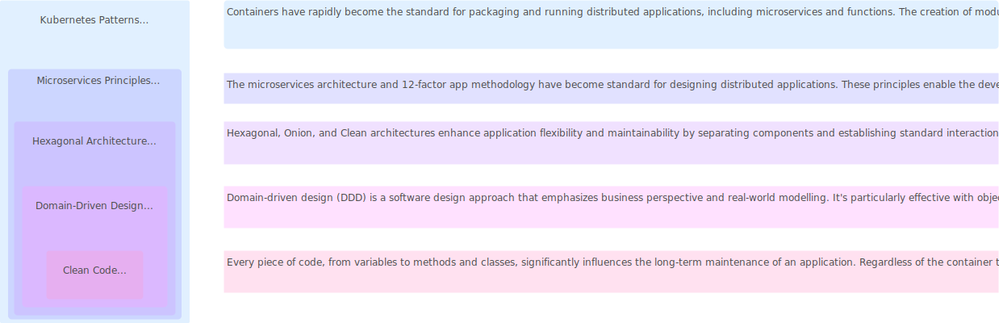

import Tabs from "@theme/Tabs";
import TabItem from "@theme/TabItem";

<Tabs queryString="primary">
    <TabItem value="overview" label="Overview">
      
    </TabItem>
    <TabItem value="principles" label="Principles">
      - **Elegant**: Pleasing to read with clear structure and logic
      - **Efficient**: Doesn't waste resources, performs well, and avoids complexity
      - **Error-free**: Minimizes bugs, handles errors gracefully
      - **Expressive**: Clearly communicates intent using meaningful names and comments
      - **Extensible**: Easily adaptable to changing requirements
      - **Modular**: Composed of small, reusable units following the single responsibility principle

      <table>
          <thead>
              <tr>
                  <th>Principle</th>
                  <th>Definition</th>
                  <th>Application</th>
                  <th>Benefits</th>
                  <th>Use Cases</th>
              </tr>
          </thead>
          <tbody>
              <tr>
                  <td><b>APO</b></td>
                  <td>Always Plan for Obsolescence</td>
                  <td>
                    <ul>
                        <li>System Architecture</li>
                        <li>Technology Selection</li>
                    </ul>
                  </td>
                  <td>
                    <ul>
                        <li>Encourages anticipating and planning for the eventual obsolescence of technology components, frameworks, or platforms</li>
                        <li>Mitigates the risk of technology becoming outdated and reduces the effort required for future migrations or upgrades</li>
                    </ul>
                  </td>
                  <td>
                    <ul>
                        <li>Selecting technologies for long-term projects</li>
                        <li>Designing architectures that can easily accommodate future changes</li>
                        <li>Incorporating backward compatibility into system designs</li>
                    </ul>
                  </td>
              </tr>
              <tr>
                  <td><b>BDUF</b></td>
                  <td>Big Design Up Front</td>
                  <td>
                    <ul>
                        <li>Software Development Process</li>
                    </ul>
                  </td>
                  <td>
                    <ul>
                        <li>Advocates for creating a detailed design before starting implementation</li>
                        <li>While it may provide a clear plan initially, it can lead to rigid architectures and hinder adaptability to changing requirements</li>
                    </ul>
                  </td>
                  <td>
                    <ul>
                        <li>Projects with well-defined requirements and stable specifications</li>
                        <li>Where changes are unlikely or costly to implement</li>
                    </ul>
                  </td>
              </tr>
              <tr>
                  <td><b>Boy Scout Rule</b></td>
                  <td>Leave the code cleaner than you found it</td>
                  <td>
                    <ul>
                        <li>Codebase Maintenance</li>
                        <li>Continuous Improvement</li>
                    </ul>
                  </td>
                  <td>
                    <ul>
                        <li>Encourages developers to continuously improve the quality of code by making small, incremental changes whenever they work with it</li>
                        <li>Over time, this leads to a cleaner, more maintainable codebase</li>
                        <li>Fosters a culture of continuous improvement within the development team</li>
                    </ul>
                  </td>
                  <td>
                    <ul>
                        <li>Refactoring code during bug fixes or feature development</li>
                        <li>Performing code reviews</li>
                        <li>Addressing technical debt</li>
                        <li>Enhancing code readability</li>
                    </ul>
                  </td>
              </tr>
              <tr>
                  <td><b>DRY</b></td>
                  <td>Don't Repeat Yourself</td>
                  <td>
                    <ul>
                        <li>Codebase</li>
                    </ul>
                  </td>
                  <td>
                    <ul>
                        <li>Reduces code duplication</li>
                        <li>Encourages maintainability</li>
                        <li>Improves readability</li>
                        <li>Minimizes errors by ensuring that a single piece of knowledge has a single, unambiguous representation in the system</li>
                    </ul>
                  </td>
                  <td>
                    <ul>
                        <li>Refactoring code to eliminate duplicate logic</li>
                        <li>Creating reusable functions or modules</li>
                        <li>Enforcing consistency across the codebase</li>
                    </ul>
                  </td>
              </tr>
              <tr>
                  <td><b>GRASP</b></td>
                  <td>General Responsibility Assignment Software Patterns</td>
                  <td>
                    <ul>
                        <li>Object-Oriented Design</li>
                        <li>Class Responsibilities</li>
                    </ul>
                  </td>
                  <td>
                    <ul>
                        <li>Provides guidelines for assigning responsibilities to classes and objects</li>
                        <li>Helping to create systems that are easier to understand, maintain, and evolve</li>
                        <li>Focuses on assigning responsibilities based on information expert</li>
                        <li>High Cohesion</li>
                        <li>Low Coupling</li>
                    </ul>
                  </td>
                  <td>
                    <ul>
                        <li>Identifying class responsibilities</li>
                        <li>Determining collaboration between objects</li>
                        <li>Defining the overall structure of an object-oriented system</li>
                    </ul>
                  </td>
              </tr>
              <tr>
                  <td><b>KISS</b></td>
                  <td>Keep It Simple, Stupid</td>
                  <td>
                    <ul>
                        <li>Design</li>
                        <li>Implementation</li>
                    </ul>
                  </td>
                  <td>
                    <ul>
                        <li>Encourages simplicity in design and implementation</li>
                        <li>Makes it easier to understand, maintain, and extend</li>
                        <li>Overly complex solutions are more prone to errors and difficult to modify or scale</li>
                    </ul>
                  </td>
                  <td>
                    <ul>
                        <li>Designing user interfaces</li>
                        <li>Writing code</li>
                        <li>Designing system architectures</li>
                        <li>Choosing between different approaches to solve a problem</li>
                    </ul>
                  </td>
              </tr>
              <tr>
                  <td><b>Law of Demeter</b></td>
                  <td>Principle of Least Knowledge</td>
                  <td>
                    <ul>
                        <li>Object-Oriented Design</li>
                        <li>Dependency Management</li>
                    </ul>
                  </td>
                  <td>
                    <ul>
                        <li>Encourages designing classes with limited knowledge of other classes</li>
                        <li>Reducing coupling and promoting encapsulation</li>
                        <li>Helps in creating more maintainable and flexible code by minimizing the impact of changes in one class on others</li>
                    </ul>
                  </td>
                  <td>
                    <ul>
                        <li>Accessing object properties or methods through a limited number of intermediary objects</li>
                        <li>Avoiding long chains of method calls between objects</li>
                    </ul>
                  </td>
              </tr>
              <tr>
                  <td><b>Occam’s Razor</b></td>
                  <td>The simplest explanation is usually the correct one</td>
                  <td>
                    <ul>
                        <li>Problem Solving</li>
                        <li>Decision Making</li>
                    </ul>
                  </td>
                  <td>
                    <ul>
                        <li>Prefers simpler explanations or solutions over more complex ones when multiple options are available</li>
                        <li>Helps in avoiding unnecessary assumptions or complexity, leading to more straightforward and efficient solutions</li>
                    </ul>
                  </td>
                  <td>
                    <ul>
                        <li>Analyzing data</li>
                        <li>Troubleshooting issues</li>
                        <li>Making design decisions</li>
                        <li>Evaluating competing hypotheses</li>
                    </ul>
                  </td>
              </tr>
              <tr>
                  <td><b>PIT</b></td>
                  <td>Prefer Isolated Tests</td>
                  <td>
                      <ul>
                          <li>Software Testing</li>
                      </ul>
                  </td>
                  <td>
                      <ul>
                          <li>Encourages writing tests that focus on testing one unit of functionality in isolation from other parts of the system</li>
                          <li>Helps in identifying and diagnosing issues more effectively</li>
                          <li>Promotes test independence, making it easier to refactor code without breaking tests</li>
                          <li>Supports parallel test execution for improved performance</li>
                      </ul>
                  </td>
                  <td>
                      <ul>
                          <li>Writing unit tests</li>
                          <li>Mocking external dependencies</li>
                          <li>Testing individual components or modules</li>
                          <li>Ensuring test suites are self-contained and repeatable</li>
                      </ul>
                  </td>
              </tr>
              <tr>
                  <td><b>Principle of Least Surprise</b></td>
                  <td>Design should minimize astonishment</td>
                  <td>
                    <ul>
                        <li>User Interface Design</li>
                        <li>API Design</li>
                    </ul>
                  </td>
                  <td>
                    <ul>
                        <li>Behavior of a system or interface should be predictable and intuitive to users or developers</li>
                        <li>Reduces confusion, errors, and the need for extensive documentation</li>
                        <li>Leads to a better user experience and increased productivity</li>
                    </ul>
                  </td>
                  <td>
                    <ul>
                        <li>Designing user interfaces</li>
                        <li>Defining API contracts</li>
                        <li>Naming conventions for variables and functions</li>
                        <li>Designing error messages and prompts</li>
                    </ul>
                  </td>
              </tr>
              <tr>
                  <td><b>SLAP</b></td>
                  <td>Single Level of Abstraction Principle</td>
                  <td>
                      <ul>
                          <li>Code Design</li>
                      </ul>
                  </td>
                  <td>
                      <ul>
                          <li>Advocates for maintaining a consistent level of abstraction within functions or methods</li>
                          <li>Improves code readability and comprehension by ensuring that each function does one thing at a single level of abstraction</li>
                          <li>Reduces cognitive overload by preventing mixing of high-level and low-level operations within the same function</li>
                          <li>Facilitates easier debugging, testing, and maintenance</li>
                      </ul>
                  </td>
                  <td>
                      <ul>
                          <li>Breaking down complex functions into smaller, more focused functions</li>
                          <li>Ensuring that each function performs a single task at a consistent level of abstraction</li>
                      </ul>
                  </td>
              </tr>
              <tr>
                  <td><b>SOLID</b></td>
                  <td>Single Responsibility, Open/Closed, Liskov Substitution, Interface Segregation, Dependency Inversion</td>
                  <td>
                    <ul>
                        <li>Object-Oriented Design</li>
                        <li>Code Modularity</li>
                    </ul>
                  </td>
                  <td>
                    <ul>
                        <li>Promotes maintainability, extensibility, and testability by emphasizing principles for designing well-structured, modular code</li>
                        <li>Each principle addresses a specific aspect of software design, contributing to overall code quality and flexibility</li>
                    </ul>
                  </td>
                  <td>
                    <ul>
                        <li>Designing classes and interfaces</li>
                        <li>Defining software architecture</li>
                        <li>Refactoring existing code to improve its design</li>
                    </ul>
                  </td>
              </tr>
              <tr>
                  <td><b>YAGNI</b></td>
                  <td>You Ain't Gonna Need It</td>
                  <td>Feature Development, Architecture</td>
                  <td>Prevents over-engineering by discouraging developers from adding functionality or architecture that is not immediately necessary. This avoids wasted effort and keeps the focus on delivering value to the customer</td>
                  <td>Avoiding premature optimization, deferring implementation of features until they are requested by users or required by business needs</td>
              </tr>
          </tbody>
      </table>
    </TabItem>
    <TabItem value="benefits" label="Benefits">
      - **Productivity**: Simplifies writing, reading, debugging, testing, and maintenance, reducing time and effort for new features, bug fixes, and refactoring
      - **Quality**: Enhances user experience and satisfaction by meeting both functional and non-functional software requirements such as performance, security, reliability, and usability
      - **Collaboration**: Facilitates teamwork and knowledge sharing, enabling quick understanding of code and effective collaboration on complex projects
      - **Learning**: Aids developers in skill improvement and technology acquisition through exposure to best practices, design patterns, and coding standards, enhancing coding abilities
    </TabItem>
    <TabItem value="guidelines" label="Guidelines">
       **General**

       - Follow standard conventions
       - Keep it simple stupid
       - Follow the Boy Scout Rule
       - Always identify the root cause

       **Design**

       - Keep configurable data at high levels
       - Favor polymorphism over if/else or switch/case statements
       - Separate multi-threading code
       - Avoid over-configurability
       - Use dependency injection
       - Adhere to the Law of Demeter

       **Understandability**

       - Be consistent
       - Use explanatory variables
       - Encapsulate boundary conditions
       - Favor dedicated value objects over primitive types
       - Avoid logical dependencies
       - Avoid negative conditionals

       **Naming Conventions**

       - Opt for descriptive and unambiguous names
       - Make meaningful distinctions
       - Use pronounceable names
       - Use searchable names
       - Replace magic numbers with named constants
       - Don’t append prefixes or type information

       **Function**

       - Keep functions small
       - Ensure functions do one thing only
       - Use descriptive names
       - Favor fewer arguments
       - Functions should not have side effects
       - Avoid flag arguments

       **Comments**

       - Strive to explain yourself in code, not comments
       - Avoid redundancy in comments
       - Don’t add unnecessary noise through comments
       - Don’t use closing brace comments
       - Don’t comment out code, just remove it
       - Use comments to explain intent, clarify code, and warn of consequences

       **Source Code Structure**

       - Separate concepts vertically
       - Related code should appear vertically dense
       - Declare variables close to where they are used
       - Dependent functions should be close together in your code structure
       - Similar functions should be grouped together in your code structure
       - Place functions in a downward direction in your code structure
       - Keep lines of code short for readability purposes
       - Avoid horizontal alignment in your code structure
       - Use white space to associate related things and disassociate weakly related things in your code structure
       - Maintain consistent indentation throughout your code structure

       **Objects and Data Structures**

       - Internal structure should be hidden within objects and data structures
       - Favor data structures over objects when possible
       - Avoid hybrid structures (half object and half data)
       - Objects and data structures should be small and do one thing only
       - They should have a small number of instance variables
       - Base classes should not know anything about their derivatives
       - It’s better to have many functions than to pass some code into a function to select a behavior
       - Non-static methods are generally preferable to static methods

       **Testing**

       - One assert per test
       - Readable
       - Fast
       - Independent
       - Repeatable

       **Code Smells**

       - Rigidity
       - Fragility
       - Immobility
       - Needless Complexity
       - Needless Repetition
       - Clearness
    </TabItem>
</Tabs>
