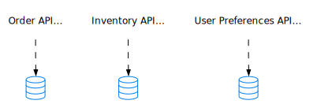
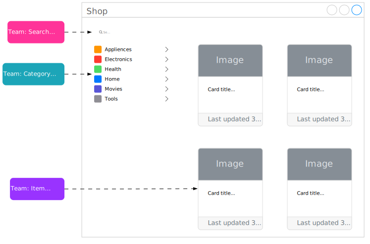

import Tabs from "@theme/Tabs";
import TabItem from "@theme/TabItem";

<Tabs queryString="primary">
    <TabItem value="overview" label="High Overview">
        <table>
          <tr>
            <th>Category</th>
            <th>Monolithic architecture</th>
            <th>Microservices architecture</th>
          </tr>
          <tr>
            <td><b>Design</b></td>
            <td>Single code base with multiple interdependent functions</td>
            <td>Independent software components with autonomous functionality that communicate with each other using APIs</td>
          </tr>
          <tr>
            <td><b>Development</b></td>
            <td>Requires less planning at the start, but gets increasingly complex to understand and maintain</td>
            <td>Requires more planning and infrastructure at the start, but gets easier to manage and maintain over time</td>
          </tr>
          <tr>
            <td><b>Deployment</b></td>
            <td>Entire application deployed as a single entity</td>
            <td>Every microservice is an independent software entity that requires individual containerized deployment</td>
          </tr>
          <tr>
            <td><b>Debugging</b></td>
            <td>Trace the code path in the same environment</td>
            <td>Requires advanced debugging tools to trace the data exchange between multiple microservices</td>
          </tr>
          <tr>
            <td><b>Modification</b></td>
            <td>Small changes introduce greater risks as they impact the entire code base</td>
            <td>You can modify individual microservices without impacting the entire application</td>
          </tr>
          <tr>
            <td><b>Scale</b></td>
            <td>You have to scale the entire application, even if only certain functional areas experience an increase in demand</td>
            <td>You can scale individual microservices as required, which saves overall scaling costs</td>
          </tr>
          <tr>
            <td><b>Investment</b></td>
            <td>Low upfront investment at the cost of increased ongoing and maintenance efforts</td>
            <td>Additional time and cost investment to set up the required infrastructure and build team competency. However, long-term cost savings, maintenance, and adaptability</td>
          </tr>
          <tr>
            <td><b>Use Cases</b></td>
            <td>
                <ul>
                    <li>Small to medium-sized projects</li>
                    <li>Rapid prototyping and MVP development</li>
                    <li>Tightly coupled components</li>
                    <li>Resource constraints</li>
                    <li>Low-usage applications for improving cost efficiency</li>
                </ul>
            </td>
            <td>
                <ul>
                    <li>Large and complex systems</li>
                    <li>Scalability demands</li>
                    <li>Technology diversity</li>
                    <li>Independent deployment and continuous delivery</li>
                    <li>High fault tolerance and resilience</li>
                    <li>Large cross-functional development teams</li>
                    <li>Rapid evolving requirements</li>
                </ul>
            </td>
          </tr>
        </table>
    </TabItem>
    <TabItem value="monolithic" label="Monolithic">
      <Tabs queryString="secondary">
        <TabItem value="overview" label="Overview" attributes={{className:"tabs__vertical"}}>
          ```mermaid
              graph TB

              client(Client)

              payment(Payment)
              shoppingCart(Shopping Cart)
              inventory(Inventory)

              singleInstance(Monolith)

              database[(Database)]

              client --> payment
              client --> shoppingCart
              client --> inventory

              payment --> singleInstance
              shoppingCart --> singleInstance
              inventory --> singleInstance
              singleInstance --> database

              subgraph dev [Development]
                  direction LR

                  subgraph vcs[Version Control System]
                      direction TB

                      git{{Git/Mercurial}}
                  end

                  subgraph teams [Dev Teams]
                      direction TB

                      developer1(Dev Team)
                      developer2(Dev Team)
                      developer3(Dev Team)
                  end
              end

              vcs --> singleInstance
              teams --> vcs
          ```

          **Monolithic architecture** is a single application that is built as a single unit. Is a singular, large computing network with one code base that couples all of the business concerns together. To make a change to this sort of application requires updating the entire stack by accessing the code base and building and deploying an updated version of the complete application.

          - Monolithic applications initially offer advantages such as ease of development and deployment
          - Challenges arise as teams grow, leading to blocked deploys, cross-team functionality issues, and difficulties with updates

          As a result, monolithic applications are often difficult to scale and maintain and often migrate to a **microservices architecture**. This involves identifying and modifying tightly coupled entities, which is complex.
        </TabItem>
        <TabItem value="modular" label="Modular Monolith">
          Monolithic applications can be transformed into **modular monolith** by starting with a single repository and clear boundaries between business contexts. Which will allow for easier transition to microservices architecture.

          **Advantages of Modular Monolith**

          - Bounded contexts in a modular monolith encompass independent business functions
          - Isolating business contexts within a single codebase and database prevents future issues and facilitates changes
          - Changes within a modular monolith are less costly compared to traditional monoliths, as data migration isn't necessary
          - Communication between modules in a modular monolith should utilize events instead of direct method calls
          - Techniques for maintaining data consistency and event management include emitting events, using databases, or employing message queues

          **Segregation by Feature**

          ```mermaid
              graph LR

              subgraph monolith[Modular Monolith]
                  direction LR

                  subgraph module1["Payment Module"]
                      direction LR

                      subgraph placeOrder[Place Order Feature]
                          direction TB

                          view1(View)
                          controller1(Controller)
                          model1(Model)

                          view1 --> controller1
                          controller1 --> model1
                      end
                  end

                  subgraph module2["Shopping Cart Module"]
                      direction LR

                      subgraph shoppingCart[Shopping Cart Feature]
                          direction TB

                          view2(View)
                          controller2(Controller)
                          model2(Model)

                          view2 --> controller2
                          controller2 --> model2
                      end
                  end

                  subgraph module3["Inventory Module"]
                      direction LR

                      subgraph inventory1[Product Catalog Management Feature]
                          direction TB

                          view3(View)
                          controller3(Controller)
                          model3(Model)

                          view3 --> controller3
                          controller3 --> model3
                      end

                      subgraph inventory2[Inventory Tracking Feature]
                          direction TB

                          view4(View)
                          controller4(Controller)
                          model4(Model)

                          view4 --> controller4
                          controller4 --> model4
                      end
                  end
              end

              database[(Database)]

              model1 --> database
              model2 --> database
              model3 --> database
              model4 --> database

              devTeam1(Dev Team) --> module1
              devTeam2(Dev Team) --> module2
              devTeam3(Dev Team) --> module3
          ```
        </TabItem>
      </Tabs>
    </TabItem>
    <TabItem value="microservices" label="Microservices">
      <Tabs queryString="secondary">
        <TabItem value="overview" label="Overview" attributes={{className:"tabs__vertical"}}>
          ```mermaid
              graph LR

              subgraph microservices[Microservices]
                  direction TB

                  payment(Payment)
                  shoppingCart(Shopping Cart)
                  inventory(Inventory)

                  payment <--> shoppingCart
                  payment <--> inventory
                  shoppingCart <--> inventory
              end

              client(Client) --> payment
              client --> shoppingCart
              client --> inventory
          ```

          **Microservices** are independent, and loosely coupled software components that perform specific tasks within a larger application, facilitating scalability, flexibility, and maintainability in software development. They organize the subdomains into one or more deployable/executable components.

          **Golden Rule**

          - we need to ensure that our microservices are independently deployable
          - if we needed to update our country codes library, and have all services pick up the new data immediately, we’d need to redeploy all services at the moment the new library is available
              - this is a classic lock-step release, and exactly what we’re trying to avoid with microservice architectures
        </TabItem>
        <TabItem value="advantages" label="Advantages">
          - **Simple Components**: Small, focused components, simplifying development and maintenance
          - **Team Autonomy**: Teams should have the independence to develop, test, and deploy their software autonomously, enabling faster iterations and reducing dependencies on other teams
          - **Fast Deployment Pipeline**: A rapid deployment pipeline facilitates quick feedback and frequent deployments
          - **Support for Multiple Technology Stacks**: Applications may utilize various technologies within different subdomains, requiring developers to update the technology stack to maintain compatibility with current languages and frameworks
          - **Segregation by Characteristics**: Segregating components based on characteristics like resource requirements, availability, and security enhances scalability, availability, and security, respectively
          - **Simple Interactions**: Operations that involve local or straightforward interactions between components are easier to troubleshoot
          - **Efficient Interactions**: Distributed operations involving numerous network round trips and large data transfers can be inefficient and should be minimized for optimal performance
          - **Prefer ACID over BASE**: Implementing operations as ACID transactions rather than eventually consistent sagas simplifies development and maintenance
          - **Minimize Runtime Coupling**: Reducing runtime coupling maximizes availability and minimizes latency for operations, improving overall system performance
          - **Minimize Design Time Coupling**: Decreasing design time coupling reduces the likelihood of services needing to be changed simultaneously, enhancing productivity and flexibility in development
        </TabItem>
        <TabItem value="principles" label="Principles">
          - **Organized around Business Capabilities**
            - Traditional division based on technology layers leads to cross-team projects for even simple changes due to Conway's Law (the way people within an organization communicate influences the structure of the systems they build)
            - Microservice approach focuses on organizing services around business capabilities
            - Cross-functional teams with skills for entire development process

          - **Size of Microservices**
            - Varies, often sized around Amazon's "Two Pizza Team" concept (organizing teams small enough that they can be fed with just two pizzas)
            - Ranges from a dozen people supporting several services to a smaller team per service

          - **Product Ownership**
            - Microservice teams own products over their full lifetime
            - Inspired by Amazon's "you build, you run it" philosophy
            - Emphasizes ongoing relationship and enhancing business capabilities

          - **Communication Structure**
            - Smart endpoints and dumb pipes approach
            - Microservices use simple protocols like HTTP request-response and lightweight messaging

          - **Comparison with SOA**
            - Microservices similar to some aspects of Service Oriented Architecture (SOA) but with distinct differences by focusing on avoiding pitfalls of traditional SOA implementations

          - **Decentralized Governance**
            - Encourages using right tools for the job rather than standardizing on single technology platforms
            - Promotes producing useful tools shared within teams, similar to internal open source model

          - **Infrastructure Automation**
            - Utilizes extensive automation techniques for building, deploying, and operating microservices
            - Enables teams to manage infrastructure efficiently and deploy software frequently

          - **Design Considerations**
            - Emphasis on failure tolerance, real-time monitoring, and asynchronous communication
            - Supports evolutionary design, modular decomposition, and granular release planning
            - Prefers tolerant services over heavy versioning for managing changes
        </TabItem>
        <TabItem value="practices" label="Best Practices">
          - Use separate data storage for each microservice
          - Keep code at a similar level of maturity
          - Separate build for each microservice
          - Assign each microservice with a single responsibility
          - Deploy into containers
          - Design stateless services
          - Adopt Domain-Driven Design (DDD)
          - Design micro frontend
          - Orchestrating microservices with Kubernetes
        </TabItem>
      </Tabs>
    </TabItem>
    <TabItem value="architecture" label="Architecture">
        <table>
            <thead>
                <tr>
                    <th>Aspect</th>
                    <th>On-Premises</th>
                    <th>Infrastructure-as-a-Service (IaaS)</th>
                    <th>Platform-as-a-Service (PaaS)</th>
                    <th>Software-as-a-Service (SaaS)</th>
                </tr>
            </thead>
            <tbody>
                <tr>
                    <td><b>Application</b></td>
                    <td>+</td>
                    <td>+</td>
                    <td>+</td>
                    <td>-</td>
                </tr>
                <tr>
                    <td><b>Data</b></td>
                    <td>+</td>
                    <td>+</td>
                    <td>+</td>
                    <td>-</td>
                </tr>
                <tr>
                    <td><b>Runtime</b></td>
                    <td>+</td>
                    <td>+</td>
                    <td>-</td>
                    <td>-</td>
                </tr>
                <tr>
                    <td><b>Middleware</b></td>
                    <td>+</td>
                    <td>+</td>
                    <td>-</td>
                    <td>-</td>
                </tr>
                <tr>
                    <td><b>O/S</b></td>
                    <td>+</td>
                    <td>+</td>
                    <td>-</td>
                    <td>-</td>
                </tr>
                <tr>
                    <td><b>Virtualization</b></td>
                    <td>+</td>
                    <td>-</td>
                    <td>-</td>
                    <td>-</td>
                </tr>
                <tr>
                    <td><b>Servers</b></td>
                    <td>+</td>
                    <td>-</td>
                    <td>-</td>
                    <td>-</td>
                </tr>
                <tr>
                    <td><b>Storage</b></td>
                    <td>+</td>
                    <td>-</td>
                    <td>-</td>
                    <td>-</td>
                </tr>
                <tr>
                    <td><b>Networking</b></td>
                    <td>+</td>
                    <td>-</td>
                    <td>-</td>
                    <td>-</td>
                </tr>
            </tbody>
            <tfoot>
                <tr>
                    <td colspan="5">
                        <ul>
                            <li><b>"+"</b> Managed by you</li>
                            <li><b>"-"</b> Managed by other</li>
                        </ul>
                    </td>
                </tr>
            </tfoot>
        </table>
    </TabItem>
</Tabs>

## Architecture Overview

<Tabs queryString="primary">
    <TabItem value="overview" label="Overview">
      <table>
        <thead>
          <tr>
            <th style={{width: '70%'}}>Visualization</th>
            <th>Specs</th>
          </tr>
        </thead>
        <tbody>
          <tr>
            <td>
              ```mermaid
                  graph TB

                  subgraph user
                    direction TB

                    web(Web)
                    mobile(Mobile)
                  end

                  user --> lb(Load Balancer)
                  lb --> apiGateway(API Gateway)
                  apiGateway --> identity(Identity Provider)
                  apiGateway --> sr(Service Registry & Discovery)

                  subgraph microservices
                    direction LR

                    domainA(Domain A)
                    domainB(Domain B)
                  end

                  domainA --> dbA[(Database A)]
                  domainB --> dbB[(Database B)]

                  sr --> domainA
                  sr --> domainB

                  management(Management) --> sr
                  management --> microservices
              ```
            </td>
            <td>
              <ul>
                <li><b>Load Balancer</b>: Distributes traffic to multiple backend services</li>
                <li><b>CDN (Content Delivery Network)</b>: Speeds up content delivery by storing static content on distributed servers</li>
                <li><b>API Gateway</b>: Routes requests to relevant services, interacts with identity provider and service discovery</li>
                <li><b>Identity Provider</b>: Manages user authentication and authorization</li>
                <li><b>Service Registry & Discovery</b>: Registers and finds microservices, used by API gateway to locate services</li>
                <li><b>Management</b>: Monitors services</li>
                <li><b>Microservices</b>: Independently deployed and maintained in separate domains, each with its own database. Communicate via REST API or RPC</li>
              </ul>
            </td>
          </tr>
        </tbody>
      </table>
    </TabItem>
    <TabItem value="common" label="Common Setup">
      <table>
        <thead>
          <tr>
            <th>Pre-Production</th>
            <th>Production</th>
          </tr>
        </thead>
        <tbody>
          <tr>
            <td>
              ```mermaid
                  graph TB

                  dev(Developer) --> api(Define API)
                  api --> ui(Develop UI)
                  api --> microservice(Develop microservices)
                  api --> apiGateway(Modify configurations in API Gateway)

                  ui --> test(Test)
                  microservice --> test
                  apiGateway --> test

                  test --> build(Build Image)
                  build --> deploy(Deploy)
              ```

              <ul>
                <li>
                  <b>Stack</b>
                  <ul>
                    <li><b>Define API</b>: Establish frontend-backend contract using Postman/OpenAPI</li>
                    <li><b>Develop UI</b>: Node.js/React</li>
                    <li><b>Develop Microservices</b>: Java/Python/Go</li>
                    <li><b>Test</b>: Unit test framework and Jenkins/Github Actions/CircleCI/Gitlab CI</li>
                    <li><b>Build</b>: Package code into Docker images for microservices deployment</li>
                  </ul>
                </li>
              </ul>
            </td>
            <td>
              ```mermaid
                  graph TB

                  user --> cdn(CDN)
                  user(User) --> lb(Load Balancer)

                  lb --> apiGateway(API Gateway)

                  subgraph microservices
                    direction TB

                    services(Services)
                    cache(Cache)
                    search(Full-Text Search)
                    broker(Message Broker)
                    management(Management & Monitoring)
                  end

                  subgraph access [Access Layer]
                    direction TB

                    relational(Relational DB)
                    blob(Object/Blob Store)
                    wideColumn(Wide-Column DB)
                  end

                  apiGateway --> microservices

                  services --> access
              ```

              <ul>
                <li>
                  <b>Stack</b>
                  <ul>
                    <li><b>Load Balancer</b>: NGINX</li>
                    <li><b>CDN</b>: CloudFront/Cloudflare</li>
                    <li><b>API Gateway</b>: Zookeeper/Eureka for service discovery</li>
                    <li><b>Full-Text Search</b>: ElasticSearch</li>
                    <li><b>Cache</b>: Redis</li>
                    <li><b>Communications</b>: Kafka or RPC for service communication</li>
                    <li><b>Management & Monitoring</b>: Prometheus/Grafana/Elastic Stack/Kubernetes</li>
                    <li>
                      <b>Persistence</b>
                      <ul>
                        <li><b>Relational DB</b>: MySQL/PostgreSQL</li>
                        <li><b>Object Store</b>: S3/GCS/Azure Blob</li>
                      </ul>
                    </li>
                    <li><b>Cloud Deployment</b>: GCP/AWS/Azure</li>
                  </ul>
                </li>
              </ul>
            </td>
          </tr>
        </tbody>
      </table>
    </TabItem>
  <TabItem value="micro-frontends" label="Micro Frontends">
    <table>
      <thead>
        <tr>
          <th>Aspect</th>
          <th>Microservices</th>
          <th>Micro Frontends</th>
        </tr>
      </thead>
      <tbody>
        <tr>
          <td><b>Visualization</b></td>
          <td></td>
          <td></td>
        </tr>
        <tr>
          <td><b>Focus Area</b></td>
          <td>Backend (server-side)</td>
          <td>Frontend (client-side)</td>
        </tr>
        <tr>
          <td><b>Responsibility</b></td>
          <td>Business capabilities</td>
          <td>User interface components</td>
        </tr>
        <tr>
          <td><b>Communication</b></td>
          <td>APIs (REST, gRPC)</td>
          <td>Shared state, event bus, single-spa</td>
        </tr>
        <tr>
          <td><b>Scalability</b></td>
          <td>Scale individual services based on load</td>
          <td>Scale specific UI modules based on usage</td>
        </tr>
        <tr>
          <td><b>Maintainability</b></td>
          <td>Easier to maintain smaller codebases</td>
          <td>Easier to maintain specific UI features</td>
        </tr>
        <tr>
          <td><b>Complexity</b></td>
          <td>Increased complexity due to distributed systems and integration overhead</td>
          <td>Increased complexity due to managing multiple UI modules, communication, and potential performance overhead</td>
        </tr>
        <tr>
          <td><b>Testing</b></td>
          <td>Requires more complex testing strategies due to service interactions</td>
          <td>Requires additional testing for UI interactions across modules</td>
        </tr>
        <tr>
          <td><b>Deployment</b></td>
          <td colspan="2">Independent deployments</td>
        </tr>
        <tr>
          <td><b>Collaboration</b></td>
          <td colspan="2">Requires cross-team collaboration and communication</td>
        </tr>
      </tbody>
    </table>
  </TabItem>
  <TabItem value="repos" label="Repos">
    <table>
      <thead>
        <tr>
          <th>Aspect</th>
          <th>Monorepo</th>
          <th>Multi-Repo</th>
        </tr>
      </thead>
      <tbody>
        <tr>
          <td><b>Repository Structure</b></td>
          <td>Single repository containing multiple projects/packages</td>
          <td>Separate repositories for each project/package</td>
        </tr>
        <tr>
          <td><b>Dependency Management</b></td>
          <td>Shared dependencies managed centrally</td>
          <td>Each repository manages its own dependencies</td>
        </tr>
        <tr>
          <td><b>Build & CI/CD</b></td>
          <td>Unified build and CI/CD pipelines</td>
          <td>Separate pipelines for each repository</td>
        </tr>
        <tr>
          <td><b>Code Ownership</b></td>
          <td>Clear ownership and responsibility</td>
          <td>Ownership can be more fragmented and decentralized</td>
        </tr>
        <tr>
          <td><b>Deployment</b></td>
          <td>Single deployment process</td>
          <td>Each repository may have its own deployment process</td>
        </tr>
        <tr>
          <td><b>Performance</b></td>
          <td>Can lead to larger repository size and slower operations</td>
          <td>Smaller repositories can have faster operations</td>
        </tr>
        <tr>
          <td><b>Testing</b></td>
          <td>Easier integration testing across projects/packages</td>
          <td>Testing is more isolated, might require more integration efforts</td>
        </tr>
        <tr>
          <td><b>Scaling</b></td>
          <td>Might face scalability challenges with a very large codebase</td>
          <td>Easier to scale by adding more repositories</td>
        </tr>
        <tr>
          <td><b>Overhead</b></td>
          <td>Potentially higher overhead due to managing a large codebase</td>
          <td>Lower overhead for smaller repositories</td>
        </tr>
      </tbody>
    </table>
  </TabItem>
</Tabs>

## Project Structure

<Tabs queryString="primary">
  <TabItem value="frontend" label="Frontend">
    <Tabs queryString="secondary">
      <TabItem value="frontend-overview" label="Overview" attributes={{ className: "tabs__vertical" }}>
        <table>
          <thead>
            <tr>
              <th>Aspect</th>
              <th>File Type Based</th>
              <th>Module/Feature Based</th>
              <th>Atomic Design</th>
              <th>Clean Architecture</th>
            </tr>
          </thead>
          <tbody>
            <tr>
              <td><b>Focus</b></td>
              <td>File types (JSX, CSS, tests)</td>
              <td>Functional modules, features</td>
              <td>UI component hierarchy</td>
              <td>Business logic separation (layers)</td>
            </tr>
            <tr>
              <td><b>Scalability</b></td>
              <td>Small to medium projects</td>
              <td>Medium to large projects</td>
              <td>Scalable for complex UIs</td>
              <td>Very scalable, promotes separation of concerns</td>
            </tr>
            <tr>
              <td><b>Use Cases</b></td>
              <td>Simple apps, prototypes</td>
              <td>Complex features, e-commerce applications</td>
              <td>Component libraries, design systems</td>
              <td>Large-scale enterprise applications with strict separation</td>
            </tr>
          </tbody>
        </table>
      </TabItem>
      <TabItem value="frontend-file-type-based" label="File Type Based">

        ```md
          src/
          ├── components/
          │   ├── Avatar/
          │   │   ├── Avatar.jsx
          │   │   ├── Avatar.test.js
          │   ├── Button/
          │   │   ├── Button.jsx
          │   │   ├── Button.test.js
          │   └── TextField/
          │       ├── TextField.jsx
          │       └── TextField.test.js
          ├── contexts/
          │   └── UserContext/
          │       └── UserContext.js
          ├── hooks/
          │   └── useMediaQuery/
          │       └── useMediaQuery.js
          ├── pages/
          │   ├── UserProfile/
          │   │   ├── components/
          │   │   │   └── UserProfileComponent/
          │   │   │       ├── UserProfileComponent.jsx
          │   │   │       └── UserProfileComponent.test.js
          │   │   ├── UserProfile.jsx
          │   │   └── UserProfile.test.js
          │   └── index.js
          ├── routes/
          │   ├── routes.jsx
          │   └── routes.test.js
          ├── utils/
          │   └── custom-util/
          │       ├── index.js
          │       ├── customUtil.js
          │       └── index.test.js
          ├── services/
          │   └── custom-service/
          │       ├── index.js/
          │       ├── customService.js/
          │       └── index.test.js
          ├── App.jsx
          └── index.js
        ```
      </TabItem>
      <TabItem value="frontend-module-feature-based" label="Module / Feature Based">
        ```md
          src/
          ├── components/
          │   ├── Avatar/
          │   │   ├── Avatar.jsx
          │   │   └── Avatar.test.js
          │   ├── Button/
          │   │   ├── Button.jsx
          │   │   └── Button.test.js
          │   └── TextField/
          │       ├── TextField.jsx
          │       └── TextField.test.js
          ├── contexts/
          │   └── UserContext/
          │       └── UserContext.js
          ├── hooks/
          │   └── useMediaQuery/
          │      └── useMediaQuery.js
          ├── features/
          │   ├── Home/
          │   │   ├── components/
          │   │   │   └── UserProfileComponent/
          │   │   │       ├── UserProfileComponent.jsx
          │   │   │       ├── UserProfileComponent.test.js
          │   │   ├── utils/
          │   │   ├── services/
          │   │   ├── hooks/
          │   │   ├── contexts/
          │   │   ├── views/
          │   │   │   └── HomeView.jsx
          │   │   └── pages/
          │   │       └── HomePage.jsx
          │   └── index.js
          ├── utils/
          │   └──  custom-common-util/
          │       ├── index.js/
          │       └── index.test.js
          ├── services/
          │   └── custom-common-service/
          │       ├── index.js/
          │       ├── custom-common-service.js/
          │       └── index.test.js
          ├── App.jsx
          └── index.js
        ```
      </TabItem>
      <TabItem value="frontend-atomic-design" label="Atomic Design">
        ```md
          src/
          ├── components/
          │   ├── atoms/ ← Single UI elements
          │   │   └── Button/
          │   │      ├── Button.js
          │   │      └── Button.css
          │   ├── molecules/ ← Groups of atoms with a function
          │   │   └── SearchBar/
          │   │       ├── SearchBar.js
          │   │       └── SearchBar.css
          │   ├── organisms/ ← Complex components from molecules/atoms
          │   │   ├── Header/
          │   │   │  ├── Header.js
          │   │   │  └── Header.css
          │   │   └── ProductList/
          │   │       ├── ProductList.js
          │   │       └── ProductList.css
          │   └── templates/ ← Layouts for arranging UI on a page
          │       └── DefaultTemplate/
          │           ├── DefaultTemplate.js
          │           └── DefaultTemplate.css
          ├── pages/ ← Final product with real content in templates
          │   ├── HomePage/
          │   │   ├── HomePage.js
          │   │   └── HomePage.css
          │   └── AboutPage/
          │       ├── AboutPage.js
          │       └── AboutPage.css
          ├── shared/
          └── public/
        ```
      </TabItem>
      <TabItem value="frontend-clean-architecture" label="Clean Architecture">
        ```md
          src/
          ├── domain/
          │   ├── models/
          │   │   └── User.js/
          │   └── services/
          │       └── User.service.js/
          ├── infrastructure/
          │		├── components/
          │		│   ├── Avatar/
          │		│   │   ├── Avatar.jsx
          │		│   │   └── Avatar.test.js
          │		│	  └── UserProfile/
          │		│       ├── UserProfile.jsx
          │		│       └── UserProfile.test.js
          │		├── http/
          │		│   ├── dto/
          │		│   │   └── userDto.js/
          │		│   └── http.js
          │		└── repositories/
          │		    └── user.repository.js/
          ├── App.jsx
          └── index.js
        ```
      </TabItem>
      <TabItem value="frontend-best-practices" label="Best Practices">
        - **UI Components**
          - **components**: React components - the main UI building blocks
          - **design-system**: Fundamental UI elements and patterns based on the design system
          - **icons**: Inline SVG icons
        - **React Specific**
          - **hooks**: Custom React hooks for shared logic
          - **hocs**: React Higher-Order Components
          - **contexts/providers**: Contains React Contexts and Providers
        - **Utilities & External Integrations**
          - **utils**: Utilities for universal logic that isn't related to business logic or any technologies
          - **lib**: Utilities that are related to certain technologies
          - **plugins**: Third-party plugins
        - **Business Logic**
          - **services**: Encapsulates main business & application logic
          - **helpers**: Provides business-specific utilities
        - **Styles**
          - **styles**: Contains (global) CSS or CSS-in-JS styles
        - **TypeScript and Configurations**
          - **types**: For general TypeScript types, enums and interfaces
          - **configs**: Configs for the application & environment variables
          - **constants**: Constants for the application
        - **Server Communication**
          - **api**: For logic that communicates with the servers
          - **graphql**: GraphQL-specific code
        - **State Management**
          - **states/store**: Global state management logic
          - **reducers, store, actions, selectors**: Redux-specific logic
        - **Routing**
          - **routes/router**: Defining routes
          - **pages**: Defining entry-point components for pages
        - **Testing**
          - **tests**: Unit tests and other kinds of tests for your code
      </TabItem>
    </Tabs>
  </TabItem>
</Tabs>

## Migration

<Tabs queryString="primary">
    <TabItem value="process" label="Process">
      - **Discovering system operations**
        - Analyzing existing monolithic architecture
        - Identifying functionalities and dependencies
        - Documenting system components, interactions, and data flows
        - Conducting interviews with stakeholders to understand business requirements
        - Profiling system performance and resource utilization
        - Assessing scalability and maintainability issues in the current architecture
        - Generating system documentation and diagrams (e.g., entity-relationship diagrams, flowcharts)

      - **Defining subdomains**
        - Use domain-driven design approach
        - Identifying business capabilities and boundaries
        - Decomposing the monolithic system into cohesive subdomains
        - Prioritizing subdomains based on business impact and complexity
        - Defining bounded contexts for each subdomain
        - Documenting subdomain boundaries, responsibilities, and contexts

      - **Designing services and their collaborations**
        - Selecting appropriate communication protocols (e.g., REST, gRPC, GraphQL, Publish-Subscribe messaging)
        - Defining service interfaces and contracts
        - Choosing technology stacks for individual services
        - Designing fault-tolerant and resilient services
        - Implementing event-driven architectures or choreographed workflows
        - Establishing service discovery and registry mechanisms
        - Developing API gateways for routing and security
        - Implementing circuit breakers and retries for robustness
        - Designing data consistency strategies (e.g., eventual consistency, transactional boundaries)
        - Defining service versioning and backward compatibility policies

      - **Evaluating a microservice architecture**
        - Performing architectural reviews and inspections
        - Conducting proof-of-concept implementations
        - Analyzing trade-offs between microservices and monolithic architectures
        - Evaluating scalability, performance, and latency requirements
        - Assessing operational overhead and deployment complexities
        - Conducting cost-benefit analysis of microservices adoption
        - Benchmarking against key performance indicators (KPIs) and service level objectives (SLOs)
        - Considering organizational readiness and cultural implications

      - **Refactoring a microservice architecture**
        - Identifying code smells and anti-patterns in the existing architecture
        - Decomposing monolithic codebase into microservices
        - Applying domain-driven design principles for service boundaries
        - Implementing continuous integration and continuous deployment (CI/CD) pipelines
        - Automating testing, deployment, and monitoring processes
        - Establishing DevOps practices for collaboration and feedback loops
        - Implementing distributed tracing and logging for observability
        - Refactoring data storage and access patterns
        - Ensuring backward compatibility and data migration strategies
        - Documenting refactoring decisions and outcomes
    </TabItem>
    <TabItem value="decomposition" label="Service Decomposition">
        <Tabs queryString="secondary">
            <TabItem value="overview" label="Overview" attributes={{className:"tabs__vertical"}}>
              <table className="stick column">
                <thead>
                  <tr>
                    <th>Aspect</th>
                    <th>Decompose by Business Capability</th>
                    <th>Decompose by Subdomain</th>
                    <th>Self-contained Service</th>
                    <th>Service per Team</th>
                    <th>Strangler Application</th>
                    <th>Anti-corruption Layer</th>
                  </tr>
                </thead>
                <tbody>
                  <tr>
                    <td><b>Definition</b></td>
                    <td>Breaks down the application into services based on business capabilities or functions</td>
                    <td>Splits services based on different subdomains or components of the business</td>
                    <td>Each service is independent and complete in itself, reducing dependencies</td>
                    <td>Each team is responsible for one or more services, allowing for ownership and autonomy</td>
                    <td>A new system slowly replaces the old one by gradually taking over its functionalities</td>
                    <td>Creates a layer between two services to ensure that changes in one do not affect the other</td>
                  </tr>
                  <tr>
                    <td><b>Complexity</b></td>
                    <td>Medium. Requires a good understanding of business capabilities</td>
                    <td>High. Requires a deep understanding of the domain and its subdomains</td>
                    <td>High. Each service must be self-sufficient</td>
                    <td>Low. Teams have full control over their services</td>
                    <td>Medium. Requires careful planning and incremental implementation</td>
                    <td>Medium. Requires understanding of both services involved</td>
                  </tr>
                  <tr>
                    <td><b>Use Cases</b></td>
                    <td>Large applications with distinct business functions</td>
                    <td>Complex domains with distinct subdomains</td>
                    <td>Applications where each service can operate independently</td>
                    <td>Teams with specific domain knowledge or skills</td>
                    <td>Legacy systems that need to be replaced</td>
                    <td>Preventing unwanted dependencies between services</td>
                  </tr>
                </tbody>
              </table>
            </TabItem>
            <TabItem value="subdomain" label="Decompose by Subdomain / Business Capability">
              ```mermaid
                graph LR

                subgraph ssd[Successful Software Development]
                  direction BT

                  process(<b>Process</b><br/>CI/CD)

                  architecture(<b>Architecture</b><br/>Microservice Architecture)

                  organization(<b>Organization</b><br/>small, agile, autonomous, cross-functional teams)

                  organization --->|enables| process
                  architecture -->|enables| process
                  architecture -->|enables| organization
                end
              ```

              - **Stable Architecture**: Ensure the architecture is robust and consistent, minimizing disruptions and failures
              - **Cohesive Services**: Services should focus on a specific set of closely related functions, enhancing clarity and maintainability
              - **Common Closure Principle**: Group together components that are likely to change together, reducing the ripple effect of modifications across the system
              - **Loose Coupling**: Services should expose clear APIs to interact with, allowing for flexibility in implementation changes without impacting clients
              - **Testability**: Each service should be designed to be easily testable, facilitating quality assurance and reliability
              - **Scalable Team Size**: Services should be small enough that they can be developed and managed effectively by a team of 6-10 people, promoting efficiency and communication
              - **Autonomous Teams**: Teams responsible for services should have the autonomy to develop, deploy, and maintain their services independently, minimizing dependencies and streamlining workflows
            </TabItem>
            <TabItem value="selfContained" label="Self-Contained Service">
                ```mermaid
                    graph RL

                    client(Client)

                    subgraph contained[Self-Contained Service]
                        direction LR

                        embedded(Embedded Module)
                    end

                    client <-->|HTTP Request/Response| contained
                    contained --- dbReplica

                    dbReplica[(CQRS Replica)]

                    message([Message Channel])
                    saga(Saga Participant Service)

                    saga --- message
                    message --- contained

                    event([Event Channel])
                    cqrs(CQRS data owner Service)

                    db[(DB)]

                    db --- cqrs
                    cqrs --- event
                    event --- contained
                ```

              **Pros**

              - Improved availability and response time

              **Cons**

              - Increased cost and complexity of using CQRS
              - Increased complexity of using sagas
              - Less straightforward API when using sagas
            </TabItem>
            <TabItem value="team" label="Service per Team">
                ```mermaid
                    graph BT

                    api1((API))
                    api2((API))

                    subgraph serviceA [Service A]
                        direction TB

                        module1(Module 1)
                        module2(Module 2)
                    end

                    api1 --> serviceA
                    serviceA --> api2

                    business(business capability-based, cross-functional, team) --->|responsible for| api1
                    business -->|owns and deploys| serviceA

                    negotiates{{negotiates}} -.-> anotherTeam(team)
                    business -.-> negotiates
                    negotiates -.-> api2

                    anotherTeam -->|owns and deploy| serviceB(Service B)
                ```

              **Pros**

              - Facilitates autonomous team work with minimal coordination
              - Promotes loose coupling between teams
              - Achieves autonomy and loose coupling with fewer services
              - Enhances code quality through long-term ownership

              **Cons**

              - Teams may not always align with end user features
              - Implementing cross-service features becomes more complex and requires collaboration between teams
            </TabItem>
            <TabItem value="strangler" label="Strangler Pattern">
              - **Identify the system boundary you want to re-architect**

                ```mermaid
                  graph LR

                  subgraph legacy[Legacy System]
                    boundary[[Boundary]]
                  end
                ```

              - **Create a facade**
                - During system re-architecture, it's crucial that clients remain unaffected. To achieve this, the facade should align with the existing system API, providing a seamless transition for users
                - API of the new service needs to be meticulously crafted to maintain backward compatibility with the legacy API. Any potential breaking changes to the new service's API should only be implemented after the re-architecture process is complete

              ```mermaid
                graph LR

                  subgraph legacy[Legacy System]
                    boundary[[Boundary]]
                  end

                  facade(Strangler Facade) <--> boundary
              ```

              - **Re-architect**
                - Implement the new service and integrate it with the strangler facade
                - Dark launch the new service by diverting traffic between the new and legacy implementations
                - Initially, return responses from the legacy implementation while monitoring the behavior of the new implementation
                - Optionally, employ continuous deployment to deploy partial implementations of the new service to gain confidence and reduce risk

              ```mermaid
                graph LR

                  subgraph legacy[Legacy System]
                    boundary{{Boundary}}
                  end

                  newService(New Service)

                  facade(Strangler Facade) <--> boundary
                  facade --> newService
                  newService --> stop((🚫))
              ```

              - **Cutover**
                - Once confident in the new implementation, switch production traffic to be served from the new implementation
                - Retain the legacy implementation for easy rollback if necessary

              ```mermaid
                graph LR

                  subgraph legacy[Legacy System]
                    boundary{{Boundary}}
                  end

                  newService(New Service)

                  facade(Strangler Facade) <--> newService
                  boundary --> stop((🚫))
              ```

              - **Clean up**
                - Delete the legacy code that has been replaced once the new system is established

              ```mermaid
                graph LR

                  legacy[Legacy System]

                  newService(New Service)

                  facade(Strangler Facade) <--> newService
              ```

              - **Migrate clients to the new API and remove the strangler facade**
                - Manage the transition to the new API, potentially requiring breaking changes to clients
                - Expose the new API while maintaining the strangler facade for large client bases
                - Monitor usage of the strangler facade and assist clients in migrating to the new API
                - Remove the strangler facade once it's no longer in use

              ```mermaid
                graph LR

                  legacy[Legacy System]

                  client(Client) <--> newService(New Service)
              ```
            </TabItem>
            <TabItem value="branch" label="Branch by Abstraction">
                ```mermaid
                    graph TB

                    subgraph monolith[Monolith]
                        direction LR

                        invoicing(Invoicing) ----> abstraction[[User Notifications Abstraction]]
                        payroll(Payroll) ----> abstraction

                        existing(Existing user notifications functionality) --> |implements| abstraction
                        provider(Service-provided user notifications) --> |implements| abstraction
                        existing -.-> |active implementation -> active implementation switched -> inactive implementation| provider
                    end

                    provider --> service{{User Notification Service}}
                ```

                **Steps**

               - Create an abstraction for the functionality that needs to be replaced
               - Modify clients of the existing functionality to use the new abstraction
               - Develop a new implementation of the abstraction with the reworked functionality
               - Switch over to using the new implementation by adapting the abstraction
               - Once the transition is complete and the new implementation is proven, clean up the abstraction
               - Remove the old implementation once it's no longer needed
            </TabItem>
            <TabItem value="parallel" label="Parallel Run">
                ```mermaid
                    graph TB

                    pricing(Pricing Requests)
                    pricing ~~~|all pricing requests duplicated and received by both systems| pricing

                    pricing --> oldPricing[Old Pricing System]
                    pricing --> newPricing[New Pricing System]

                    oldPricing --> oldResults[(Results)]
                    newPricing --> newResults[(Results)]

                    oldResults --> daily[Daily comparison batch process]
                    newResults --> daily[Daily comparison batch process]
                ```

                - Instead of solely calling either the old or new implementation, both are called simultaneously
                - This enables comparison of results to ensure equivalence
                - Despite calling both, only one implementation is regarded as the "source of truth" at any moment
                - Initially, the old implementation serves as the source of truth until ongoing verification validates the reliability of the new implementation
                - This technique verifies not only the equivalence of results but also ensures that the new implementation operates within acceptable nonfunctional parameters
            </TabItem>
            <TabItem value="decorating" label="Decorating Collaborator">
                ```mermaid
                    graph TB

                    order(Order) --> |Place Order - Request| proxy{{Proxy}}
                    proxy --> |Order Placed - Response| order
                    proxy --> monolith(Existing Monolith)
                    monolith --> proxy

                    proxy -.-> |award loyalty points| loyalty(Loyalty Service)
                    loyalty -.-> |fetch order value| monolith
                ```

                - It enables attaching new functionality to an object without the object being aware of it
                - By using a decorator, it seems as if the monolith is directly communicating with services, without altering the monolith itself
                - Instead of intercepting calls before reaching the monolith, the calls proceed normally
                - After the call, based on the result, external microservices can be invoked through any chosen collaboration mechanism
            </TabItem>
            <TabItem value="capture" label="Change Data Capture">
                ```mermaid
                    graph TB

                    monolith(Monolith) --> |"INSERT INTO (id, loyalty_number) VALUES (1, 1234)"| database[(Database)]
                    database --> |generate| loyalty(Loyalty Card)
                    database --> |synchronize| marketing(Marketing Service)
                ```

                - It involves reacting to changes made within a datastore rather than intercepting and acting on calls made into the monolith
                - The effectiveness of change data capture relies on coupling the underlying capture system to the monolith's datastore
                - Change data capture serves as a useful, versatile pattern, particularly for scenarios involving data replication
                - In the context of microservices migration, this approach is most beneficial when there's a need to respond to data changes within the monolith, but it's not feasible to intercept them at the system's perimeter using techniques like strangler or decorator, nor is it possible to modify the underlying codebase
            </TabItem>
        </Tabs>
    </TabItem>
    <TabItem value="scale" label="Scale">
        ```mermaid
            graph TB

            subgraph step1[ ]
                direction TB

                subgraph step1Server["Single Application Server (Monolith)"]
                    direction TB

                    step1Inventory(Inventory)
                    step1User(User)
                end

                step1Server --> step1LocalDB[(Local DB<br/>Inventory & User Data)]
            end

            step1 --> |split services & DB| step2

            subgraph step2[ ]
                direction TB

                step2Inventory(Inventory) --> step2DBInventory[(DB<br/>Inventory Table)]
                step2User(User) --> step2DBUser[(DB<br/>User Table)]
            end

            step2 --> |split services into clusters| step3

            subgraph step3[ ]
                direction TB

                subgraph step3Server1[Application Server]
                    direction TB

                    step3Server1Inventory(Inventory)
                    step3Server1User(User)
                end

                subgraph step3Server2[Application Server]
                    direction TB

                    step3Server2Inventory(Inventory)
                    step3Server2User(User)
                end

                step3Server1 & step3Server2 --> step3DB[(DB<br/>Inventory & User Table)]
            end

            step3 --> |add load balancer| step4

            subgraph step4[ ]
                direction TB

                step4loadBalancer(Load Balancer) --> step4Server1 & step4Server2

                subgraph step4Server1[Application Server]
                    direction TB

                    step4Server1Inventory(Inventory)
                    step4Server1User(User)
                end

                subgraph step4Server2[Application Server]
                    direction TB

                    step4Server2Inventory(Inventory)
                    step4Server2User(User)
                end

                step4Server1 & step4Server2 --> step4DB[(DB<br/>Inventory & User Table)]
            end

            step4 --> |"separate DB read/write (CQRS)"| step5

            subgraph step5[ ]
                direction TB

                step5loadBalancer(Load Balancer) --> step5Server1 & step5Server2

                subgraph step5Server1[Application Server]
                    direction TB

                    step5Server1Inventory(Inventory)
                    step5Server1User(User)
                end

                subgraph step5Server2[Application Server]
                    direction TB

                    step5Server2Inventory(Inventory)
                    step5Server2User(User)
                end

                step5Server1 & step5Server2 --> step5DBRead[(Read DB<br/>Inventory & User Table)]
                step5Server1 & step5Server2 --> step5DBWrite[(Write DB<br/>Inventory & User Table)]
            end

            step5 --> |DB vertical/horizontal partitioning<br/>add cache| step6

            subgraph step6[ ]
                direction TB

                step6loadBalancer(Load Balancer) --> step6Server1 & step6Server2

                subgraph step6Server1[Application Server]
                    direction TB

                    step6Server1Inventory(Inventory)
                    step6Server1User(User)
                end

                subgraph step6Server2[Application Server]
                    direction TB

                    step6Server2Inventory(Inventory)
                    step6Server2User(User)
                end

                subgraph step6DbWrite[ ]
                    direction TB

                    step6DBWrite1[(Write DB)]
                    step6DBWrite2[(Write DB)]
                    step6DBWrite3[(Write DB)]
                end

                subgraph step6DbRead[ ]
                    direction TB

                    step6DBRead1[(Read DB)]
                    step6DBRead2[(Read DB)]
                end

               step6Server1 & step6Server2 --> step6DbWrite
               step6Server1 & step6Server2 --> step6Cache[[Cache]]
               step6DbRead --> step6Cache
            end

            step6 --> |split and modularize services| step7

            subgraph step7[ ]
                direction TB

                step7loadBalancer(Load Balancer) --> step7Product(Product) & step7Login(Login)

                step7Product --> step7Inventory(Inventory Service)
                step7Login --> step7User(User Service)

                step7Inventory ---> step7InventoryCache[[Cache]]
                step7InventoryCache --> step7InventoryDBWrite[(Write DB)]
                step7InventoryDBRead[(Read DB)] --> step7InventoryCache

                step7User ---> step7UserCache[[Cache]]
                step7UserCache --> step7UserDBWrite[(Write DB)]
                step7UserDBRead[(Read DB)] --> step7UserCache
            end
        ```
    </TabItem>
</Tabs>
