import Tabs from "@theme/Tabs";
import TabItem from "@theme/TabItem";

# Enterprise Design Patterns

## Layered Architecture MV(x)

<Tabs queryString="primary">
    <TabItem value="enterprise-overview" label="High Overview">
        <h3 style={{ textAlign: "center", margin: "3em 0 1em 0" }}>Model-View-Controller (MVC)</h3>

        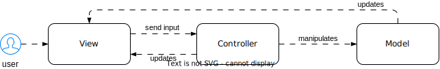

        <h3 style={{ textAlign: "center", margin: "3em 0 1em 0" }}>Model-View-Presenter (MVP)</h3>

        

        <h3 style={{ textAlign: "center", margin: "3em 0 1em 0" }}>Model-View-Intent (MVI)</h3>

        

        <h3 style={{ textAlign: "center", margin: "3em 0 1em 0" }}>Model-View-ViewModel (MVVM)</h3>

        

        <h3 style={{ textAlign: "center", margin: "3em 0 1em 0" }}>Model-View-ViewModel-Coordinator (MVVM-C)</h3>

        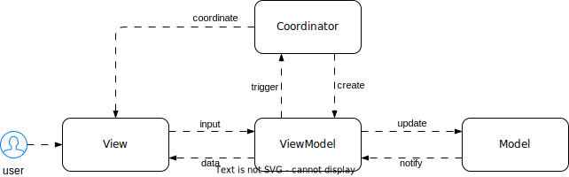

        <h3 style={{ textAlign: "center", margin: "3em 0 1em 0" }}>View-Interactor-Presenter-Entity-Router (VIPER)</h3>

        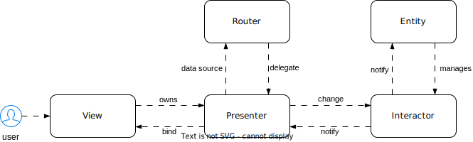
    </TabItem>
    <TabItem value="enterprise-comparison" label="Comparison Table">
        <table class="sticky column">
          <thead>
          <tr>
            <th>Aspect</th>
            <th>Model-View-Controller (MVC)</th>
            <th>Model-View-Presenter (MVP)</th>
            <th>Model-View-Intent (MVI)</th>
            <th>Model-View-ViewModel (MVVM)</th>
            <th>Model-View-ViewModel-Coordinator (MVVM-C)</th>
            <th>View-Interactor-Presenter-Entity-Router (VIPER)</th>
          </tr>
          </thead>
          <tbody>
          <tr>
            <td>Separation of Concerns</td>
            <td>
              <ul>
                <li><b>Model</b>: data and business logic of the application</li>
                <li><b>View</b>: UI components and logic</li>
                <li><b>Controller</b>: acts as an intermediary between Model and View, handling user input and updating the Model or View accordingly</li>
              </ul>
            </td>
            <td>
              <ul>
                <li><b>Model</b>: data and business logic of the application</li>
                <li><b>View</b>: UI components and logic</li>
                <li><b>Presenter</b>: acts as an intermediary that retrieves data from the Model and formats it for display in the View</li>
              </ul>
            </td>
            <td>
              <ul>
                <li><b>Model</b>: data and business logic of the application</li>
                <li><b>View</b>: UI components and logic</li>
                <li><b>Intent</b>: user intentions or actions, such as button clicks or text input</li>
              </ul>
            </td>
            <td>
              <ul>
                <li><b>Model</b>: data and business logic of the application</li>
                <li><b>View</b>: UI components and logic</li>
                <li><b>ViewModel</b>: acts as an intermediary between the View and Model, exposing data and actions to the View via data binding</li>
              </ul>
            </td>
            <td>
              <ul>
                <li><b>Model</b>: data and business logic of the application</li>
                <li><b>View</b>: UI components and logic</li>
                <li><b>ViewModel</b>: acts as an intermediary between the View and Model, exposing data and actions to the View via data binding</li>
                <li><b>Coordinator</b>: manages navigation and flow control within the application</li>
              </ul>
            </td>
            <td>
              <ul>
                <li><b>View</b>: passive, handles UI updates (no logic)</li>
                <li><b>Interactor</b>: business logic and data fetching</li>
                <li><b>Presenter</b>: formats data for View, handles user interactions</li>
                <li><b>Entity</b>: data model representation</li>
                <li><b>Router</b>: navigation management</li>
              </ul>
            </td>
          </tr>
          <tr>
            <td>Origin</td>
            <td>Web</td>
            <td>Web</td>
            <td>Android</td>
            <td>Microsoft WPF</td>
            <td>iOS</td>
            <td>Web</td>
          </tr>
          <tr>
            <td>Data Flow</td>
            <td>2-way data flow. View directly modifies the Model, and the Controller updates both View and Model</td>
            <td>1-way data flow. View sends user interaction to Presenter, which updates the Model and informs the View of changes</td>
            <td>unidirectional data flow. View dispatches "intents" (user actions) received by a store, which updates the state and returns new state to the View</td>
            <td>2-way data binding. ViewModel holds data and updates both View and Model as needed</td>
            <td>2-way data binding</td>
            <td>unidirectional, with data passing from the Interactor to the Presenter and then to the View for display</td>
          </tr>
          <tr>
            <td>Responsibilities</td>
            <td>View contains much logic, including data formatting and user interaction handling</td>
            <td>Presenter handles most UI logic, decoupling View from complex code</td>
            <td>View focuses on displaying information and sending intents. The store handles state logic and mutations</td>
            <td>ViewModel holds UI-related logic and data, separating concerns</td>
            <td>ViewModel handles UI-related logic and data, while Coordinator handles navigation and flow control</td>
            <td>Interactor manages business logic, Presenter handles UI logic, View displays UI, Entity represents data objects, and Router manages navigation</td>
          </tr>
          <tr>
            <td>Testability</td>
            <td>difficult due to tight coupling</td>
            <td>easier with separation</td>
            <td>easier due to unidirectional data flow</td>
            <td>better due to separation and reactive programming</td>
            <td>better due to the separation of concerns between ViewModel and Coordinator</td>
            <td>high testability due to its modular structure</td>
          </tr>
          <tr>
            <td>Focus on Reactive UI</td>
            <td>no</td>
            <td>no</td>
            <td>yes</td>
            <td>yes</td>
            <td>yes</td>
            <td>no</td>
          </tr>
          <tr>
            <td>Adoption Difficulty</td>
            <td>low</td>
            <td>low</td>
            <td>moderate</td>
            <td>moderate</td>
            <td>moderate</td>
            <td>high</td>
          </tr>
          <tr>
            <td>Coupling of the Components</td>
            <td>tight coupling between view and model</td>
            <td>presenter acts as a link, loosely coupled</td>
            <td>strict unidirectional data flow enforced</td>
            <td>data binding allows for easy separation</td>
            <td>data binding allows for easy separation</td>
            <td>loosely coupled, enhancing maintainability</td>
          </tr>
          <tr>
            <td>Relationship between Components</td>
            <td>1-to-many relationship between controller and view</td>
            <td>1-to-1 relationship between presenter and view</td>
            <td>components interact through strict unidirectional flow</td>
            <td>1-to-many mapping with single view model</td>
            <td>1-to-many mapping between ViewModels and Views, and coordination between Coordinators</td>
            <td>1-to-1 mapping between Presenter and View, and other components interact through protocols/interfaces</td>
          </tr>
          <tr>
            <td>References with other Components</td>
            <td>View has no information about controller</td>
            <td>View holds presenter's knowledge</td>
            <td>Components interact through strict unidirectional flow</td>
            <td>View holds references to ViewModel</td>
            <td>View holds references to ViewModel, and Coordinator manages navigation and may hold references to ViewModels</td>
            <td>View holds references to Presenter, and Presenter holds references to other components</td>
          </tr>
          <tr>
            <td>Making Changes</td>
            <td>hectic due to tight coupling</td>
            <td>easily manageable changes</td>
            <td>changes propagate unidirectionally</td>
            <td>easily manageable changes</td>
            <td>easily manageable changes</td>
            <td>easily manageable changes</td>
          </tr>
          <tr>
            <td>Applicability</td>
            <td>small-scale projects</td>
            <td>simple to complex projects</td>
            <td>projects with strict data flow</td>
            <td>complex projects</td>
            <td>complex projects with intricate navigation flows</td>
            <td>large-scale, enterprise-level applications with complex requirements</td>
          </tr>
          <tr>
            <td>Dependency on APIs</td>
            <td>high</td>
            <td>low</td>
            <td>minimized dependency through strict unidirectional flow</td>
            <td>little to zero</td>
            <td>little to zero</td>
            <td>reduces dependency on APIs by abstracting them behind Interactors</td>
          </tr>
          <tr>
            <td>Use Cases</td>
            <td>small, simple applications</td>
            <td>good balance between simplicity and maintainability</td>
            <td>state-driven applications and familiarity with reactive programming</td>
            <td>ideal for UI-intensive data-driven projects</td>
            <td>large-scale applications with complex UI and navigation requirements</td>
            <td>requiring high modularity and scalability, especially in teams where different components can be developed independently</td>
          </tr>
          </tbody>
        </table>
    </TabItem>
</Tabs>

## Domain-Driven Design (DDD)

<Tabs queryString="primary">
    <TabItem value="ddd-benefits" label="Benefits">
        - **Communication**: Enhances communication among developers, managers, and domain experts through a shared language and understanding of the business domain
        - **Productivity**: Boosts productivity with a clear comprehension of the business domain and by encapsulating domain logic in an easily understandable and maintainable manner
        - **Improved Maintainability**: Enhances maintainability via a modular, object-oriented design that facilitates understanding and modification
        - **Scalability**: Enhances scalability by breaking down large monolithic applications into smaller, more manageable components
        - **Flexibility**: Enhances flexibility by facilitating the handling of complex business processes and adapting to changing business requirements
    </TabItem>
    <TabItem value="ddd-challenges" label="Challenges">
        - **Learning Curve**: Challenging for new developers, particularly those unfamiliar with object-oriented programming or domain modeling
        - **Complexity**: Significant complexity, especially in large, intricate domains, demanding substantial time and effort to create a well-designed domain model and implement domain logic
        - **Resistance to Change**: Difficulty in implementation within organizations resistant to change or entrenched in siloed development cultures
        - **Lack of Resources**: Demands substantial resources such as time, money, and personnel
    </TabItem>
    <TabItem value="ddd-architecture" label="Architecture">

        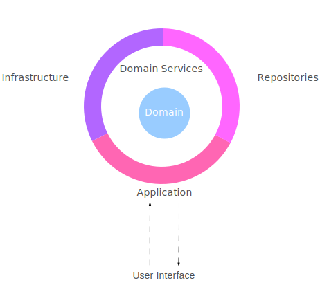

        **User Interface (UI)**

        The user interface (UI) layer serves to present the system to users and handle their interactions, commonly through web pages, mobile apps, or desktop applications. It's ideal for this layer to be lightweight and straightforward, with most logic and functionality managed by the application layer. Additionally, it's crucial for the UI layer to remain independent of the domain layer, achieved by utilizing data transfer objects (DTOs) or view models tailored to UI requirements. This decoupling ensures that changes or replacements to the UI layer won't impact the domain layer

        **Application Layer**

        The application layer orchestrates system workflows, mediating between the user interface and domain layers. It should be lightweight, focusing solely on application-specific logic, not domain-related tasks. Decoupling from the infrastructure layer ensures independence, achieved by utilizing domain-defined interfaces or abstractions like repositories or services. This separation enables independent testing and deployment of the application layer

        **Domain Layer**

        The domain layer embodies the core business logic and rules of the system, comprising the domain model which represents relevant concepts and behaviors. It includes entities, value objects, aggregates, services, events, and other elements crucial to the domain. This layer should be comprehensive, housing most system logic and functionality, and should remain isolated and self-contained. It defines its own interfaces or abstractions, like repositories or services, implemented by other layers, ensuring that changes or refinements to the domain layer won't impact other layers

        **Infrastructure Layer**

        The infrastructure layer furnishes technical resources and services to support system functionality, encompassing databases, message brokers, web servers, cloud platforms, and 3rd-party APIs. It should adhere to interfaces or abstractions outlined by the domain layer, ensuring compatibility. Furthermore, it should offer configurability and interchangeability, allowing different implementations or providers to be utilized based on requirements. For instance, it should support the use of various databases or message brokers for testing or production purposes. This flexibility enables optimization or replacement of the infrastructure layer without impacting other system layers
    </TabItem>
    <TabItem value="ddd-principles" label="Principles">
        - **Focus on the core domain and domain logic**: Developers should prioritize understanding and implementing the essential aspects of the business domain. This involves focusing on the key rules and behaviors that define how the domain operates and what it can accomplish
        - **Base complex designs on models of the domain**: Complex designs should be built upon simplified and abstract representations of the domain. These models capture the fundamental aspects of the domain while disregarding unnecessary details. They aid in comprehension, communication, and reasoning about the domain, guiding software design and implementation to align with domain logic and terminology
        - **Collaborate with domain experts and stakeholders**: Developers must engage closely with individuals possessing deep domain knowledge, such as business analysts, managers, or end-users. This collaboration enables the elicitation of requirements, validation of assumptions, and gathering of feedback. Domain experts contribute to refining and evolving the model, as well as identifying and resolving gaps or inconsistencies between the model and the reality of the domain

        **DDD Model**

        - DDD as a Programming Paradigm
           - DDD is a programming paradigm centered around the domain model, representing the business domain in code
           - It goes beyond mere data structures, embodying the business domain's behavior and logic within the codebase

        - Structured Domain Modeling
           - DDD employs a structured approach to modeling the domain, rooted in a thorough understanding of the business domain
           - It utilizes a ubiquitous language, a shared vocabulary among stakeholders for describing the business domain

        - Entities and Value Objects
           - Domain entities, with unique identities, are the focal points of the domain model
           - Value objects, though lacking unique identities, play crucial roles within the domain

        - Aggregates for Unit of Work Definition
           - Aggregates define boundaries for units of work, grouping objects treated as single entities to maintain data consistency

        - Domain Events for Communication
           - Domain events signify significant changes within the domain, facilitating communication and ensuring data consistency across the system
           - These events prompt other system components to react and update data accordingly

        - Domain Services for Logic Encapsulation
           - Domain services encapsulate domain logic and provide standardized interfaces for interacting with the domain model
           - They are independent of specific entities or value objects, promoting modularity and maintainability while preserving the integrity of the domain model
    </TabItem>
    <TabItem value="ddd-concepts" label="Concepts">
        **Domain Model**

        A domain model in DDD is the core representation of domain concepts, rules, and behaviors in code. It serves as the central component of a DDD application, capturing the essence of the problem domain and facilitating communication between developers, domain experts, and stakeholders

        - **Focused**: The domain model should only include relevant aspects of the domain, avoiding unnecessary complexity or technical details. This ensures clarity and simplicity in understanding the domain
        - **Explicit**: Domain concepts and rules should be made clear and explicit within the model, utilizing well-defined terms and structures. This promotes understanding and communication among team members and stakeholders
        - **Isolated**: The domain model should be decoupled from other layers or concerns of the application, such as the user interface, database, or network. This isolation ensures that changes in one part of the system do not unnecessarily impact the domain model, enhancing maintainability and flexibility
        - **Testable**: The domain model should be easy to verify and validate through automated tests. This allows developers to ensure the correctness and behavior of the model, promoting confidence in its functionality and reliability

        **Ubiquitous Language**

        Ubiquitous language is a set of terms and expressions that are shared by developers and domain experts, and used consistently throughout the project. A ubiquitous language helps to bridge the gap between the technical and the business worlds, and to ensure that the domain model reflects the true understanding of the domain.

        - **Evolving**: constantly refined and updated as the project progresses and new insights are gained
        - **Contextual**: specific to a particular bounded context, and avoid ambiguity or confusion with other contexts or domains
        - **Expressive**: rich and precise enough to capture the nuances and subtleties of the domain
        - **Implemented**: reflected in the code, the tests, the documentation, and the communication of the project

        **Domain Object**

        A domain object is an object that represents a domain concept or entity in code. It encapsulates the state and behavior of that concept or entity, and enforces its invariants and rules.

        - **Encapsulated**: hide its internal implementation details and expose only a well-defined interface to its clients
        - **Cohesive**: have a single responsibility and a clear purpose within the domain model
        - **Immutable**: should not allow its state to be modified after creation, unless it is part of its domain behavior
        - **Identifiable**: have a unique identity that distinguishes it from other objects of the same type

        **Value Object**

        A value object is a type of domain object that represents a simple or atomic value in the domain. It has no identity or lifecycle, and is defined only by its attributes.

        - **Immutable**: should not allow its attributes to be changed after creation
        - **Equatable**: implement equality based on its attributes, rather than on its identity or reference
        - **Replaceable**: should be easily replaced by another value object with the same attributes, without affecting the domain behavior
        - **Shareable**: should be safe to share across multiple domain objects or contexts, without causing side effects or inconsistencies

        **Entity**

        An entity is a type of domain object that represents a complex or composite concept or entity in the domain. It has a unique identity and a lifecycle, and may have mutable state.

        - **Identifiable**: unique identifier that distinguishes it from other entities of the same type
        - **Mutable**: may allow its state to be changed as part of its domain behavior, but only in a controlled and consistent way
        - **Consistent**: maintain its invariants and rules at all times, regardless of its state changes
        - **Aggregateable**: may belong to an aggregate that defines its boundaries and consistency rules

        **Context**

        A context is a boundary or scope within which a particular domain model applies. A context defines what concepts, rules, and behaviors are relevant and meaningful for a specific subdomain or problem space.

        - **Bounded**: clear and explicit boundary that separates it from other contexts or domains
        - **Consistent**: ensure that the domain model within it is coherent and valid, and does not conflict with other models or contexts
        - **Autonomous**: should be independent and self-contained, and not depend on other contexts or domains for its functionality or behavior
        - **Integrable**: may communicate or interact with other contexts or domains through well-defined interfaces or protocols

        **Aggregate**

        An aggregate is a cluster of related entities and value objects that form a unit of consistency and transactional integrity. An aggregate defines what entities belong together, what are their invariants and rules, and how they can be accessed or modified.

        - **Rooted**: single entity, called the aggregate root, that serves as the entry point and the source of truth for the aggregate
        - **Consistent**: ensure that the entities and value objects within it are always in a valid and consistent state, and that their invariants and rules are enforced
        - **Isolated**: should not expose its internal entities or value objects to the outside world, and should only allow access or modification through the aggregate root
        - **Transactional**: should be treated as a single unit of work or transaction, and should either succeed or fail as a whole

        **Repository**

        A repository is an abstraction that provides access to the aggregates or entities of a domain model. A repository hides the details of how the aggregates or entities are stored, retrieved, or persisted, and provides a collection-like interface to manipulate them.

        - **Abstract**: define an interface that specifies what operations are available for the aggregates or entities, without exposing how they are implemented
        - **Concrete**: provide one or more implementations that realize the interface using different technologies or mechanisms, such as databases, files, web services, etc.
        - **Consistent**: ensure that the aggregates or entities returned by the repository are always in a consistent state, and reflect the latest changes made to them
        - **Queryable**: allow querying or filtering the aggregates or entities based on various criteria or specifications

        **Domain Event**

        A domain event is an object that represents something meaningful or significant that happened in the domain. A domain event captures the state and context of the event, and may trigger some actions or reactions in response to it.

        - **Immutable**: should not allow its state or context to be changed after creation
        - **Descriptive**: describe what happened in the domain, using a clear and expressive name and attributes
        - **Observable**: should be published or broadcasted to interested parties or subscribers, using an event bus, a message broker, or other mechanisms
        - **Reactive**: may trigger some actions or reactions in response to it, such as updating the domain state, sending notifications, invoking services, etc.

        **Domain Service**

        A domain service is an object that performs some domain-specific operation or logic that does not belong to any entity or value object. A domain service encapsulates some complex or cross-cutting functionality that is needed by the domain model, but is not part of its natural behavior.

        - **Stateless**: should not have any state or dependencies of its own, and should only rely on the parameters or inputs provided to it
        - **Functional**: perform a single function or operation, and return a result or output
        - **Injectable**: should be easily injected or provided to the entities or value objects that need it, using dependency injection, service locator, or other techniques
        - **Testable**: should be easy to test and verify its correctness and behavior using automated tests

        **Commandos**

        A commando is an object that represents a request or an intention to perform some action or change some state in the domain. A commando encapsulates the data and context needed to execute the action or change, and may also specify some validation rules or preconditions.

        - **Immutable**: should not allow its data or context to be changed after creation
        - **Validatable**: may implement some validation rules or preconditions that must be satisfied before executing the action or change
        - **Executable**: may implement some logic to execute the action or change itself, using a command handler, a mediator, or other mechanisms
        - **Auditable**: may record some information about when, where, how, and by whom it was executed

        **Factories**

        A factory is an object that creates other objects. A factory encapsulates the logic and details of how to instantiate and initialize an entity, a value object, an aggregate, a commando, a domain event, or any other object needed by the domain model.

        - **Abstract**: It may define an interface that specifies what objects can be created by the factory, without exposing how they are created
        - **Concrete**: It may provide one or more implementations that realize the interface using different strategies or parameters
        - **Simple**: It should only create objects and not perform any other actions or side effects
        - **Configurable**: It may allow customizing some aspects of how the objects are created, such as their initial state, dependencies, settings, etc.
    </TabItem>
    <TabItem value="ddd-bestPractices" label="Best Practices">
        **Identify and Define the Core Business Domain**

        - **Identify Primary Objects**: Entities, value objects, and domains critical to the business (Customers, accounts, transactions, and payments in banking)
        - **Define Domain Model**: Define attributes, behaviors, and relationships of identified objects (Customer name, account balance)

        **Ubiquitous Language Establishment**

        - **Define Shared Language**: Common vocabulary based on the domain model (Customer, account, transaction, payment)
        - **Communication Standardization**: Consistent usage throughout the development process (Ensures effective communication across stakeholders)

        **Object-Relational Mapping (ORM) Tools**

        - **Mapping Domain Model**: Tools like Hibernate, Entity Framework map domain model to database (Facilitates interaction with data in the domain model)
        - **Abstraction of Storage Technology**: Allows direct work with the domain model, abstracting storage technology (Simplifies potential changes in storage technology)

        **Command-Query Responsibility Segregation (CQRS)**

        - **Separate System Responsibilities**: Commands for updating the model, queries for data retrieval (Enhances scalability and maintainability)

        **Event Sourcing**

        - **Store Domain Model History**: Records changes as events, providing a complete history (Facilitates auditing and debugging)
        - **Reconstruction of Domain Model**: Replay events to reconstruct the model, understand system evolution

        **Bounded Context**

        - **Define Domain Boundaries**: Establish limits of a specific subdomain's applicability (Ensures relevance and avoids unnecessary complexity)

        **Microservices**

        - **Decompose Large Systems**: Break large systems into smaller, manageable parts (Enables independent development, deployment, and scaling)

        **Messaging**

        - **Facilitate Communication**: Messaging enables communication between objects or systems (Supports loosely coupled architecture, aiding system flexibility)
    </TabItem>
</Tabs>

## Hexagonal Architecture

<Tabs queryString="primary">
  <TabItem value="hexagonal-definition" label="Definition">
    Hexagonal architecture, also known as ports and adapters architecture, is an architectural pattern that aims to create loosely coupled application components that can be easily connected to their software environment by means of ports and adapters. This makes components exchangeable at any level and facilitates test automation.

    Hexagonal Architecture’s concept is to position inputs and outputs on the periphery of the design. The business logic should remain unaffected regardless of whether we expose a REST or a GraphQL API, and irrespective of our data sources — be it a database, a microservice API revealed through gRPC or REST.

    **Port**

    A port is an interface that facilitates communication between an application and an external system using a specific protocol. It can be either incoming (receiving requests or events from the external system) or outgoing (sending commands or queries to the external system).

    A port can support multiple adapters, each implementing the communication protocol differently. For instance, an incoming port could have adapters for a GUI, CLI, or a web service, while an outgoing port could have adapters for various DBMS or repositories.

    **Adapters**

    An adapter is a component that links a port to an external system, translating data and messages between the application and the external system using the port’s protocol. It also manages technical aspects like error handling, logging, security, and caching.

    Depending on the role of the external system, an adapter can be primary (connecting to an actor initiating communication) or secondary (connecting to an actor responding to communication). Primary actors include users or other applications, while secondary actors include databases or services.
  </TabItem>
  <TabItem value="hexagonal-benefits" label="Benefits">
    - Loose coupling by decopling core from external systems and their technical details
    - High cohesion by handling technical concerns with adapters and keeping focus on the business and application logic within core
    - Improved Testability
    - Easier Maintenance
    - Better Domain Modeling
    - Scalability
    - Exchangeability by changing adapters without changing core
    - Reusability by using different adapters
    - Improved Readability
  </TabItem>
  <TabItem value="hexagonal-principles" label="Principles">
    **Separation of User-/Business-/Server- Side Logic**

    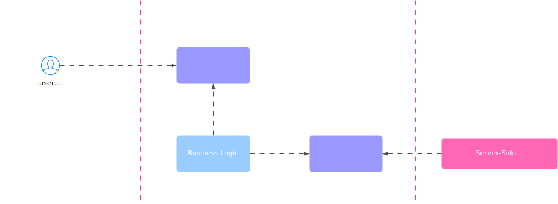

    - **Compartmentalization**: This separation allows for focusing on one logic at a time, making each easier to understand without mixing them up. The constraints of each logic have less impact on the others
    - **Prioritization of Business Logic**: The business logic is emphasized in the code. It can be isolated into a specific directory or module, making it clear for all developers. It can be developed, refined, and tested without the cognitive load of the rest of the program. This is important as it’s the developers’ understanding of the business that gets deployed
    - **Effective Testing**: With this separation, automated tests can efficiently test: The entire Business Logic on its own. The integration between User-Side and Business Logic, independent of the Server-Side. The integration between Business Logic and Server-Side, independent of the User-Side

    **Dependencies Go Inside**

    

    - **Business Logic as Core Dependency**: The software can be manipulated via console and tests, but the Business Logic doesn’t recognize the concept of a console. The User-Side depends on the Business Logic, not vice versa. The User-Side relies on a universal user-initiated "post request" mechanism
    - **Inside vs Outside**: The central Business Logic is "inside" and everything else is "outside". Dependencies point inward. Everything is dependent on the Business Logic, while the Business Logic is independent. This distinction between "inside" and "outside" is emphasized as more crucial than differentiating between User-Side and Server-Side

    **Boundaries are Isolated with Interfaces**

    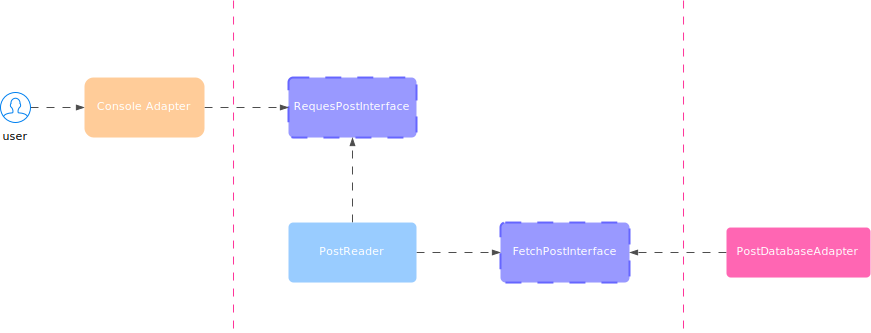

    The client-side code interacts with the business logic via an interface, which is established within the business logic itself. Similarly, the business logic communicates with the server-side through another interface, also defined within the business logic. These interfaces serve as clear boundaries separating the internal and external components.

    **Ports & Adapters**

    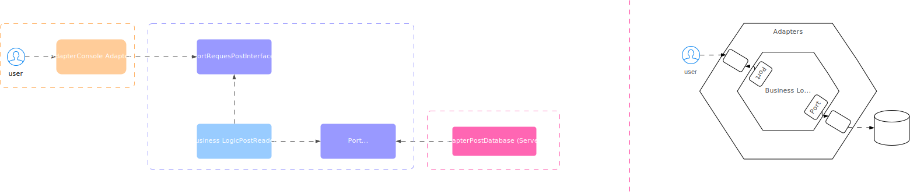

    Hexagonal Architecture, also known as the Ports & Adapters Pattern, is a design pattern that uses ports and adapters to facilitate interactions between internal and external elements. The business logic creates ports, which can be connected to various adapters interchangeably.

    The interfaces created by the business code are referred to as ports, which are considered internal as they are defined by the business. Adapters represent external code that bridges the gap between the port and the rest of the user-side or server-side code.

    The architecture is symbolized by a hexagon, providing ample space to depict multiple ports and adapters.

    **Dependency Rule & Dependency Inversion**

    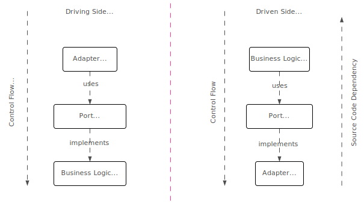

    The main challenge in software architecture is to prevent technical details and libraries from infiltrating the application. The "dependency rule" provides a solution by ensuring that all source code dependencies point inward, towards the core of the application.

    The difficulty arises when implementing secondary ports and adapters, where the source code dependency must be opposite to the direction of invocation. For instance, how can the application core access the database if the database is outside the core and the source code dependency is to be directed towards the center?

    This is where we apply the "dependency inversion principle." The port is still defined by an interface, but the relationships between classes are reversed. This allows control the direction of a code dependency — for secondary ports and adapters, it’s opposite to the calling direction.
  </TabItem>
  <TabItem value="hexagonal-workflow" label="Workflow">
    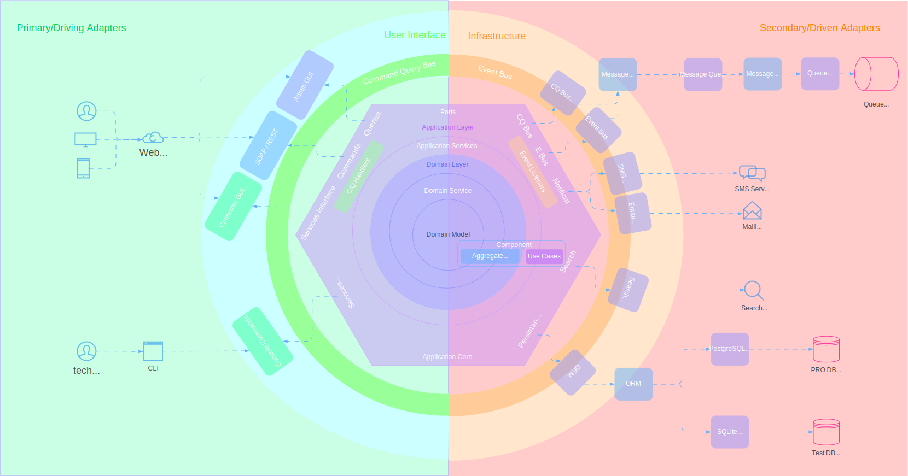

    The main idea behind hexagonal architecture is to put the inputs and outputs at the edges of the design, and to isolate the core layer from outside concerns. This way, the core layer can be swapped out without changing the adapter layer, and vice versa.

    For example, suppose you have a core layer that implements a simple calculator service. It exposes two ports: one for receiving arithmetic expressions as input, and one for sending the results as output. The core layer does not care about how these ports are implemented, as long as they follow the contract defined by the port layer.

    Now, you can have different adapters for these ports, depending on your needs. For instance, you can have a web adapter that implements the input port as a REST API endpoint, and the output port as a JSON response. Or you can have a console adapter that implements the input port as a command-line argument, and the output port as a standard output stream. Or you can have a test adapter that implements the input port as a mock object, and the output port as an assertion.

    The beauty of this approach is that you can change or add adapters without affecting the core layer or other adapters. You can also test the core layer in isolation, by using test adapters that simulate the external world.

    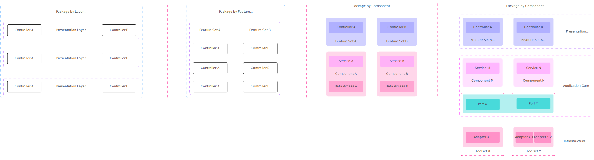

    **High-Level Overview of How Hexagonal Architecture Works**

    - **Application core**: contains the business logic and algorithms that solve the problem
    - **Ports**: define the interfaces that the application uses to communicate with the external systems
    - **Adapters**: implement the ports and provide a bridge between the application and the external systems
    - **Edge**: handles the communication between the application core and the external systems
    - **External systems**: interact with the application through the ports and adapters

    **Steps for Applying Hexagonal Architecture**

    - **Identify your core domain logic** and encapsulate it in one or more classes or modules. This is your application core
    - **Identify your external actors** and their interactions with your system. These are your primary and secondary ports
    - **Define abstract interfaces for each port** that specify what methods or operations are available for communication
    - **Implement concrete adapters for each port** that handle the communication with the external actors. For example, you can use a web framework to implement a web adapter, or a JDBC driver to implement a database adapter
    - **Connect your adapters to your core through dependency injection or inversion of control**. This way, you can easily change or replace your adapters without affecting your core

    **Examples**

    - **Web Application**: Web application that allows users to create and manage blog posts
      - **core logic** of this application is responsible for validating and storing blog posts, as well as retrieving them by various criteria
      - **external components** are a web browser that provides a user interface for creating and viewing blog posts, and a relational database that persists blog posts in tables
      - **ports** are an HTTP API that defines how blog posts are created and retrieved using HTTP requests and responses in JSON format, and a repository interface that defines how blog posts are stored and queried using CRUD operations on entities
      - **adapters** are a web controller that implements the HTTP API using Spring MVC framework, and a JDBC repository that implements the repository interface using SQL queries on a MySQL database
    - **Command-Line Application (CLI)**: Command-line application that allows users to generate and analyze reports from data sources
      - **core logic** of this application is responsible for generating and analyzing reports, as well as formatting them in various formats
      - **external components** are a command-line interface that provides a user interface for specifying report parameters and options, and various data sources that provide data for the reports, such as CSV files, web services or databases
      - **ports** are a CLI API that defines how report parameters and options are parsed and validated using command-line arguments and options, and a data source interface that defines how data is retrieved and queried using data source identifiers and queries
      - **adapters** are a CLI parser that implements the CLI API using Apache Commons CLI library, and various data source adapters that implement the data source interface using different technologies, such as Apache Commons CSV, Apache HttpClient or JDBC
  </TabItem>
  <TabItem value="hexagonal-comparison" label="Comparison">
    <Tabs queryString="secondary">
      <TabItem value="hexagonal-comparison-layered" label="Layered Architecture" attributes={{className: "tabs__vertical"}}>
        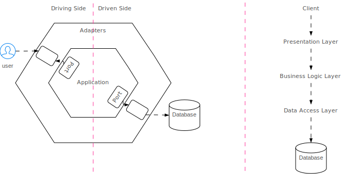

        Traditional layered architecture is a software architecture pattern that organizes the components of an application into a series of layers, each with a specific responsibility.

        The most common layers in a traditional layered architecture are:

        - **Presentation layer**: responsible for handling user input and output, and for displaying the user interface
        - **Application layer**: contains the business logic of the application, including the rules and processes that govern the behavior of the system
        - **Domain layer**: represents the data and the business concepts of the application, and is responsible for managing the data and the business rules
        - **Data access layer**: responsible for accessing and manipulating data, typically through a database
        - **Infrastructure layer**: includes the underlying systems and technologies that support the application, such as the operating system, database management system, and network protocols

        

        **Layered Architecture** is criticized for its focus on the database, leading to issues such as transitive dependencies, blurred layer boundaries, poor component isolation, and difficulties in testing, maintaining, and swapping infrastructure components. This approach is referred to as **database-driven design**, where the application is planned around a database.

        On the other hand, the **hexagonal architecture**, emphasizes **business logic over database design**. It’s more logical to plan and develop the business side of an application first and consider data persistence later. Changes in business logic should drive changes in data persistence, not vice versa.

        As applications grow more complex and incorporate additional components like REST APIs and third-party services, the hexagonal architecture provides clear guidelines for where these components belong. In contrast, a layered architecture often results in increased dependencies and potential duplication of business logic.

        **Drawbacks of Layered Architecture**

        - **Tight coupling**: The layers depend on each other in a specific order, which makes them hard to change or replace. For example, if you want to use a different database provider, you have to change the data access layer and possibly the business layer as well
        - **Contamination**: The layers can leak technical details or implementation choices to other layers, which violates the separation of concerns principle. For example, if you use an ORM framework in the data access layer, you may have to use its specific classes or annotations in the business layer or even in the presentation layer
        - **Asymmetry**: The layers do not reflect the actual communication patterns between external actors and the system. For example, a user request may go through several layers before reaching the business logic, while a notification may go directly from the business logic to an external actor

        <table>
          <thead>
            <tr>
              <th>Criteria</th>
              <th>Traditional Layered Architecture</th>
              <th>Hexagonal Architecture</th>
            </tr>
          </thead>
          <tbody>
            <tr>
              <td>Complexity</td>
              <td>Simpler, with fewer moving parts and easier to understand and implement</td>
              <td>More complex, with more moving parts and more nuanced design</td>
            </tr>
            <tr>
              <td>Coupling</td>
              <td>Tight coupling between layers</td>
              <td>Loose coupling between layers, with the application layer being the main entry point for external inputs</td>
            </tr>
            <tr>
              <td>Flexibility</td>
              <td>Inflexible, as changes to one layer can affect other layers</td>
              <td>More flexible, as changes to one layer do not affect other layers</td>
            </tr>
            <tr>
              <td>Focus</td>
              <td>Separation of concerns within the application</td>
              <td>Separation of concerns between the application and the external world</td>
            </tr>
            <tr>
              <td>Layers</td>
              <td>Fixed set of layers</td>
              <td>Flexible set of layers that can be added or removed as needed</td>
            </tr>
            <tr>
              <td>Maintenance</td>
              <td>More difficult to modify and extend, as changes to one layer can affect other layers</td>
              <td>Easier to modify and extend, as the separation of concerns and use of adapters and ports make it easier to modify the application</td>
            </tr>
            <tr>
              <td>Responsibilities</td>
              <td>Each layer has a specific responsibility</td>
              <td>Domain layer responsible for business logic, application layer responsible for handling user input and output</td>
            </tr>
            <tr>
              <td>Scalability</td>
              <td>Difficult to add new adapters or ports without affecting the core domain logic</td>
              <td>Easier to add new adapters and ports, as they can be added without affecting the existing architecture</td>
            </tr>
            <tr>
              <td>Testability</td>
              <td>Difficult to test individual layers in isolation</td>
              <td>Easier to test individual layers in isolation, as adapters and ports can be mocked or stubbed</td>
            </tr>
            <tr>
              <td>Use Cases</td>
              <td>
                <ul>
                  <li>Has a simple structure</li>
                  <li>Has a small number of components</li>
                  <li>Doesn’t require extensive integration with external systems</li>
                  <li>Doesn’t require high scalability</li>
                </ul>
              </td>
              <td>
                <ul>
                  <li>Integrate with multiple external systems</li>
                  <li>Handle a large volume of data</li>
                  <li>Scale the application horizontally</li>
                  <li>Test the application extensively</li>
                </ul>
              </td>
            </tr>
          </tbody>
        </table>
      </TabItem>
      <TabItem value="hexagonal-comparison-clean" label="Clean Architecture">
        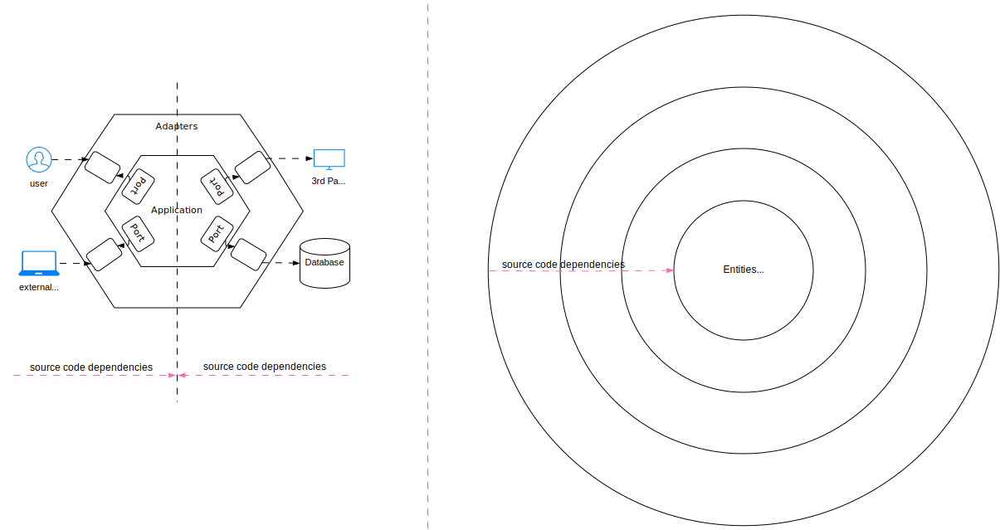

        **Clean Architecture** also places business logic at the center, similar to the Hexagonal Architecture. Interface adapters surround this core, connecting it with the user interface, database, and other external components. The core is only aware of the interfaces of these adapters and not their concrete implementations.

        In Clean Architecture, all source code dependencies point towards the core. The Dependency Inversion Principle is applied when calls point from inside to outside, opposite to the source code dependency direction.

        The Hexagonal Architecture can be almost directly mapped to the Clean Architecture:

        - **Eexternal agencies** around the outer hexagon correspond to the outer ring of Clean Architecture, "frameworks & drivers"
        - **Outer hexagon adapters** match the "interface adapters" ring in Clean Architecture
        - **Application hexagon** aligns with the "business rules" in Clean Architecture. These are further divided into "enterprise-related business rules" (entities) and "application business rules" (use cases that orchestrate entities and control data flow). However, Hexagonal Architecture leaves the architecture within the application hexagon open
        - **Ports** are not explicitly mentioned in Clean Architecture but are present in associated UML diagrams and source code examples as interfaces

        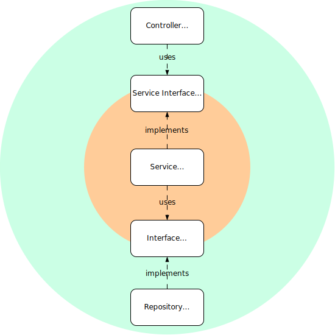
      </TabItem>
      <TabItem value="hexagonal-comparison-onion" label="Onion Architecture">
        
        
        The Onion Architecture places the business logic at the center, known as the **application core**. This core interfaces with the user interface and infrastructure but is unaware of their concrete implementations, isolating it from the infrastructure.
        
        Like the Hexagonal and Clean architectures, all source code dependencies in the Onion Architecture point towards the core. Dependency inversion is applied when the call direction opposes the source code dependency.
        
        The Hexagonal Architecture can be almost directly mapped to the Onion Architecture:
        
        - **External agencies** around the outer hexagon correspond to the infrastructure components in the Onion Architecture
        - **Outer hexagon adapters** match the ring containing "user interface", "tests", and "infrastructure" in the Onion Architecture
        - **Application hexagon** aligns with the application core in the Onion Architecture, which is further divided into "application services", "domain services", and "domain model". Only the "domain model" is a fixed component of the Onion Architecture, with other rings marked as optional. The "domain model" defines the "enterprise business rules", corresponding to the innermost circle or "entities" ring of the Clean Architecture

      </TabItem>
      <TabItem value="hexagonal-comparison-table" label="Comparison Table">
        <table class="sticky column">
          <thead>
          <tr>
            <th>Aspect</th>
            <th>Traditional Layered Architecture</th>
            <th>Clean Architecture</th>
            <th>Onion Architecture</th>
            <th>Hexagonal Architecture</th>
          </tr>
          </thead>
          <tbody>
          <tr>
            <td>Definition</td>
            <td>
              Divides the application into layers based on functionality, with each
              layer having dependencies on the layer below it
            </td>
            <td>
              Emphasizes separation of concerns and the use of SOLID principles for
              building scalable and maintainable software
            </td>
            <td>
              Similar to Hexagonal Architecture, it aims to decouple the application
              core from the infrastructure layers. However, it adds the concept of
              concentric layers
            </td>
            <td>
              Also known as Ports and Adapters Architecture, it focuses on separating
              the application core from the surrounding infrastructure layers
            </td>
          </tr>
          <tr>
            <td>Dependency Flow</td>
            <td>
              Dependencies flow from higher-level layers to lower-level layers, with
              each layer depending on the layer directly below it
            </td>
            <td>
              The dependency flow is unidirectional, with higher-level layers
              depending on lower-level layers. Dependencies are not allowed to flow in
              the opposite direction
            </td>
            <td>
              Similar to Hexagonal Architecture, the dependency flow is inward, with
              the core defining interfaces and the adapters implementing them
            </td>
            <td>
              The flow of dependencies is inward, with the application core defining
              interfaces (ports) that are implemented by the adapters. The adapters
              depend on the interfaces defined by the core
            </td>
          </tr>
          <tr>
            <td>Dependency Inversion Principle (DIP) Support</td>
            <td>
              May not explicitly enforce the DIP, leading to potentially tightly
              coupled dependencies between layers
            </td>
            <td>
              Emphasizes the DIP by using interfaces and dependency injection to
              invert dependencies, enabling higher-level layers to depend on
              abstractions defined by lower-level layers
            </td>
            <td>
              Supports the DIP by using interfaces to define dependencies between
              layers, allowing for the inversion of dependencies and loose coupling
            </td>
            <td>
              Strongly aligns with the DIP by relying on interfaces (ports) that are
              implemented by adapters, allowing the core to depend on abstractions
            </td>
          </tr>
          <tr>
            <td>Deployment and Infrastructure</td>
            <td>
              May have tight coupling with the infrastructure, making it more
              difficult to adapt or switch deployment environments without impacting
              the entire system
            </td>
            <td>
              Is agnostic to the deployment and infrastructure details, allowing for
              easy adaptation to different environments
            </td>
            <td>
              Separates infrastructure concerns into outer layers, making it easier to
              adapt or switch to different deployment environments without affecting
              the core
            </td>
            <td>
              Abstracts away the infrastructure, making it easier to switch or adapt
              to different deployment environments without affecting the core
            </td>
          </tr>
          <tr>
            <td>Flexibility and Adaptability</td>
            <td>
              Can be less flexible and adaptable due to tight coupling, making it
              harder to change or replace components without impacting other parts of
              the system
            </td>
            <td>
              Promotes flexibility and adaptability by enforcing separation of
              concerns, allowing for independent modification of layers without
              affecting others
            </td>
            <td>
              Provides flexibility and adaptability by separating concerns into
              layers, making it easier to change or replace components without
              affecting other layers
            </td>
            <td>
              Offers high flexibility and adaptability by isolating the core from
              external dependencies, making it easier to switch or upgrade components
            </td>
          </tr>
          <tr>
            <td>Layering Philosophy</td>
            <td>
              Layers are organized vertically based on functionality, with each layer
              providing services to the layer above it
            </td>
            <td>
              Layers are organized based on business logic and responsibilities. Each
              layer has a clear purpose and can depend only on the layer below it
            </td>
            <td>
              Concentric layers approach: The innermost layer represents the core
              business logic and the outer layers handle infrastructure and frameworks
            </td>
            <td>
              Ports (interfaces) and Adapters (implementations) are the core elements.
              The application core is isolated from the external dependencies
            </td>
          </tr>
          <tr>
            <td>Scalability and Maintainability</td>
            <td>
              Can be scalable and maintainable, but tight coupling between layers can
              make it more challenging to modify or add new features without affecting
              other parts of the system
            </td>
            <td>
              Promotes scalability and maintainability by enforcing separation of
              concerns and dependency inversion, making it easier to modify and add
              new features without impacting other parts of the system
            </td>
            <td>
              Aims to improve scalability and maintainability through its layered
              approach, allowing for easier modification and replacement of components
              without affecting other layers
            </td>
            <td>
              Enables scalability and maintainability by decoupling the application
              core from the infrastructure, allowing for easier modification and
              replacement of external dependencies
            </td>
          </tr>
          <tr>
            <td>Testing and Isolation</td>
            <td>
              Can make testing more challenging due to tight coupling between layers,
              requiring more complex integration testing
            </td>
            <td>
              Advocates for testability by employing dependency inversion and
              interfaces, enabling mocking and unit testing of individual layers
            </td>
            <td>
              Emphasizes testability through the use of interfaces and dependency
              injection, allowing for isolated testing of the core business logic
            </td>
            <td>
              Promotes easier testing and isolation of the application core by using
              ports and adapters, allowing the core to be tested independently of the
              infrastructure
            </td>
          </tr>
          <tr>
            <td>Use cases</td>
            <td>
              <ul>
                <li>project requires a simple and straightforward architecture</li>
                <li>project involves a small number of external integrations</li>
                <li>project requires a high degree of scalability</li>
              </ul>
            </td>
            <td>
              <ul>
                <li>
                  project requires a high degree of maintainability and
                  understandability
                </li>
                <li>
                  project involves a large number of business rules and use cases
                </li>
                <li>project requires a high degree of testability</li>
              </ul>
            </td>
            <td>
              <ul>
                <li>
                  project requires a high degree of flexibility and maintainability
                </li>
                <li>
                  project involves a large number of complex business rules and domain
                  logic
                </li>
                <li>project requires a high degree of testability</li>
              </ul>
            </td>
            <td>
              <ul>
                <li>
                  project requires a high degree of testability and maintainability
                </li>
                <li>
                  project involves a large number of external integrations, such as
                  databases, file systems, or web services
                </li>
                <li>
                  project requires a high degree of flexibility, such as the ability
                  to switch from one technology to another
                </li>
              </ul>
            </td>
          </tr>
          </tbody>
        </table>
      </TabItem>
    </Tabs>
  </TabItem>
</Tabs>
