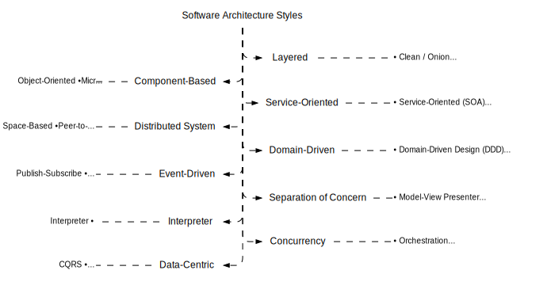

import Tabs from "@theme/Tabs";
import TabItem from "@theme/TabItem";

<Tabs queryString="primary">
    <TabItem value="architecture-styles-definition" label="Definition">
        Architectural style is a framework of guidelines dictating the structure and organization of a software system, encompassing component roles, interactions, and dependencies. It also addresses non-functional aspects like scalability, performance, security, testability, and maintainability. While not rigid, it offers a flexible approach adaptable to project requirements. There's no one-size-fits-all solution; instead, various trade-offs and considerations must be weighed to select the most suitable style for a given scenario

        
    </TabItem>
    <TabItem value="architecture-styles-benefits" label="Benefits">
        - **Modularity**: breaking down a complex system into smaller and simpler components that can be developed, tested, deployed, and maintained independently
        - **Reusability**: avoiding duplication of code and logic by creating reusable components that can be shared across different parts of the system or even across different systems
        - **Extensibility**: allowing the system to evolve and adapt to changing requirements and new features by adding or modifying components without affecting the existing ones
        - **Testability**: making the system easier to test by isolating the components and their dependencies and providing clear interfaces and contracts between them
        - **Maintainability**: making the system easier to understand, modify, debug, and refactor by following consistent and coherent conventions and principles
        - **Decoupling**: reducing the coupling or dependency between components by minimizing the amount of information and behavior they share or expose to each other
    </TabItem>
    <TabItem value="architecture-styles-performance" label="Software Performance">
        Software performance refers to the ability of a software system to execute its intended functions within a certain time frame and with optimal use of resources. It is a critical aspect of software development and maintenance, as it directly impacts the user experience, system reliability, and overall efficiency.

        Software performance can be defined as the measure of how well a software system executes its intended functions and responds to user input within a specified time frame.

        It encompasses various aspects, including:

        - **Response time**: The time it takes for the system to respond to user input or queries
        - **Throughput**: The number of tasks or requests the system can process within a given time frame
        - **Resource** utilization: The efficiency with which the system uses hardware and software resources, such as CPU, memory, disk I/O, and network bandwidth
        - **Scalability**: The system’s ability to handle increased workload or user traffic without a significant decrease in performance
        - **Reliability**: The system’s ability to perform its intended functions consistently and without errors or failures

        **Key Performance Indicators (KPIs) for Software Systems**

        Key Performance Indicators (KPIs) are measurable values that demonstrate how effectively a software system is achieving its intended goals.

        Some common KPIs for software performance include:

        - **Response time**: Average response time, response time variability, and response time distribution
        - **Throughput**: Number of requests processed per unit time, such as requests per second (RPS) or transactions per minute (TPM)
        - **Resource utilization**: CPU usage, memory usage, disk I/O, network bandwidth, and database queries per second
        - **Scalability**: Number of users, concurrent connections, or requests handled by the system without significant performance degradation
        - **Reliability**: Mean time between failures (MTBF), mean time to recover (MTTR), and error rates

        **Factors that Affect Software Performance**

        - **Hardware resources**: Availability, utilization, and performance of hardware components, such as CPU, memory, storage, and network interfaces
        - **Software architecture**: Design and structure of the software system, including the number of layers, components, and interactions between them
        - **Algorithmic complexity**: The time and space complexity of algorithms used in the software, which can impact response time and resource utilization
        - **Data size and growth**: The amount of data processed and stored by the system, which can affect performance as the data set grows
        - **User behavior**: Patterns and intensity of user activity, such as the number of concurrent users, frequency of requests, and usage patterns
        - **Network and I/O performance**: Network latency, packet loss, and I/O operations can impact the system’s ability to retrieve and process data
        - **Resource contention**: Competition for shared resources, such as CPU, memory, and I/O devices, which can lead to performance bottlenecks
        - **Interference and noise**: Interference from other systems or background processes, as well as random fluctuations in system performance, can affect software performance

        **Methods for Measuring and Monitoring Software Performance**

        - **Synthetic transactions**: Simulating user interactions to measure response time, throughput, and resource utilization
        - **Real-user monitoring**: Tracking actual user interactions to assess performance from the end-user perspective
        - **Load testing**: Testing the system under varying loads to evaluate its scalability and performance under different workloads
        - **Stress testing**: Testing the system under extreme conditions, such as high concurrency or large data sets, to identify performance bottlenecks
        - **End-user experience monitoring**: Monitoring user experience metrics, such as page load times, error rates, and user satisfaction
        - **Performance modeling**: Creating mathematical models of the system to predict performance under different conditions and optimize system configuration
        - **Performance benchmarking**: Comparing the system’s performance to industry-standard benchmarks or competing systems
        - **Root cause analysis**: Identifying the underlying causes of performance issues through techniques such as profiling, tracing, and logging
    </TabItem>
    <TabItem value="architecture-styles-overview" label="Architectural Styles">
        **Ways to Apply Architectural Style**

        - **Entire system**: defining the high-level structure and organization of the system as a whole, such as how it is divided into subsystems or modules, how they communicate with each other, and how they interact with external systems or services
        - **Subsystem or module**: defining the internal structure and organization of a subsystem or module within the system, such as how it is divided into components or classes, how they collaborate with each other, and how they expose their functionality to other subsystems or modules
        - **Component or class**: defining the internal structure and organization of a component or class within a subsystem or module, such as how it is divided into methods or functions, how they implement the logic and behavior of the component or class, and how they access data or resources

        **Overview**

        <table>
            <thead>
                <tr>
                    <th>Architectural Style</th>
                    <th>Definition</th>
                    <th>Technical Concepts</th>
                </tr>
            </thead>
            <tbody>
                <tr>
                    <td>Asynchronous Messaging</td>
                    <td>Pattern where the sender and receiver of a message don't need to interact with the message queue at the same time</td>
                    <td>
                        <ul>
                            <li><b>Decoupling</b>: This refers to the lack of a direct connection between the sender and receiver, allowing them to operate independently</li>
                            <li><b>Message Exchange Architectures</b>: These are structures designed for transferring messages between a sender and receiver</li>
                            <li><b>Eventual Consistency</b>: This concept suggests that changes made to one service may potentially lead to unintended and negative consequences in other parts of the system</li>
                        </ul>
                    </td>
                </tr>
                <tr>
                    <td>Blackboard</td>
                    <td>Decentralized problem-solving model that uses a modular approach. It’s designed to tackle complex problems that don’t have a clear algorithm or pre-set architecture</td>
                    <td>
                        <ul>
                          <li><b>Initialization:</b> The blackboard is prepared with the initial problem statement and any available input data</li>
                          <li><b>Activation:</b> Based on the current state of the problem and the data on the blackboard, the controller selects and activates one or more knowledge sources</li>
                          <li><b>Execution:</b> The activated knowledge sources independently analyze the problem, apply their specialized algorithms or techniques, and produce partial solutions or hypotheses</li>
                          <li><b>Conflict resolution:</b> If multiple knowledge sources generate conflicting or overlapping solutions, a conflict resolution mechanism is used to reconcile the differences and select the most appropriate solution(s)</li>
                          <li><b>Update:</b> The knowledge sources update the blackboard with their outputs, such as new constraints, proposed solutions, or intermediate results</li>
                          <li><b>Iteration:</b> The controller repeats the activation and execution steps until a satisfactory solution is reached, convergence criteria are met, or a predefined time limit is exceeded</li>
                        </ul>
                    </td>
                </tr>
                <tr>
                    <td>Client-Server</td>
                    <td>Model of interaction in a distributed system where software runs on local client devices and connects to remote server resources</td>
                    <td>
                        <ul>
                          <li><b>Loose coupling:</b> Clients and servers are separate entities that communicate over a network</li>
                          <li><b>Horizontal scaling:</b> Servers can be added to handle increased load</li>
                          <li><b>Distributed database:</b> Data can be stored across multiple servers, improving availability and performance</li>
                          <li><b>Asynchronous communication:</b> Clients make requests to servers and continue processing until the server responds</li>
                          <li><b>Stateless or stateful:</b> Servers can be designed to be stateless for scalability or stateful for simplicity</li>
                        </ul>
                    </td>
                </tr>
                <tr>
                    <td>Cloud Computing Patterns</td>
                    <td>Adapting to the many new possibilities but very different set of architectural constraints offered by the cloud compared to traditional on-premises infrastructure</td>
                    <td>
                        <ul>
                          <li><b>Functional requirements:</b> What the system should do</li>
                          <li><b>Non-functional requirements:</b> How the system should perform</li>
                          <li><b>Constraints:</b> What is out-of-scope to change</li>
                          <li><b>Self-healing:</b> The system should be able to recover from failures automatically</li>
                          <li><b>Cost efficient:</b> The system should make optimal use of resources to minimize costs</li>
                          <li><b>Continuous Integration/Continuous Delivery (CI/CD):</b> The system should be easily updated and maintained</li>
                        </ul>
                    </td>
                </tr>
                <tr>
                    <td>Component-Based</td>
                    <td>Framework for building software based on reusable components. It provides a higher level of abstraction and divides the problem into sub-problems, each associated with component partitions</td>
                    <td>
                        <ul>
                          <li><b>Components:</b> The building blocks that are highly flexible, modular, and reused across several projects. They follow repeatable conventions and can be used across other interfaces and modules without compromising the integrity of your code or UX</li>
                          <li><b>Interfaces:</b> Well-defined communication interfaces containing methods, events, and properties</li>
                          <li><b>Contracts:</b> Define the functionality provided by the component and the functionality required from the system to be operational</li>
                          <li><b>Component models and frameworks:</b> Define standards for component implementation, composition, and deployment</li>
                          <li><b>Composition:</b> The way components are assembled to form a system</li>
                          <li><b>Certification:</b> The process of verifying that a component meets its specification</li>
                        </ul>
                    </td>
                </tr>
                <tr>
                    <td>Database-Centric</td>
                    <td>Treats data as a valuable and versatile asset, acknowledging its role in the larger enterprise and industry ecosystem</td>
                    <td>
                        <ul>
                          <li><b>Centralized Data:</b> Refers to data collected and stored in one place, allowing frequent access and modification by various components</li>
                          <li><b>Security, Integration, Portability, and Analysis:</b> Significantly simplified in a data-centric approach, facilitating faster insights across the entire data value chain</li>
                          <li><b>Interoperability and Versatility:</b> By freeing data from a single monolithic stack, there are greater opportunities for accelerating digital transformation</li>
                        </ul>
                    </td>
                </tr>
                <tr>
                    <td>Domain-Driven Design (DDD)</td>
                    <td>Architecture style that focuses on modeling business domains and their logic in code</td>
                    <td>
                        <ul>
                          <li><b>Domain model:</b> A central, conceptual model of the business domain that guides the design of the application</li>
                          <li><b>Bounded context:</b> A self-contained model representing a specific aspect of the business domain</li>
                          <li><b>Ubiquitous language:</b> A shared language used across the entire development team to describe the domain model</li>
                        </ul>
                    </td>
                </tr>
                <tr>
                    <td>Event-Driven</td>
                    <td>Design pattern that organizes the application around the production, transformation, and consumption of events</td>
                    <td>
                        <ul>
                          <li><b>Event sources:</b> Services or systems that generate events</li>
                          <li><b>Event processors:</b> Services or systems that consume and process events</li>
                          <li><b>Event stores:</b> Systems that store events for later processing</li>
                        </ul>
                    </td>
                </tr>
                <tr>
                    <td>Layered</td>
                    <td>Architecture that separates the application into distinct layers, each with its own set of responsibilities</td>
                    <td>
                        <ul>
                          <li><b>Logical separation of components:</b> Components that are related or similar are usually placed on the same layers</li>
                          <li><b>Layers of isolation:</b> Layers can be modified and the change won't affect other layers</li>
                          <li><b>Separation of concerns:</b> The modules on a single layer together perform a single function</li>
                        </ul>
                    </td>
                </tr>
                <tr>
                    <td>Microkernel</td>
                    <td>A type of operating system kernel that is designed to provide only the most basic services required for an operating system to function</td>
                    <td>
                        <ul>
                          <li><b>Minimal functional core:</b> Only essential services run in kernel space, such as low-level address space management, thread management, and inter-process communication (IPC)</li>
                          <li><b>User-level processes:</b> Services like device drivers and file systems are implemented as user-level processes, communicating with the microkernel via message passing</li>
                          <li><b>Modularity and flexibility:</b> The system is designed to easily add, remove, or replace services without affecting other parts of the system</li>
                        </ul>
                    </td>
                </tr>
                <tr>
                    <td>Model–View–Controller</td>
                    <td>Design pattern that separates an application into 3 interconnected components: the model, the view, and the controller</td>
                    <td>
                        <ul>
                          <li><b>Model:</b> The heart of the system, managing the data, logic, and rules of the application</li>
                          <li><b>View:</b> Represents any output of information</li>
                          <li><b>Controller:</b> Accepts input and transforms it into commands for either the model or view</li>
                        </ul>
                    </td>
                </tr>
                <tr>
                    <td>Monolithic Application</td>
                    <td>Single, self-contained unit that includes all the components and functionality of the application</td>
                    <td>
                        <ul>
                          <li><b>Tight coupling:</b> Components are closely integrated and communicate directly with each other</li>
                          <li><b>Vertical scaling:</b> The entire application is deployed and scaled as a single unit</li>
                          <li><b>Shared database:</b> A single database is used to store all data for the application</li>
                        </ul>
                    </td>
                </tr>
                <tr>
                    <td>Multitier Architecture</td>
                    <td>Client–server architecture in which presentation, application processing, and data management functions are physically separated</td>
                    <td>
                        <ul>
                          <li><b>N-tier architecture:</b> Software engineering approach where processing, data management, and presentation functions are physically and logically separated</li>
                          <li><b>Three-tier architecture:</b> Consists of 3 components: a presentation tier, a logic tier, and a data tier</li>
                          <li><b>Layer vs Tier:</b> A layer refers to the logical structure of elements in a software solution, while a tier refers to the physical structure of hardware elements in the system infrastructure</li>
                        </ul>
                    </td>
                </tr>
                <tr>
                    <td>Object Request Broker</td>
                    <td>Middleware architecture used in distributed computing to coordinate and enable communication between registered servers and clients</td>
                    <td>
                        <ul>
                          <li><b>Language Independence:</b> CORBA is not associated with a particular programming language, and any language with a CORBA binding can be used to call and implement CORBA objects</li>
                          <li><b>Interface Definition Language (IDL):</b> Objects are described in a syntax called IDL</li>
                          <li><b>Object Request Broker (ORB):</b> The ORB handles communication, marshaling, and unmarshaling of parameters, making parameter handling transparent for CORBA server and client applications</li>
                          <li><b>Naming Service:</b> The naming service holds references to CORBA objects</li>
                        </ul>
                    </td>
                </tr>
                <tr>
                    <td>Peer-to-Peer</td>
                    <td>Network architecture where each workstation, or node, has the same capabilities and responsibilities</td>
                    <td>
                        <ul>
                          <li><b>Decentralized:</b> Tasks are distributed among all peers, eliminating the need for a central server</li>
                          <li><b>Equal Contribution:</b> Every device in the network functions as both a client and a server</li>
                          <li><b>Resilience to Change:</b> The network can adapt to changes in its participants</li>
                          <li><b>Elimination of Single Points of Failure:</b> The dual role of peers as both clients and servers helps avoid single points of failure, making this architecture useful for applications that require high reliability</li>
                          <li><b>Resource Sharing:</b> The network allows for the sharing of resources among peers</li>
                        </ul>
                    </td>
                </tr>
                <tr>
                    <td>Pipes and Filters</td>
                    <td>Architectural pattern for stream processing. It consists of one or more components called filters</td>
                    <td>
                        <ul>
                          <li><b>Filters:</b> Components that transform or filter data, such as sorting and counting functions</li>
                          <li><b>Pipes:</b> Connectors that pass data from one filter to another</li>
                          <li><b>Independent Processing:</b> Filters do not share state with other filters, allowing them to work independently without needing to know the identity of their upstream or downstream filters</li>
                          <li><b>Change Resilience:</b> New filters can be added to existing systems since filters are separate from each other and connected by explicit connectors</li>
                        </ul>
                    </td>
                </tr>
                <tr>
                    <td>Presentation–Abstraction–Control (PAC)</td>
                    <td>Interaction-oriented software architecture that separates an interactive system into 3 types of components</td>
                    <td>
                        <ul>
                          <li><b>Abstraction Component:</b> Retrieves and processes data</li>
                          <li><b>Presentation Component:</b> Formats the visual and audio presentation of data</li>
                          <li><b>Control Component:</b> Handles the flow of control and communication between the other two components</li>
                        </ul>
                    </td>
                </tr>
                <tr>
                    <td>Publish-Subscribe</td>
                    <td>Messaging system where publishers categorize messages into classes without knowing the subscribers. Subscribers, on the other hand, show interest in certain classes of messages and receive only those, without knowing the publishers</td>
                    <td>
                        <ul>
                          <li><b>Decoupling:</b> Publishers and subscribers are independent entities, connected only through a message queue</li>
                          <li><b>Asynchronous communication:</b> Messages are exchanged without requiring immediate acknowledgement, allowing tasks to continue uninterrupted</li>
                          <li><b>Scalability:</b> The system can easily accommodate new publishers and subscribers without disruption</li>
                          <li><b>Fault tolerance:</b> If a message isn't processed successfully, it can be retried or moved to a separate queue for handling errors</li>
                        </ul>
                    </td>
                </tr>
                <tr>
                    <td>Reflection</td>
                    <td>Architectural style based on the concept of reflection, which allows a system to observe and modify its own structure and behavior</td>
                    <td>
                        <ul>
                          <li><b>Reification:</b> The process of making something real, bringing something into being, or making something concrete</li>
                          <li><b>Structural Language:</b> A declarative language that defines an architecture’s static skeleton</li>
                          <li><b>Dynamic Language:</b> An imperative language that appears as a set of constraining rules written in a concurrent language</li>
                          <li><b>Behavioral and structural reflection:</b> Involves agent computation and structure</li>
                          <li><b>Pre-reflective architecture:</b> There exists a particular precognitive communication between an architectural work and the body, which shapes the overall (embodied) experience of an architectural setting</li>
                        </ul>
                    </td>
                </tr>
                <tr>
                    <td>Representational State Transfer (REST)</td>
                    <td>Architectural style that uses a subset of HTTP. It is commonly used to create interactive applications that use Web services</td>
                    <td>
                        <ul>
                          <li><b>Stateless:</b> Each request from client to server must contain all the information needed to understand and process the request</li>
                          <li><b>Client-Server:</b> The client and server are separate entities that communicate over a network</li>
                          <li><b>Cacheable:</b> Clients can cache responses to improve performance</li>
                          <li><b>Layered System:</b> The architecture is composed of hierarchical layers, providing a high level of abstraction</li>
                          <li><b>Uniform Interface:</b> The method of communication between the client and server is standardized</li>
                        </ul>
                    </td>
                </tr>
                <tr>
                    <td>Rule-Based</td>
                    <td>Architectural style where the system’s behavior is dictated by a set of rules</td>
                    <td>
                        <ul>
                          <li><b>Rule Engine:</b> The core component that interprets and executes rules</li>
                          <li><b>Rules:</b> Defined in a specific format, often IF-THEN-ELSE statements</li>
                          <li><b>Fact Model:</b> The data on which rules operate</li>
                          <li><b>Rulebase:</b> The storage of rules</li>
                          <li><b>Inference Engine:</b> Applies the rules to the known facts to deduce new facts</li>
                          <li><b>Working Memory:</b> Stores the facts the system currently knows</li>
                        </ul>
                    </td>
                </tr>
                <tr>
                    <td>Sensor–Controller–Actuator</td>
                    <td>Architectural pattern that helps with actuating in face of several input senses</td>
                    <td>
                        <ul>
                          <li><b>Sensing:</b> Responsible for collecting sensor data</li>
                          <li><b>Planning:</b> Processes sensor data and passes information to the controller</li>
                          <li><b>Execution:</b> Also known as the controller, sends actuator commands based on information received from the planner</li>
                          <li><b>Sequential organization:</b> Components are organized sequentially, with sensor data passed to the planner, who then passes information to the controller, which sends actuator commands</li>
                        </ul>
                    </td>
                </tr>
                <tr>
                    <td>Service-Oriented Architecture (SOA)</td>
                    <td>Design pattern that organizes the application into a collection of interconnected services</td>
                    <td>
                        <ul>
                          <li><b>Service contracts:</b> Services communicate through well-defined interfaces</li>
                          <li><b>Service discovery:</b> Services are registered and discovered at runtime</li>
                          <li><b>Service composition:</b> Services are combined to form complex business processes</li>
                        </ul>
                    </td>
                </tr>
                <tr>
                    <td>Shared Nothing Architecture (SNA)</td>
                    <td>Distributed computing architecture that consists of multiple separated nodes that don’t share resources</td>
                    <td>
                        <ul>
                          <li><b>Independent Nodes:</b> Each node in the system is independent and self-sufficient with its own disk space and memory</li>
                          <li><b>Data Partitioning:</b> The data set/workload is split into smaller sets (nodes) distributed into different parts of the system</li>
                          <li><b>High-Speed Interconnect Network:</b> Nodes communicate and synchronize through a high-speed interconnect network</li>
                          <li><b>Scalability:</b> The system supports incremental growth. New nodes can be added to scale the distributed system horizontally</li>
                          <li><b>No Shared Resources:</b> Unlike other architectures, SNA has no shared resources</li>
                        </ul>
                    </td>
                </tr>
                <tr>
                    <td>Space-Based Architecture (SBA)</td>
                    <td>Distributed-computing architecture for achieving linear scalability of stateful, high-performance applications</td>
                    <td>
                        <ul>
                          <li><b>Tuple Space Paradigm:</b> Components interact by exchanging tuples or entries via shared spaces</li>
                          <li><b>Processing Units (PUs):</b> Self-sufficient units independent of each other, encapsulating business logic and required data</li>
                          <li><b>Space:</b> A distributed, shared memory data grid where all data resides and is accessible to every processing unit</li>
                          <li><b>Router:</b> Routes client requests to the appropriate processing unit</li>
                          <li><b>Shared Nothing System:</b> Achieves scalability by distributing both processing and storage across multiple servers</li>
                        </ul>
                    </td>
                </tr>
            </tbody>
        </table>
    </TabItem>

</Tabs>

## Communication Patterns

<Tabs queryString="primary">
    <TabItem value="communication-patterns-overview" label="Architecture Styles">
      <table>
        <thead>
          <tr>
            <th>Communication Style</th>
            <th>Definition</th>
            <th>Features</th>
            <th>Use Cases</th>
          </tr>
        </thead>
        <tbody>
          <tr>
            <td><b>Asynchronous</b></td>
            <td>Asynchronous communication is used to communicate between services without waiting for the response</td>
            <td>
              <ul>
                <li>Non-blocking</li>
                <li>Supports retries</li>
                <li>Flexible scaling</li>
                <li>Load leveling</li>
                <li>Batch processing</li>
              </ul>
            </td>
            <td>
              <ul>
                <li>Event-Driven Architectures</li>
                <li>Background processing</li>
                <li>Decoupled systems</li>
              </ul>
            </td>
          </tr>
          <tr>
            <td><b>Database</b></td>
            <td>Uses a shared database to communicate between services. Commonly uses CQRS and Event Sourcing techniques</td>
            <td>
                <ul>
                    <li>Eventual Consistency</li>
                    <li>ACID properties</li>
                    <li>Consistent state management</li>
                </ul>
            </td>
            <td>
                <ul>
                    <li>Data backup and recovery</li>
                    <li>Data synchronization</li>
                    <li>When you need a snapshot of data</li>
                </ul>
            </td>
          </tr>
          <tr>
            <td><b>File Transfer</b></td>
            <td>Services communicate by reading and writing files to a shared location</td>
            <td>
                <ul>
                    <li>Batch processing</li>
                    <li>Eventual Consistency</li>
                </ul>
            </td>
            <td>
                <ul>
                    <li>Batch processing</li>
                    <li>Data import/export</li>
                    <li>Integration with legacy systems</li>
                </ul>
            </td>
          </tr>
          <tr>
            <td><b>GraphQL</b></td>
            <td>Query language for APIs, allowing clients to request exactly what they need</td>
            <td>
                <ul>
                    <li>Flexible data retrieval</li>
                    <li>Schema-first development</li>
                    <li>Type safety</li>
                    <li>Reduces over/under-fetching of data</li>
                </ul>
            </td>
            <td>
                <ul>
                    <li>APIs with complex and dynamic data requirements</li>
                </ul>
            </td>
          </tr>
          <tr>
            <td><b>gRPC</b></td>
            <td>gRPC (Google Remote Procedure Call) is a high-performance, language-agnostic remote procedure call (RPC) framework that enables efficient communication between distributed systems by utilizing Protocol Buffers for serialization and HTTP/2 for transport, ensuring low latency, bandwidth efficiency, and support for bi-directional streaming</td>
            <td>
                <ul>
                    <li>High performance</li>
                    <li>Bi-directional streaming</li>
                    <li>Protobuf</li>
                    <li>HTTP/2</li>
                    <li>Binary data transfer</li>
                </ul>
            </td>
            <td>
                <ul>
                    <li>Microservices</li>
                    <li>Point-to-point real-time communication</li>
                    <li>Command and action oriented APIs</li>
                    <li>High performance communication in massive microservice systems</li>
                </ul>
            </td>
          </tr>
          <tr>
            <td><b>P2P</b></td>
            <td>P2P (Peer-to-Peer) is a decentralized form of communication where each party has the same capabilities and either party can initiate a communication session. It enables direct communication and sharing of resources among multiple nodes in a network without the need for a central coordinating server</td>
            <td>
                <ul>
                    <li>Decentralized</li>
                    <li>Resource sharing</li>
                    <li>Direct communication</li>
                    <li>Dynamic network topology</li>
                    <li>Resilient and scalable</li>
                </ul>
            </td>
            <td>
                <ul>
                    <li>File sharing applications (Torrent)</li>
                    <li>Blockchain and cryptocurrencies</li>
                    <li>Distributed databases</li>
                    <li>Decentralized social networks</li>
                    <li>Collaborative software applications</li>
                    <li>Multiplayer online gaming</li>
                </ul>
            </td>
          </tr>
          <tr>
            <td><b>SOAP</b></td>
            <td>SOAP (Simple Object Access Protocol) is an XML-based communication protocol</td>
            <td>
              <ul>
                <li>XML-based</li>
              </ul>
            </td>
            <td>
              <ul>
                <li>Enterprise applications</li>
                <li>Payment gateways</li>
                <li>identity management</li>
                <li>CRM solutions</li>
                <li>financial and telecommunication services</li>
                <li>legacy system support</li>
              </ul>
            </td>
          </tr>
          <tr>
            <td><b>Stream</b></td>
            <td>Data transmission method where information is continuously and sequentially delivered in a steady flow, often in real-time, without distinct boundaries or breaks, facilitating persistent and ongoing data exchange between communicating entities</td>
            <td>
                <ul>
                    <li>Push-based</li>
                    <li>Pull-based</li>
                    <li>Reactive</li>
                    <li>Real-time data processing and insights</li>
                </ul>
            </td>
            <td>
                <ul>
                    <li>Real-time analytics</li>
                    <li>Live dashboard updates</li>
                    <li>Streaming applications</li>
                    <li>MMO games</li>
                    <li>Chat applications</li>
                </ul>
            </td>
          </tr>
          <tr>
            <td><b>Synchronous</b></td>
            <td>Data transmission between sender and receiver occurs in real-time, requiring both parties to be actively engaged simultaneously for message exchange, ensuring temporal alignment of communication events</td>
            <td>
                <ul>
                    <li>Blocking</li>
                    <li>Resource-based</li>
                    <li>HTTP methods</li>
                    <li>Supports request-response patterns</li>
                </ul>
            </td>
            <td>
                <ul>
                    <li>Operations where immediate response is required</li>
                    <li>Request/response APIs</li>
                    <li>Transactional systems</li>
                </ul>
            </td>
          </tr>
        </tbody>
      </table>
    </TabItem>
    <TabItem value="communication-patterns-async" label="Async">
        <Tabs queryString="secondary">
            <TabItem value="async-protocol" label="Messaging protocol" attributes={{className:"tabs__vertical"}}>
              <table>
                  <thead>
                      <tr>
                          <th>Aspect</th>
                          <th>MQTT</th>
                          <th>AMQP</th>
                      </tr>
                  </thead>
                  <tbody>
                      <tr>
                          <td><b>Visualization</b></td>
                          <td>
                              ```mermaid
                              graph LR

                              subgraph broker[AMPQ Broker]
                                direction LR

                                exchange(Exchange) --> |route messages based on binding| queue1(Queue)
                                exchange(Exchange) --> |route messages based on binding| queue2(Queue)
                              end

                              publisher(Publisher) --> |publish message| exchange(Exchange)
                              queue1 --> |publish| consumer1(Consumer)
                              consumer1 -.-> |subscribe| queue1(Queue)

                              queue2 --> |publish| consumer2(Consumer)
                              consumer2 -.-> |subscribe| queue2(Queue)
                              ```
                          </td>
                          <td>
                              ```mermaid
                                graph LR

                                subgraph broker[MQTT Broker]
                                    direction LR

                                    topic(Topic)
                                end

                                publisher(Publisher) --> |publish message| topic

                                topic --> |publish| consumer1(Consumer)
                                topic --> |publish| consumer2(Consumer)

                                consumer1 -.-> |subscribe| topic
                                consumer2 -.-> |subscribe| topic
                              ```
                          </td>
                      </tr>
                      <tr>
                          <td><b>Definition</b></td>
                          <td>Provides simple message queuing services, which can be implemented mainly in the embedded systems</td>
                          <td>Offers a wealthier range of messaging circumstances, and it performs better when it comes to security protocols</td>
                      </tr>
                      <tr>
                          <td><b>Background</b></td>
                          <td>MQTT is majorly vendor-driven and was developed by IBM</td>
                          <td>JP Morgan developed AMQP for financial apps</td>
                      </tr>
                      <tr>
                          <td><b>Architecture</b></td>
                          <td>MQTT has client/broker architecture</td>
                          <td>AMQP has a client/broker and client/server architecture</td>
                      </tr>
                      <tr>
                          <td><b>Design protocol</b></td>
                          <td>It simplifies the process of encrypting messaging using TLS and authenticating clients using modern protocols such as OAuth</td>
                          <td>It is a TCP-based protocol that performs both publish/subscribe and request/response types of communication</td>
                      </tr>
                      <tr>
                          <td><b>Framework optimization</b></td>
                          <td>It is based on the wire framework, which uses a stream-like approach for lightweight memory devices</td>
                          <td>It is optimized on the wire of data framing, which has a buffering approach, boosting the server performance</td>
                      </tr>
                      <tr>
                          <td><b>Messaging services</b></td>
                          <td>MQTT is highly transient and is most engaged for active routing pud core unuse bors</td>
                          <td>AMQP enables all kinds of messaging, including bulk messaging, and executes metadata messages</td>
                      </tr>
                      <tr>
                          <td><b>Transaction of messages</b></td>
                          <td>It is known for supporting general acknowledgments relatively quickly</td>
                          <td>It supports various acknowledgments and transactions</td>
                      </tr>
                      <tr>
                          <td><b>Data context</b></td>
                          <td>MQTT has partial support for data cache and proxy</td>
                          <td>AMQP offers full support for data cache and proxy</td>
                      </tr>
                      <tr>
                          <td><b>Proven security</b></td>
                          <td>It does not act to any security issues in connection, although its security can be amped up using add-on services</td>
                          <td>AMQP eliminates the policy of TLS and SASL, increasing the performance of continuous updates swiftly</td>
                      </tr>
                      <tr>
                          <td><b>Last value queues</b></td>
                          <td>It offers to Retain command and Supports the last value in the queues smoothly</td>
                          <td>There is no provision or support for the last values in the queue, which can be a limitation</td>
                      </tr>
                      <tr>
                          <td><b>Efficiency and scalability</b></td>
                          <td>Since it is wire-efficient, it requires less effort to implement on a client than AMQP</td>
                          <td>It does not allow the creation of subscriptions in message streams; hence, it is unscalable</td>
                      </tr>
                      <tr>
                          <td><b>Reliable messaging</b></td>
                          <td>Its data delivery is highly reliable and on point</td>
                          <td>It enables only fire-and-forget policy. AMQP is not reliable</td>
                      </tr>
                      <tr>
                          <td><b>Namespaces</b></td>
                          <td>MQTT deploys "namespaces" for the transmission of messages in a hierarchy</td>
                          <td>AMQP allows multiple ways for finding messages, such as queues or nodes</td>
                      </tr>
                      <tr>
                          <td><b>Additional attributes</b></td>
                          <td>MQTT fulfills the basic requirements for the DNS server</td>
                          <td>It is asymmetric and does not support any advanced features</td>
                      </tr>
                      <tr>
                          <td><b>Implementation</b></td>
                          <td>It can be implemented in devices with less than 64kb of RAM</td>
                          <td>It is implemented in little elements of less than 64kb</td>
                      </tr>
                      <tr>
                          <td><b>Extensibility</b></td>
                          <td>MQTT has an entire fresh draft of the protocol and allows for much broader extensibility than other protocols</td>
                          <td>It has structural points allowing extensibility in a particular fashion and alteration in layers by isolation</td>
                      </tr>
                      <tr>
                        <td><b>Pros</b></td>
                        <td>
                            <ul>
                                <li>Is lightweight and battery-friendly</li>
                                <li>Offers 3 QoS levels to support reliable messaging</li>
                                <li>Works well over unreliable networks</li>
                                <li>Allows for security through TLS</li>
                                <li>Has many open-source libraries to ease development and implementation</li>
                                <li>Low bandwidth usage</li>
                            </ul>
                        </td>
                        <td>
                            <ul>
                                <li>Has built-in integrations for TSL and SASL for greater security</li>
                                <li>Supports many different messaging patterns</li>
                                <li>Offers 3 QoS levels for message deliverability and reliability</li>
                                <li>Can be extended very easily</li>
                                <li>Has many open-source libraries to make implementation easy</li>
                            </ul>
                        </td>
                      </tr>
                      <tr>
                        <td><b>Cons</b></td>
                        <td>
                            <ul>
                                <li>Only supports the publish-subscribe messaging pattern</li>
                                <li>Not as easily extensible</li>
                                <li>Less built-in security features</li>
                            </ul>
                        </td>
                        <td>
                            <ul>
                                <li>Requires higher bandwidthT</li>
                                <li>Has bigger messages, which means slower transmission speeds</li>
                            </ul>
                        </td>
                      </tr>
                      <tr>
                        <td><b>Use Cases</b></td>
                        <td>
                            <ul>
                                <li>Social apps messaging</li>
                                <li>Cloud communication protocol</li>
                            </ul>
                        </td>
                        <td>Widely used in critical systems in the financial, telecommunications, defense, manufacturing, internet, and cloud computing industries</td>
                      </tr>
                  </tbody>
              </table>
            </TabItem>
            <TabItem value="async-delivery-semantics" label="Delivery Semantics">
              <table>
                <thead>
                    <tr>
                        <th>QoS (Quality of Service) Level</th>
                        <th>Definition</th>
                        <th>Message Delivery</th>
                        <th>Pace</th>
                        <th>Dependability</th>
                    </tr>
                </thead>
                <tbody>
                    <tr>
                        <td><b>0 (at least once)</b></td>
                        <td>Each message will be delivered once or possibly not at all. This method prioritizes speed but compromises on reliability (may have duplicates)</td>
                        <td>Single Delivery</td>
                        <td>Swift</td>
                        <td>Low</td>
                    </tr>
                    <tr>
                        <td><b>1 (at most once)</b></td>
                        <td>Ensures the delivery of the message but also allows the possibility of duplicates (may loose message)</td>
                        <td>Guaranteed Delivery</td>
                        <td>Fair</td>
                        <td>High</td>
                    </tr>
                    <tr>
                        <td><b>2 (exactly once)</b></td>
                        <td>Promises a single delivery of the message. While the most reliable, it is the least speedy (guaranteed once)</td>
                        <td>Unambiguous Delivery</td>
                        <td>Slow</td>
                        <td>Supreme</td>
                    </tr>
                </tbody>
              </table>
            </TabItem>
            <TabItem value="async-service-integration-patterns" label="Service Integration Patterns">
                <table>
                  <thead>
                    <tr>
                      <th>Pattern</th>
                      <th>Description</th>
                      <th>Use Cases</th>
                      <th>Implementation</th>
                      <th>Examples</th>
                    </tr>
                  </thead>
                  <tbody>
                    <tr>
                      <td><b>Request-Reply</b></td>
                      <td>Client sends a request to a service, which processes the request and sends a response back to the client</td>
                      <td>Synchronous interactions where the client expects a response within a predefined time frame</td>
                      <td>Use protocols like HTTP, gRPC, or AMQP for request-response communication. Ensure error handling and timeout mechanisms are in place to handle failures gracefully</td>
                      <td>HTTP RESTful APIs and RPC calls</td>
                    </tr>
                    <tr>
                      <td><b>Publish-Subscribe (Pub-Sub)</b></td>
                      <td>Publishers broadcast messages (events) to one or more subscribers without knowledge of the subscribers' identities</td>
                      <td>Asynchronous event-driven architectures where services need to react to state changes or events</td>
                      <td>Utilize message brokers like Apache Kafka, RabbitMQ, or AWS SNS/SQS. Define topics for different event types and allow subscribers to consume messages asynchronously</td>
                      <td>User registrations, order placements, and system notifications</td>
                    </tr>
                    <tr>
                      <td><b>Message Broker</b></td>
                      <td>Services communicate indirectly through a message broker, which acts as an intermediary responsible for message routing and delivery</td>
                      <td>Decoupling of producers and consumers, enabling asynchronous communication and load balancing</td>
                      <td>Choose a suitable message broker (e.g., RabbitMQ, Kafka) and define message queues for point-to-point communication or topics for pub-sub scenarios</td>
                      <td>Task queues, job processing, and distributed logging</td>
                    </tr>
                    <tr>
                      <td><b>Event Sourcing</b></td>
                      <td>Services maintain a sequential record of state-changing events, which serve as the primary source of truth for data</td>
                      <td>Tracking and auditing changes to data, ensuring consistency and traceability across distributed systems</td>
                      <td>Implement event sourcing patterns using databases optimized for write-heavy workloads (e.g., Apache Kafka, Apache Pulsar) or dedicated event sourcing frameworks</td>
                      <td>Financial transactions, inventory management, and audit logs</td>
                    </tr>
                    <tr>
                      <td><b>Command Query Responsibility Segregation (CQRS)</b></td>
                      <td>Separates the responsibility for handling read and write operations into separate components, optimizing performance and scalability</td>
                      <td>Applications with varying read and write loads, where optimizing data retrieval and modification operations is critical</td>
                      <td>Maintain separate data models for reads and writes, with dedicated services handling each aspect. Utilize event sourcing and eventual consistency to synchronize data between read and write stores</td>
                      <td>E-commerce platforms, social media feeds, and analytics systems</td>
                    </tr>
                    <tr>
                      <td><b>Saga Pattern</b></td>
                      <td>Manages distributed transactions across multiple services by orchestrating a sequence of compensating actions to maintain consistency</td>
                      <td>Long-running business transactions spanning multiple services, where traditional ACID transactions are not feasible</td>
                      <td>Implement sagas using choreography or orchestration-based approaches. Utilize compensating transactions to rollback changes in case of failures and ensure eventual consistency</td>
                      <td>Order processing, payment processing, and booking systems</td>
                    </tr>
                    <tr>
                      <td><b>Data Replication</b></td>
                      <td>Copies data from one service to another to ensure availability, performance, and fault tolerance</td>
                      <td>Replicating data across multiple services or data centers to improve read/write performance, reduce latency, and enhance fault tolerance</td>
                      <td>Use techniques like master-slave replication, multi-master replication, or distributed caching to replicate data across services. Ensure consistency and synchronization mechanisms are in place to handle updates and conflicts</td>
                      <td>Caching, database replication, and distributed data stores</td>
                    </tr>
                    <tr>
                      <td><b>Gateway and Proxy</b></td>
                      <td>Provides a single entry point for clients to access multiple services, abstracting the complexities of the underlying microservices architecture</td>
                      <td>Simplifying client interactions, enforcing security policies, and aggregating data from multiple services</td>
                      <td>Deploy gateways/proxies as separate services or as part of a service mesh infrastructure. Implement routing, load balancing, and security features to manage client requests effectively</td>
                      <td>API gateways, reverse proxies, and edge computing platforms</td>
                    </tr>
                  </tbody>
                </table>
            </TabItem>
            <TabItem value="async-fan-in-fan-out" label="Fan-In / Fan-Out">
                <table class="text_vertical">
                  <thead>
                      <tr>
                        <th>Criteria</th>
                        <th>Fan-In</th>
                        <th>Fan-Out</th>
                      </tr>
                  </thead>
                  <tbody>
                      <tr>
                        <td>Visualization</td>
                        <td>
                          ```mermaid
                              graph LR

                              producer1(Producer) & producer2(Producer) & producer3(Producer) --> aggregator[[Aggregator]]
                              aggregator --> consumer(Consumer)
                          ```
                        </td>
                        <td>
                          ```mermaid
                              graph LR

                              producer(Producer) --> queue([Queue])
                              queue --> consumer1(Consumer 1) & consumer2(Consumer 2) & consumer3(Consumer 3)
                          ```
                        </td>
                      </tr>
                      <tr>
                        <td>Definition</td>
                        <td>Multiple nodes or components send data to a single destination or central point</td>
                        <td>Data is distributed from a single source or central point to multiple nodes or components</td>
                      </tr>
                      <tr>
                        <td>Purpose</td>
                        <td>
                          <ul>
                            <li>Aggregating data from multiple sources</li>
                            <li>Collecting metrics from distributed systems for analysis</li>
                          </ul>
                        </td>
                        <td>
                          <ul>
                            <li>Broadcasting updates or notifications to multiple subscribers</li>
                            <li>Sending requests to multiple microservices for parallel processing</li>
                          </ul>
                        </td>
                      </tr>
                      <tr>
                        <td>Use Cases</td>
                        <td>
                          <ul>
                            <li>Aggregating logs from various services to a central monitoring system</li>
                            <li>Collecting metrics from distributed systems for analysis</li>
                            <li>Centralized logging systems like ELK stack (Elasticsearch, Logstash, Kibana)</li>
                            <li>Metrics aggregation platforms such as Prometheus</li>
                          </ul>
                        </td>
                        <td>
                          <ul>
                            <li>Pub/Sub systems: Apache Kafka</li>
                            <li>Message queues: RabbitMQ or AWS SQS (Simple Queue Service)</li>
                          </ul>
                        </td>
                      </tr>
                    </tbody>
                </table>
            </TabItem>
        </Tabs>
    </TabItem>
    <TabItem value="communication-patterns-db" label="Database">
      <table>
        <thead>
          <tr>
            <th>Aspect</th>
            <th>Binary Logs</th>
            <th>Polling</th>
          </tr>
        </thead>
        <tbody>
          <tr>
            <td><b>Visualization</b></td>
            <td>
              ```mermaid
                  graph LR

                  subgraph s [Binlog Process]
                    direction LR


                    transaction(Transaction is committed) --> |update| binlog(binlog Cache)
                    binlog --> |commit| pageCache(Page Cache)
                    pageCache --> |flush| fsync(fsync to binlog file)
                  end
              ```

              ```mermaid
                  graph RL

                  subgraph s [Replication]
                    direction LR

                    source(Source/Master instance) --> |1. execute transaction| sourceDb[(Database)]
                    source --> |2. write event| binarylog(Binary Log)
                    replica(Replica/Slave instance) --> |3. run binlog dump with IO thread| source
                    replica --> |4. IO thread writes the events it downloaded| relay(Relay Log)
                    replica --> |5. SQL thread reads| relay
                    replica --> |6. SQL thread executes events| replicaDb[(Database)]
                  end
              ```
            </td>
            <td>
              ```mermaid
                graph TB

                write(Write Microservice) -----> |message with status NEW| db[(Database)]

                job(Read Jobs) --> |read/poll message| db
                job -.-> |message status PROCESSING| db

                subgraph brokers [Message Brokers]
                    direction LR

                    broker([Broker])
                end

                job --> |publish message| broker

                broker --> |publish| ms(Processing Microservice)
                ms -.-> |subscribe| broker

                ms -.-> |message status PROCESSED| db
              ```
            </td>
          </tr>
          <tr>
            <td><b>Definition</b></td>
            <td>Structured file that records changes made to a database, typically used for data recovery, replication, and auditing purposes</td>
            <td>Mechanism that repeatedly querying a database to check for changes</td>
          </tr>
          <tr>
            <td><b>Trigger</b></td>
            <td>Database write operations</td>
            <td>Periodic queries/checks</td>
          </tr>
          <tr>
            <td><b>Data Transmission</b></td>
            <td>Only the changes made to the database</td>
            <td>All relevant data periodically</td>
          </tr>
          <tr>
            <td><b>Updates</b></td>
            <td>Near real-time</td>
            <td>Eventual consistency</td>
          </tr>
          <tr>
            <td><b>Use Cases</b></td>
            <td>
              <ul>
                <li>High-performance systems</li>
                <li>Real-time analytics</li>
              </ul>
            </td>
            <td>
              <ul>
                <li>Reporting systems</li>
                <li>Less critical data syncing</li>
              </ul>
            </td>
          </tr>
        </tbody>
      </table>
    </TabItem>
    <TabItem value="communication-patterns-ftp" label="File Transfer">
        <table>
          <thead>
            <tr>
              <th>Aspect</th>
              <th>File Transfer Protocol (FTP)</th>
              <th>File Storage</th>
            </tr>
          </thead>
          <tbody>
            <tr>
              <td><b>Visualization</b></td>
              <td>
                ```mermaid
                  graph TB

                  ftpClient(FTP Client) --> |send file| ftpServer(FTP Server)
                  job(Read Jobs) -.-> |read/poll message| ftpServer
                  job --> |send message| broker([Message Broker])
                  service(Microservice) -.-> |subscribe| broker
                  broker --> |publish| service
                ```
              </td>
              <td>
                ```mermaid
                  graph TB

                  client( Client) --> |send file| storage[(Blob Storage)]
                  job(Read Jobs) -.-> |read/poll message| storage
                  job --> |send message| broker([Message Broker])
                  service(Microservice) -.-> |subscribe| broker
                  broker --> |publish| service
                ```
              </td>
            </tr>
            <tr>
              <td><b>Definition</b></td>
              <td>FTP is a standard network protocol used for transferring files from one host to another over a TCP-based network, such as the Internet</td>
              <td>File Storage involves storing files in a centralized location or distributed system, accessible by multiple users or systems, typically over a network</td>
            </tr>
            <tr>
              <td><b>Communication Model</b></td>
              <td>Client-server model, where clients initiate requests and servers respond</td>
              <td>Can follow client-server or peer-to-peer models depending on the architecture</td>
            </tr>
            <tr>
              <td><b>Transfer Mode</b></td>
              <td>FTP supports two modes: ASCII and Binary, for transferring text and binary files, respectively</td>
              <td>File storage supports various modes including block storage, object storage, and file systems</td>
            </tr>
            <tr>
              <td><b>Scalability</b></td>
              <td>FTP servers can handle a limited number of concurrent connections, scalability can be achieved through load balancing and clustering</td>
              <td>File storage systems are designed for scalability, with the ability to scale horizontally by adding more storage nodes or vertically by increasing resources</td>
            </tr>
            <tr>
              <td><b>Performance</b></td>
              <td>Performance may vary based on network conditions and server load. Limited by factors like bandwidth and server processing power</td>
              <td>Performance depends on factors like storage technology (e.g., HDD, SSD, NVMe), network bandwidth, and caching mechanisms</td>
            </tr>
            <tr>
              <td><b>Use Cases</b></td>
              <td>Primarily used for transferring files between a client and a server. Considered as a legacy protocol, still widely used but less favored in modern cloud-native architectures</td>
              <td>Used for storing, managing, and accessing files within a network or across multiple networks. Often integrated with services like object storage or distributed file systems</td>
            </tr>
            <tr>
              <td><b>Examples</b></td>
              <td>FileZilla Server</td>
              <td>Amazon S3, Google Cloud Storage, Azure Blob Storage</td>
            </tr>
          </tbody>
        </table>
    </TabItem>
    <TabItem value="communication-patterns-graphql" label="GraphQL">
      <table>
        <thead>
          <tr>
            <th>Aspect</th>
            <th>REST</th>
            <th>GraphQL</th>
          </tr>
        </thead>
        <tbody>
          <tr>
            <td><b>Visualization</b></td>
            <td>
              ```mermaid
                graph TB

                client(Client) --> |REST call| product(Product)
                client --> |REST call| review(Review)
                client --> |REST call| inventory(Inventory)
              ```
            </td>
            <td>
              ```mermaid
                graph TB

                client(Client) --> |REST call| graphql(GraphQL)

                graphql --> |request data| product(Product)
                graphql --> |request data| review(Review)
                graphql --> |request data| inventory(Inventory)
              ```
            </td>
          </tr>
          <tr>
            <td><b>Design Philosophy</b></td>
            <td>Based on standard HTTP methods (GET, POST, PUT, DELETE for CRUD operations) and status codes</td>
            <td>A query language for APIs, not tied to HTTP. Provides single endpoint for clients to query for precisely the data they need</td>
          </tr>
          <tr>
            <td><b>Data Fetching</b></td>
            <td>Multiple requests might be required to gather all necessary data</td>
            <td>Allows fetching all necessary data in a single request</td>
          </tr>
          <tr>
            <td><b>Over-fetching/Under-fetching</b></td>
            <td>Possible, as server defines what data is returned for each endpoint</td>
            <td>No over- or under-fetching, as client defines exactly what data it needs. Might lead to N+1 requests problem that should be handled by dev</td>
          </tr>
          <tr>
            <td><b>Efficiency</b></td>
            <td>Less efficient due to over-fetching and under-fetching</td>
            <td>More efficient due to minimized data transfer</td>
          </tr>
          <tr>
            <td><b>Versioning</b></td>
            <td>Requires versioning as changing the structure can lead to breaking changes</td>
            <td>No versioning needed, as old fields can be deprecated and new ones added</td>
          </tr>
          <tr>
            <td><b>Error Handling</b></td>
            <td>Uses HTTP status codes</td>
            <td>Provides error messages in the response, not tied to HTTP status codes</td>
          </tr>
          <tr>
            <td><b>Real-time Updates</b></td>
            <td>Requires additional technologies like WebSockets</td>
            <td>Supports subscriptions which allows real-time updates</td>
          </tr>
          <tr>
            <td><b>Flexibility</b></td>
            <td>Less flexible as server defines what data is sent for each endpoint</td>
            <td>API-First approach: More flexible as client specifies exactly what data it needs</td>
          </tr>
          <tr>
            <td><b>Caching</b></td>
            <td>Caching is straightforward with HTTP caching mechanisms</td>
            <td>Requires more effort to implement as it doesn't leverage HTTP caching mechanisms</td>
          </tr>
          <tr>
            <td><b>Use Case</b></td>
            <td>Ideal for simple, CRUD-based projects and public APIs due to its simplicity and scalability</td>
            <td>Best for complex systems, real-time data, microservices, and when precise control over data fetching is required and when following API-First approach</td>
          </tr>
          <tr>
            <td><b>Typing</b></td>
            <td>No built-in type system</td>
            <td>Has a strong type system, which helps with validation and autocompletion tools</td>
          </tr>
          <tr>
            <td><b>API Introspection</b></td>
            <td>Not supported</td>
            <td>Supported, which allows clients to understand what data is available</td>
          </tr>
          <tr>
            <td><b>Optimized for</b></td>
            <td>Optimized for servers</td>
            <td>Optimized for clients</td>
          </tr>
          <tr>
            <td><b>Scalability</b></td>
            <td>Might suffer performance issues due to over-fetching and multiple round trips</td>
            <td>Better performance due to minimized data transfer and single round trip. For Enterprise applications Federated schemas and Apollo Router can be used</td>
          </tr>
          <tr>
            <td><b>Debugging</b></td>
            <td>Can be difficult due to the lack of specific error messages</td>
            <td>Easier due to detailed error messages and API introspection</td>
          </tr>
        </tbody>
      </table>
    </TabItem>
    <TabItem value="communication-patterns-grpc" label="gRPC">
        <Tabs queryString="secondary">
            <TabItem value="grpc-flow" label="gRPC Flow" attributes={{className:"tabs__vertical"}}>
              ```mermaid
                graph LR

                subgraph order [Order Service]
                  direction TB

                  clientApp(Client Application) --> |2. rpc call| clientEncode(Encoding/Decoding)
                  clientEncode --> |3. client stub| clientRuntime(gRPC Runtime)
                  clientRuntime --> |4. send| clientTransport(Transport)

                  clientTransport --> |12. receive| clientRuntime
                  clientRuntime --> |13. decode| clientEncode
                  clientEncode --> |14. result| clientApp
                end

                subgraph payment [Payment Service]
                  direction TB

                  serverTransport(Transport) --> |6. receive| serverRuntime(gRPC Runtime)
                  serverRuntime --> |7. decode stub| serverEncode(Encoding/Decoding)
                  serverEncode --> |8. local call| serverApp(Server Application)

                  serverApp --> |9. return| serverEncode
                  serverEncode --> |10. encode stub| serverRuntime
                  serverRuntime --> |11. send| serverTransport
                end

                client(Client) <----> |1. REST call| clientApp

                clientTransport <----> |5. HTTP/2| serverTransport
              ```
            </TabItem>
            <TabItem value="grpc-types" label="Types">
              <table>
                <thead>
                  <tr>
                    <th>Aspect</th>
                    <th>Unary</th>
                    <th>Server Streaming</th>
                    <th>Client Streaming</th>
                    <th>Bi-Directional Streaming</th>
                  </tr>
                </thead>
                <tbody>
                  <tr>
                    <td><b>Visualization</b></td>
                    <td>
                    ```mermaid
                      graph TB

                      client(Client) --> |request| server(Server)
                      server --> |response| client
                    ```
                    </td>
                    <td>
                    ```mermaid
                      graph TB

                      client(Client) --> |request| server(Server)

                      subgraph messages
                        direction LR

                        message1(( ))
                        message2(( ))
                        message3(( ))

                        message1 -.-> message2
                        message2 -.-> message3
                      end

                      server -.....-> |response| message1
                      message3 -.-> |stream messages| client
                    ```
                    </td>
                    <td>
                    ```mermaid
                      graph BT

                      client(Client) -.-> |request| message1

                      subgraph messages
                        direction LR

                        message1(( ))
                        message2(( ))
                        message3(( ))

                        message1 -.-> message2
                        message2 -.-> message3
                      end

                      message3 -.-> |stream messages| server(Server)

                      server --> |response| client
                    ```
                    </td>
                    <td>
                    ```mermaid
                      graph TB

                      subgraph clientMessages [Messages]
                        direction LR

                        message1(( ))
                        message2(( ))
                        message3(( ))

                        message1 -.-> message2
                        message2 -.-> message3
                      end

                      subgraph serverMessages [Messages]
                        direction LR

                        message4(( ))
                        message5(( ))
                        message6(( ))

                        message4 -.-> message5
                        message5 -.-> message6
                      end

                      client(Client) -.-> |request| message1

                      message3 -.-> |stream messages| server(Server)

                      server -.-> |response| message4

                      message6 -.-> |stream messages| client
                    ```
                    </td>
                  </tr>
                  <tr>
                    <td><b>Definition</b></td>
                    <td>Client sends request, server sends back response</td>
                    <td>Client sends request, server responds with a stream to read multiple messages</td>
                    <td>Client sends multiple messages via stream, waits for server response</td>
                    <td>Both sides send and receive messages independently via streams</td>
                  </tr>
                  <tr>
                    <td><b>Data Flow</b></td>
                    <td>Single request - single response</td>
                    <td>Single request - multiple responses</td>
                    <td>Multiple requests - single response</td>
                    <td>Multiple requests - multiple responses</td>
                  </tr>
                  <tr>
                    <td><b>Latency</b></td>
                    <td>High, due to round-trip time</td>
                    <td>Lower due to continuous stream from server</td>
                    <td>Lower due to continuous stream from client</td>
                    <td>Lowest, due to continuous bi-directional communication</td>
                  </tr>
                  <tr>
                    <td><b>Resource Usage</b></td>
                    <td>Low, only one request and one response</td>
                    <td>Higher, due to the stream of responses</td>
                    <td>Higher, due to the stream of requests</td>
                    <td>Highest, due to the continuous bi-directional communication</td>
                  </tr>
                  <tr>
                    <td><b>Real-time Data Handling</b></td>
                    <td>Not suitable, due to high latency</td>
                    <td>Server can continuously send updates</td>
                    <td>Client can continuously send updates</td>
                    <td>Both client and server can continuously send updates</td>
                  </tr>
                  <tr>
                    <td><b>Use Cases</b></td>
                    <td>
                      <ul>
                        <li>Request/Response pattern</li>
                      </ul>
                    </td>
                    <td>
                      <ul>
                        <li>Live audio/video streaming</li>
                        <li>Send large datasets</li>
                        <li>Download files</li>
                      </ul>
                    </td>
                    <td>
                      <ul>
                        <li>Upload files</li>
                        <li>Sending client-side streaming data</li>
                      </ul>
                    </td>
                    <td>
                      <ul>
                        <li>Chat applications</li>
                        <li>Real-time gaming</li>
                      </ul>
                    </td>
                  </tr>
                </tbody>
              </table>
            </TabItem>
            <TabItem value="grpc-rpc" label="RPC vs RESTful">
              <table>
                <thead>
                  <tr>
                    <th>Aspect</th>
                    <th>RPC</th>
                    <th>RESTful</th>
                  </tr>
                </thead>
                <tbody>
                  <tr>
                    <td><b>Message type</b></td>
                    <td>Resource</td>
                    <td>Binary</td>
                  </tr>
                  <tr>
                    <td><b>Coupling</b></td>
                    <td>Strong</td>
                    <td>Weak</td>
                  </tr>
                  <tr>
                    <td><b>Data format</b></td>
                    <td>binary, thrift, protobuf, avro</td>
                    <td>text, xml, json, csv</td>
                  </tr>
                  <tr>
                    <td><b>Communication protocol</b></td>
                    <td>TCP</td>
                    <td>HTTP/1.1, HTTP/2</td>
                  </tr>
                  <tr>
                    <td><b>Performance</b></td>
                    <td>High</td>
                    <td>Lower</td>
                  </tr>
                  <tr>
                    <td><b>IDL (Interface Definition Language)</b></td>
                    <td>Thrift, protobuf</td>
                    <td>Swagger</td>
                  </tr>
                  <tr>
                    <td><b>Client code generation</b></td>
                    <td>Auto-generated stub</td>
                    <td>Auto-generated stub</td>
                  </tr>
                  <tr>
                    <td><b>Developer experience</b></td>
                    <td>Not human readable and hard to debug</td>
                    <td>Human readable and easy to debug</td>
                  </tr>
                </tbody>
              </table>
            </TabItem>
            <TabItem value="grpc-trpc" label="gRPC vs tRPC">
              <table>
                <thead>
                  <tr>
                    <th>Comparison Criteria</th>
                    <th>gRPC (Google RPC)</th>
                    <th>tRPC (TypeScript RPC)</th>
                  </tr>
                </thead>
                <tbody>
                  <tr>
                    <td><b>Language Support</b></td>
                    <td>Supports a wide range of programming languages including C++, Python, Ruby, and C#</td>
                    <td>Primarily supports TypeScript and JavaScript, other languages are not supported</td>
                  </tr>
                  <tr>
                    <td><b>Protocol</b></td>
                    <td>Uses HTTP/2 as a default transport protocol</td>
                    <td>Uses HTTP/1.1, HTTP/2, and HTTP/3 protocols</td>
                  </tr>
                  <tr>
                    <td><b>Data Format</b></td>
                    <td>Uses Protocol Buffers as the interface definition language</td>
                    <td>Uses JSON as the data format</td>
                  </tr>
                  <tr>
                    <td><b>Streaming Support</b></td>
                    <td>Supports bi-directional streaming and flow control</td>
                    <td>tRPC doesn't support streaming natively but can be used with streaming libraries</td>
                  </tr>
                  <tr>
                    <td><b>Client-Server Communication</b></td>
                    <td>Uses a contract-first approach to client-server communication</td>
                    <td>Uses a code-first approach to client-server communication</td>
                  </tr>
                  <tr>
                    <td><b>API Contract</b></td>
                    <td>Interface definition language (IDL) is required for defining the API contract</td>
                    <td>Type safety is provided by the TypeScript compiler, and doesn't require a separate IDL</td>
                  </tr>
                  <tr>
                    <td><b>Error Handling</b></td>
                    <td>Provides a rich model for handling various types of errors</td>
                    <td>Has a simpler mechanism for handling errors</td>
                  </tr>
                  <tr>
                    <td><b>Performance</b></td>
                    <td>High performance due to binary data format and HTTP/2 protocol</td>
                    <td>Performance is good but not as high as gRPC due to JSON and HTTP/1.1 usage</td>
                  </tr>
                  <tr>
                    <td><b>Use Cases</b></td>
                    <td>Suitable for microservices, real-time systems, and point-to-point services</td>
                    <td>Suitable for building APIs in TypeScript or JavaScript</td>
                  </tr>
                  <tr>
                    <td><b>Server Push</b></td>
                    <td>Supports server push via HTTP/2</td>
                    <td>Server push is not supported natively</td>
                  </tr>
                  <tr>
                    <td><b>Interoperability</b></td>
                    <td>Can interoperate with other gRPC services out of the box</td>
                    <td>Interoperability is limited to TypeScript and JavaScript</td>
                  </tr>
                </tbody>
              </table>
            </TabItem>
        </Tabs>
    </TabItem>
    <TabItem value="communication-patterns-p2p" label="P2P">
      <Tabs queryString="secondary">
        <TabItem value="p2p-overview" label="Overview" attributes={{className:"tabs__vertical"}}>
          Peer-to-peer (P2P) is a decentralized network model where nodes, or "peers", connect directly to each other instead of via a central server. Each peer shares resources like processing power or storage, enabling efficient and flexible data distribution

          ```mermaid
              graph LR

              subgraph orders [Orders]
                  direction LR

                  order1(Order Service)
                  order2(Order Service)
                  order3(Order Service)
              end

              subgraph payments [Payments]
                  direction LR

                  payment1(Payment Service)
                  payment2(Payment Service)
                  payment3(Payment Service)
              end

              order1 --> payment1
              order1 --> payment2
              order1 --> payment3

              order2 --> payment1
              order2 --> payment2
              order2 --> payment3

              order3 --> payment1
              order3 --> payment2
              order3 --> payment3
          ```
        </TabItem>
        <TabItem value="p2p-types" label="Network Types">
          <table>
            <thead>
              <tr>
                <th>Aspect</th>
                <th>Unstructured P2P</th>
                <th>Structured P2P</th>
                <th>Hybrid P2P</th>
              </tr>
            </thead>
            <tbody>
              <tr>
                <td><b>Topology</b></td>
                <td>Random, decentralized</td>
                <td>Overlay network, usually structured based on distributed hash tables (DHTs)</td>
                <td>Combination of decentralized and structured elements</td>
              </tr>
              <tr>
                <td><b>Routing</b></td>
                <td>Flooding, random walk</td>
                <td>DHT-based (Chord, Kademlia, etc.)</td>
                <td>Combination of flooding and DHT-based routing</td>
              </tr>
              <tr>
                <td><b>Scalability</b></td>
                <td>Limited by flooding, can suffer from congestion and inefficiency as network size grows</td>
                <td>Highly scalable due to structured routing, can handle large-scale networks efficiently</td>
                <td>Offers good scalability by combining the benefits of both structured and unstructured approaches</td>
              </tr>
              <tr>
                <td><b>Search Efficiency</b></td>
                <td>Low, as searches may need to traverse the entire network</td>
                <td>High, logarithmic time complexity for routing queries</td>
                <td>Moderate, depends on the implementation</td>
              </tr>
              <tr>
                <td><b>Fault Tolerance</b></td>
                <td>Limited, as nodes may join/leave without coordination, leading to data loss or inconsistency</td>
                <td>High, redundancy and structured routing ensure resilience against node failures</td>
                <td>Moderately high, benefits from both decentralized nature and structured redundancy</td>
              </tr>
              <tr>
                <td><b>Data Locality</b></td>
                <td>Low, data may be stored on any node, leading to increased latency for retrieval</td>
                <td>Moderate, structured routing enables efficient data localization</td>
                <td>Moderate, depends on the implementation</td>
              </tr>
              <tr>
                <td><b>Resource Consumption</b></td>
                <td>High, due to flooding and lack of optimization in routing</td>
                <td>Moderate, structured routing reduces resource consumption compared to unstructured P2P</td>
                <td>Moderate, depends on the balance between structured and unstructured elements</td>
              </tr>
              <tr>
                <td><b>Security</b></td>
                <td>Low, vulnerable to sybil attacks, as nodes can easily join without verification</td>
                <td>Moderate to high, DHT-based authentication and routing protocols enhance security</td>
                <td>Moderate, depends on the implementation and integration of security measures</td>
              </tr>
              <tr>
                <td><b>Examples</b></td>
                <td>BitTorrent</td>
                <td>Chord, Kademlia</td>
                <td>Blockchain networks</td>
              </tr>
              <tr>
                <td><b>Use Cases</b></td>
                <td>File sharing, ad hoc communication</td>
                <td>Distributed storage, content delivery networks</td>
                <td>Decentralized finance, decentralized applications</td>
              </tr>
            </tbody>
          </table>
        </TabItem>
      </Tabs>
    </TabItem>
    <TabItem value="communication-patterns-stream" label="Stream">
      <table>
          <thead>
              <tr>
                  <th>Aspect</th>
                  <th>Short Polling</th>
                  <th>Long Polling</th>
                  <th>Webhook</th>
                  <th>WebSockets</th>
                  <th>Server-Sent Events (SSE)</th>
              </tr>
          </thead>
          <tbody>
              <tr>
                  <td><b>Visualization</b></td>
                  <td>
                    ```mermaid
                      sequenceDiagram

                      participant Client
                      participant Server

                      Client->>Server: Request
                      Server-->>Client: No new data

                      loop Check for updates
                          Client->>Server: Poll for updates
                          Server-->>Client: New data (if available)
                          Note over Client,Server: Delay between requests (client-side)
                      end
                    ```
                  </td>
                  <td>
                    ```mermaid
                      sequenceDiagram

                      participant Client
                      participant Server

                      Client->>Server: Request
                      activate Server
                      Server-->>Client: No new data
                      deactivate Server

                      loop Check for updates
                          Client->>Server: Long poll for updates
                          activate Server
                          Server-->>Client: New data (if available)
                          deactivate Server
                          Note over Client,Server: Connection kept open (server-side)
                      end
                    ```
                  </td>
                  <td>
                    ```mermaid
                        sequenceDiagram

                        participant User
                        participant App
                        participant Server
                        participant Webhook

                        User->>App: Performs an action
                        App->>Server: Sends data about the action
                        Note right of Server: Processes data and decides
                        Server->>Webhook: Triggers the Webhook
                        Webhook->>App: Sends data (POST request)
                        App->>User: Updates based on Webhook data
                    ```
                  </td>
                  <td>
                    ```mermaid
                      sequenceDiagram

                      participant Client
                      participant Server

                      Client->>Server: Establish connection
                      Server-->>Client: Connection Accepted (101 Switching Protocols)

                      loop events
                        Client->>Server: Send Message
                        Server-->>Client: Receive Message
                      end

                      Client->>Server: Close Connection
                      Server-->>Client: Close Connection
                    ```
                  </td>
                  <td>
                    ```mermaid
                      sequenceDiagram
                      participant Client
                      participant Server

                      Client->>Server: Establish connection
                      Server-->>Client: Connection established

                      Client->>Server: Request

                      loop Receive events
                          Server->>Client: Event data
                      end

                      Client->>Server: Close connection
                      Server-->>Client: Connection closed
                    ```
                  </td>
              </tr>
              <tr>
                  <td><b>Real-time communication</b></td>
                  <td>No, it makes repeated requests even if no data is available</td>
                  <td>Yes, it keeps connection open until data is available</td>
                  <td>Yes, server pushes data to client when a particular event happens</td>
                  <td>Yes, it provides full-duplex communication channels</td>
                  <td>Yes, it allows a server to push updates to clients</td>
              </tr>
              <tr>
                  <td><b>Efficiency</b></td>
                  <td>Low, as it continuously asks for data from the server, leading to high network traffic</td>
                  <td>Higher than short polling, as it reduces unnecessary network overhead</td>
                  <td>High, no need for client to continuously poll for data, reducing network traffic</td>
                  <td>High, as it only communicates when there is new data, and maintains a constant connection</td>
                  <td>High, as it allows servers to push updates without client requests</td>
              </tr>
              <tr>
                  <td><b>Complexity</b></td>
                  <td>Low, as it uses standard HTTP requests</td>
                  <td>Higher than short polling, as it needs to maintain open connections</td>
                  <td>Medium, client needs to subscribe to events and server needs to support webhooks</td>
                  <td>High, as it requires specific protocols and server-side implementation</td>
                  <td>Medium, as it mostly requires server-side implementation</td>
              </tr>
              <tr>
                  <td><b>HTTP Headers</b></td>
                  <td>Sent with every request, increasing overhead</td>
                  <td>Sent with every request, increasing overhead</td>
                  <td>Sent only when an event occurs, reducing overhead</td>
                  <td>Sent only at connection setup, reducing overhead</td>
                  <td>Sent only at connection setup, reducing overhead</td>
              </tr>
              <tr>
                  <td><b>Data Direction</b></td>
                  <td>Bidirectional, but inefficient</td>
                  <td>Bidirectional, but inefficient</td>
                  <td>Unidirectional (server to client), best for delivering event notifications</td>
                  <td>Bidirectional, providing real-time interaction</td>
                  <td>Unidirectional (server to client), best for delivering updates</td>
              </tr>
              <tr>
                  <td><b>Connection Persistence</b></td>
                  <td>No, connections are closed after each request</td>
                  <td>Yes, until the server has data to send</td>
                  <td>No, connections are established only when an event occurs</td>
                  <td>Yes, connections are kept alive until closed by either client or server</td>
                  <td>Yes, until the client closes the connection</td>
              </tr>
              <tr>
                  <td><b>Use Cases</b></td>
                  <td>Best for when updates are infrequent and data is small</td>
                  <td>Best for when updates are sporadic but real-time delivery is required</td>
                  <td>Best for real-time notifications, when you want to be notified when a particular event happens</td>
                  <td>Best for real-time applications, gaming, chat applications etc</td>
                  <td>Best for real-time applications, especially when updates are only required to be sent to the client</td>
              </tr>
          </tbody>
      </table>
    </TabItem>
    <TabItem value="communication-patterns-sync" label="Sync">
        <Tabs  queryString="secondary">
            <TabItem value="sync-development" label="Development Styles" attributes={{className:"tabs__vertical"}}>
              <table>
                <thead>
                  <tr>
                    <th>Aspect</th>
                    <th>Code First</th>
                    <th>API First</th>
                  </tr>
                </thead>
                <tbody>
                  <tr>
                    <td><b>Visualization</b></td>
                    <td>
                      ```mermaid
                        graph TB

                        develop(Develop code) --> integrate(Integrate code)
                        tests(Write tests and API docs) --> |run tests| integrate
                        integrate --> deploy(Deploy)
                        deploy --> release(Release new version)
                      ```
                    </td>
                    <td>
                      ```mermaid
                        graph TB

                        design(Design API) --> review(Review & mock API)
                        review --> developApi(Develop API)

                        review --> |generate code| developCode(Develop code)
                        document(Document API & write tests) -.-> developCode
                        developCode --> integrate(Integrate & deploy code)
                        publish(Publish API docs & run tests) -.-> integrate

                        developApi --> deploy(Deploy API)
                        deploy --> release(Release new version)

                        integrate --> release
                      ```
                    </td>
                  </tr>
                  <tr>
                    <td><b>Definition</b></td>
                    <td>Development of the application begins with coding, and the APIs are developed from the code</td>
                    <td>APIs are developed before the actual coding begins. The APIs are designed and documented first, followed by the development of the application</td>
                  </tr>
                  <tr>
                    <td><b>Approach</b></td>
                    <td>Bottom-up: Focuses on the application’s functionality. Serves application's needs</td>
                    <td>Top-down: Client-oriented approach. Serves client's needs</td>
                  </tr>
                  <tr>
                    <td><b>Design Focus</b></td>
                    <td>Focuses primarily on the application’s functionality and then on the API capabilities</td>
                    <td>Prioritizes the design and capabilities of the APIs, and then the application is built around these APIs</td>
                  </tr>
                  <tr>
                    <td><b>Implementation Speed</b></td>
                    <td>Can be faster initially because the development can start immediately without having to wait for the API design</td>
                    <td>Might be slower to start because the API design needs to be completed first. However, in the long run, it can speed up the development process as it provides a clear roadmap. In addition, cross-team collaboration can be improved as well and decentralize/distribute the workflow among multiple teams without any overhead or delays</td>
                  </tr>
                  <tr>
                    <td><b>Collaboration</b></td>
                    <td>Might lead to less collaboration as developers might not have a clear vision of the final product</td>
                    <td>Promotes collaboration between front-end and back-end developers, as well as other stakeholders, as everyone has a clear understanding of the APIs and their capabilities</td>
                  </tr>
                  <tr>
                    <td><b>Scalability</b></td>
                    <td>Scalability can be a challenge as changes in the code might require changes in the APIs</td>
                    <td>Considers scalability from the start. APIs are designed to cater to future needs, which makes scaling more straightforward</td>
                  </tr>
                  <tr>
                    <td><b>Consistency</b></td>
                    <td>May lead to inconsistency in API design as different developers might design APIs differently</td>
                    <td>Ensures consistency in API design as all APIs are designed before the coding begins, following a predefined set of standards</td>
                  </tr>
                  <tr>
                    <td><b>Documentation</b></td>
                    <td>Can be a challenge in the Code First approach, as it is often treated as an afterthought</td>
                    <td>Prioritizes documentation, which is done in the initial stages of the project. This ensures that all stakeholders understand the APIs and their capabilities</td>
                  </tr>
                  <tr>
                    <td><b>Testing</b></td>
                    <td>Testing is generally performed after the application has been developed</td>
                    <td>APIs can be tested independently of the application, allowing for early detection and resolution of issues</td>
                  </tr>
                  <tr>
                    <td><b>Integration</b></td>
                    <td>Might present integration challenges as the APIs might not align with 3rd-party systems or components</td>
                    <td>Considers integration from the start. APIs are designed to be reusable and can be easily integrated with other systems</td>
                  </tr>
                  <tr>
                    <td><b>Maintenance</b></td>
                    <td>Might lead to higher maintenance costs if changes in the code require changes in the APIs</td>
                    <td>With its focus on scalability and integration from the start, can lead to lower maintenance costs in the long run</td>
                  </tr>
                  <tr>
                    <td><b>Use Case</b></td>
                    <td>Well-suited for small, simple projects where quick development is required</td>
                    <td>Ideal for complex, large-scale projects where scalability, consistency, and integration are key considerations</td>
                  </tr>
                </tbody>
              </table>
            </TabItem>
            <TabItem value="sync-retry-patterns" label="Retry Patterns">
                ### Patterns

                - **Cancel**: User can cancel the request
                - **Immediate retry**: User immediately resends a request
                - **Incremental intervals**: User waits for a short time for the first retry, and then incrementally increases the time for subsequent retries
                - **Exponential Backoff**: Retry after waiting doubled from previous attempt (1s, 2s, 4s...)
                - **Exponential Backoff with Jitter**: Adds randomness to waiting times to prevent retries from all hitting the server at once

                ### Cons

                - Degrade/Overload the system
                - Idempotency consideration (operation that produces the same outcome for the same input)
                - Retry amplification (retries aren't always needed)

                ### Solutions

                - Rate limiting
                - Circuit breakers
            </TabItem>
            <TabItem value="sync-practices" label="Best Practices">
                ## Versioning

                - **URL Path**: `test.com/v1/users`
                - **URL Query**: `/users?version=1.0`
                - **Header** (or as a custom header): `curl -H "Accept: application/json; version=1.0" test.com/users`
                - **Body**: `curl test.com/users -d "{version: 1.0}"`

                ## Resource Naming Convention

                - **URL Path and URL Query Parameters**: Consider using hyphens (`-`) to separate words in your URLs, as it helps users and search engines identify concepts in the URL more easily
                    - `/users/very-long-path?long-text=123`
                - **camelCase**
                    - `/users/veryLongPath?longText=123`

                ## Nouns vs Verbs

                - Verbs should not be used in endpoint paths. Instead, the pathname should contain the nouns that identify the object that the endpoint that we are accessing or altering belongs to.
                    - Instead of using `/getAllClients` to fetch all clients, use `/clients`

                ## Singular vs Plural

                - Stick to one convention because it depends on your domain
                    - as an example
                        - **shopping cart** in e-commerce website is **1-to-1** relationship between client and a shopping cart. Therefore, it's confusing to have `/carts`
                        - on the other hand, we can have a **blog** with **articles** which makes more sense to have `/articles` endpoint

                ## REST Verbs

                - **HEAD**
                    - identical to GET, except without the response body. It will do the same GET request but won't return anything
                    - useful for checking what a GET request will return before actually making a GET request (download large file or response body)
                - **OPTIONS**
                    - return data describing what other methods and operations the server supports at the given URL
                - **PATCH**
                    - applied partial modification to the resource (send only username in the body) as opposed to POST which require the full user entity

                <table>
                    <thead>
                        <tr>
                            <th>Resource</th>
                            <th>GET (read)</th>
                            <th>POST (create)</th>
                            <th>PUT (update)</th>
                            <th>PATCH (partial update)</th>
                            <th>DELETE (delete)</th>
                            <th>OPTIONS</th>
                            <th>HEAD</th>
                        </tr>
                    </thead>
                    <tbody>
                        <tr>
                            <td><code>/users</code></td>
                            <td>returns all users</td>
                            <td>creates a new user</td>
                            <td>bulk update of users</td>
                            <td>partial update of all users</td>
                            <td>delete all users</td>
                            <td rowspan="2">returns HTTP methods</td>
                            <td rowspan="2">returns HTTP headers</td>
                        </tr>
                        <tr>
                            <td><code>/users/1</code></td>
                            <td>returns a specific use</td>
                            <td>method not allowed (405)</td>
                            <td>updates a specific user</td>
                            <td>partial update of a specific user</td>
                            <td>deletes a specific user</td>
                        </tr>
                    </tbody>
                </table>

                ## HTTP Status Codes

                - **1xx**: Information
                - **2xx**: Success
                - **3xx**: Redirection
                - **4xx**: Client Error
                - **5xx**: Server Error

                <table>
                    <thead>
                        <tr>
                            <th>HTTP Code</th>
                            <th>HTTP Status</th>
                            <th>Use Cases</th>
                        </tr>
                    </thead>
                    <tbody>
                        <tr>
                            <td>200</td>
                            <td>OK</td>
                            <td>Request succeeded (REST call)</td>
                        </tr>
                        <tr>
                            <td>201</td>
                            <td>CREATED</td>
                            <td>Request succeeded and resource created (short async call)</td>
                        </tr>
                        <tr>
                            <td>202</td>
                            <td>ACCEPTED</td>
                            <td>Request has been accepted for processing (long async call)</td>
                        </tr>
                        <tr>
                            <td>301</td>
                            <td>MOVED PERMANENTLY</td>
                            <td>Resource was moved to a new place permanently</td>
                        </tr>
                        <tr>
                            <td>400</td>
                            <td>BAD REQUEST</td>
                            <td>REST API client's invalid input. Provide only client's oriented message</td>
                        </tr>
                        <tr>
                            <td>401</td>
                            <td>UNAUTHORIZED</td>
                            <td>Client is not authenticated</td>
                        </tr>
                        <tr>
                            <td>403</td>
                            <td>FORBIDDEN</td>
                            <td>Client is not authorised to access resource</td>
                        </tr>
                        <tr>
                            <td>404</td>
                            <td>NOT FOUND</td>
                            <td>Requested resource is not found</td>
                        </tr>
                        <tr>
                            <td>500</td>
                            <td>INTERNAL SERVER ERROR</td>
                            <td>Any unexpected error. Do not provide any information to a client instead log it</td>
                        </tr>
                          <tr>
                              <td>503</td>
                              <td>SERVICE UNAVAILABLE</td>
                              <td>Do not provide any information to a client instead log it</td>
                          </tr>
                    </tbody>
                </table>

                ## Proper Error Handling

                - Do not expose any sensitive information
                - Wrap any API calls and return only predefined messages for `4xx`, `5xx`
                - Implement global Exception and provide Default Response Entity
                    - HTTP Code 400: Provide only client's oriented message
                    - HTTP Code 500: Log the error and provide generic message
                - Standardize response body

                  ```json
                  {
                      "timestamp":"2000-01-15T22:00:00.000+0000",
                      "status":500,
                      "error":"Internal Server Error",
                      "message":"Error while processing request",
                      "path":"/api/user/1"
                  }
                  ```

                ## Response Entity

                - Don’t return plain text responses
                - In most cases REST APIs should accept JSON for request payload and also respond with JSON because it is a standard for transferring data

                ## Data Filtering

                - use URL params
                    - **filter**: `GET /users?country=US&city=NY`
                    - **sorting**: `GET /users?sort=name:asc`
                    - **paging**:
                        - **offset/limit**: `GET /users?offset=3&limit=120`
                            - slower solution because it process **x** rows and then return **y** rows
                            - **OFFSET 90000 LIMIT 10**: read 90010 rows and then return only 10 rows
                        - **cursor/token**: `GET /users?cursor=12345`
                            - more efficient solution especially for large datasets
                            - **token**: any column or property that is used to pivot through the data in the table. Most common is `created_at` column
                            - **improve performance**: index column that is used to pivot through the data in the table (cursor/token column)
                            - **WHERE created_at >= "2024-01-01" LIMIT 10**: filter through the table and read only 10 required rows

                ## Utilize Resource Nesting Efficiency

                - If resource have a **has-a** relationship to another resource it's good to use **nesting** while implementing REST API Contracts
                    - Example: user can have some orders in e-commerce website
                        - **user's orders**: `/users/1/orders/`
                        - **user's order**: `/users/1/orders/1`

                ## Security

                - Use SSL/TLS for secure communication
                - Add secured short-lived headers
                    - **JWT Token**: `Authorization: Bearer <token>`
                    - **CORS**: `Access-Control-Allow-Origin: your.domain.com`
                - Root Certificate
                - Rate Limiting
                    - Design rate limiting rules based on **user**, **IP**, **action group**, etc.

                ## Async Logging

                - send logs to a lock-free ring buffer and return
                - flush to the disk periodically
                - higher throughput and lower latency

                ## Caching

                - store frequently accessed data in the cache instead of database
                - query database when there is a cache miss

                ## Payload Compression

                - use gzip
                - reduce the data size to speed up the download/upload

                ## Connection Pool

                - opening and closing DB connections add significant overhead
                - connection pool maintains a number of open connections for applications to reuse

                ## Request Body

                This pattern is well-suited for any messaging protocols and data formats. Including but not limited to REST, Pub-Sub

                ```json
                {
                    "specversion" : "1.0",
                    "type" : "com.github.pull_request.closed",
                    "source" : "https://github.com/spec/pull",
                    "subject" : "123",
                    "id" : "5f9eab6f-3d1f-4d0f-bd6d-9a8c6c8c6c6c",
                    "time" : "2020-01-15T22:00:00Z",
                    "datacontenttype" : "application/json",
                    "data" : "{ "user": { "id": 1, "name": "John" } }"
                }
                ```

                <table>
                    <thead>
                        <tr>
                            <th>Attribute</th>
                            <th>Description</th>
                            <th>Constraints</th>
                            <th>Examples</th>
                        </tr>
                    </thead>
                    <tbody>
                        <tr>
                            <td><b>id</b></td>
                            <td>Producers must ensure each event has a unique source and ID. If a duplicate event is resent (e.g., due to a network error), it may have the same ID. Consumers may assume events with identical source and ID are duplicates</td>
                            <td>
                                <ul>
                                    <li>REQUIRED</li>
                                    <li>MUST be a non-empty string</li>
                                    <li>MUST be unique within the scope of the producer</li>
                                </ul>
                            </td>
                            <td>
                                <ul>
                                    <li>Event counter maintained by the producer</li>
                                    <li>UUID</li>
                                    <li>Complex ID</li>
                                    <li>`d9b280c3-890d-4a09-a518-8b3a2080d0d7`</li>
                                </ul>
                            </td>
                        </tr>
                        <tr>
                            <td><b>source</b></td>
                            <td>Event details include source type, publisher, and creation process. The source URI format is defined by the creator. Each event needs a unique source + ID combo, managed by producers. Applications can assign unique sources for easier ID creation. Source identifiers can be UUIDs, URNs, DNS or custom schemes. A source can have multiple producers, requiring collaboration on unique ID creation</td>
                            <td>
                                <ul>
                                    <li>REQUIRED</li>
                                    <li>MUST be a non-empty URI-reference</li>
                                    <li>An absolute URI is RECOMMENDED</li>
                                </ul>
                            </td>
                            <td>
                                <ul>
                                    <li>Internet-wide unique URI with a DNS authority</li>
                                    <li>Universally-unique URN with a UUID</li>
                                    <li>Application-specific identifiers</li>
                                    <li>`https://github.com/spec/pull`</li>
                                </ul>
                            </td>
                        </tr>
                        <tr>
                            <td><b>specversion</b></td>
                            <td>Attribute includes only major and minor version numbers, allowing for patch changes without altering this property's value. Note: A suffix might be added for testing purposes during release candidate releases</td>
                            <td>
                                <ul>
                                    <li>REQUIRED</li>
                                    <li>MUST be a non-empty string</li>
                                </ul>
                            </td>
                            <td>
                                <ul>
                                    <li>`1.0`</li>
                                    <li>`1.1`</li>
                                </ul>
                            </td>
                        </tr>
                        <tr>
                            <td><b>type</b></td>
                            <td>Describes the type of event associated with the originating occurrence. It's commonly used for routing, observability, and policy enforcement. The format is defined by the producer and may include details such as the type version</td>
                            <td>
                                <ul>
                                    <li>REQUIRED</li>
                                    <li>MUST be a non-empty string</li>
                                    <li>SHOULD be prefixed with a reverse-DNS name. The prefixed domain dictates the organization which defines the semantics of this event type</li>
                                </ul>
                            </td>
                            <td>
                                <ul>
                                    <li>`com.github.pull_request.closed`</li>
                                    <li>`com.example.object.created.v2`</li>
                                </ul>
                            </td>
                        </tr>
                        <tr>
                          <td><b>datacontenttype</b></td>
                          <td>Allows data to carry various content types, independent of the event format. It informs consumers about the content's format and encoding</td>
                          <td>
                            <ul>
                              <li>OPTIONAL</li>
                              <li>String</li>
                            </ul>
                          </td>
                          <td>
                            <ul>
                              <li>`application/xml`</li>
                              <li>`application/json`</li>
                            </ul>
                          </td>
                        </tr>
                        <tr>
                          <td><b>dataschema</b></td>
                          <td>Identifies the schema that data adheres to. Incompatible changes to the schema SHOULD be reflected by a different URI</td>
                          <td>
                            <ul>
                              <li>OPTIONAL</li>
                              <li>URI</li>
                            </ul>
                          </td>
                          <td>
                            <ul>
                              <li>`http://registry.com/schema/v1/api.json`</li>
                            </ul>
                          </td>
                        </tr>
                        <tr>
                          <td><b>subject</b></td>
                          <td>Event-driven systems use event subjects to filter relevant events for subscribers, especially when dealing with limited middleware. Subscribers can specify filters based on the subject, like file extensions (.jpg, .jpeg) or blob names within a container. The subject essentially allows targeted filtering</td>
                          <td>
                            <ul>
                              <li>OPTIONAL</li>
                              <li>String</li>
                            </ul>
                          </td>
                          <td>
                            <ul>
                              <li>`file.jpg`</li>
                            </ul>
                          </td>
                        </tr>
                        <tr>
                          <td><b>time</b></td>
                          <td>Timestamp of the event occurrence</td>
                          <td>
                            <ul>
                              <li>OPTIONAL</li>
                              <li>Timestamp</li>
                              <li>RFC 3339</li>
                            </ul>
                          </td>
                          <td>
                            <ul>
                              <li>`2020-01-15T22:00:00Z`</li>
                            </ul>
                          </td>
                        </tr>
                        <tr>
                          <td><b>data</b></td>
                          <td>Content that is associated with the event</td>
                          <td>
                            <ul>
                              <li>OPTIONAL</li>
                              <li>Based on the `datacontenttype`</li>
                            </ul>
                          </td>
                          <td>
                            <ul>
                              <li>
                              ```json
                              {
                                "user": {
                                  "id": 1,
                                  "name": "John",
                                  "age": 20
                                }
                              }
                              ```
                              </li>
                            </ul>
                          </td>
                        </tr>
                    </tbody>
                </table>
            </TabItem>
        </Tabs>
    </TabItem>
</Tabs>
