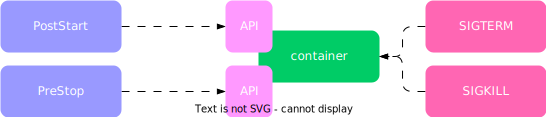
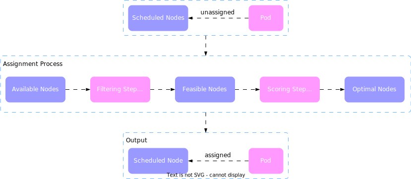
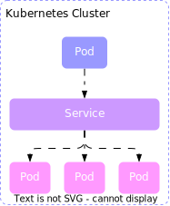
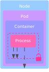
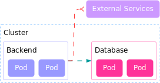

import TabItem from "@theme/TabItem";
import Tabs from "@theme/Tabs";

# Kubernetes Design Patterns

## Overview

<Tabs queryString="primary">
  <TabItem value="k8s-foundational" label="Foundational">
    **Foundational Patterns** are reusable design principles and best practices for building applications that run on Kubernetes.
    <Tabs queryString="secondary">
      <TabItem value="foundational-predictable" label="Predictable Demands" attributes={{className: "tabs__vertical"}}>
        

        **Predictable Demands** pattern emphasizes the importance of declaring application requirements, such as resource needs, to ensure efficient automation and adherence to
        containerized app principles. By specifying resource requirements and limits for each container, Kubernetes can allocate resources appropriately, enforce quality of service policies, and
        prevent resource contention. This approach benefits both applications and clusters, enhancing performance, reliability, scalability, efficiency, and simplifying resource management and
        troubleshooting.
      </TabItem>
      <TabItem value="foundational-declarative" label="Declarative Deployment">
        **Declarative deployment** involves specifying the desired state of the system, including aspects like the number of replicas, image versions, configurations, and resources (`Pods`,
        `ReplicaSets`, `Services`).
        Kubernetes then automatically manages the creation, scaling, updating, and deletion of underlying resources to match this desired state. This contrasts with imperative deployment, where
        specific commands or scripts are used to directly perform actions on the system, requiring more detailed knowledge and control but also introducing complexity and potential errors.

        **Rolling Deployment**

        

        **Rolling deployment** is a method of updating applications in Kubernetes by gradually replacing the old version with the new one. Unlike deploying the new version all at once, rolling
        deployment
        updates the application in incremental batches, replacing one pod at a time. This approach ensures that the application remains available and responsive throughout the update process.

        **Fixed Deployment**

        

        **Fixed deployment** pattern involves stopping all containers running the old version of an application and replacing them with new containers running the updated version. This results in
        downtime during the transition, making it suitable for applications that can tolerate downtime or have low availability requirements. However, it's not recommended for applications needing
        high availability or zero downtime.

        The RollingUpdate strategy updates the application without downtime by running both old and new versions simultaneously. This can cause issues if there are backward-incompatible changes.

        Conversely, the Recreate strategy stops all current containers before starting new ones, resulting in downtime but ensuring only one version of the container runs at a time, which can be
        beneficial for handling backward compatibility.

        **Blue/Green Release**

        

        **Blue-Green deployment** is a release strategy in Kubernetes that aims to reduce downtime and risk during software deployment in production environments. It involves creating two Deployments:
        one
        for the existing version (blue) and another for the new version (green). While the blue Deployment serves live requests, the green Deployment is prepared with the latest container version.
        Once the new version is verified as healthy, traffic is switched from blue to green by updating the Service selector.
        This approach ensures only one application version serves requests at a time, simplifying service consumption. However, it requires double the application capacity and may encounter challenges
        with long-running processes and database state drifts during transitions.

        **Canary Release**

        

        **Canary release** is a deployment strategy that minimizes the risk of introducing a new application version by initially replacing only a small number of old instances. This allows a subset
        of
        users to interact with the updated version. If the new version performs well, all old instances are replaced.

        In Kubernetes, this is achieved by creating a new Deployment with a small replica count for the canary instance. The Service then directs some users to the updated Pod instances. Once
        confident in the new `ReplicaSet`, it's scaled up and the old `ReplicaSet` is scaled down, effectively executing a controlled, user-tested incremental rollout.
      </TabItem>
      <TabItem value="foundational-healthProbe" label="Health Probe">
        **Health Probe**

        **Health Probe** pattern is a way for an application to communicate its health state to Kubernetes, which can then take appropriate actions based on the application's status. For example,
        Kubernetes can restart a container that is not responding, or remove a pod that is not ready from a service's load balancer. The Health Probe pattern enables a cloud-native application to be
        more resilient and scalable by allowing Kubernetes to manage its lifecycle and traffic routing.

        

        **Liveness Probes**

        **Liveness probe** is used to check if a container is alive or dead. A container is considered alive if it can respond to the liveness probe within a specified timeout. A container is
        considered
        dead if it fails to respond to the liveness probe for a certain number of times consecutively.
        Kubernetes uses liveness probes to determine when to restart a container. If a container fails its liveness probe, Kubernetes will kill it and create a new one. This can help recover from
        situations where a container becomes unresponsive or hangs due to a deadlock or a resource exhaustion.
        To configure a liveness probe, you need to specify how Kubernetes should perform the probe, how often it should perform it, how long it should wait for a response, and how many failures it
        should tolerate before restarting the container.

        

        **Readiness Probes**

        **Readiness probes** are used to signal when an application is ready to start accepting traffic. Kubernetes will periodically execute a readiness probe on a container, and if the probe
        succeeds, it will add the container to the service endpoint and allow it to receive traffic. If the probe fails, it will remove the container from the service endpoint and stop sending traffic
        to it.
        Readiness probes are useful for scenarios where an application needs some time to warm up before serving requests, or where an application may become temporarily overloaded or degraded and
        needs to shield itself from additional load. For example, a web server may need to load configuration files or establish database connections before it can handle HTTP requests, or a
        microservice may need to throttle requests when its latency increases due to high load or downstream failures.

        

        **Startup Probes**

        **Startup probes** are a type of probe that can be used to check if an application has successfully started within a pod. Startup probes are useful for applications that take a long time to
        initialize, or that perform some initialization tasks before being ready to accept requests. For example, an application may need to load a large amount of data into memory, or connect to a
        remote database, or perform some schema migrations. These tasks can take longer than the default timeout period of 10 seconds that Kubernetes uses to determine if a pod is healthy. If the pod
        fails to respond to the liveness probe within this period, Kubernetes will kill and restart the pod, assuming that it is stuck or dead. This can result in a never-ending loop of restarts,
        preventing the application from ever becoming ready.
        Startup probes can help avoid this situation by telling Kubernetes to wait for a longer period before performing the liveness checks. Startup probes work by sending an HTTP GET request, a TCP
        socket connection, or an arbitrary command execution to the pod, and expecting a success response. The startup probe can be configured with parameters such as `initialDelaySeconds`,
        `periodSeconds`, `timeoutSeconds`, `successThreshold`, and `failureThreshold`, which control how often and how long the probe should run. The startup probe will run until it succeeds, or until
        it
        reaches the failureThreshold. If the startup probe succeeds, Kubernetes will start performing the liveness and readiness probes as usual. If the startup probe fails, Kubernetes will kill and
        restart the pod as usual.

        
      </TabItem>
      <TabItem value="foundational-managedLifecycle" label="Managed Lifecycle">
        

        Cloud-native applications need to adjust their lifecycles in response to platform events. They provide APIs for health checks and respond to platform commands. The deployment unit of an
        application is a Pod, which consists of one or more containers.
        Kubernetes manages the container lifecycle. When it decides to shut down a container, it sends a `SIGTERM` signal, and if the application doesn't shut down, a `SIGKILL` signal is sent after a
        grace period.
        Kubernetes also provides features like `PostStart Hook` and `PreStop Hook`. The `PostStart Hook` runs after a container is created, while the PreStop Hook is sent before a container is
        terminated.
        Init containers run before any application containers in a Pod and are used for Pod-level initialization tasks. For more control over the startup process, methods like the **Commandlet
        pattern**
        and **Entrypoint Rewriting** can be used.
      </TabItem>
      <TabItem value="foundational-automatedPlacement" label="Automated Placement">
        **Automated Placement**

        

        The Kubernetes scheduler is responsible for assigning new Pods to suitable nodes, a process known as **Automated Placement**. This process takes into account container resource requests and
        scheduling policies.
        In a microservices-based system, there can be numerous isolated processes. Containers and Pods provide packaging and deployment abstractions, but they don't solve the placement problem on
        appropriate nodes. That's where the Kubernetes scheduler comes in. It retrieves each new Pod definition from the API Server and assigns it to a node considering runtime dependencies, resource
        requirements, and high availability policies.

        Key aspects of Kubernetes scheduling:

        - **Node Resource Availability**: The scheduler ensures that the total resources requested by a Pod's containers don't exceed the node's available capacity. If resources are not reserved for
        system
        daemons, Pods can be scheduled up to the node's full capacity, potentially leading to resource starvation issues
        - **Container Resource Requirements**: For efficient Pod placement, containers should declare their resource profiles and environment dependencies. This allows Pods to be optimally assigned to
        nodes
        and run without affecting each other or facing resource starvation during peak usage
        - **Scheduler Configurations**: The scheduler can be configured to meet your cluster needs using profiles that allow you to override the default implementations of the scheduling process
        - **Scheduling Process**: Pods are assigned to nodes based on placement policies. The scheduler applies filtering policies and removes nodes that do not qualify. The remaining nodes are scored
        and
        ordered by weight. The scheduler then informs the API server about the assignment decision

        While it's generally better to let the scheduler handle Pod-to-Node assignment, you may want to force a Pod's assignment to a specific node using a node selector. **Node Affinity** in
        Kubernetes
        allows for more flexible scheduling configurations by enabling rules to be either required or preferred.

        **Pod-to-Pod and Pod-to-Node and Dependencies**

        

        **Pod Affinity** is a scheduling method in Kubernetes that allows you to limit which nodes a Pod can run on based on label or field matching. It can express rules at various topology levels
        based
        on the Pods already running on a node.

        **Topology Spread Constraints** provide precise control for evenly distributing Pods across your cluster to achieve better cluster utilization or high availability of applications.

        **Impurities and Acceptances** are advanced features that control Pod scheduling. Impurities are node attributes that prevent Pods from being scheduled on the node unless the Pod has an
        acceptance
        for the impurity.

        The Kubernetes **descheduler** helps in defragmenting nodes and enhancing their utilization. It's run as a Job by a cluster administrator to tidy up and defragment a cluster by rescheduling
        the
        Pods.

        **Placement** is the process of assigning Pods to nodes. In complex scenarios, Pods may be scheduled to specific nodes based on constraints like data locality, Pod colocality, application high
        availability, and efficient cluster resource utilization.

        There are several methods to guide the scheduler towards your preferred deployment topology: `nodeName`, `nodeSelector`, `Node affinity`, and `Taints` and `tolerations`. Once you've expressed
        your
        preferred correlation between a Pod and nodes, identify dependencies between different Pods. Use Pod affinity techniques for colocation of tightly coupled applications, and use Pod
        anti-affinity techniques to distribute Pods across nodes and avoid single points of failure.

        To use topology spread constraints, admins must label nodes with topology data. Workload authors must then be aware of this topology when creating Pod configurations.

        The default scheduler places new Pods onto nodes and can be altered in the filtering and prioritization phases. If this isn't enough, a custom scheduler can be created. This allows for
        consideration of factors outside of the Kubernetes cluster when assigning Pods to nodes.
      </TabItem>
    </Tabs>

  </TabItem>
  <TabItem value="k8s-behavioral" label="Behavioral">
    **Behavioral Patterns** describe how to manage the life-cycle of Pods, which are the basic units of deployment in Kubernetes. Depending on the type of workload, a Pod might run until completion as
    a batch job, be scheduled to run periodically as a cron job, run as a daemon service on every node, or run as a singleton service on a specific node.

    <Tabs queryString="secondary">
      <TabItem value="behavioral-batch" label="Batch Job" attributes={{className: "tabs__vertical"}}>
        

        **Kubernetes Resources and Controllers**

        - **Batch Job Pattern**: Manages isolated atomic units of work using the Job resource. It runs short-lived Pods reliably until completion on a distributed environment
        - **Bare Pod**: A manually created Pod to run containers. If the node running the Pod fails, the Pod is not restarted. This method is discouraged except for development or testing purposes
        - **ReplicaSet**: A controller used for creating and managing the lifecycle of Pods expected to run continuously (e.g., to run a web server container). It maintains a stable set of replica
        Pods
        running at any given time
        - **DaemonSet**: A controller that runs a single Pod on every node and is used for managing platform capabilities such as monitoring, log aggregation, storage containers, and others
        - **Job Resource**: For tasks that need to perform a predefined finite unit of work reliably and then shut down the container, Kubernetes provides the Job resource. A Kubernetes Job creates
        one or
        more Pods and ensures they run successfully

        **Types of Jobs**

        Jobs can be categorized based on the parameters `.spec.completions` and `.spec.parallelism`:

        - **Single Pod Jobs**: Starts only one Pod and is completed as soon as the single Pod terminates successfully
        - **Fixed completion count Jobs**: The Job is considered completed after the `.spec.completions` number of Pods has completed successfully
        - **Work queue Jobs**: A work queue Job is considered completed when at least one Pod has terminated successfully and all other Pods have terminated too
        - **Indexed Jobs**: Every Pod of the Job gets an associated index ranging from 0 to `.spec.completions - 1`. The assigned index is available to the containers through the Pod annotation
        `batch.kubernetes.io/job-completion-index` or directly via the environment variable `JOB_COMPLETION_INDEX`

        **Limitations and Solutions**

        There are limitations with Indexed Jobs. For instance, the Job's application code cannot discover the total number of workers (i.e., the value specified in `.spec.completions`) for an Indexed
        Job.

        To overcome this:

        - Hardcode the total number of Pods working on a Job into the application code
        - Access the value of `.spec.completions` in your application code by copying it to an environment variable or passing it as an argument to the container command in the Job's template
        specification

        If you have an unlimited stream of work items to process, other controllers like `ReplicaSet` are recommended for managing the Pods processing these work items.
      </TabItem>
      <TabItem value="behavioral-periodic" label="Periodic Job">
        Periodic jobs, often used for system maintenance or administrative tasks, traditionally rely on specialized scheduling software or cron.

        However, these methods can be costly and difficult to maintain. Developers usually create solutions that handle both scheduling and business logic, but this can lead to high resource
        consumption and requires the entire application to be highly available for the scheduler to be the same.

        Kubernetes CronJob offers a solution by scheduling Job resources using the cron format, allowing developers to focus on the work rather than scheduling. It's similar to a Unix crontab line and
        manages a Job's temporal aspects. Combined with other Kubernetes features, a `CronJob` becomes a powerful job-scheduling system, enabling developers to focus on implementing a containerized
        application responsible for the business logic, with scheduling handled by the platform. However, when implementing a `CronJob` container, it's important to consider all corner and failure
        cases
        of duplicate runs, no runs, parallel runs, or cancellations.
      </TabItem>
      <TabItem value="behavioral-daemon" label="Daemon Service">
        The Daemon Service pattern in Kubernetes is used to run prioritized, infrastructure-focused Pods on specific nodes. This is primarily used by administrators to run node-specific Pods to
        enhance the platform's capabilities. In software systems, a daemon is a long-running, self-recovering program that runs as a background process. In Kubernetes, a similar concept exists in the
        form of a `DaemonSet`, which represents Pods that run on cluster nodes and provide background capabilities for the rest of the cluster.

        A `DaemonSet` is similar to `ReplicaSet` and `ReplicationController` in that it ensures a certain number of Pods are always running. However, unlike these two, a `DaemonSet` is not driven by
        consumer
        load in deciding how many Pod instances to run and where to run them. Its main purpose is to keep running a single Pod on every node or specific nodes.

        Key differences in how `DaemonSet` and `ReplicaSet` are managed include:

        - By default, a `DaemonSet` places one Pod instance on every node. This can be controlled and limited to a subset of nodes using the `nodeSelector` or affinity fields
        - A Pod created by a `DaemonSet` already has `nodeName` specified, so it doesn't require the existence of the Kubernetes scheduler to run containers
        - Pods created by a `DaemonSet` can run before the scheduler has started
        - The unschedulable field of a node is not respected by the `DaemonSet` controller
        - Pods created by a `DaemonSet` can have a `RestartPolicy` only set to `Always` or left unspecified
        - Pods managed by a `DaemonSet` are supposed to run only on targeted nodes and are treated with higher priority by many controllers

        `DaemonSets` in Kubernetes are used to run system-critical Pods on certain nodes in the cluster. From Kubernetes v1.17 onwards, `DaemonSet` uses the default scheduler for scheduling, improving
        the
        overall experience and bringing features like taints, tolerations, Pod priority, and preemption to `DaemonSets`.

        `DaemonSet` Pods can be accessed in several ways:

        - **Service**: Create a Service with the same Pod selector as a `DaemonSet` to reach a daemon Pod load-balanced to a random node
        - **DNS**: Create a headless Service with the same Pod selector as a `DaemonSet` to retrieve multiple A records from DNS containing all Pod IPs and ports
        - **Node IP with hostPort**: Pods in the `DaemonSet` can specify a `hostPort` and become reachable via the node IP addresses and the specified port
        - **External Push**: The application in the `DaemonSets` Pods can push data to a well-known location or service that's external to the Pod
        - **Static Pods**: managed by the Kubelet only and run on one node only. However, `DaemonSets` are better integrated with the rest of the platform and are recommended over static Pods
      </TabItem>
      <TabItem value="behavioral-singleton" label="Singleton Service">
        The Singleton Service pattern in Kubernetes is a method that ensures only one instance of an application is active at any given time, while still maintaining high availability. This pattern is
        particularly useful in scenarios where tasks need to be executed by a single service instance to avoid duplication or to maintain order.

        There are some ways to implement this pattern: out-of-application and in-application locking. The former involves running multiple replicas of the same Pod to create an active-active topology,
        where all instances of a service are active. However, for the Singleton Service pattern, an active-passive topology is needed, where only one instance is active and all other instances are
        passive.

        Kubernetes `ReplicaSets` are designed for Pod availability, not for ensuring At-Most-One semantics for Pods. This can lead to multiple copies of a Pod running concurrently in certain failure
        scenarios. If strong singleton guarantees are needed, consider using `StatefulSets` or in-application locking options that provide more control over the leader election process.

        In some cases, only a part of a containerized application needs to be a singleton. For instance, an application might have an HTTP endpoint that can be scaled to multiple instances, but also a
        polling component that must be a singleton. In such situations, either split the singleton component into its own deployment unit or use in-application locking to lock only the component that
        needs to be a singleton.

        **Out-of-Application Locking**

        

        In Kubernetes, singleton instances, which are typically unaware of their constraint, can be managed by an external process. This is achieved by starting a single Pod, backed by a controller
        such as a `ReplicaSet`, which ensures high availability. The `ReplicaSet` controller ensures that at least one instance is always running, although occasionally there can be more instances.
        This
        mechanism favors availability over consistency, making it suitable for highly available and scalable distributed systems.

        However, singletons typically favor consistency over availability. For strict singleton requirements, `StatefulSets` might be a better choice as they provide stronger singleton guarantees but
        come with increased complexity. Singleton applications running in Pods on Kubernetes typically open outgoing connections to other systems. Singleton Pods in Kubernetes can accept incoming
        connections through the Service resource.

        Regular Services create a virtual IP and perform load balancing among all matching Pod instances. Singleton Pods managed through a StatefulSet have only one Pod and a stable network identity.
        It's recommended to create a headless Service (by setting both type: `ClusterIP` and `clusterIP: None`) for singleton Pods. Headless Services don't have a virtual IP address, kube-proxy
        doesn't
        handle these Services, and no proxying is performed.

        Headless Services with selectors create endpoint records in the API Server and generate DNS A records for the matching Pod(s). DNS lookup for the Service returns the IP address(es) of the
        backing Pod(s), enabling direct access to the singleton Pod via the Service DNS record.

        For nonstrict singletons with at least one instance requirement, defining a `ReplicaSet` with one replica would suffice. For a strict singleton with an At-Most-One requirement and better
        performant service discovery, a `StatefulSet` and a headless Service would be preferred. Using `StatefulSet` will favor consistency and ensure there is an At-Most-One instance and occasionally
        none in some corner cases.

        **In-Application Locking**

        

        In distributed environments, service instance control is achieved through a distributed lock. When a service instance is activated, it acquires a lock and becomes active. Other instances that
        fail to acquire the lock wait and keep trying to get the lock in case the active service releases it. This mechanism is used in many distributed frameworks for high availability and
        resiliency.

        For example, **Apache ActiveMQ**, a message broker, can run in a highly available active-passive topology where the data source provides the shared lock. The first broker instance that starts
        up
        acquires the lock and becomes active, while any other subsequently started instances become passive and wait for the lock to be released.

        This strategy is similar to a Singleton in object-oriented programming: an object instance stored in a static class variable that doesn't allow instantiation of multiple instances for the same
        process. In distributed systems, this means the application itself has to be written in a way that doesn't allow more than one active instance at a time, regardless of the number of Pod
        instances that are started.

        To achieve this in a distributed environment, we need a distributed lock implementation such as **Apache ZooKeeper**, **HashiCorp's Consul**, **Redis**, or **etcd**. For example, ZooKeeper
        uses ephemeral
        nodes which exist as long as there is a client session and are deleted as soon as the session ends.

        In Kubernetes, instead of managing a ZooKeeper cluster only for the locking feature, it would be better to use etcd capabilities exposed through the Kubernetes API and running on the main
        nodes. etcd is a distributed key-value store that uses the Raft protocol to maintain its replicated state and provides necessary building blocks for implementing leader election. Kubernetes
        offers the Lease object for node heartbeats and component-level leader election.

        Kubernetes Leases are used in high-availability cluster deployments to ensure that only one control plane component, such as `kube-controller-manager` and `kube-scheduler`, is active at a
        time,
        with others on standby. Apache Camel's Kubernetes connector provides leader election and singleton capabilities, using Kubernetes APIs to leverage `ConfigMaps` as a distributed lock. This
        ensures that only one Camel route instance is active at a time.

        **Pod Disruption Budget**

        The `PodDisruptionBudget` (PDB) is a feature in Kubernetes that limits the number of Pods that can be down at the same time during maintenance. It ensures that a specific number or percentage
        of
        Pods will not be voluntarily evicted from a node at any given time. This is especially useful for applications that require a minimum number of running replicas at all times, or for critical
        applications that should maintain a certain percentage of total instances.

        For workloads that only have one instance (singleton workloads), setting `maxUnavailable` to 0 or `minAvailable` to 100% will prevent any voluntary eviction, effectively making the Pod
        unevictable. This is beneficial in scenarios where the cluster operator needs to coordinate downtime with the singleton workload owner before evicting a non-highly available Pod.
      </TabItem>
      <TabItem value="behavioral-stateless" label="Stateless Service">
        

        The Stateless Service pattern is a technique for building applications composed of identical, ephemeral replicas, making them suitable for dynamic cloud environments. These applications can be
        quickly scaled and made highly available. In a microservices architecture, each service addresses a single concern, owns its data, and has a well-defined deployment boundary. Stateless
        services do not maintain any internal state across service interactions but store information in external storage such as a database or message queue.

        Stateless services consist of identical, replaceable instances that offload state to external permanent storage systems and use load-balancers for distributing incoming requests among
        themselves. In Kubernetes, the concept of Deployment is used to control how an application should be updated to the next version.

        A complex distributed system comprises various services, including stateful services, short-lived jobs, and highly scalable stateless services. Stateless services are ideal for handling
        short-lived requests as they are composed of identical, swappable, ephemeral, and replaceable instances that can scale rapidly.

        Kubernetes provides several primitives to manage such applications. However, Kubernetes doesn't enforce any direct relationship between these building blocks. It's the user's responsibility to
        combine them to match the application nature. This includes understanding how liveness checks, ReplicaSet, readiness probes, Service definitions, PVCs, and accessMode work together.

        **Instances**

        A `ReplicaSet` in Kubernetes is a tool that ensures a specified number of identical Pod replicas are running at all times. It can create new Pods as needed to maintain the desired count, and
        can
        manage bare Pods (those without an owner reference) that match its label selector. However, this can lead to a `ReplicaSet` owning a nonidentical set of Pods and terminating existing bare Pods
        that exceed the declared replica count. To avoid this, it's advised to ensure bare Pods do not have labels matching `ReplicaSet` selectors.

        Whether a `ReplicaSet` is created directly or through a Deployment, the end goal is the same: to create and maintain the desired number of identical Pod replicas. Deployments offer additional
        benefits such as controlling how replicas are upgraded and rolled back. The replicas are then scheduled to available nodes as per certain policies.

        The `ReplicaSet's` role is to restart containers if needed and scale out or in when the number of replicas changes. This allows Deployment and `ReplicaSet` to automate the lifecycle management
        of
        stateless applications.

        **Networking**

        Stateless applications in Kubernetes can handle new requests by any Pod, and depending on the application's connection to other systems, a Kubernetes Service may be necessary. These services
        often use synchronous request/response-driven protocols like HTTP and gRPC. However, since Pod IP addresses change with every restart, it's more efficient to use a permanent IP address
        provided by a Kubernetes Service.

        A Kubernetes Service provides a fixed IP address that remains constant throughout its lifetime. This ensures that client requests are evenly distributed across instances and are directed to
        healthy Pods that are ready to accept requests.

        **Storage**

        In Kubernetes, Pods can use file storage through volumes, which come in various types and can store state. The text specifically discusses the `persistentVolumeClaim` volume type, which
        utilizes
        manually or dynamically provisioned persistent storage.

        A **PersistentVolume** (PV) is a piece of storage in a Kubernetes cluster that exists independently of any Pod that uses it. A Pod uses a **PersistentVolumeClaim** (PVC) to request and bind to
        the
        PV,
        which points to the actual durable storage. This indirect connection allows for separation of concerns and decoupling of Pod lifecycle from PV.

        In a `ReplicaSet`, all Pods are identical; they share the same PVC and refer to the same PV. This is different from `StatefulSets` where PVCs are created dynamically for each stateful Pod
        replica.
        This is one of the key differences between how stateless and stateful workloads are managed in Kubernetes.
      </TabItem>
      <TabItem value="behavioral-stateful" label="Stateful Service">
        

        Stateful applications like **Apache ZooKeeper**, **MongoDB**, **Redis**, or **MySQL** are unique and long-lived, often serving as the backbone for highly scalable stateless services.

        However, they pose challenges when implemented as a distributed service with multiple instances. Kubernetes' `StatefulSets` offer a solution for these applications by addressing needs such as
        persistent storage, networking, identity, and ordinality. This makes stateful applications first-class citizens in the cloud native world. Despite this, many legacy stateful applications are
        not designed for cloud native platforms.

        To tackle this issue, Kubernetes allows users to implement custom controllers and model application resources through custom resource definitions and behavior through operators.

        **Storage**

        In Kubernetes, stateful applications often require dedicated persistent storage, which is managed through **Persistent Volumes** (PVs) and **Persistent Volume Claims** (PVCs). `StatefulSet`, a
        key
        component in Kubernetes, creates PVCs dynamically for each Pod during both initial creation and scaling up. This allows each Pod to have its own dedicated PVC, unlike `ReplicaSet` which refers
        to predefined PVCs.

        However, `StatefulSets` do not manage PVs. The storage for Pods must be pre-provisioned by an admin or dynamically provisioned by a PV provisioner based on the requested storage class.

        While scaling up a `StatefulSet` creates new Pods and associated PVCs, scaling down only deletes the Pods and not the PVCs or PVs to prevent data loss. If the data has been replicated or
        drained
        to other instances, you can manually delete the PVC, which then allows for PV recycling.

        `ReplicaSet` can lead to shared storage among all Pod instances, creating a single point of failure and potential data corruption during scaling. A workaround is to have a separate
        `ReplicaSet`
        for each instance, but this requires manual labor for scaling up.

        **Networking**

        In Kubernetes, a `StatefulSet` is used to create Pods with a stable identity, which is determined by the `StatefulSet's` name and an ordinal index. This is particularly useful for stateful
        applications that often need scalable persistent storage and networking. To cater to this, a headless Service (where clusterIP is set to None) is defined.

        Unlike stateless Pods that are created through a `ReplicaSet` and are identical, stateful Pods are unique and may need to be accessed individually. Stateful applications require a stable
        network
        identity because they store configuration details such as hostname and connection details of their peers.

        Creating a Service per `ReplicaSet` with `replicas=1` could be a solution, but it requires manual work and doesn't provide a stable hostname. Therefore, the use of `StatefulSets` simplifies
        the
        management of stateful applications in Kubernetes.

        **Identity**

        `StatefulSet` is a fundamental aspect that provides predictable Pod names and identities based on its name. This identity is crucial for naming PVCs, reaching specific Pods via headless
        Services, and more.

        The identity of each Pod can be predicted before it's created, which can be useful for the application. Stateful applications require each instance to have its own long-lasting storage and
        network identity.

        In contrast, a Pod created with `ReplicaSet` would have a random name and wouldn't maintain that identity across a restart.

        **Ordinality**

        In a distributed stateful application, each instance is unique and has a fixed position in the collection of instances, which is known as its ordinality.

        This ordinality affects the sequence in which instances are scaled up or down. It's also used for data distribution, access, and determining in-cluster behavior.

        The concept of ordinality is particularly significant in `StatefulSet` during scaling operations.

        Other Requirements
        Stateful applications have specific needs such as stable storage, networking, identity, and ordinality. They may require a certain number of instances to be always available, and some may be
        sensitive to ordinality or parallel deployments. Some can tolerate duplicate instances, while others cannot.

        To cater to these diverse requirements, Kubernetes allows the creation of **CustomResourceDefinitions (CRDs)** and **Operators**.

        Kubernetes provides the `StatefulSet` primitive for managing stateful applications. This is contrasted with the `ReplicaSet` primitive used for running stateless workloads. `StatefulSet` is
        likened
        to managing pets (unique servers requiring individual care), while `ReplicaSet` is compared to managing cattle (identical, replaceable servers). Essentially, `StatefulSet` is designed for
        managing
        unique Pods, whereas `ReplicaSet` is for managing identical, replaceable Pods.
      </TabItem>
      <TabItem value="behavioral-discovery" label="Service Discovery">
        

        The Service Discovery pattern in Kubernetes offers a stable endpoint for service consumers to access service providers, regardless of whether they are within or outside the cluster.

        Applications deployed on Kubernetes often interact with other services within the cluster or external systems. These interactions can be initiated internally or externally. Internally
        initiated interactions are typically performed through a polling consumer, such as an application running within a Pod connecting to a file server, message broker, or a database and start
        exchanging data.

        However, the more common use case for Kubernetes workloads is when we have long-running services expecting external stimulus, most commonly in the form of incoming HTTP connections from other
        Pods within the cluster or external systems. In these cases, service consumers need a mechanism for discovering Pods that are dynamically placed by the scheduler and sometimes elastically
        scaled up and down.

        Kubernetes implements the Service Discovery pattern through different mechanisms to track, register, and discover endpoints of dynamic Kubernetes Pods. Service discovery from outside the
        cluster builds on the Service abstraction and focuses on exposing the Services externally. While `NodePort` provides basic exposure of Services, a highly available setup requires integration
        with the platform infrastructure provider.

        **Internal Service Discovery**

        

        In Kubernetes, each Pod in a Deployment is assigned a cluster-internal IP address. However, knowing these IP addresses in advance can be challenging for other services within different Pods
        that want to consume the web application endpoints.

        This issue is addressed by the Kubernetes Service resource, which provides a stable entry point for a collection of Pods offering the same functionality.

        A Service can be created through `kubectl expose`, which assigns it a `clusterIP` that is only accessible from within the Kubernetes cluster. This IP remains unchanged as long as the Service
        definition exists.

        Other applications within the cluster can discover this dynamically allocated clusterIP in a few ways:

        - **Discovery through environment variables**: When Kubernetes starts a Pod, its environment variables get populated with the details of all Services that exist at that moment. The application
        running that Pod would know the name of the Service it needs to consume and can be coded to read these environment variables
        - **Discovery through DNS lookup**: Kubernetes runs a DNS server that all the Pods are automatically configured to use. When a new Service is created, it automatically gets a new DNS entry
        that all Pods can start using. The Service can be reached by a **fully qualified domain name (FQDN)** such as `hostname.default.svc.cluster.local`

        The DNS Discovery mechanism allows all Pods to look up all Services as soon as a Service is defined, overcoming the drawbacks of the environment-variable-based mechanism. However, environment
        variables may still be needed to look up nonstandard or unknown port numbers.

        **Manual Service Discovery**

        

        In Kubernetes, a Service with a selector keeps track of Pods that are ready to serve, and this list is maintained in the endpoint resources. You can view all endpoints created for a Service
        using the `kubectl get endpoints hostnames` command.

        If you want to redirect connections to external IP addresses and ports, you can do so by not defining a selector for a Service and manually creating endpoint resources. This type of Service is
        only accessible within the cluster and can be used through environment variables or DNS lookup. The list of endpoints for this Service is manually maintained and typically points to IP
        addresses outside the cluster.

        The Service allows you to add or remove selectors and point to either external or internal providers without having to delete the resource definition, which would result in a change of the
        Service IP address. This means that consumers of the service can continue using the same Service IP address while the actual service provider implementation is being migrated from on-premises
        to Kubernetes, without any impact on the client.

        **Service Discovery from Outside the Cluster**

        

        In Kubernetes, there are different methods to expose a Service outside of the cluster:

        - **NodePort Service**: This method reserves a port on all nodes and forwards incoming connections to the Service. This makes the Service accessible both internally (through the virtual IP
        address)
        and externally (through a dedicated port on every node)
        - **LoadBalancer Service**: This method builds on top of a regular Service with type ClusterIP by also opening a port on every node. However, a load balancer is still needed for client
        applications
        to pick a healthy node
        - **Service of type LoadBalancer**: This exposes the service externally using a cloud provider's load balancer. When such a Service is created, Kubernetes adds IP addresses to the `.spec` and
        `.status`
        fields, allowing an external client application to connect to the load balancer, which then selects a node and locates the Pod
        However, it's important to note that load-balancer provisioning and service discovery can vary among cloud providers. Some providers allow you to define the load-balancer address while others
        do not. Similarly, some offer mechanisms for preserving the source address, while others replace it with the load-balancer address. Therefore, it's crucial to check the specific implementation
        provided by your chosen cloud provider.

        **Application Layer Service Discovery**

        

        **Kubernetes Ingress** is a resource that serves as a smart router and entry point to the cluster, providing HTTP-based access to Services. It enables access through externally reachable URLs,
        load balancing, TLS termination, and name-based virtual hosting. Its strength lies in its ability to use a single external load balancer and IP to service multiple Services, thereby reducing
        infrastructure costs.

        Despite being the most complex service discovery mechanism on Kubernetes, it is highly useful for exposing multiple services under the same IP address, particularly when all services use the
        same L7 (typically HTTP) protocol.
      </TabItem>
      <TabItem value="behavioral-self-awareness" label="Self Awareness">
        

        The Self Awareness pattern in Kubernetes is beneficial for applications that require runtime information such as the Pod name, Pod IP address, and the hostname. This information, along with
        other static or dynamic data defined at the Pod level, can be obtained through the downward API in Kubernetes.

        The downward API allows metadata about the Pod to be passed to the containers and the cluster via environment variables and files. This metadata is injected into your Pod and made available
        locally, eliminating the need for the application to interact with the Kubernetes API, thus keeping it Kubernetes-agnostic.

        However, the downward API has a limitation in that it offers a limited number of keys that can be referenced. If an application requires more data, particularly about other resources or
        cluster-related metadata, it must query the API Server. This method is commonly used by applications to discover other Pods in the same namespace with certain labels or annotations. The
        application can then form a cluster with the discovered Pods and synchronize state.

        Monitoring applications also use this technique to discover Pods of interest and start instrumenting them. Numerous client libraries are available in different languages to interact with the
        Kubernetes API Server to obtain more self-referring information that goes beyond what the downward API provides.
      </TabItem>
    </Tabs>

  </TabItem>
  <TabItem value="k8s-structural" label="Structural">
    Structural patterns are related to organizing containers within a Kubernetes pod. Having good cloud-native containers is the first step, but not enough. Reusing containers and combining them into
    Pods to achieve the desired outcome is the next step.

    The primary goal of the structural pattern is to facilitate comprehension of how to arrange containers within a pod to address various scenarios.

    At the heart of this pattern is the principle of single responsibility, which stipulates that each container should be dedicated to a single task. If a container needs to perform more than one
    task, a separate container should be deployed for each additional task.

    This approach enhances the modularity and scalability of your application. By ensuring that each container performs only one task, you can easily update or scale individual components without
    affecting others. This also improves fault isolation, as issues in one container don't directly impact others. Moreover, it simplifies the process of building, testing, and deploying each
    component of your application.

    This pattern is particularly useful in microservices architectures where each service can be encapsulated in its own container.

    <Tabs queryString="secondary">
      <TabItem value="structural-init-container" label="Init Container" attributes={{className: "tabs__vertical"}}>
        

        The Init Container pattern in Kubernetes is a way to separate initialization tasks from the main application containers, similar to constructors in programming languages.

        Some key points:

        - **Init Containers**: Part of the Pod definition and run before the application containers. They handle prerequisites such as setting up permissions, database schemas, or installing seed
        data. They
        run in sequence and must all terminate successfully before the application containers start. If an init container fails, the whole Pod is restarted
        - **Application Containers**: Run in parallel after all init containers have completed. The startup order is arbitrary
        - **Separation of Concerns**: Init containers allow for a clear separation of initialization activities from the main application duties. This enables you to keep containers single-purposed,
        with
        application containers focusing on application logic and init containers focusing on configuration and initialization tasks
        - **Resource Handling**: Init containers affect how Pod resource requirements are calculated for scheduling, autoscaling, and quota management. The effective Pod-level request and limit values
        are
        the highest of either the highest init container request/limit value or the sum of all application container values for request/limit
        - **Lifecycle Differences**: Init containers have slightly different lifecycle, health-checking, and resource-handling semantics compared to application containers. For example, there is no
        `livenessProbe`, `readinessProbe`, or `startupProbe` for init containers
        - **Usage**: Init containers are used by developers deploying on Kubernetes, while admission webhooks help administrators and various frameworks control and alter the container initialization
        process

        This pattern ensures successful completion of each initialization step before moving to the next, allowing for the creation of containers focused on either initialization or application tasks,
        which can be reused in different contexts within Pods with predictable guarantees.
      </TabItem>
      <TabItem value="structural-sidecar" label="Sidecar">
        

        Containers are a popular technology for unified application development and deployment, but there's a need to extend their functionality and enable collaboration among them.

        The Sidecar pattern uses the Pod primitive to combine multiple containers into a single unit. Containers in a Pod share volumes and communicate over the local network or host IPC.

        In the context of containerization, an analogy is drawn with object-oriented programming (OOP). Container images are likened to classes, and containers to objects in OOP.

        Extending a container is compared to inheritance in OOP, signifying an "**is-a**" relationship and resulting in tighter coupling between containers. Having multiple containers collaborate in a
        Pod
        is akin to composition in OOP, representing a "**has-a**" relationship. This approach is more flexible as it doesn't couple containers at build time.

        Sidecars can be transparent or explicit. An example of a transparent sidecar is Envoy proxy, which provides features like TLS, load balancing, automatic retries by intercepting all traffic to
        the main container. Dapr is an example of an explicit proxy that offers features like reliable service invocation, publish-subscribe, bindings to external systems over HTTP and gRPC APIs.

        The choice between using a separate process (sidecar) or merging it into the main container depends on factors including resource consumption and the specific requirements of your application.
      </TabItem>
      <TabItem value="structural-adapter" label="Adapter">
        

        The Adapter pattern is a design strategy in containerized systems that provides a unified interface for different components. It's a specialization of the Sidecar pattern, aimed at adapting
        access to the application. This pattern is particularly useful in distributed systems with components using different technologies, as it hides system complexity and offers unified access.

        A practical example of the Adapter pattern is in monitoring a distributed system with multiple services. Services written in different languages might not expose metrics in the same format
        expected by the monitoring tool. The Adapter pattern addresses this by exporting metrics from various application containers into one standard format and protocol. This is done through an
        adapter container that translates locally stored metrics information into an external format that the monitoring server understands.

        In essence, the Adapter acts as a reverse proxy to a heterogeneous system, hiding its complexity behind a unified interface. Using a distinct name separate from the generic Sidecar pattern
        allows for clearer communication of this pattern's purpose.
      </TabItem>
      <TabItem value="structural-ambassador" label="Ambassador">
        

        The Ambassador pattern is a design pattern used in containerized services to manage the complexities of accessing external services. It acts as a proxy, decoupling the main container from
        directly accessing these services.

        This pattern is particularly useful for legacy applications that are challenging to modify with modern networking concepts like monitoring, logging, routing, and resiliency patterns.

        The Ambassador pattern abstracts away complexities such as dynamic addresses, load balancing needs, unreliable protocols, and complex data formats.

        An ambassador container can manage tasks like connecting to different shards of a cache in a production environment, performing client-side service discovery, or handling non-reliable
        protocols with circuit-breaker logic.

        The Ambassador pattern is a type of Sidecar pattern but acts as a smart proxy to the outside world instead of enhancing the main application with additional capabilities.

        The benefits of the Ambassador pattern are similar to the Sidecar pattern as both keep containers single-purpose and reusable. This approach also enables the creation of specialized and
        reusable ambassador containers that can be combined with other application containers.
      </TabItem>
    </Tabs>

  </TabItem>
  <TabItem value="k8s-configuration" label="Configuration">
    Kubernetes configuration is based on a declarative model, which means that you define what you want your deployment to look like, rather than how to achieve it. This is in contrast to imperative
    models, where you specify a series of steps to follow. The declarative model allows for more flexibility and easier management of complex deployments.

    One of the key aspects of designing cloud native applications is how to manage the configuration of the application components. Configuration can include anything from environment variables,
    command-line arguments, configuration files, secrets, etc. Configuration can affect the behavior, performance, security, and scalability of the application. Therefore, it is important to follow
    some best practices and patterns when dealing with configuration in Kubernetes.

    It's important to separate application configuration from the source code. Storing configurations in the source code can lead to issues as it ties the life cycle of the code and configuration
    together. This is not ideal for a continuous delivery approach, where the application should remain unchanged as it moves through different stages of the deployment pipeline.

    To achieve this separation, it's a good practice to use external configuration data, which can be customized for each environment. This allows for flexibility in adapting configurations without
    needing to modify the application or recreate its container image.

    <Tabs queryString="secondary">
      <TabItem value="configuration-envvar" label="EnvVar Configuration" attributes={{className: "tabs__vertical"}}>
        Configuring applications using environment variables is a simple and universally applicable method, suitable for all environments and platforms.

        Nontrivial applications need configuration for accessing data sources, external services, or production-level tuning. These configurations should be externalized rather than hardcoded within
        the application.

        The **12-factor app manifesto** recommends using environment variables for storing application configurations. A common pattern is to define hardcoded default values during build time, which
        can
        be overwritten at runtime.

        Default values can simplify configuration but can also be problematic for evolving applications. If a default value needs to be changed, it's often better to remove the default and throw an
        error if the user does not provide a configuration value. Avoid default values if you cannot be 90% sure that a reasonable default will last for a long time. Passwords or database connection
        parameters are good candidates for not providing default values.

        Environment variables are widely used in container configurations due to their simplicity and universal support. However, they have limitations such as lack of security and difficulty in
        management when the number of configuration values is large.

        For more complex needs, patterns like **Configuration Resource**, **Immutable Configuration**, and **Configuration Template** are recommended. One downside of environment variables is that
        they can only
        be set before an application starts and cannot be changed later. This promotes immutability, meaning a new application container is started with a modified configuration whenever changes are
        needed.
      </TabItem>
      <TabItem value="configuration-configuration-resource" label="Configuration Resource">
        Kubernetes offers 2 resources, **ConfigMap** and **Secret**, for managing regular and confidential data respectively. These resources allow the configuration lifecycle to be separated from the
        application lifecycle. They store and manage key-value pairs, which can be used as environment variables or files mapped to a volume in a Pod.

        However, updates to ConfigMap entries used as environment variables are not reflected in running processes. Also, when using multiple ConfigMaps with duplicate keys, the last entry in envFrom
        takes precedence, and any same-named environment variable set directly with env has higher priority.

        Kubernetes has introduced an immutable field for ConfigMaps and Secrets to prevent updates once they're created, enhancing cluster performance. To modify an immutable Secret, it must be
        deleted and recreated, and any running Pod referencing this secret would need to be restarted.

        Despite their benefits, there are limitations. Secrets have a 1 MB size limit and are not suitable for storing large non-configuration application data. Also, Kubernetes clusters often impose
        a quota on the number of ConfigMaps per namespace or project.

        Secrets hold Base64-encoded data, which is not encrypted and is considered plain text from a security perspective. The security of Secrets comes from their distribution only to nodes running
        Pods that require them, their storage in memory on nodes, and their potential encrypted storage in etcd.

        However, there are still ways to access Secrets as a root user or by creating a Pod and mounting a Secret. Role-based access control (RBAC) can limit access to Secrets, but users who can
        create Pods in a namespace can still escalate their privileges within that namespace. Thus, additional encryption of sensitive information is often done at the application level.
      </TabItem>
      <TabItem value="configuration-immutable" label="Immutable Configuration">
        The Immutable Configuration pattern is a strategy to ensure that your application's configuration data is always in a known and consistent state.

        It addresses the challenge of managing numerous environment variables and the size limitation of ConfigMaps in Kubernetes.

        Solutions:

        - **Use ConfigMaps or Secrets marked as immutable**: This is the simplest and preferred option if your configuration fits into a ConfigMap and is easy to maintain. However, this becomes
        challenging
        when dealing with large or complex configuration data, such as nested XML or YAML within YAML, or large data sets like pretrained machine learning models due to the backend size restriction of
        1 MB
        - **Use a passive data image for environment-specific configuration data**: All configuration data is put into a single data image that can be distributed as a regular container image. During
        runtime, the application and the data image are linked together so that the application can extract the configuration from the data image. This approach allows for crafting different
        configuration data images for various environments, which can be versioned like any other container image

        Advantages:

        - Environment-specific configuration is sealed within a container, allowing it to be versioned and distributed via a container registry
        - The configuration is immutable, requiring a version update and a new container image for any change
        - Data images can hold large configuration data, making them useful when the data is too complex for environment variables or ConfigMaps

        Drawbacks:

        - The process is complex as it requires building and distributing extra container images
        - It doesn't address security concerns around sensitive configuration data
        - As of 2023, only experimental CSI support is available, and there's no image volume support for Kubernetes workloads

        Extra init container processing is required in the Kubernetes case, necessitating different Deployment objects for different environments.
        An alternative approach for dealing with large configuration files that differ slightly from environment to environment is the **Configuration Template** pattern.

        **Docker Volumes**

        

        Docker volumes are a feature in Docker that allows a container to expose a volume with data from within the container. This is achieved using a `VOLUME` directive in a `Dockerfile`, which
        specifies a directory that can be shared. When the container starts up, the contents of this directory are copied to the shared directory.

        **Kubernetes Init Containers**

        

        Kubernetes, unlike Docker, does not support container volumes. Instead, it allows containers to share external volumes but not directories within the containers. To overcome this, Kubernetes'
        Init Containers pattern can be used to initialize an empty shared volume during startup by copying configuration data to a shared Pod volume using a base image like busybox.

        This process involves creating a configuration image with a `Dockerfile`. The Pod template specification in the Deployment contains a single volume and two containers. An empty directory, of
        type `emptyDir`, is created on the node hosting the Pod as the volume. During startup, an init container is called to copy its content to the specified directory, which is mounted from the
        volume. The application container then mounts the volume to access the copied configuration.

        To switch configurations between development and production environments, you simply need to change the image of the init container either by updating the `YAML` definition or using `kubectl`.
        However, editing the resource descriptor for each environment is not ideal.
      </TabItem>
      <TabItem value="configuration-template" label="Configuration Template">
        

        The Configuration Template pattern is a method for managing large and complex configurations during application startup. It creates a configuration specific to the target runtime environment
        based on parameters used in processing the configuration template.

        Large and complex configuration files can be challenging to manage when directly embedded into ConfigMaps due to special characters and size limitations. These files often contain redundant
        data as they only slightly differ for different execution environments.

        To reduce redundancy, only differing configuration values (like database connection parameters) are stored in a ConfigMap or environment variables. During the container's startup, these values
        are processed with configuration templates to create the full configuration file. Tools like **Tiller** or **Gomplate** can be used for processing templates during application initialization.

        There are some techniques for live processing during runtime:

        - Adding the template processor as part of the ENTRYPOINT to a Dockerfile so the template processing becomes directly part of the container image
        - Using an init container of a Pod in Kubernetes where the template processor runs and creates the configuration for the application containers in the Pod

        The Configuration Template pattern is beneficial when operating applications in different environments with similar complex configurations. It's particularly useful for applications that
        require a large amount of configuration data, with only a small fraction being environment-dependent. However, this setup is more complex and has more potential for errors.

        Directly copying the entire configuration into the environment-specific ConfigMap may initially work, but it can lead to maintenance issues as the configuration is likely to diverge over time.
        The template approach is ideal for such situations.
      </TabItem>
    </Tabs>

  </TabItem>
  <TabItem value="k8s-security" label="Security">

    

    It's important to keep secure the system in all stages of the software development lifecycle and its implications on various layers of the software stack, known as the **4C's** of cloud native
    security:

    - **Process Containment**: This pattern aims to limit and contain the actions an application can perform on the node it's running on
    - **Network Segmentation**: This involves techniques to restrict which Pods a particular Pod can communicate with
    - **Secure Configuration**: This pattern discusses how an application within a Pod can access and use configurations securely
    - **Access Control**: This describes how an application can authenticate and interact with the Kubernetes API server

    <Tabs queryString="secondary">
      <TabItem value="security-process-containment" label="Process Containment" attributes={{className: "tabs__vertical"}}>
        

        Despite the implementation of various security measures such as static code analysis, dynamic scanning tools, and regular scanning of application dependencies for vulnerabilities, new code and
        dependencies can still introduce fresh vulnerabilities. This means that without runtime process-level security controls, a malicious actor could potentially breach the application code and
        take control of the host or even the entire Kubernetes cluster.

        To mitigate this risk, it's crucial to limit a container to only the permissions it needs to run, applying the principle of least privilege. This can be achieved through Kubernetes
        configurations, which serve as an additional line of defense by containing any rogue process and preventing it from operating outside its designated boundary.

        The Security configurations applied to a container are managed by Kubernetes and made available to the user through the security context configurations of the Pod and container specs. While
        specialized infrastructure containers may require fine-grained tuning, common security configurations are typically sufficient for running standard cloud-native applications on Kubernetes.

        A container is not only a packaging format and resource isolation mechanism but also serves as a security fence when properly configured. The practice of **Shift Left** security considerations
        and
        testing is gaining popularity. This involves deploying into Kubernetes with production security standards early in the development cycle to identify and address security issues sooner, thereby
        avoiding last-minute surprises.

        The **Shift Left** model encourages developers to incorporate operational security considerations during the application development phase. The objective is to fully understand what your
        application requires and grant it only the minimum necessary permissions. This includes creating boundaries between workloads and the host, reducing container privileges, and configuring the
        runtime environment to limit resource utilization in case of a breach.

        The **Process Containment** pattern is emphasized as a method to ensure that any security breaches remain confined within the container.

        **Running Containers with a Non-Root User**

        In Kubernetes, you can specify user and group IDs for container images, which are crucial for managing access to files, directories, and volume mounts. However, some containers either run as
        root by default or don't have a default user set. You can override this at runtime using `securityContext`, which allows you to define the user ID and group ID for any container in the Pod.

        However, be aware that mismatches between the directory structure and file ownership IDs in the container image and the specified user and group IDs can lead to runtime failures due to
        permission issues. Therefore, it's advisable to inspect the container image file and run the container with the defined user ID and group ID.

        To ensure a container doesn't run as root, set the `.spec.securityContext.runAsNonRoot` flag to `true`. This doesn't alter the user but guarantees that the container operates as a non-root
        user.
        If root access is required for certain tasks, you can use an init container that runs as root briefly before the application containers start up as non-root.

        Finally, to prevent privilege escalation  a situation where a user gains root-like capabilities  set `.spec.containers[].securityContext.allowPrivilegeEscalation` to `false`.

        This is a key measure in adhering to general security practices and thwarting container breakout attacks.

        **Restricting Container Capabilities**

        A container is essentially a process running on a node, possessing the same privileges as any other process. If it needs to make a kernel-level call, it requires the appropriate privileges,
        which can be granted by running the container as root or assigning specific capabilities.

        Containers with the `.spec.containers[].securityContext.privileged` flag are equivalent to root on the host, bypassing kernel permission checks and potentially compromising security. It's
        advisable to avoid using privileged containers and instead assign specific kernel capabilities to those containers that require them.

        In Linux, root user privileges are divided into distinct capabilities that can be independently enabled or disabled. Determining what capabilities your container has is not straightforward. An
        allow list approach can be employed, starting your container without any capabilities and gradually adding them as needed.

        To bolster security, containers should be granted the minimum privileges necessary to run. The container runtime assigns a default set of privileges (capabilities) to the container, which are
        often more generous than necessary, potentially making them vulnerable to exploits. A sound security practice is to drop all privileges and add only those that are needed.

        For instance, you might drop all capabilities and only add back the `NET_BIND_SERVICE` capability, which allows binding to privileged ports with numbers lower than 1024. Alternatively, you
        could
        replace the container with one that binds to an unprivileged port number.

        A Pod's security context should be configured appropriately and not overly permissive to prevent compromise. Limiting the capabilities of containers serves as an additional line of defense
        against known attacks. A malicious actor who breaches an application would find it more challenging to take control of the host if the container process is not privileged or if the
        capabilities are significantly limited.

        **Avoiding a Mutable Container Filesystem**

        It's crucial to understand that applications running in containers should avoid writing to the container filesystem. This is because containers are temporary, and any data stored within them
        will be lost when they restart. Instead, applications should write their state to external persistence methods like databases or filesystems.

        To enhance security, applications can limit potential attack vectors by setting the container filesystem to `read-only`. This prevents any modifications to the application configuration or the
        installation of additional executables. In Kubernetes, this can be achieved by setting `.spec.containers[].securityContext.readOnlyRootFile` to `true`, which mounts the container's root
        filesystem
        as read-only.

        There are also other significant security context options:

        - `seccompProfile`: restricts the process running in a container to only call a subset of the available system calls
        - `seLinuxOptions`: assigns custom SELinux labels to all containers within a Pod and its volume

        However, manually configuring these fields for every Pod or container can lead to human errors. To mitigate this, cluster administrators can define cluster-level policies that ensure all Pods
        in a namespace meet minimum security standards. This policy-driven approach helps maintain consistent security practices across the entire cluster.

        **Enforcing Security Policies**

        Kubernetes employs **Pod Security Standards (PSS)** and the **Pod Security Admission (PSA)** controller to ensure that a group of Pods complies with specific security standards. PSS provides a
        universal language for security policies, while PSA enforces these policies.

        These policies, which can be implemented via PSS or other 3rd-party tools, are categorized into a few security profiles:

        - **Privileged**: Unrestricted profile offers the broadest range of permissions and is intended for trusted users and infrastructure workloads
        - **Baseline**: Minimally restrictive profile is designed for common, non-critical application workloads. It prevents known privilege escalations but does not permit privileged containers,
        certain
        - **security** capabilities, and configurations outside of the securityContext field
        - **Restricted**: The most restrictive profile, adhering to the latest security-hardening best practices. It is intended for security-critical applications and users with lower trust levels

        These security standards are applied to a Kubernetes namespace using labels that define the standard level and one or more actions to take when a potential violation is detected.

        These actions can be:

        - **Warn**: User-facing warning
        - **Audit**: Recorded auditing log entry
        - **Enforce**: Pod rejection

        For example, a namespace can be created that rejects any Pods that don't meet the baseline standard, and also issues a warning for Pods that don't comply with the restricted standards
        requirements.
      </TabItem>
      <TabItem value="security-network-segmentation" label="Network Segmentation">
        In Kubernetes, all Pods can connect to each other by default, which can pose security risks, particularly when multiple independent applications are running in the same cluster. While
        Kubernetes' Namespaces offer a way to group related entities, they don't inherently provide isolation for containers within those namespaces. As such, it's vital to limit network access to and
        from Pods to bolster application security.

        Network segmentation becomes particularly important in multi-tenant environments where multiple entities share the same cluster. However, setting up network segmentation in Kubernetes can be a
        complex task. Traditionally, this responsibility fell on administrators who managed firewalls and iptable rules to shape the network topology.

        **Software-Defined Networking (SDN)**, an architecture that enables network administrators to manage network services by abstracting lower-level functionality. This is done by separating the
        control plane, which makes decisions about data transmission, from the data plane that carries out these decisions.

        Kubernetes allows for the overlay of its flat cluster-internal network with user-defined network segments via the Kubernetes API. This shifts the responsibility of managing network topology to
        developers who have a better understanding of their applications' security needs. This Shift-Left approach is particularly beneficial in a microservices environment characterized by
        distributed dependencies and a complex network of connections.

        To implement this Network Segmentation pattern, `NetworkPolicies` for L3/L4 network segmentation and `AuthorizationPolicies` for finer control of network boundaries are essential tools.

        **Multitenancy with Kubernetes**

        Multitenancy, the ability of a platform to support multiple isolated user groups or tenants, is not extensively supported by Kubernetes out of the box, and its definition can be complex.

        A potential solution could be network isolation, which provides a softer approach to multitenancy. For stricter isolation needs, a more encapsulated approach like a virtual control plane per
        tenant provided by vcluster might be necessary.

        Kubernetes has shifted networking tasks to the left, allowing developers to fully define their applications' networking topology. This includes creating "application firewalls" for network
        segmentation.

        This can be achieved in a few ways:

        - **Using core Kubernetes features that operate on the L3/L4 networking layers**: Developers can create ingress and egress firewall rules for workload Pods by defining resources of the type
        NetworkPolicy
        - **Using a service mesh that targets the L7 protocol layer, specifically HTTP-based communication**: This allows for filtering based on HTTP verbs and other L7 protocol parameters

        **Network Policies**

        

        In Kubernetes, a resource type known as `NetworkPolicy` acts as a custom firewall, setting rules for inbound and outbound network connections for Pods. These rules dictate which Pods can be
        accessed and their connection points. The **Container Network Interface (CNI)** add-on, used by Kubernetes for internal networking, implements these rules. However, it's important to note that
        not
        all CNI plugins support `NetworkPolicies`.

        `NetworkPolicy` is supported either directly or through add-on configuration by all hosted Kubernetes cloud offerings and other distributions like **Minikube**. The definition of a
        NetworkPolicy
        includes a Pod selector and lists of **inbound (ingress)** or **outbound (egress)** rules. The Pod selector uses labels, which are metadata attached to Pods, to match the Pods to which the
        `NetworkPolicy` applies. This allows for flexible and dynamic grouping of Pods.

        The list of ingress and egress rules defines the permitted inbound and outbound connections for the Pods matched by the Pod selector. These rules specify the allowed sources and destinations
        for connections to and from the Pods.

        `NetworkPolicy` objects are confined to their namespace and only match Pods within that namespace. Defining cluster-wide defaults for all namespaces through `NetworkPolicy` is not possible,
        but
        some CNI plugins like **Calico** support customer extensions for defining cluster-wide behavior.

        **Network segment definition with labels**

        In Kubernetes, groups of Pods are defined using label selectors, which facilitate the creation of unique networking segments. This is advantageous because it allows developers, who have a deep
        understanding of the application's Pods and their communication patterns, to label the Pods appropriately. These labels can then be converted into `NetworkPolicies`, establishing clear network
        boundaries for an application with defined entry and exit points.

        To segment the network using labels, it's typical to label all Pods in the application with a unique app label. This label is then used in the `NetworkPolicy` selector to ensure that all Pods
        associated with the application are included in the policy.

        There are a few prevalent methods for consistently labeling workloads:

        - **Workload-unique labels**: These labels enable the direct modeling of the dependency graph between application components, such as other microservices or a database. This technique is used
        to
        model the permission graph where a label type identifies the application component
        - **Role or permissions labels**: In a more flexible approach, specific role or permissions labels can be defined that need to be attached to every workload that plays a certain role. This
        method
        allows for new workloads to be added without updating the `NetworkPolicy`

        **Deny-all as default policy**

        In Kubernetes, the default setting for `NetworkPolicy` allows all incoming and outgoing traffic, which can be a potential issue if a Pod is overlooked or future Pods are added without the
        necessary `NetworkPolicy`. To mitigate this, it's advisable to implement a `deny-all` policy as a starting point.

        This policy essentially sets the list of permitted ingresses to an empty list (`[]`), effectively blocking all incoming traffic. It's crucial to understand that an empty list is not the same
        as
        a list with a single empty element (`{}`). The latter matches everything, which is the complete opposite of what we're trying to achieve with a `deny-allh` policy. This distinction is key in
        maintaining a secure and efficient Kubernetes environment.

        **Ingress**

        One of the primary use cases involves managing incoming traffic, also known as ingress traffic. This is achieved through a policy that uses a `podSelector` field to determine which Pods (the
        basic units of deployment in a Kubernetes system) are permitted to send traffic to a specific Pod. If the incoming traffic matches any of the set ingress rules, the selected Pod can receive
        it.

        There are several ways to configure these ingress rules:

        - use `namespaceSelector` for specifying the namespaces where the `podSelector` should be applied
        - instead of selecting Pods from within the cluster, you can define an IP address range using an `ipBlock` field
        - limit traffic to certain ports on the selected Pod by using a `ports` field that lists all permitted ports. This provides an additional layer of control over the network traffic in your
        Kubernetes system

        **Egress**

        

        When working with Kubernetes, it's advisable to begin with a stringent policy. Although blocking all outgoing traffic may seem like a good idea, it's not feasible because every Pod needs to
        interact with Pods from the system namespace for DNS lookups.

        The `policyTypes` field in a `NetworkPolicy` is crucial as it determines the type of traffic the policy impacts. It can include Egress and/or Ingress elements, indicating which rules are part
        of
        the policy. The default value is decided based on whether the ingress and egress rule sections are present.

        For an egress-only policy, you need to explicitly set `policyTypes` to `Egress`. If this isn't done, it would imply an empty ingress rules set, effectively blocking all incoming traffic.

        Selective activation of access to external IP addresses is possible for specific Pods that need network access outside the cluster. However, if you opt for stricter egress rules and also wish
        to limit the internal egress traffic within the cluster, it's crucial to always permit access to the DNS server in the kube-system namespace and the Kubernetes API server.

        **Authorization Policies**

        Kubernetes provides control over network traffic between Pods at the TCP/IP level. However, there might be situations where you need to manage network restrictions based on higher-level
        protocol parameters.

        This requires a deep understanding of protocols like HTTP and the ability to inspect incoming and outgoing traffic. Unfortunately, Kubernetes doesn't inherently support this feature.

        To overcome this, there are add-ons known as service meshes that extend Kubernetes to provide this advanced network control.

        **Service Mesh**

        Service meshes such as Istio and Linkerd are designed to manage operational needs like security, observability, and reliability, enabling applications to concentrate on their core business
        logic. They typically operate by injecting sidecar containers into workload Pods to monitor Layer 7 traffic.

        Istio, in particular, offers a comprehensive set of features for authentication, transport security through mutual TLS, identity management with certificate rotations, and authorization.

        Istio leverages the Kubernetes API machinery by introducing its own **CustomResourceDefinitions (CRDs)** and manages authorization using the `AuthorizationPolicy` resource. This resource is a
        namespaced resource that controls traffic to a specific set of Pods in a Kubernetes cluster through a set of rules.

        The policy is composed of:

        - **Selector**: Specifies the Pods to which the policy applies
        - **Action**: Determines what should be done with the traffic that matches the rules
        - **List of rules**: Avaluated for incoming traffic

        The `AuthorizationPolicy` can define network segments of an application that are independent and isolated from each other. It can also be used for application-level authorization when an
        identity check is added to the rules.

        However, it's crucial to understand that while `AuthorizationPolicy` is about application authorization, the Kubernetes RBAC model is about securing access to the Kubernetes API server.
      </TabItem>
      <TabItem value="security-secure-configuration" label="Secure Configuration">
        Applications often need to interact with external systems, necessitating authentication and secure credential storage. Kubernetes provides Secret resources for storing confidential data, but
        these are merely Base64 encoded, not encrypted. Despite Kubernetes' efforts to limit access to Secrets, they can be exposed when stored outside the cluster.

        The advent of GitOps, which involves storing configurations in remote Git repositories, introduces additional security risks. Secrets should never be stored unencrypted in remote repositories,
        and the encryption and decryption process requires careful management. Even within a cluster, access to encrypted credentials isn't entirely secure since the cluster administrator can access
        all data.

        Trust levels can differ based on whether a 3rd-party operates the cluster or if it's deployed on a company-wide platform. Depending on these trust boundaries and confidentiality needs,
        different solutions may be necessary.

        Two common approaches for secure configuration are:

        - **Out-of-cluster encryption**: This method stores encrypted configuration data outside of Kubernetes. The data is transformed into Kubernetes Secrets either just before entering the cluster
        or
        within the cluster by a continuously running operator process
        - **Centralized secret management**: This approach uses specialized services offered by cloud providers (like AWS Secrets Manager or Azure Key Vault) or in-house vault services (like HashiCorp
        Vault) to store confidential configuration data

        Here are some methods for securing confidential information in Kubernetes:

        - **Sops**: Provides pure client-side encryption, ideal for encrypting Secrets stored in public-readable places like a remote Git repository
        - **External Secrets Operator**: Implements secret synchronization, separating the concerns of retrieving credentials in a remote SMS and using them
        - **Secret Storage CSI Providers**: Provides ephemeral volume projection of secret information, ensuring no confidential information is permanently stored in the cluster except access tokens
        for
        external vaults
        - **Vault Sidecar Agent Injector**: Offers sidebar injections that shield from direct access to an SMS

        However, it's crucial to remember that if someone with malicious intent gains full root access to your cluster and containers, they can potentially access that data. The aim is to make these
        kinds of exploits as challenging as possible by adding an extra layer on the Kubernetes Secret abstraction.

        **Out-of-Cluster Encryption**

        The out-of-cluster encryption technique involves retrieving secret and confidential data from outside the cluster and converting it into a Kubernetes Secret.

        **Sealed Secrets**

        

        Sealed Secrets, a Kubernetes add-on developed by Bitnami, enables the secure storage of encrypted data within a **CustomResourceDefinition (CRD)** known as a `SealedSecret`. This add-on
        operates by
        monitoring these resources and generating a Kubernetes Secret for each `SealedSecret`, which contains decrypted content. The encryption process is carried out externally from the cluster using
        a
        command-line interface tool named kubeseal. This tool transforms a Secret into a `SealedSecret` that can be safely stored in a source code management system like Git.

        The encryption employs `AES-256-GCM` symmetrically for a session key, and the session key is encrypted asymmetrically with `RSA-OAEP`, mirroring the approach used in TLS. The secret private
        key is
        stored within the cluster and is automatically created by the `SealedSecret Operator`. However, it's important to note that the administrator is responsible for backing up this key and
        rotating
        it when necessary.

        `SealedSecrets` offers scopes:

        - Strict (default)
        - Namespace-wide
        - Cluster-wide

        The desired scope can be chosen when creating the `SealedSecret` with `kubeseal`.

        One potential limitation of `SealedSecrets` is its reliance on a server-side operator that must continuously run within the cluster to perform decryption.

        Additionally, proper backup of the secret key is crucial because without it, decryption of the secrets will not be possible if the operator is uninstalled.

        **External Secrets**

        

        The External Secrets Operator is a tool designed for Kubernetes that collaborates with various external **Secret Management Systems (SMSs)**.

        Unlike `SealedSecrets`, which requires you to handle the encrypted data storage, `ExternalSecrets` delegates the tasks of encryption, decryption, and secure persistence to an external SMS.
        This
        approach allows you to utilize features provided by your cloud's SMS, such as key rotation and a user-friendly interface.

        This system promotes a separation of duties, allowing different roles to manage application deployments and secrets independently. It provides flexibility in defining how the external secret
        data maps to the content of the mirrored Secret. For example, you can use a template to create a configuration with a specific structure.

        A significant benefit of this server-side solution is that only the server-side operator has access to the credentials needed to authenticate against the external SMS. The External Secrets
        Operator project has absorbed several other Secret-syncing projects, establishing itself as the leading solution for mapping and syncing externally defined secrets to a Kubernetes Secret.

        However, it does require running a server-side component continuously, which could be seen as a drawback.

        **Secret OPerationS (Sops)**

        

        Sops is a versatile tool created by Mozilla. It's designed to encrypt and decrypt any `YAML` or `JSON` file, making it safe to store these files in a source code repository. This is especially
        handy in a GitOps environment where all resources are stored in a Git repository. Sops operates entirely outside of a Kubernetes cluster and doesn't require any server-side component.

        The tool encrypts all values in a document, leaving the keys untouched. It supports various encryption methods:

        - Local asymmetric encryption via age with keys stored locally
        - Storing the secret encryption key in a centralized key management system (KMS). It supports platforms like AWS KMS, Google KMS, and Azure Key Vault as external cloud providers, and HashiCorp
        Vault as an independently hosted SMS

        Sops is a command-line interface (CLI) tool that can be run either locally on your machine or within a cluster (for instance, as part of a CI pipeline).

        If you're operating in one of the major clouds, integrating with their KMSs can provide seamless operation. This makes Sops an essential tool for those working with Kubernetes and other deep
        tech knowledge areas.

        **Secret Management Systems (SMSs) vs Key Management Systems (KMSs)**

        Both cloud services that handle different aspects of data security.

        SMSs provide an API for storing and accessing secrets, with granular and configurable access control. The secrets are encrypted transparently for the user, eliminating the need for the user to
        manage this aspect.

        On the other hand, **KMSs** are not databases for secure data but focus on the discovery and storage of encryption keys. These keys can be used to encrypt data outside of a KMS. A good example
        of
        a KMS is the GnuPG keyserver.

        Each leading cloud provider offers both SMSs and KMSs, and if you're using one of the major cloud services, you'll also benefit from good integration with its identity management for defining
        and assigning access rules to SMS- and KMS-managed data.

        **Centralized Secret Management**

        While secrets are made as secure as possible, they can still be read by any administrator with cluster-wide read access. This could potentially be a security concern depending on the trust
        relationship with cluster operators and specific security requirements.

        An alternative to this is to keep the secure information outside the cluster in an external **Secret Management System (SMS)** and request confidential information on demand over secure
        channels.
        There are many such SMSs available, and each cloud provider offers its own variant. The focus here is not on the individual offerings of these systems, but on how they integrate into
        Kubernetes.

        **Secrets Store CSI Driver**

        

        The **Secrets Store CSI Driver** is a Kubernetes API that allows access to various centralized **Secret Management Systems (SMSs)** and mounts them as regular Kubernetes volumes. Unlike a
        mounted
        Secret volume, nothing is stored in the Kubernetes etcd database but securely outside the cluster. This driver supports the SMS from major cloud vendors (AWS, Azure, and GCP) and HashiCorp
        Vault.

        The setup for connecting a secret manager via the CSI driver involves some administrative tasks:

        - **Installing the Secrets Store CSI Driver and configuration for accessing a specific SMS**: Cluster-admin permissions are required for the installation process
        - **Configuring access rules and policies**: This results in a Kubernetes service account being mapped to a secret manager-specific role that allows access to the secrets

        After the setup, you must define a `SecretProviderClass`, where you select the backend provider for the secret manager and add the provider-specific configuration.

        While the setup for a CSI Secret Storage drive is complex, its usage is straightforward, and it allows you to avoid storing confidential data within Kubernetes.

        However, there are more moving parts than with Secrets alone, so more things can go wrong, and it's harder to troubleshoot.

        **Pod injection**

        

        There are different methods for an application to access external **Secret Management Systems (SMSs)**:

        - **Direct Access**: The application can directly access the SMS via proprietary client libraries. However, this method requires storing the credentials along with the application and adds a
        hard
        dependency on a specific SMS
        - **Container Storage Interface (CSI) Abstraction**: The abstraction allows secret information to be projected into volumes visible as files for the deployed application, providing a more
        decoupled
        approach
        - **Init Container**: An Init Container fetches confidential data from an SMS and copies it to a shared local volume that is mounted by the application container. The secret data is fetched
        only
        once before the main container starts
        - **Sidecar**: A Sidecar syncs secret data from the SMS to a local ephemeral volume accessed by the application. This method allows for updating secrets locally if the SMS rotates them

        **HashiCorp Vault Sidecar Agent Injector** implemented as a mutating webhook, it modifies any resource when it's created based on specific vault-specific annotations in a Pod specification.
        This
        technique is entirely transparent to the user and has fewer moving parts than hooking up a CSI secret storage volume with the provider deployment for a particular SMS product.
      </TabItem>
      <TabItem value="security-access-control" label="Access Control">
        

        There are 2 core concepts of security:

        - **Authentication (AuthN)**: identifying the subject of an operation
        - **Authorization (AuthZ)**: determining permissions for actions on resources

        Developers are typically more concerned with authorization, such as who can perform operations in the cluster and access specific parts of an application. Misconfigured access can lead to
        privilege escalation and deployment failures, hence it's crucial for developers to understand authorization rules set up by administrators.

        Every request to the Kubernetes API server has to pass through a few stages :

        - Authentication
        - Authorization
        - Admission Control

        Once a request passes the Authentication and Authorization stages, a final check is done by Admission controllers before the request is processed. This process ensures fine-grained access
        management and restrictions are in place to limit the impact of any potential security breaches.

        Key points for access control:

        - **Namespace-specific resources**: Use a Role with a `RoleBinding` that connects to a user or `ServiceAccount`
        - **Reuse access rules**: Use a `RoleBinding` with a `ClusterRole` that defines shared-access rules
        - **Extend predefined ClusterRoles**: Create a new `ClusterRole` with an `aggregationRule` field that refers to the `ClusterRoles` you wish to extend
        - **Access to all resources of a specific kind**: Use a `ClusterRole` and a `ClusterRoleBinding`
        - **Manage cluster-wide resources**: Use a `ClusterRole` and a `ClusterRoleBinding`

        RBAC allows for fine-grained permissions and can reduce risk by ensuring no gaps are left for escalation paths. However, broad permissions can lead to security escalations.

        General gudelines:

        - **Avoid wildcard permissions**: Follow the principle of least privilege when defining Roles and ClusterRoles
        - **Avoid cluster-admin ClusterRole**: High privileges can lead to severe security implications
        - **Don't automount ServiceAccount tokens**: If a Pod gets compromised, an attacker can talk with the API server with the permissions of the Pod's associated `ServiceAccount`

        **Authentication**

        Kubernetes offers several pluggable authentication strategies that administrators can configure:

        - **Bearer Tokens (OpenID Connect) with OIDC Authenticators**: OpenID Connect (OIDC) Bearer Tokens can authenticate clients and grant access to the API Server. The client sends the OIDC token
        in the
        Authorization header of their request, and the API Server validates the token to allow access
        - **Client certificates (X.509)**: The client presents a TLS certificate to the API Server, which is then validated and used to grant access
        - **Authenticating Proxy**: This refers to using a custom authenticating proxy to verify the client's identity before granting access to the API Server
        - **Static Token files**: Tokens can be stored in standard files and used for authentication. The client presents a token to the API Server, which is then used to look up the token file and
        search
        for a match
        - **Webhook Token Authentication**: A webhook can authenticate clients and grant access to the API Server. The client sends a token in the Authorization header of their request, and the API
        Server
        forwards the token to a configured webhook for validation

        Kubernetes allows you to use multiple authentication plugins simultaneously, such as **Bearer Tokens** and **Client certificates**.

        However, the order in which these strategies are evaluated is not fixed, so it's impossible to know which one will be checked first. The process will stop after one is successful, and
        Kubernetes will forward the request to the next stage for authorization.

        **Authorization**

        Kubernetes uses **Role-Based Access Control (RBAC)** as a standard method for managing system access. RBAC allows developers to execute actions in a detailed manner. The authorization plugin
        in
        Kubernetes is easily pluggable, enabling users to switch between the default RBAC and other models like **Attribute-Based Access Control (ABAC)**, webhooks, or delegation to a custom
        authority.

        ABAC requires a file containing policies in a `JSON` per-line format, but any changes necessitate server reloading, which can be a disadvantage due to its static nature. This is why ABAC-based
        authorization is only used in certain cases.

        **Admission Controllers**

        Admission controllers are a feature of the Kubernetes API server that intercept requests to the API server and perform additional actions based on those requests. They can enforce policies,
        perform validations, and modify incoming resources. Kubernetes uses Admission controller plugins for various functions, such as setting default values on specific resources and validations.
        External webhooks can be configured for validation and updating API resources.

        Authentication has 2 fundamental parts:

        - **Who**: Represented by a subject: a human person or a workload identity
        - **What**: Representing the actions those subjects can trigger at the Kubernetes API server

        **Subject**

        

        In Kubernetes, a "subject" refers to the identity associated with a request to the Kubernetes API server.

        There are some types of subjects which represent the workload identity of Pods:

        - human users
        - `ServiceAccounts`

        Both human users and `ServiceAccounts` can be grouped into user groups and service account groups respectively. These groups can act as a single subject, with all members sharing the same
        permission model.

        **Users**

        In Kubernetes, human users are not defined as explicit resources in the Kubernetes API, meaning they can't be managed via an API call.

        Instead, authentication and mapping to a user subject are handled externally. After successful authentication, each component creates the same user representation and adds it to the actual API
        request for later verification.

        This user representation includes the username, a unique user id (UID), a list of groups that the user belongs to, and additional information as comma-separated key-value pairs.

        This information is evaluated by the Authorization plugin against the authorization rules associated with the user or via its membership to a user group.

        Certain usernames are reserved for internal Kubernetes use and have the special prefix `system:`. It's recommended to avoid creating your own users or groups with the `system:` prefix to avoid
        conflicts. While external user management can vary, workload identities for Pods are standardized as part of the Kubernetes API and are consistent across all clusters.

        **Service accounts**

        In Kubernetes, service accounts represent non-human users within the cluster, enabling processes within a pod to interact with the Kubernetes API Server. These accounts are authenticated by
        the API server using a specific username format.

        Every namespace includes a default service account that is used by any pod that doesn't specify its own service account. Each of these accounts has an associated JWT, which is managed by
        Kubernetes and automatically integrated into each pod's filesystem.

        The service account token can be mapped directly into the pod's filesystem, which enhances security by eliminating the need for an intermediate token representation and allowing for token
        expiration times.

        Before the release of Kubernetes 1.24, these tokens were represented as secrets and had long lifetimes without rotation. However, with the introduction of the projected volume type, the token
        is now only accessible to the pod and isn't exposed as an additional resource.

        The service account resource also includes fields for specifying credentials for pulling container images and defining mountable secrets. Image pull secrets enable workloads to authenticate
        with a private registry when pulling images.

        You can attach a pull secret directly to a service account in Kubernetes, which means that every pod associated with that service account will automatically include the pull secrets in its
        specification when it's created. This eliminates the need to manually include them each time a new pod is created.

        Furthermore, you can specify which secrets a pod associated with a service account can mount using the secrets field in the service account resource. You can enforce this restriction by adding
        a specific annotation to the service account. If this annotation is set to true, only the listed secrets will be mountable by pods associated with the service account, enhancing security and
        reducing manual effort.

        **JSON Web Tokens (JWTs)**

        JWTs are digitally signed tokens used in Kubernetes as Bearer Tokens for API requests. They consist of a header, payload, and signature, and are represented as a sequence of Base64 URL-encoded
        parts separated by periods.

        The payload of a JWT can carry various information such as the identity of the workload making the request, the expiration time, the issuer, and more. Tools like `jwt.io` can be used to
        decode,
        validate, and inspect these tokens.

        In Kubernetes, the API server verifies the JWT's signature by comparing it with a public key published in a **JSON Web Key Set (JWKS)**, following the **JSON Web Key (JWK)** specification
        which
        defines the cryptographic algorithms used in the verification process.

        The tokens issued by Kubernetes contain useful information in their payload, such as the issuer of the token, its expiration time, user information, and any associated service accounts.

        **Groups**

        In Kubernetes, both user and service accounts can be part of one or more groups. These groups are attached to requests by the authentication system and are used to grant permissions to all
        members of the group. Group names are plain strings that represent the group name and can be freely defined and managed by the identity provider. This allows for the creation of groups of
        subjects with the same permission model.

        Kubernetes also has a set of predefined groups that are implicitly defined and have a `system:` prefix in their name. Group names can be used in a `RoleBinding` to grant permissions to all
        group
        members.

        The text also mentions that users, `ServiceAccounts`, and groups can be associated with Roles that define the actions they are allowed to perform against the Kubernetes API server.

        **Role-Based Access Control**

        

        In Kubernetes, **Roles** are used to define the specific actions that a subject (like users or service accounts) can perform on particular resources. These Roles are assigned to subjects
        through
        **RoleBindings**. Both Roles and RoleBindings are resources within Kubernetes that can be created and managed like any other resource, and they are tied to a specific namespace, applying to
        its
        resources.

        It's crucial to understand that in Kubernetes **RBAC (Role-Based Access Control)**, there is a many-to-many relationship between subjects and Roles. This means a single subject can have
        multiple
        Roles, and a single Role can be applied to multiple subjects. The relationship between a subject and a Role is established using a RoleBinding, which contains references to a list of subjects
        and a specific Role.

        **Role**

        Roles in Kubernetes are used to define a set of allowed actions for a group of Kubernetes resources or subresources. They consist of a list of rules that describe which resources can be
        accessed.

        Each rule is described by a few fields:

        - **apiGroups**: This list specifies all resources of multiple API groups. An empty string (`""`) is used for the core API group, which contains primary Kubernetes resources such as Pods and
        Services.
        A wildcard character (`*`) can match all available API groups the cluster is aware of
        - **resources**: This list specifies the resources that Kubernetes should grant access to. Each entry should belong to at least one of the configured `apiGroups`. A single `*` wildcard entry
        means
        all
        resources from all configured `apiGroups` are allowed
        - **verbs**: These are similar to HTTP methods and define allowed actions in a system. They include CRUD operations on resources (Create-Read-Update-Delete) and separate actions for operations
        on
        collections, such as list and deletecollection. Additionally, a watch verb allows access to resource change events and is separate from directly reading the resource with get
        Only one rule needs to match a request to grant access to this Role.

        **RoleBinding**

        In Kubernetes, RoleBindings are used to link one or more subjects to a specific Role. Each RoleBinding can connect a list of subjects to a Role, with the subjects list field taking resource
        references as elements. These resource references have a name field plus kind and `apiGroup` fields for defining the resource type to reference.

        A subject in a RoleBinding can be one of the following types:

        - **User**: Human or system authenticated by the API server. User entries have a fixed apiGroup value of `rbac.authorization.k8s.io`
        - **Group**: Group is a collection of users. The group entries also carry `rbac.authorization.k8s.io` as `apiGroup`
        - **ServiceAccount**: Belong to the core API Group that is represented by an empty string (`""`). It's unique in that it can also carry a namespace field, allowing you to grant access to Pods
        from
        other namespaces

        The other end of a RoleBinding points to a single Role, which can either be a Role resource within the same namespace as the RoleBinding or a ClusterRole resource shared across multiple
        bindings in the cluster. Similar to the subjects list, Role references are specified by name, kind, and apiGroup.

        **Privilege-Escalation Prevention**

        The **RBAC (Role-Based Access Control)** subsystem in Kubernetes is designed to prevent privilege escalation. It manages Roles and RoleBindings, including their cluster-wide counterparts,
        ClusterRoles and ClusterRoleBindings. Here are the key restrictions:

        - users can only update a Role if they already possess all the permissions within that Role, or if they have permission to use the `escalate` verb on all resources in the
        `rbac.authorization.k8s`
        API group
        - similar rule applies to RoleBindings: users must either have all the permissions granted in the referenced Role, or they must have the `bind` verb allowance on the RBAC resources

        These restrictions are designed to prevent users with control over RBAC resources from elevating their own permissions.

        **ClusterRole**

        

        Common purposes:

        - **Securing cluster-wide resources**: These resources, such as `CustomResourceDefinitions` or `StorageClasses`, are typically managed at the cluster-admin level and require additional access
        control.
        Developers may have read access to these resources but need help writing to them. `ClusterRoleBindings` are used to grant subjects access to these cluster-wide resources
        - **Defining typical Roles that are shared across namespaces**: `ClusterRoles` allow you to define general-access control Roles (e.g., `view` for `read-only` access to all resources) that can
        be
        used in
        multiple `RoleBindings`. This allows you to create typical access-control schemes that can be easily reused

        Sometimes, you may need to combine the permissions defined in two `ClusterRoles`. This can be achieved using aggregation, where you define a `ClusterRole` with an empty rules field and a
        populated
        `aggregationRule` field containing a list of label selectors. The rules defined by every other `ClusterRole` that has labels matching these selectors will be combined and used to populate the
        rules field of the aggregated `ClusterRole`.

        This technique allows you to dynamically build up large rule sets by combining smaller, more focused ClusterRoles. It also allows you to quickly compose more specialized ClusterRoles by
        aggregating a set of basic ClusterRoles.

        You can view the complete list of ClusterRoles available in a Kubernetes cluster using the `kubectl get clusterroles` command, or refer to the Kubernetes documentation for a list of default
        ClusterRoles.

        **ClusterRoleBinding**

        

        A **ClusterRoleBinding** in Kubernetes is similar to a `RoleBinding`, but it applies to all namespaces in the cluster, ignoring the namespace field. This means that the rules defined in a
        `ClusterRoleBinding`, such as the `ClusterRole` `view-pod`, apply universally, allowing any Pod associated with a specific `ServiceAccount` (like `test-sa`) to read all Pods across all
        namespaces.

        However, caution is advised when using `ClusterRoleBindings` due to their wide-ranging permissions across the entire cluster. It's recommended to consider carefully whether using a
        `ClusterRoleBinding` is necessary. While it may be convenient as it automatically grants permissions to newly created namespaces, using individual `RoleBindings` per namespace is generally
        better
        for more granular control over permissions. This allows for the omission of specific namespaces, such as `kube-system`, from unauthorized access.

        `ClusterRoleBindings` should be used only for administrative tasks, like managing cluster-wide resources (`Nodes`, `Namespaces`, `CustomResourceDefinitions`, or even `ClusterRoleBindings`).
        Despite its
        power, Kubernetes RBAC can be complex to understand and even more complicated to debug. Therefore, it's important to have a good understanding of a given RBAC setup.
      </TabItem>
    </Tabs>

  </TabItem>
  <TabItem value="k8s-advanced" label="Advanced">
    <Tabs queryString="secondary">
      <TabItem value="advanced-controller" label="Controller" attributes={{className: "tabs__vertical"}}>
        

        In Kubernetes, controllers are like diligent supervisors that constantly monitor and maintain resources to ensure they match the desired state. This process is known as state reconciliation.

        Kubernetes uses a declarative resource-centric API. For example, when you want to scale up a Deployment, you don't create new Pods directly. Instead, you change the Deployment resource's
        replicas property via the Kubernetes API to the desired number. Controllers then create new Pods in response to these changes.

        Kubernetes has built-in controllers that manage standard resources like `ReplicaSets`, `DaemonSets`, `StatefulSets`, `Deployments`, or `Services`. These controllers run on the control plane
        node and
        constantly monitor their resources to ensure the actual and desired states align.

        You can also create **custom controllers** which add extra functionality by reacting to state-changing events. These controllers observe the actual state, analyze the differences from the
        desired
        state, and act to align them.

        A new generation of more sophisticated controllers called **Operators** manage the full application lifecycle and interact with **CustomResourceDefinitions (CRDs)**. They encapsulate complex
        application domain logic and use the Singleton Service pattern to prevent multiple controllers from acting on the same resources simultaneously.

        Controllers can be written in any programming language by sending requests to the Kubernetes API Server. They extend Kubernetes' resource management capabilities and are invisible to the
        cluster user.

        Controllers evaluate resource definitions and perform actions based on conditions. `Metadata` and `ConfigMaps` are suitable for monitoring and acting upon any field in the resource definition.
        Labels, part of a resource's metadata, can be watched by any controller. They are indexed in the backend database and can be efficiently searched for in queries.

        CRDs are favored over `ConfigMaps` for custom target state specifications. A Kubernetes controller observes `ConfigMap` changes and restarts Pods accordingly. It uses a hanging `GET` HTTP
        request to
        monitor API Server events, checking if a changed `ConfigMap` carries an annotation. If so, it deletes all Pods matching the annotation's selector.
      </TabItem>
      <TabItem value="advanced-operator" label="Operator">
        

        In Kubernetes, an operator is a type of controller that uses a **CustomResourceDefinition (CRD)** to automate tasks for a specific application, thereby enhancing the platform's capabilities.
        When
        integrating new concepts like Prometheus for monitoring, we need additional domain objects. CRDs allow us to extend the Kubernetes API by adding custom resources to our cluster, which we can
        use as if they were native resources.

        **Operator** is essentially a controller that understands both Kubernetes and another domain. By combining knowledge of both areas, it can automate tasks that usually require a human operator.

        Kubernetes allows us to specify a few possible subresources for our CRD properties:

        - **Scale**: allows a CRD to manage its replica count
        - **Status**: allows updates only to the status field of a resource

        The metadata section follows the same format and validation rules as any other Kubernetes resource. The spec contains the CRD-specific content, which Kubernetes validates against the given
        validation rule from the CRD.

        While operators can extend the Kubernetes platform, they are not always the best solution. A simple controller working with standard resources may be sufficient in many cases. Operators are
        suitable for modeling custom domain logic that aligns with the declarative Kubernetes way of handling resources with reactive controllers.

        If your custom use case requires more flexibility in how custom resources can be implemented and persisted, a custom API Server may be a better choice. However, not all use cases are suitable
        for Kubernetes extension points. If your use case is not declarative, if the data to manage does not fit into the Kubernetes resource model, or you don't need a tight integration into the
        platform, it might be better to write your standalone API and expose it with a classical Service or Ingress object.

        **Controller and Operator Classification**

        Types of CRDs:

        - **Installation CRDs**: These are used for installing and operating applications on the Kubernetes platform. For instance, Prometheus CRDs are used for installing and managing Prometheus
        - **Application CRDs**: These represent an application-specific domain concept, allowing applications to deeply integrate with Kubernetes. An example is the `ServiceMonitor` CRD used by the
        Prometheus
        operator to register specific Kubernetes Services to be scraped by a Prometheus server

        If creating CRDs isn't possible, consider using `ConfigMaps`. While this method doesn't require cluster-admin rights, it lacks features like API Server level validation and support for API
        versioning.

        From an implementation perspective, the choice between using vanilla Kubernetes objects or custom resources managed by a controller is significant. For CRDs, we can use a schemaless approach
        or define custom types ourselves.

        Another option is to extend the Kubernetes API with its own aggregation layer for complex problem domains. This involves adding a custom-implemented `APIService` resource as a new URL path to
        the Kubernetes API, requiring additional security configuration. While this provides more flexibility than using plain CRDs, it also requires implementing more logic. For most use cases, an
        operator dealing with plain CRDs is sufficient.

        **Operator Development and Deployment**

        Tools for creating Operators:

        - **Kubebuilder**: A Kubernetes SIG API Machinery project, Kubebuilder is a framework and library for creating Kubernetes APIs via `CustomResourceDefinitions`. It simplifies the creation of
        Golang-based operators by providing higher-level abstractions over the Kubernetes API. It also offers project scaffolding and supports multiple CRDs watched by a single operator
        - **Operator Framework**: A CNCF project that provides comprehensive support for operator development. It includes the Operator SDK for accessing a Kubernetes cluster and starting an operator
        project, the Operator Lifecycle Manager for managing operator releases and updates, and Operator Hub, a public catalog for sharing community-built operators
        - **Metacontroller**: A Google Cloud Platform project

        The **Operator Lifecycle Manager (OLM)** enables nonprivileged users to register CRDs and install their operators. Operators can be published on the Operator Hub, which extracts metadata from
        the
        operator's **ClusterServiceVersion (CSV)** and displays it in a user-friendly web interface.

        **Metacontroller**

        Metacontroller is an operator building framework that enhances Kubernetes with APIs, simplifying the process of writing custom controllers. It functions like the Kubernetes Controller Manager,
        running multiple controllers defined through Metacontroller-specific CRDs.

        In essence, Metacontroller is a delegating controller that calls out to a service providing the actual controller logic. It simplifies the definition of behavior for standard or custom
        resources. When defining a controller through Metacontroller, you only need to provide a function containing your controller's specific business logic.

        Metacontroller handles all interactions with the Kubernetes APIs, runs a reconciliation loop for you, and calls your function through a webhook. This webhook gets called with a payload
        describing the CRD event. The function then returns a definition of the Kubernetes resources to be created (or deleted) on behalf of our controller function.

        This delegation allows functions to be written in any language that understands HTTP and JSON, without any dependency on the Kubernetes API or its client libraries. These functions can be
        hosted on Kubernetes, externally on a **Functions-as-a-Service (FaaS)** provider, or elsewhere.

        Metacontroller is particularly useful for extending and customizing Kubernetes with simple automation or orchestration when no extra functionality is needed. It's especially handy when you
        want to implement your business logic in a language other than Go. Examples of controllers implemented using Metacontroller include `StatefulSet`, `Blue-Green Deployment`, `Indexed Job`, and
        `Service per Pod`.
      </TabItem>
      <TabItem value="advanced-elastic-scale" label="Elastic Scale">
        Kubernetes' Elastic Scale pattern enables multi-dimensional application scaling, including horizontal, vertical, and cluster scaling.

        This is particularly useful for workloads that fluctuate seasonally or over time. Kubernetes simplifies the process of determining the necessary resources for a container, the number of
        replicas for a service, and the number of nodes in a cluster. It can monitor external load and capacity-related events, analyze the current state, and self-adjust for optimal performance.

        Scaling in Kubernetes can be horizontal (creating more Pod replicas) or vertical (allocating more resources to containers managed by Pods). Configuring autoscaling on a shared cloud platform
        can be complex, but Kubernetes provides various features to optimize application setup.

        The **Vertical Pod Autoscaler (VPA)** is still experimental. However, with the growing popularity of the serverless programming model, scaling to zero and rapid scaling have become priorities.
        Kubernetes add-ons like **Knative** and **KEDA** are being developed to meet these needs.

        Kubernetes maintains a distributed system based on a desired state specification, ensuring reliability and resilience through continuous monitoring, self-healing, and state matching. It also
        offers scalability under heavy load, expanding its Pods and nodes rather than weakening or becoming more brittle, demonstrating its antifragile capabilities.

        **Manual Horizontal Scaling**

        Manual scaling techniques:

        - **Imperative Scaling**: In this approach, a human operator directly instructs Kubernetes to adjust the number of Pod instances by altering the desired replica count. For instance, a
        Deployment
        named `random-generator` can be scaled to 4 instances with a single command: `kubectl scale random-generator --replicas=4`. The `ReplicaSet` then adjusts the Pods to match the desired count
        - **Declarative Scaling**: This method is ideal for maintaining configurations outside the cluster. Adjustments are made declaratively in the `ReplicaSet` or other definitions and then applied
        to
        Kubernetes. For example, the replica count can be set using a Deployment with the command: `kubectl apply -f random-generator-deployment.yaml`
        Both methods necessitate a human to monitor or predict changes in application load and make scaling decisions accordingly. They are not ideal for dynamic workload patterns that require
        constant adaptation.

        Resources managing multiple Pods such as `ReplicaSets`, `Deployments`, and `StatefulSets` can be scaled. However, `StatefulSets` with persistent storage behave differently  they create PVCs
        when
        scaling up but do not delete them when scaling down to prevent storage deletion.

        Jobs can also be scaled by modifying the `.spec.parallelism` field instead of `.spec.replicas`, allowing multiple instances of the same Pod to run concurrently, thereby increasing capacity.

        **Horizontal Pod Autoscaling (HPA)**

        

        **HPA** in Kubernetes can scale the number of Pods horizontally. However, it can't scale down to 0 (zero) Pods. Add-ons like **Knative** and **KEDA** can provide this capability, turning
        Kubernetes
        into a
        serverless platform.

        For **HPA** to work, the Deployment must declare a `.spec.resources.requests` limit for the CPU and the metrics server must be enabled. The **HPA** controller then continuously retrieves
        metrics
        about
        the Pods and calculates the required number of replicas based on these metrics.

        **HPA** should be applied to the higher-level Deployment abstraction rather than individual `ReplicaSets` to ensure its preservation and application to new `ReplicaSet` versions. The **HPA**
        calculates a
        single-integer number representing the desired number of replicas to keep the measured value below a certain threshold.

        There are a few types of metrics used for autoscaling:

        - Standard
        - Custom
        - External

        Getting autoscaling right involves experimenting and tuning. One of the most critical decisions is which metrics to use.

        The **HPA** uses various techniques to prevent rapid fluctuations in the number of replicas when the load is unstable. It disregards high CPU usage samples during scale-up and considers all
        scale
        recommendations during a configurable time window during scale-down.

        Kubernetes provides the `.spec.behavior` field in the **HPA** specification to customize the behavior of the **HPA** when scaling the number of replicas in a Deployment. This field allows you
        to
        specify
        policies for the maximum number of replicas to scale in a given period and `stabilizationWindowSeconds` to prevent thrashing effects.

        While powerful, **HPA** lacks the feature of scale-to-zero, which stops all Pods of an application if it is not used.

        Kubernetes-based autoscaling platforms:

        

        **Knative**: Includes `Serving` and `Autoscaler` components, is ideal for HTTP-based services. It uses metrics like concurrent requests per Pod and requests per second for scaling decisions,
        providing a better correlation to HTTP request latency than CPU or memory consumption. Knative initially used a custom metric adapter for the **HPA** in Kubernetes but later developed its own
        implementation, the **Knative Pod Autoscaler (KPA)**, for more control over the scaling algorithm. The **KPA** algorithm can be configured in various ways to optimize autoscaling behavior for
        any
        workload and traffic shape.

        

        **KEDA**: Project by Microsoft and Red Hat, scales based on external metrics from different systems. It consists of the `KEDA Operator` and `Metrics` service. The `KEDA Operator` connects the
        scaled
        target with an autoscale trigger that connects to an external system via a scaler. It also configures the HPA with the external metrics service provided by KEDA. KEDA's autoscaling algorithm
        distinguishes between 2 scenarios: activation by scaling from zero replicas to one, and scaling up and down when running. The central element for KEDA is the custom resource `ScaledObject`,
        which plays a similar role as the `HorizontalPodAutoscaler` resource. As soon as the KEDA operator detects a new instance of `ScaledObject`, it automatically creates a
        `HorizontalPodAutoscaler`
        resource that uses the KEDA metrics service as an external metrics provider and the scaling parameters. KEDA is an excellent solution when you need to scale based on work items held in
        external systems, like message queues that your application consumes. It shares some characteristics of batch jobs: the workload runs only when work is done and does not consume any resources
        when idle. Both can be scaled up for parallel processing of the work items

        Despite their differences, Knative and KEDA can be used together as there is little overlap between them.

        Autoscalers, which adjust the scale of applications based on metrics, can be categorized into types:

        - **Push**: Autoscalers, like the one used in Knative, actively receive metrics from closely integrated systems. For instance, the Activator in Knative sends concurrent request metrics to the
        Autoscaler component. This type is typically employed for applications that are data recipients, such as those with HTTP endpoints
        - **Pull**: Autoscalers actively fetch metrics either from the application itself or external sources. This is common when the metrics are stored externally or aren't directly accessible to
        the
        autoscaler. KEDA is an example of this, scaling deployments based on factors like queue length in terms of events or messages. Pull autoscalers are generally suitable for applications that
        actively fetch their workload, such as pulling from a message queue

        **Vertical Pod Autoscaling (VPA)**

        

        The **VPA** adjusts resources based on usage, which is particularly useful for stateful services and those with fluctuating load patterns. It operates in different modes, each applying
        recommendations to Pods in its own way. However, it can cause service disruptions and conflicts with the **HPA**.

        **Cluster Autoscaler**

        

        **Cluster Autoscaler (CA)** aligns with the pay-as-you-go principle of cloud computing, interacting with cloud providers to manage nodes during peak times or shut down idle nodes. This reduces
        infrastructure costs but can lead to vendor lock-in due to the use of plugins by cloud providers.

        The Cluster API Kubernetes project aims to provide APIs for cluster creation, configuration, and management. It operates through a machine controller running in the background.

        The CA performs a few operations:

        - **Scale-up**: adding new nodes to a cluster
        - **Scale-down**: removing nodes from a cluster, ensuring service isn't disrupted

        The **CA** manages the size of your cluster based on the workload. It scales down the cluster when a node is not needed, and scales it up when there's an increase in load. To determine if a
        node
        can be scaled down, the CA checks if more than half of its capacity is unused and if all movable Pods on the node can be relocated to other nodes.

        If these conditions are met for a certain period (default is 10 minutes), the node is marked for deletion. The **CA** then marks it as unschedulable and moves all Pods from it to other nodes.

        While scaling Pods and nodes are separate processes, they complement each other. Tools like **HPA** or **VPA** can analyze usage metrics and events, and scale Pods. If the cluster capacity is
        insufficient, the **CA** steps in to increase the capacity.

        **Scaling Levels**

        

        The first step in scaling is **Application Tuning**. This involves adjusting the application within the container to make the most of the resources available.

        Techniques such as **Netflix's Adaptive Concurrency Limits library** can be used for dynamic in-app autoscaling:

        - **VPA**, which automates the process of determining and applying optimal resource requests and limits in containers based on actual usage. However, this may cause brief service disruptions
        as Pods
        need to be deleted and recreated
        - **HPA** is another method where the number of Pods is adjusted without altering their specifications. This is useful when you want to improve performance without changing the number of Pods
        - **Cluster Autoscaler (CA)** provides flexibility at the cluster capacity level, expanding or reducing the cluster as needed. It operates independently of other scaling methods and doesn't
        concern
        itself with why workload profiles are changing

        These techniques can be automated, which aligns with the cloud-native mindset.
      </TabItem>
      <TabItem value="advanced-image-builder" label="Image Builder">
        

        Traditionally, container images are built outside the cluster, pushed to a registry, and then referenced in the Kubernetes Deployment descriptors. However, building within the cluster has
        several benefits such as lower maintenance costs, simplified capacity planning, and reduced platform resource overhead.

        Kubernetes' advanced scheduler is ideal for scheduling tasks like image building with **Continuous Integration (CI)** systems like Jenkins. This becomes particularly useful when transitioning
        to
        **Continuous Delivery (CD)**, where the process moves from building images to running containers. Since both phases share the same infrastructure, having the build occur within the same
        cluster
        simplifies this transition.

        For example, if a new **security vulnerability is found in a base image** used by all applications, all dependent application images would need to be rebuilt and updated with the new image.
        With
        the Image Builder pattern, the cluster is aware of both the image build and its deployment, allowing for automatic redeployment if a base image changes.

        There are several techniques for creating images within a Kubernetes cluster, providing flexibility and efficiency in managing containerized applications.

        Tools for building container images can be divided into categories:

        - **Container Image Builders**: Creates container images within the cluster without needing privileged access. They can also run outside the cluster as CLI programs. Their main function is to
        create
        a container image, but they don't handle application redeployments
        - **Build Orchestration Tools**: Operates at a higher level of abstraction. They trigger the container image builder for creating images and support build-related tasks like updating
        deployment
        descriptors after an image has been built. CI/CD systems are typical examples of orchestrators

        Building and running an application in the same cluster offers several benefits. For instance, OpenShift's ImageStream triggers allow for better integration between build and deployment, a key
        aspect of Continuous Deployment (CD).

        **Container Image Builder**

        Creating images within a cluster without privileged access is crucial for security.

        This can be achieved through various tools and methods:

        - **Rootless Builds**: These builds run without root privileges to enhance security during the build process. They minimize the attack surface, making them beneficial for secure Kubernetes
        clusters
        - **Dockerfile-Based Builders**: These builders use `Dockerfile` format for defining build instructions. Examples include **Buildah** and **Podman**, **Kaniko**, and **BuildKit**. These tools
        build
        OCI-compliant
        images without a Docker daemon, creating images locally within the container before pushing them to an image registry
        - **Multilanguage Builders**: These are favored by developers who are more concerned about their application being packaged as container images rather than the process itself
        However, Docker's client-server architecture poses potential security risks as a daemon running in the background needs root privileges mainly for network and volume management reasons. This
        could potentially allow untrusted processes to escape their container, giving an intruder control of the entire host.

        **Cloud Native Buildpacks (CNB)** is a unified platform supporting many programming platforms. Introduced by Heroku in 2012 and later adopted by Cloud Foundry, CNB became part of the **Cloud
        Native
        Computing Foundation (CNCF)** in 2018.

        CNB has a lifecycle for transforming source code into executable container images, which consists of a few main phases:

        - Detect
        - Build
        - Export

        **Cloud Native Buildpacks (CNB)** primarily serves a few groups:

        - **Developers**: Deploying code onto container-based platforms like Kubernetes
        - **Buildpack Authors**: Who create and group buildpacks into builders

        Developers can utilize these buildpacks by referencing them when running the CNB lifecycle on their source code.

        There are several tools for executing this lifecycle, including the **pack CLI command**, CI steps like **Tekton** build tasks or **GitHub Actions**, and **kpack**, an `Operator` for
        configuring
        and running
        buildpacks within a Kubernetes cluster.

        **CNB** has been adopted by many platforms and projects as their preferred build platform, including **Knative Functions** and **OpenShift's Source-to-Image (S2I)**. Specialized builders are
        also
        available for specific situations that perform a rootless build, creating the container image without running arbitrary commands as with a Dockerfile RUN directive.

        There are also various tools for creating application image layers and pushing them directly to a container image registry:

        - **Jib**: A pure Java library and build extension that integrates with Java build tools like Maven or Gradle. It optimizes image rebuild times by creating separate image layers for the Java
        build
        artifacts, dependencies, and other static resources. It communicates directly with a container image registry for the resulting images
        - **ko**: A tool for creating images from Golang sources. It can create images directly from remote Git repositories and update Pod specifications to point to the image after it has been built
        and
        pushed to a registry
        - **Apko**: A unique builder that uses Alpine's Apk packages as building blocks instead of `Dockerfile` scripts. This strategy allows for easy reuse of building blocks when creating multiple
        similar
        images

        These tools have a narrow scope of what they can build, but this opinionated approach allows them to optimize build time and image size because they know precisely about the domain in which
        they operate and can make strong assumptions.

        **Build Orchestrators**

        

        Build orchestrators are tools that automate the process of building, testing, and deploying your code to Kubernetes. They typically integrate with your version control system, such as Git, and
        trigger a pipeline of tasks whenever you push a new commit or create a pull request.

        Some of the tasks that build orchestrators can perform are:

        - **Building** your code into a container image and pushing it to a registry
        - **Running** unit tests, integration tests, and code quality checks
        - **Deploying** your code to a staging or production environment on Kubernetes
        - **Rolling back or rolling forward** your deployments in case of errors or failures
        - **Monitoring and logging** your application performance and health

        There are many build orchestrators available for Kubernetes, each with its own features, advantages, and drawbacks.

        Some of the most popular ones are:

        - **Jenkins**: An open-source tool with a rich ecosystem of plugins. It supports scripting pipelines using Groovy or declarative syntax
        - **Tekton**: A cloud-native framework for building Kubernetes-native pipelines. It supports reusable tasks and pipelines, parameterized inputs and outputs, and conditional execution
        - **GitHub Actions**: A feature of GitHub that allows you to create workflows for your repositories. It integrates with other GitHub features, such as issues, pull requests, and secrets
        - **GitLab CI/CD**: A feature of GitLab that allows you to create pipelines for your projects. It supports features such as auto-scaling runners, multi-project pipelines, and
        environment-specific
        variables

        These are just some examples of build orchestrators for Kubernetes. There are many other tools that you can use or combine to create your own custom solution.

        The choice of the best build orchestrator for your project depends on your requirements, preferences, and budget. However, regardless of which tool you choose, the benefits of using a build
        orchestrator for Kubernetes are clear: faster feedback loops, improved quality assurance, and easier deployment management.

        **Red Hat OpenShift Build**

        Red Hat OpenShift is an enterprise-grade version of Kubernetes, enriched with features like an integrated container image registry, single sign-on support, a new user interface, and native
        image building capability. Its open-source community edition is known as **OKD**.

        OpenShift was the pioneer in offering a cluster-integrated way of building images managed by Kubernetes. It supports various strategies for building images, including **Source-to-Image
        (S2I)**,
        **Docker builds**, **Pipeline builds**, and **Custom builds**. The input for these builds can come from diverse sources like **Git Repository**, **Dockerfile**, **Image**, **Secret Resource**,
        and **Binary Source**.

        OpenShift introduces some additional concepts:

        - **ImageStream**: Resource that references one or more container images. It allows OpenShift to emit events when an image is updated in the registry for an ImageStreamTag
        - **Trigger**: Acts as a listener to events

        **S2I** is a robust mechanism for creating application images and is more secure than plain Docker builds because the build process is under full control of trusted builder images. However,
        **S2I**
        can be slow for complex applications, especially when many dependencies need to be loaded. To mitigate this, it's recommended to set up a cluster-internal Maven repository that serves as a
        cache or use incremental builds with **S2I**.

        A drawback of S2I is that the generated image also contains the whole build environment, increasing the size of the application image and potentially exposing vulnerabilities. To address this,
        OpenShift offers **chained builds**, which create a slim runtime image from the result of an S2I build.

        OpenShift also supports Docker builds directly within the cluster. The source for a Docker build is a `Dockerfile` and a directory holding the context. A **chained build** involves an initial
        S2I
        build that creates the runtime artifact, such as a binary executable. This artifact is then used by a second build, typically a Docker build.
      </TabItem>
    </Tabs>

  </TabItem>
</Tabs>
