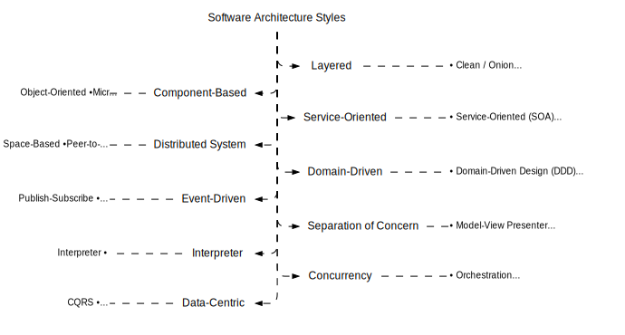

import Tabs from "@theme/Tabs";
import TabItem from "@theme/TabItem";

<Tabs queryString="primary">
    <TabItem value="architecture-styles-definition" label="Definition">
        Architectural style is a framework of guidelines dictating the structure and organization of a software system, encompassing component roles, interactions, and dependencies. It also addresses non-functional aspects like scalability, performance, security, testability, and maintainability. While not rigid, it offers a flexible approach adaptable to project requirements. There's no one-size-fits-all solution; instead, various trade-offs and considerations must be weighed to select the most suitable style for a given scenario

        

      ### Ways to Apply Architectural Style

      - **Entire system**: defining the high-level structure and organization of the system as a whole, such as how it is divided into subsystems or modules, how they communicate with each other, and how they interact with external systems or services
      - **Subsystem or module**: defining the internal structure and organization of a subsystem or module within the system, such as how it is divided into components or classes, how they collaborate with each other, and how they expose their functionality to other subsystems or modules
      - **Component or class**: defining the internal structure and organization of a component or class within a subsystem or module, such as how it is divided into methods or functions, how they implement the logic and behavior of the component or class, and how they access data or resources
    </TabItem>
    <TabItem value="architecture-styles-benefits" label="Benefits">
        - **Modularity**: breaking down a complex system into smaller and simpler components that can be developed, tested, deployed, and maintained independently
        - **Reusability**: avoiding duplication of code and logic by creating reusable components that can be shared across different parts of the system or even across different systems
        - **Extensibility**: allowing the system to evolve and adapt to changing requirements and new features by adding or modifying components without affecting the existing ones
        - **Testability**: making the system easier to test by isolating the components and their dependencies and providing clear interfaces and contracts between them
        - **Maintainability**: making the system easier to understand, modify, debug, and refactor by following consistent and coherent conventions and principles
        - **Decoupling**: reducing the coupling or dependency between components by minimizing the amount of information and behavior they share or expose to each other
    </TabItem>
    <TabItem value="architecture-styles-performance" label="Software Performance">
        Software performance refers to the ability of a software system to execute its intended functions within a certain time frame and with optimal use of resources. It is a critical aspect of software development and maintenance, as it directly impacts the user experience, system reliability, and overall efficiency.

        Software performance can be defined as the measure of how well a software system executes its intended functions and responds to user input within a specified time frame.

        It encompasses various aspects, including:

        - **Response time**: The time it takes for the system to respond to user input or queries
        - **Throughput**: The number of tasks or requests the system can process within a given time frame
        - **Resource** utilization: The efficiency with which the system uses hardware and software resources, such as CPU, memory, disk I/O, and network bandwidth
        - **Scalability**: The system’s ability to handle increased workload or user traffic without a significant decrease in performance
        - **Reliability**: The system’s ability to perform its intended functions consistently and without errors or failures

        **Key Performance Indicators (KPIs) for Software Systems**

        Key Performance Indicators (KPIs) are measurable values that demonstrate how effectively a software system is achieving its intended goals.

        Some common KPIs for software performance include:

        - **Response time**: Average response time, response time variability, and response time distribution
        - **Throughput**: Number of requests processed per unit time, such as requests per second (RPS) or transactions per minute (TPM)
        - **Resource utilization**: CPU usage, memory usage, disk I/O, network bandwidth, and database queries per second
        - **Scalability**: Number of users, concurrent connections, or requests handled by the system without significant performance degradation
        - **Reliability**: Mean time between failures (MTBF), mean time to recover (MTTR), and error rates

        **Factors that Affect Software Performance**

        - **Hardware resources**: Availability, utilization, and performance of hardware components, such as CPU, memory, storage, and network interfaces
        - **Software architecture**: Design and structure of the software system, including the number of layers, components, and interactions between them
        - **Algorithmic complexity**: The time and space complexity of algorithms used in the software, which can impact response time and resource utilization
        - **Data size and growth**: The amount of data processed and stored by the system, which can affect performance as the data set grows
        - **User behavior**: Patterns and intensity of user activity, such as the number of concurrent users, frequency of requests, and usage patterns
        - **Network and I/O performance**: Network latency, packet loss, and I/O operations can impact the system’s ability to retrieve and process data
        - **Resource contention**: Competition for shared resources, such as CPU, memory, and I/O devices, which can lead to performance bottlenecks
        - **Interference and noise**: Interference from other systems or background processes, as well as random fluctuations in system performance, can affect software performance

        **Methods for Measuring and Monitoring Software Performance**

        - **Synthetic transactions**: Simulating user interactions to measure response time, throughput, and resource utilization
        - **Real-user monitoring**: Tracking actual user interactions to assess performance from the end-user perspective
        - **Load testing**: Testing the system under varying loads to evaluate its scalability and performance under different workloads
        - **Stress testing**: Testing the system under extreme conditions, such as high concurrency or large data sets, to identify performance bottlenecks
        - **End-user experience monitoring**: Monitoring user experience metrics, such as page load times, error rates, and user satisfaction
        - **Performance modeling**: Creating mathematical models of the system to predict performance under different conditions and optimize system configuration
        - **Performance benchmarking**: Comparing the system’s performance to industry-standard benchmarks or competing systems
        - **Root cause analysis**: Identifying the underlying causes of performance issues through techniques such as profiling, tracing, and logging
    </TabItem>
</Tabs>
