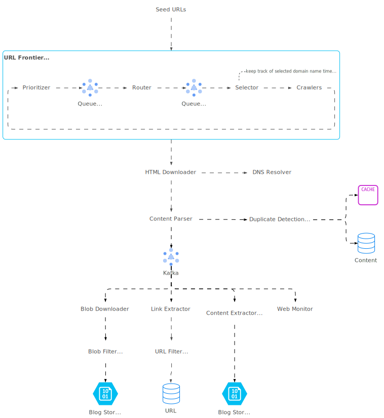
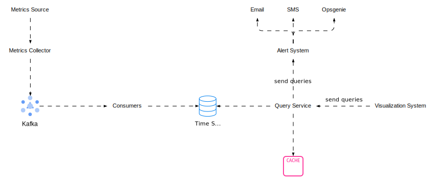
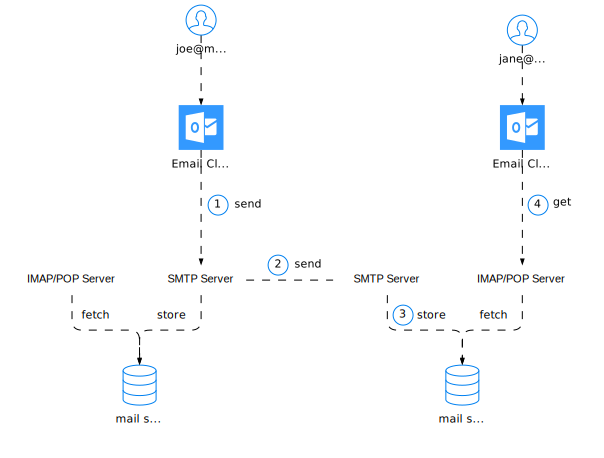
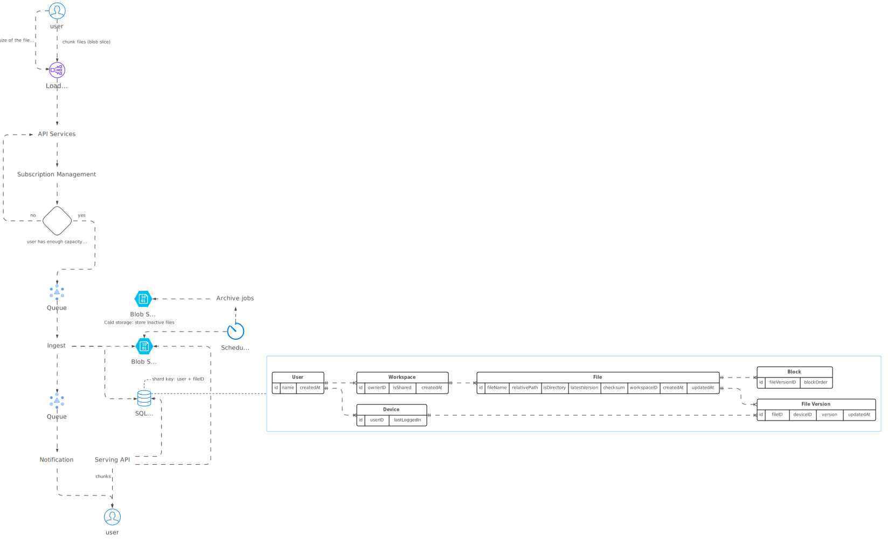
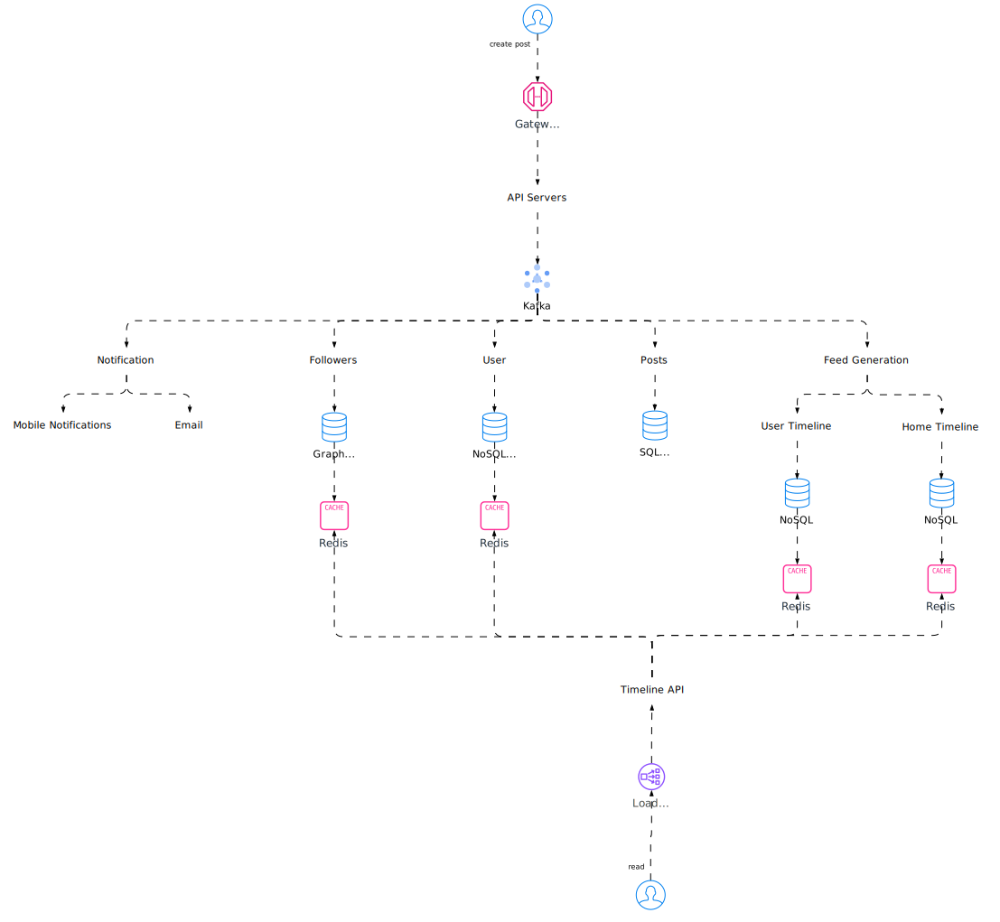
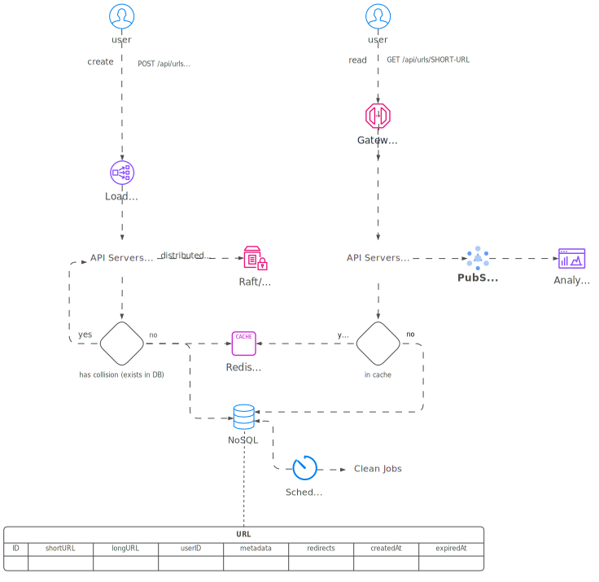

import Tabs from "@theme/Tabs";
import TabItem from "@theme/TabItem";

<Tabs queryString="primary">
    <TabItem value="basic" label="Basic">
        <Tabs queryString="secondary">
            <TabItem value="web-crawler" label="Web Crawler" attributes={{className:"tabs__vertical"}}>
                
            </TabItem>
            <TabItem value="metrics-monitoring" label="Metrics & Monitoring">
                

                ### Considerations

                - Collect metrics from various sources (servers, databases)
                - Store and query time-series data (time-series database + Kafka)
                - Process and analyze data (Apache Storm, Flink, Spark)
                - Retrieve, visualize, and get alerted on metrics (query service, visualization system, alerting system)
            </TabItem>
            <TabItem value="peak-season" label="Peak Season">
                

                ### Considerations

                - **Block Bots & DDoS**: Use reCaptcha & rate limiting
                - **Fast Loading**: Minify & CDN deliver CSS/JS/Images
                - **Scale on Demand**: Spin up isolated dedicated instances & use queues
                - **Prevent Overselling**: Lock inventory on order
                - **Fast Cache**: Use cache & manage inventory
                - **Minimize & Optimize**: Reduce RPC, hops, & streamline services
                - **Isolate Content**: Separate static/dynamic & isolate uncommon items
                - **Accurate Confirmation**: Show true stock availability
            </TabItem>
            <TabItem value="email" label="Email">
                
            </TabItem>
            <TabItem value="chat" label="Chat">
                
            </TabItem>
            <TabItem value="file-storage" label="File Storage">
                
            </TabItem>
            <TabItem value="news-feed" label="News Feed">
                
            </TabItem>
            <TabItem value="rate-limiter" label="Rate Limiter">
                
            </TabItem>
            <TabItem value="autocomplete" label="Autocomplete">
                
            </TabItem>
            <TabItem value="url-shortener" label="URL Shortener">
                
            </TabItem>
            <TabItem value="video-platform" label="Video Platform">
                
            </TabItem>
        </Tabs>
    </TabItem>
    <TabItem value="systems" label="Systems">
        <Tabs queryString="secondary">
            <TabItem value="twitter" label="Twitter (2022)" attributes={{className:"tabs__vertical"}}>
                
            </TabItem>
            <TabItem value="stackoverflow" label="StackOverflow">
                
            </TabItem>
        </Tabs>
    </TabItem>
    <TabItem value="lessons" label="Lessons">
        <Tabs queryString="secondary">
            <TabItem value="_" label="_" attributes={{className:"tabs__vertical"}}></TabItem>
        </Tabs>
    </TabItem>
</Tabs>
