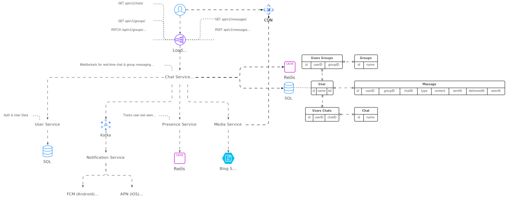
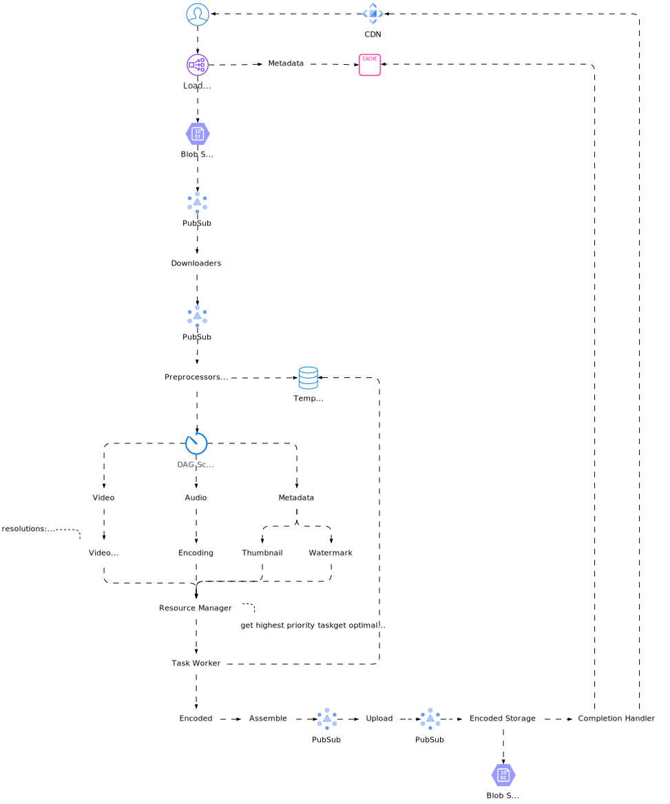
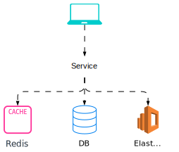

import Tabs from "@theme/Tabs";
import TabItem from "@theme/TabItem";

<Tabs queryString="primary">
    <TabItem value="definitions" label="Definitions">
      - **DAU**: Daily Active Users
      - **QPS**: Queries Per Second
    </TabItem>
    <TabItem value="basic" label="Basic">
        <Tabs queryString="secondary">
            <TabItem value="web-crawler" label="Web Crawler" attributes={{className:"tabs__vertical"}}>
                

                ### Clarifications

                - **Crawling Goal:** Search Engine Indexing
                - **Monthly Intake:** 1 billion pages
                - **Content Type:** HTML only
                - **Freshness:** Include new & edited pages
                - **Storage:** Keep crawled HTML for 5 years
                - **Duplicates:** Ignore duplicate content

                ### Assumptions

                - **Scale Up:** Handle billions of web pages with parallelization (running tasks simultaneously)
                - **Handle the Weird:** Expect broken code, slow servers, crashes, and bad actors. The crawler must adapt
                - **Be Nice:** Don't overload websites with too many requests at once based on the website
                - **Future-Proof:** Easily add new content types (like images) without a major overhaul
                - **Crawl:** Use BFS algorithm

                ### Estimations

                - **Load**: QPS: `1M (pages) / 30 (days) / 24 (hours) / 3600 (seconds) = 400 pages/sec` and Peak QPS: `QPS * 2 (peak ratio) = 800 pages/sec`
                - **Storage**: `1B (pages) * 500kb (page size) = 500 TB/month` for 5 years `500 (TB/month) * 12 (months) * 5 (years) = 30 PB`
            </TabItem>
            <TabItem value="metrics-monitoring" label="Metrics & Monitoring">
                

                ### Considerations

                - Collect metrics from various sources (servers, databases)
                - Store and query time-series data (time-series database + Kafka)
                - Process and analyze data (Apache Storm, Flink, Spark)
                - Retrieve, visualize, and get alerted on metrics (query service, visualization system, alerting system)
            </TabItem>
            <TabItem value="peak-season" label="Peak Season">
                

                ### Considerations

                - **Block Bots & DDoS**: Use reCaptcha & rate limiting
                - **Fast Loading**: Minify & CDN deliver CSS/JS/Images
                - **Scale on Demand**: Spin up isolated dedicated instances & use queues
                - **Prevent Overselling**: Lock inventory on order
                - **Fast Cache**: Use cache & manage inventory
                - **Minimize & Optimize**: Reduce RPC, hops, & streamline services
                - **Isolate Content**: Separate static/dynamic & isolate uncommon items
                - **Accurate Confirmation**: Show true stock availability
            </TabItem>
            <TabItem value="email" label="Email">
                
            </TabItem>
            <TabItem value="chat" label="Chat">
                

                ### Clarifications

                - **App Type:** Both 1-on-1 and group chat
                - **Platform:** Mobile & Web
                - **Scale:** 50M DAU
                - **Group Size:** Max 100 members
                - **Features:** Basic (text chat, online indicator) - No attachments for now
                - **Message Length:** Up to 100,000 characters
                - **Encryption:** Not required (discuss later)
                - **History:** Saved forever

                ### Assumptions

                - **1:1 Chat:** Messages arrive quickly between 2 people
                - **Group Chat:** Up to 100 people in a group chat
                - **Online Status:** See if friends are available
                - **Multi-Device:** Use on multiple devices at once
                - **Push Notifications:** Get alerts for new messages
            </TabItem>
            <TabItem value="file-storage" label="File Storage">
                

                ### Clarifications

                - **Features:** Upload, download, sync files, get notifications
                - **Platform:** Mobile & Web
                - **File Types:** All supported
                - **Encryption:** Encrypted storage
                - **Size Limit:** Up to 10GB per file
                - **Users:** 10M DAU

                ### Assumptions

                - **Core Features:** Drag-and-Drop upload, download, multi-device sync, revision history
                - **Sharing & Notifications:** Share files and get alerts on edits/changes
                - **Fast & Efficient:** Quick file sync with minimal bandwidth use
                - **Rock-Solid Reliability:** No data loss
                - **Load:** High availability and scalability

                ### Estimations

                - **Storage Allocation**: `50M (users) * 10GB (space allocation / user) = 500 PT/month`
                - **Upload Load**: `10M (users) * 2 (upload/day) 24 (hours) / 3600 (seconds) = 240 upload/sec` and Peak QPS: `QPS * 2 (peak ratio) = 480 upload/sec`
            </TabItem>
            <TabItem value="news-feed" label="News Feed">
                

                ### Assumptions

                - **Functionality:** Post, Get Feed, Update Feed
                - **Focus:** Text and not on large media
                - **Ranking Assumed:** Existing system already ranks posts
                - **Global Reach:** Serves 1B users worldwide
                - **Share:** 500 friends per user
                - **Post Speed:** Varies by location (1s - 1 minute)
                - **Availability:** Ensures posts aren't lost, but not guaranteed uptime
                - **Ads (Bonus):** Optional addition of advertisements

                ### Estimations

                - **News Feed Size**: `1K (posts) * 10Kb (post size) = 10 MB`

                ### Clarifications

                - **Platform:** Mobile & Web
                - **Key Feature:** Users post and see friends' posts in a news feed
                - **Feed Order:** Newest first
                - **Friend Limit:** Up to 5k friends per user
                - **Traffic:** 10M DAU
                - **Feed Content:** Text, images, and videos
            </TabItem>
            <TabItem value="rate-limiter" label="Rate Limiter">
                
            </TabItem>
            <TabItem value="autocomplete" label="Autocomplete">
                

                ### Clarifications

                - **Match Start Only:** Autocomplete suggestions only appear at the beginning of queries
                - **Top 5 Picks:** Show 5 most popular suggestions based on past searches
                - **No Spell Check:** Focuses on displaying popular suggestions, not correcting typos
                - **Language Support:** English for now, multi-language can be discussed later
                - **Lowercase Letters:** Search queries are assumed to be lowercase with no special characters
                - **Traffic:** Used by 10M DAU
                - **Workflow:** Each time you enter a character it'll send a request to a backend service to get suggestions: `/search?q=f` -> `/search?q=fo` -> `/search?q=foo`

                ### Assumptions

                - **Performance:** Autocomplete suggestions must appear within `100ms` to avoid lag
                - **Relevance:** Suggestions should be related to the search terms
                - **Ranked:** Show more popular suggestions first
                - **Scalability:** High availability, scalability, and fault tolerance considerations
                - **Encoding**: UTF-8

                ### Estimations

                - **Query Size**: `4 (words) * 5 (characters) * 1 (byte/character) = 20 bytes/query`
                - **Load**: QPS: `10M (users) * 10 (queries/day) * 20 (characters) / 24 (hours) / 3600 (seconds) = 24K query/sec` and Peak QPS: `QPS * 2 (peak ratio) = 48K query/sec`
                - **Storage**: `10M (users) * 10 (queries/day) * 20 (bytes/query) * 20% (new users) = 0.4 GB/day`
            </TabItem>
            <TabItem value="url-shortener" label="URL Shortener">
                

                ### Clarifications

                - **Shortener:** Long URL (e.g. `https://www.myweb.com/learn/system-design/`) to short one (`https://tinyurl.com/app`). Clicking short link goes to the original long URL
                - **Volume:** 100M shortened URLs generated daily
                - **Length:** Short as possible
                - **Characters:** Numbers (0-9) and letters (a-z, A-Z)
                - **Updates:** Shortened URLs cannot be deleted or changed (for simplicity)

                ### Assumptions

                - **URL shortening**: given a long URL → return a much shorter URL
                - **URL redirecting**: given a shorter URL → redirect to the original URL
                - **Characters**: `[A-Za-z0-9]`
                - High availability, scalability, and fault tolerance considerations

                ### Estimations

                - **URL Shortener**: `62 characters ([A-Za-z0-9]) * 7 (letters for short URL) = 3.5 trillion (URLs)`
                - **Write operation**: 100M URLs/day → `100M (URLs) / 24 (hours) / 3600 (seconds) = 1160` (URLs/sec)
                - **Read operation**: assuming ratio of read operation to write operation is `10:1` → `1160 (writes/sec) * 10 (reads ratio) = 11,600 (reads/sec)`
                - **Storage requirement**: average URL length is `100 bytes` with `10 years` of data storage: `100M (URLs) * 365 (days) * 10 (years) * 100 (bytes) = 365TB`
            </TabItem>
            <TabItem value="video-platform" label="Video Platform">
                

                ### Clarifications

                - **Features:** Upload & watch videos
                - **Clients:** Mobile, web, smart TV
                - **Users:** 5M DAU
                - **Engagement:** 30 min/day
                - **Global:** Supports international users
                - **Playback:** Accepts most resolutions/formats
                - **Security:** Encrypted videos
                - **Upload Limit:** Max 1GB videos (focuses on smaller sizes)
                - **Cloud Storage:** Consider leveraging existing services (AWS, Google Cloud, Azure)

                ### Assumptions

                - **Fast Uploads:** Videos upload quickly
                - **Seamless Streaming:** Videos play smoothly without buffering
                - **Quality Control:** Lets users adjust video quality
                - **Cost-Effective:** Needs low infrastructure costs
                - **Scalability:** Highly available, scalable, and reliable
                - **Multi-Platform:** Works on mobile apps, web browsers, and smart TVs

                ### Estimations

                - **Storage**: `5M (users) * 10% (users upload 1 video/day) * 300MB (video) = 150 TB/day`
                - **CDN Costs**: `5M (users) * 5 (videos) * 300MB (video) * 0.02 (CDN cost $/GB) = 750k $/day`
            </TabItem>
        </Tabs>
    </TabItem>
    <TabItem value="systems" label="Systems">
        <Tabs queryString="secondary">
            <TabItem value="twitter" label="Twitter (2022)" attributes={{className:"tabs__vertical"}}>
                
            </TabItem>
            <TabItem value="stackoverflow" label="StackOverflow">
                
            </TabItem>
        </Tabs>
    </TabItem>
    <TabItem value="lessons" label="Lessons">
        <Tabs queryString="secondary">
            <TabItem value="_" label="_" attributes={{className:"tabs__vertical"}}></TabItem>
        </Tabs>
    </TabItem>
</Tabs>
