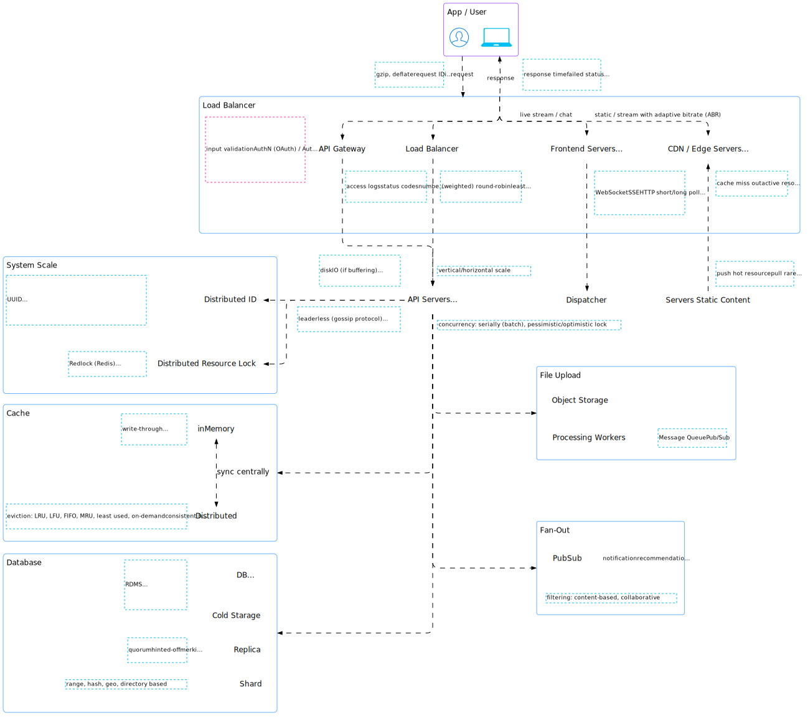

import TabItem from "@theme/TabItem";
import Tabs from "@theme/Tabs";

## Interview Process

<Tabs queryString="primary">
  <TabItem value="introductory-call" label="Introductory Call">
    <Tabs queryString="secondary">
      <TabItem value="introductory-call-preparation" label="Preparation" attributes={{className:"tabs__vertical"}}>
        - Company Research
        - Job Description Analysis
        - Resume & Portfolio Review
        - Practice Self-Introduction
        - Technical Knowledge Refresh
      </TabItem>
      <TabItem value="introductory-call-during-interview" label="During Interview">
        <table>
            <thead>
                <tr>
                    <th>Stage</th>
                    <th>Duration</th>
                    <th>Considerations</th>
                    <th>Evaluations</th>
                </tr>
            </thead>
            <tbody>
                <tr>
                    <td><b>Rapport Building</b></td>
                    <td>5 minutes</td>
                    <td>
                        <ul>
                            <li>Briefly introduce yourself</li>
                        </ul>
                    </td>
                    <td>
                        <ul>
                            <li>Communication style</li>
                            <li>Enthusiasm for the opportunity</li>
                        </ul>
                    </td>
                </tr>
                <tr>
                    <td><b>Background & Experience</b></td>
                    <td>10 minutes</td>
                    <td>
                        <ul>
                            <li>Provide only relevant to the role information</li>
                            <li>Craft **Elevator Pitch** (60 sec) about yourself and your experience</li>
                            <li>Focus on how you can contribute</li>
                        </ul>
                    </td>
                    <td>
                        <ul>
                            <li>Alignment with the role requirements</li>
                            <li>Problem-solving skills through past experiences</li>
                            <li>Ability to grasp technical concepts</li>
                            <li>Evaluate interpersonal skills: Leadership qualities. Ability to inspire and motivate</li>
                            <li>Company fit</li>
                            <li>How deep candidate understands culture, products, processes</li>
                        </ul>
                    </td>
                </tr>
                <tr>
                    <td><b>Questions</b></td>
                    <td>5 minutes</td>
                    <td>
                        <ul>
                            <li>Ask clarifying questions about the role and company</li>
                            <li>Understand role: Tech stack, team structure, and key projects</li>
                        </ul>
                    </td>
                    <td>
                        <ul>
                            <li>Interest level and engagement</li>
                            <li>Initiative and curiosity</li>
                            <li>What interests most</li>
                        </ul>
                    </td>
                </tr>
                <tr>
                    <td><b>Wrap Up</b></td>
                    <td>5 minutes</td>
                    <td>
                        <ul>
                            <li>Next steps: brief summarization and next steps</li>
                        </ul>
                    </td>
                    <td>
                        <ul>
                            <li>Overall impression of the company and opportunity</li>
                        </ul>
                    </td>
                </tr>
            </tbody>
        </table>
      </TabItem>
      <TabItem value="introductory-call-final-evaluation-checklist" label="Final Evaluation Checklist">
        <table>
          <thead>
            <tr>
              <th>Section</th>
              <th>Criteria</th>
              <th>Description</th>
            </tr>
          </thead>
          <tbody>
            <tr>
              <td rowspan="4"><b>Background & Motivation</b></td>
              <td><b>Understanding of Role</b></td>
              <td>Does the candidate demonstrate a clear understanding of the specific role and its responsibilities?</td>
            </tr>
            <tr>
              <td><b>Company Research</b></td>
              <td>Does the candidate show knowledge of the company, its products, and its mission?</td>
            </tr>
            <tr>
              <td><b>Motivation</b></td>
              <td>Does the candidate express a genuine interest in the role and the company? Why are they interested in this specific opportunity?</td>
            </tr>
            <tr>
              <td><b>Salary Expectations</b></td>
              <td>Does the candidate have realistic salary expectations aligned with the role and experience level?</td>
            </tr>
            <tr>
              <td rowspan="4"><b>Technical Skills & Experience</b></td>
              <td><b>Technical Background</b></td>
              <td>Can the candidate articulate their technical skills and experience with relevant programming languages, frameworks, and technologies?</td>
            </tr>
            <tr>
              <td><b>Project Experience</b></td>
              <td>Can the candidate discuss past projects, highlighting the technical challenges tackled and solutions implemented?</td>
            </tr>
            <tr>
              <td><b>Learning Agility</b></td>
              <td>Does the candidate express a passion for continuous learning and staying up-to-date with the latest technologies?</td>
            </tr>
            <tr>
              <td><b>Problem-Solving Approach</b></td>
              <td>Can the candidate describe their approach to problem-solving and debugging?</td>
            </tr>
            <tr>
              <td rowspan="4"><b>Soft Skills & Communication</b></td>
              <td><b>Communication Skills</b></td>
              <td>Does the candidate communicate clearly, concisely, and professionally?</td>
            </tr>
            <tr>
              <td><b>Teamwork & Collaboration</b></td>
              <td>Can the candidate demonstrate experience working effectively in a team environment?</td>
            </tr>
            <tr>
              <td><b>Learning Attitude</b></td>
              <td>Does the candidate show a willingness to learn, adapt, and take feedback constructively?</td>
            </tr>
            <tr>
              <td><b>Professionalism</b></td>
              <td>Does the candidate exhibit a professional demeanor throughout the call (punctuality, enthusiasm)?</td>
            </tr>
            <tr>
              <td rowspan="3"><b>Cultural Fit</b></td>
              <td><b>Company Culture</b></td>
              <td>Does the candidate's values and work style seem aligned with the company's culture?</td>
            </tr>
            <tr>
              <td><b>Team Fit</b></td>
              <td>Does the candidate seem like they would be a good fit with the existing engineering team?</td>
            </tr>
            <tr>
              <td><b>Passion & Drive</b></td>
              <td>Does the candidate demonstrate passion for software engineering and a drive to excel?</td>
            </tr>
            <tr>
              <td rowspan="3"><b>Candidate Evaluation</b></td>
              <td><b>Strengths</b></td>
              <td>Identify the candidate's key strengths demonstrated during the conversation</td>
            </tr>
            <tr>
              <td><b>Areas for Improvement</b></td>
              <td>Highlight any areas where the candidate may need further development or improvement</td>
            </tr>
            <tr>
              <td><b>Recommendation</b></td>
              <td>Provide a recommendation regarding whether to proceed to the next stage of the interview process</td>
            </tr>
          </tbody>
        </table>
      </TabItem>
    </Tabs>
  </TabItem>
  <TabItem value="technical" label="Technical">
    <Tabs queryString="secondary">
      <TabItem value="technical-preparation" label="Preparation" attributes={{className:"tabs__vertical"}}>
        - Theory of Programming Language and Frameworks / Libraries / Tools
        - [Bitwise Operations](/docs/education/software-development/bitwise-operations)
        - [Regex](/docs/education/software-development/regex)
        - [Data Structures](/docs/education/computer-science/data-structures/definition)
        - [Algorithms](/docs/education/computer-science/algorithms/techniques)
      </TabItem>
      <TabItem value="technical-during-interview" label="During Interview">
        <table>
            <thead>
                <tr>
                    <th>Stage</th>
                    <th>Duration</th>
                    <th>Considerations</th>
                    <th>Evaluations</th>
                </tr>
            </thead>
            <tbody>
                <tr>
                    <td><b>Rapport Building</b></td>
                    <td>5 minutes</td>
                    <td>
                        <ul>
                            <li>Establish a friendly and confident demeanor</li>
                        </ul>
                    </td>
                    <td>
                        <ul>
                            <li>Confidence and professionalism</li>
                            <li>Clarity and conciseness</li>
                        </ul>
                    </td>
                </tr>
                <tr>
                    <td><b>Technical Experience (Option 1)</b></td>
                    <td>15-20 minutes</td>
                    <td>
                        <ul>
                            <li>Discuss previous technical roles and responsibilities</li>
                            <li>Explain specific projects worked on, technologies utilized, and contributions made</li>
                            <li>Showcase technical expertise and problem-solving skills</li>
                            <li>Technical skills that are relevant to the role</li>
                        </ul>
                    </td>
                    <td>
                        <ul>
                            <li>Depth of technical knowledge and expertise</li>
                            <li>Ability to communicate complex technical concepts clearly and effectively</li>
                            <li>Demonstrated problem-solving abilities</li>
                            <li>Experience with relevant technologies and tools</li>
                        </ul>
                    </td>
                </tr>
                <tr>
                    <td><b>Technical Challenges (Option 2)</b></td>
                    <td>15-20 minutes</td>
                    <td>
                        <ul>
                            <li>Solve technical problems or coding challenges</li>
                            <li>Explain thought process and reasoning behind the solutions proposed</li>
                            <li>Utilize appropriate algorithms, data structures, and coding best practices</li>
                            <li>Ask clarifying questions</li>
                        </ul>
                    </td>
                    <td>
                        <ul>
                            <li>Problem-solving approach and methodology</li>
                            <li>Understanding of algorithms, data structures, and coding principles</li>
                            <li>Code efficiency and cleanliness</li>
                            <li>Ability to articulate thought process and reasoning effectively</li>
                            <li>Adaptability to new challenges and learning on the spot</li>
                        </ul>
                    </td>
                </tr>
                <tr>
                    <td><b>Questions</b></td>
                    <td>5 minutes</td>
                    <td>
                        <ul>
                            <li>Ask insightful questions about the company culture, team dynamics, projects, or any other relevant topics</li>
                            <li>Demonstrate genuine interest in the position and company</li>
                            <li>Seek clarification on any doubts or concerns regarding the role or organization</li>
                        </ul>
                    </td>
                    <td>
                        <ul>
                            <li>Quality, maturity, and relevance of questions asked</li>
                            <li>Clarity on role expectations and company culture</li>
                            <li>Company's and team's culture fit</li>
                        </ul>
                    </td>
                </tr>
            </tbody>
        </table>
      </TabItem>
      <TabItem value="technical-final-evaluation-checklist" label="Final Evaluation Checklist">
        <table>
          <thead>
            <tr>
              <th>Criteria</th>
              <th>Aspects</th>
            </tr>
          </thead>
          <tbody>
            <tr>
              <td><b>Technical Skills</b></td>
              <td>
                <ul>
                  <li>Proficiency in programming languages relevant to the role</li>
                  <li>Knowledge of data structures and algorithms</li>
                  <li>Understanding of object-oriented design principles / functional programming concepts and patterns</li>
                  <li>Ability to write clean, maintainable, and efficient code</li>
                </ul>
              </td>
            </tr>
            <tr>
              <td><b>Problem-Solving Skills</b></td>
              <td>
                <ul>
                  <li>Analytical skills in breaking down complex problems into smaller, manageable components</li>
                  <li>Creativity and innovation in proposing solutions</li>
                  <li>Proficiency in identifying and resolving bugs and errors in code</li>
                  <li>Capacity to optimize code for performance and scalability</li>
                  <li>Experience in troubleshooting and debugging software issues</li>
                </ul>
              </td>
            </tr>
            <tr>
              <td><b>Communication Skills</b></td>
              <td>
                <ul>
                  <li>Clarity and effectiveness in explaining technical concepts including non-technical stakeholders</li>
                  <li>Active listening skills during discussions and collaborative problem-solving sessions</li>
                  <li>Ability to articulate thoughts and ideas coherently in both written and verbal communication</li>
                  <li>Confidence and professionalism in presenting technical solutions</li>
                </ul>
              </td>
            </tr>
            <tr>
              <td><b>Collaboration & Teamwork</b></td>
              <td>
                <ul>
                  <li>Demonstrated experience in working effectively within cross-functional teams</li>
                  <li>Willingness to share knowledge and mentor junior team members</li>
                  <li>Adaptability to various team dynamics and project requirements</li>
                  <li>Ability to receive and incorporate feedback constructively</li>
                </ul>
              </td>
            </tr>
            <tr>
              <td><b>Cultural Fit</b></td>
              <td>
                <ul>
                  <li>Alignment with company values and culture</li>
                  <li>Interest in continuous learning and professional growth</li>
                  <li>Compatibility with the team's work style and dynamics</li>
                  <li>Enthusiasm for collaborating on challenging projects and solving complex problems</li>
                </ul>
              </td>
            </tr>
            <tr>
              <td><b>Candidate Evaluation</b></td>
              <td>
                <ul>
                  <li>Strengths</li>
                  <li>Evaluate level of seniority</li>
                  <li>Areas for Improvement</li>
                  <li>Recommendation whether to proceed to the next stage of the interview process </li>
                </ul>
              </td>
            </tr>
          </tbody>
        </table>
      </TabItem>
    </Tabs>
  </TabItem>
  <TabItem value="system-design" label="System Design">
    <Tabs queryString="secondary">
      <TabItem value="system-design-preparation" label="Preparation" attributes={{className:"tabs__vertical"}}>
        - [System Design](/docs/category/system-design)
        - **Focus on approach, not perfection**: There is no right or wrong answer. It's a matter of how you approach the problem
        - **Keep it simple, avoid premature optimization**
        - **Clarify requirements upfront**

        
      </TabItem>
      <TabItem value="during-interview" label="During Interview">
        <table class="text_vertical">
          <thead>
            <tr>
              <th>Stage</th>
              <th>Duration</th>
              <th>Considerations</th>
              <th>Evaluations</th>
            </tr>
          </thead>
          <tbody>
            <tr>
              <td><b>Requirements Clarification</b></td>
              <td>5 minutes</td>
              <td>
                <ul>
                  <li>Understand the problem statement thoroughly</li>
                  <li>Identify functional and non-functional requirements</li>
                  <li>Determine scope and constraints</li>
                  <li>Discuss assumptions</li>
                </ul>
              </td>
              <td>
                <ul>
                  <li>Ability to ask relevant questions to clarify requirements</li>
                  <li>Demonstrate communication skills to ensure a clear understanding of the problem</li>
                  <li>Ability to identify edge cases and exceptional scenarios early on</li>
                  <li>Clarity in defining assumptions and their potential impact on the design</li>
                </ul>
              </td>
            </tr>
            <tr>
              <td><b>Estimations</b></td>
              <td>5 minutes</td>
              <td>
                <ul>
                  <li>Break down the problem into manageable components</li>
                  <li>Identify key metrics (traffic, storage, QPS)</li>
                  <li>Choose appropriate technologies and platforms</li>
                  <li>Consider growth projections</li>
                  <li>
                    Non-Functional Requirements
                    <ul>
                        <li>**Performance**: How fast is the system?</li>
                        <li>**Scalability**: How will the system respond to increased demand?</li>
                        <li>**Reliability**: What is the system's uptime?</li>
                        <li>**Resilience**: How will the system recover if it fails?</li>
                        <li>**Security**: How are the system and data protected?</li>
                        <li>**Usability**: How do users interact with the system?</li>
                        <li>**Maintainability**: How will you troubleshoot the system?</li>
                        <li>**Modifiability**: Can users customize features? Can developers change the code?</li>
                        <li>**Localization**: Will the system handle currencies and languages?</li>
                    </ul>
                  </li>
                </ul>
              </td>
              <td>
                <ul>
                  <li>Demonstrate a structured approach to estimation</li>
                  <li>Ability to reason about the scale and size of the system</li>
                  <li>Understanding of trade-offs between different technology choices</li>
                  <li>Accuracy in providing estimations with reasoning</li>
                </ul>
              </td>
            </tr>
            <tr>
              <td><b>High Level Design (HLD)</b></td>
              <td>15-20 minutes</td>
              <td>
                <ul>
                  <li>Identify major components/modules</li>
                  <li>Define interactions between components</li>
                  <li>Discuss data flow and storage strategies</li>
                  <li>Address fault tolerance and disaster recovery</li>
                  <li>Sketch system architecture diagrams</li>
                </ul>
              </td>
              <td>
                <ul>
                  <li>Clarity in defining system architecture and components</li>
                  <li>Ability to design for scalability, reliability, and performance</li>
                  <li>Understanding of data consistency, partitioning, and replication</li>
                  <li>Consideration of error handling, retries, and fallback mechanisms</li>
                  <li>Ability to communicate complex ideas through diagrams</li>
                </ul>
              </td>
            </tr>
            <tr>
              <td><b>Low Level Design (LLD)</b></td>
              <td>20-25 minutes</td>
              <td>
                <ul>
                  <li>Design individual components/modules in detail</li>
                  <li>Discuss algorithms and data structures</li>
                  <li>Address concurrency and synchronization</li>
                  <li>Define database schemas and query patterns</li>
                  <li>Discuss API contracts and communication protocols</li>
                </ul>
              </td>
              <td>
                <ul>
                  <li>Clarity in defining data structures, algorithms, and APIs/interfaces</li>
                  <li>Optimization of resource utilization (CPU, memory, bandwidth)</li>
                  <li>Consideration of caching, load balancing, and routing strategies</li>
                  <li>Understanding of database design principles and normalization</li>
                  <li>Consistency in defining interfaces and communication protocols</li>
                </ul>
              </td>
            </tr>
            <tr>
              <td><b>Wrap Up</b></td>
              <td>5 minutes</td>
              <td>
                <ul>
                  <li>Summarize the design decisions made</li>
                  <li>Address any outstanding concerns or questions</li>
                  <li>Discuss potential improvements or optimizations</li>
                </ul>
              </td>
              <td>
                <ul>
                  <li>Ability to articulate the rationale behind design choices</li>
                  <li>Openness to feedback and willingness to iterate on the design</li>
                  <li>Demonstration of critical thinking and creativity in improving the design</li>
                  <li>Professionalism and courtesy in concluding the discussion</li>
                </ul>
              </td>
            </tr>
          </tbody>
        </table>
      </TabItem>
      <TabItem value="system-design-final-evaluation-checklist" label="Final Evaluation Checklist">
        <table>
          <thead>
            <tr>
              <th>Criteria</th>
              <th>Aspects</th>
            </tr>
          </thead>
          <tbody>
            <tr>
              <td><b>Understanding Requirements</b></td>
              <td>
                <ul>
                  <li>Comprehension of requirements	</li>
                  <li>Ability to identify key features	</li>
                  <li>Understanding of scalability</li>
                  <li>Consideration of latency</li>
                  <li>Handling of fault tolerance</li>
                </ul>
              </td>
            </tr>
            <tr>
              <td><b>System Architecture</b></td>
              <td>
                <ul>
                  <li>Appropriateness of chosen architecture</li>
                  <li>Clarity of component interaction</li>
                  <li>Consideration of modularity</li>
                  <li>Ability to scale horizontally and vertically</li>
                  <li>Consistency with industry best practices</li>
                </ul>
              </td>
            </tr>
            <tr>
              <td><b>Data Management</b></td>
              <td>
                <ul>
                  <li>Database schema design</li>
                  <li>Selection of appropriate database technologies</li>
                  <li>Handling of data consistency and integrity</li>
                  <li>Consideration of data partitioning/sharding</li>
                  <li>Efficiency in data retrieval and storage</li>
                </ul>
              </td>
            </tr>
            <tr>
              <td><b>System Components</b></td>
              <td>
                <ul>
                  <li>Clarity of component responsibilities</li>
                  <li>Appropriate use of caching</li>
                  <li>Consideration of system security</li>
                  <li>Handling of system dependencies</li>
                  <li>Integration of third-party services</li>
                </ul>
              </td>
            </tr>
            <tr>
              <td><b>Performance Optimization</b></td>
              <td>
                <ul>
                  <li>Proficiency in performance profiling</li>
                  <li>Application of optimization techniques</li>
                  <li>Consideration of resource constraints</li>
                  <li>Ability to prioritize optimizations</li>
                  <li>Understanding of trade-offs between performance and cost</li>
                </ul>
              </td>
            </tr>
            <tr>
              <td><b>Communication and Collaboration</b></td>
              <td>
                <ul>
                  <li>Clarity of explanations</li>
                  <li>Ability to justify design decisions</li>
                  <li>Effective collaboration skills</li>
                  <li>Responsiveness to feedback</li>
                  <li>Ability to adapt to changing requirements</li>
                </ul>
              </td>
            </tr>
            <tr>
              <td><b>Candidate Evaluation</b></td>
              <td>
                <ul>
                  <li>Strengths</li>
                  <li>Evaluate level of seniority</li>
                  <li>Areas for Improvement</li>
                  <li>Recommendation whether to proceed to the next stage of the interview process </li>
                </ul>
              </td>
            </tr>
          </tbody>
        </table>
      </TabItem>
    </Tabs>

  </TabItem>
  <TabItem value="behavioral" label="Behavioral">
    <Tabs queryString="secondary">
      <TabItem value="behavioral-preparation" label="Preparation" attributes={{className:"tabs__vertical"}}>
        - Use **STAR** structured approach to answer questions
        - Use **Leadership Principles** to guide decisions

        <table>
            <thead>
                <tr>
                    <th>Aspect</th>
                    <th>Definition</th>
                    <th>Questions</th>
                    <th>Proportion</th>
                </tr>
            </thead>
            <tbody>
                <tr>
                    <td><b>Situation (S)</b></td>
                    <td>Describe the situation you were in, or the task you needed to do. Give enough detail for the interviewer to understand the complexities of the situation</td>
                    <td>Where? When?</td>
                    <td>20%</td>
                </tr>
                <tr>
                    <td><b>Task (T)</b></td>
                    <td>Describe your responsibility / goal</td>
                    <td>What needed to be done? Why?</td>
                    <td>10%</td>
                </tr>
                <tr>
                    <td><b>Action (A)</b></td>
                    <td>Describe the actions you took. Use an appropriate amount of detail</td>
                    <td>What steps did you take? What was your contribution? What did you do? How?</td>
                    <td>60%</td>
                </tr>
                <tr>
                    <td><b>Result (R)</b></td>
                    <td>Describe the outcome of your actions. Quantify the outcome</td>
                    <td>What did you accomplish? What impact did you make?</td>
                    <td>10%</td>
                </tr>
            </tbody>
        </table>

        ### Leadership Principles

        - **Customer First**: Focus on customers, not competitors
        - **Ownership**: Think long term, act for the whole company
        - **Innovate & Simplify**: Be inventive, find ways to simplify
        - **Be Right Often**: Make good decisions, be open to new ideas
        - **Never Stop Learning**: Always be curious and improve yourself
        - **Hire & Develop Best**: Raise the bar with every hire, develop leaders
        - **Highest Standards**: Set & drive relentlessly high standards
        - **Think Big**: Create a bold vision that inspires results
        - **Act Quickly**: Take calculated risks, speed matters
        - **Frugality**: Do more with less, be resourceful
        - **Earn Trust**: Be transparent, honest, and self-critical
        - **Deep Dive**: Get into the details, don't ignore the small things
        - **Disagree & Commit**: Debate respectfully, then fully commit
        - **Deliver Results**: Focus on key metrics and get things done
        - **Best Employer**: Create a safe, productive, and fun workplace
        - **Responsible Growth**: We impact the world, strive to do better
      </TabItem>
      <TabItem value="behavioral-final-evaluation-checklist" label="Final Evaluation Checklist">
        <table>
          <thead>
            <tr>
              <th>Criteria</th>
              <th>Aspect</th>
              <th>Description</th>
            </tr>
          </thead>
          <tbody>
            <tr>
              <td rowspan="3"><b>Communication Skills</b></td>
              <td><b>Clarity of Expression</b></td>
              <td>
                <ul>
                  <li>Ability to articulate technical concepts clearly</li>
                  <li>Communicates ideas effectively to non-technical stakeholders</li>
                </ul>
              </td>
            </tr>
            <tr>
              <td><b>Active Listening</b></td>
              <td>
                <ul>
                  <li>Demonstrates attentiveness during conversation</li>
                  <li>Asks clarifying questions when necessary</li>
                </ul>
              </td>
            </tr>
            <tr>
              <td><b>Conflict Resolution</b></td>
              <td>
                <ul>
                  <li>Describes experiences resolving conflicts within a team</li>
                  <li>Provides examples of successful conflict resolution</li>
                </ul>
              </td>
            </tr>
            <tr>
              <td rowspan="3"><b>Problem-Solving Skills</b></td>
              <td><b>Analytical Thinking</b></td>
              <td>
                <ul>
                  <li>Ability to break down complex problems into smaller, manageable components</li>
                  <li>Describes a systematic approach to problem-solving</li>
                </ul>
              </td>
            </tr>
            <tr>
              <td><b>Creativity</b></td>
              <td>
                <ul>
                  <li>Provides examples of innovative solutions to challenges</li>
                  <li>Demonstrates ability to think outside the box</li>
                </ul>
              </td>
            </tr>
            <tr>
              <td><b>Resourcefulness</b></td>
              <td>
                <ul>
                  <li>Describes experiences of overcoming obstacles with limited resources</li>
                  <li>Adapts to changing circumstances effectively</li>
                </ul>
              </td>
            </tr>
            <tr>
              <td rowspan="3"><b>Teamwork and Collaboration</b></td>
              <td><b>Collaborative Skills</b></td>
              <td>
                <ul>
                  <li>Describes experiences working effectively in team settings</li>
                  <li>Shares instances of contributing to team success</li>
                </ul>
              </td>
            </tr>
            <tr>
              <td><b>Leadership Potential</b></td>
              <td>
                <ul>
                  <li>Demonstrates the ability to lead without formal authority</li>
                  <li>Provides examples of motivating and influencing team members</li>
                </ul>
              </td>
            </tr>
            <tr>
              <td><b>Conflict Management</b></td>
              <td>
                <ul>
                  <li>Shares experiences of resolving conflicts within a team</li>
                  <li>Describes strategies for fostering a positive team environment</li>
                </ul>
              </td>
            </tr>
            <tr>
              <td rowspan="3"><b>Adaptability and Learning Ability</b></td>
              <td><b>Adaptability</b></td>
              <td>
                <ul>
                  <li>Describes experiences of successfully adapting to new technologies or methodologies</li>
                  <li>Demonstrates openness to change</li>
                </ul>
              </td>
            </tr>
            <tr>
              <td><b>Learning Agility</b></td>
              <td>
                <ul>
                  <li>Shares instances of quickly grasping new concepts</li>
                  <li>Describes methods for continuous learning and improvement</li>
                </ul>
              </td>
            </tr>
            <tr>
              <td><b>Resilience</b></td>
              <td>
                <ul>
                  <li>Shares experiences of overcoming setbacks or failures</li>
                  <li>Maintains composure and positivity in challenging situations</li>
                </ul>
              </td>
            </tr>
            <tr>
              <td rowspan="2"><b>Ethical and Professional Behavior</b></td>
              <td><b>Integrity</b></td>
              <td>
                <ul>
                  <li>Demonstrates honesty and transparency in past experiences</li>
                  <li>Describes adherence to ethical guidelines in professional settings</li>
                </ul>
              </td>
            </tr>
            <tr>
              <td><b>Professionalism</b></td>
              <td>
                <ul>
                  <li>Exhibits professionalism in both verbal and non-verbal communication</li>
                  <li>Maintains confidentiality of sensitive information</li>
                </ul>
              </td>
            </tr>
            <tr>
              <td rowspan="2"><b>Time Management and Prioritization</b></td>
              <td><b>Time Management</b></td>
              <td>
                <ul>
                  <li>Describes experiences of effectively managing time to meet deadlines</li>
                  <li>Demonstrates ability to prioritize tasks efficiently</li>
                </ul>
              </td>
            </tr>
            <tr>
              <td><b>Organization Skills</b></td>
              <td>
                <ul>
                  <li>Shows evidence of organized work habits and workflows</li>
                  <li>Describes methods for staying organized in a fast-paced environment</li>
                </ul>
              </td>
            </tr>
          </tbody>
        </table>
      </TabItem>
    </Tabs>

  </TabItem>
</Tabs>
