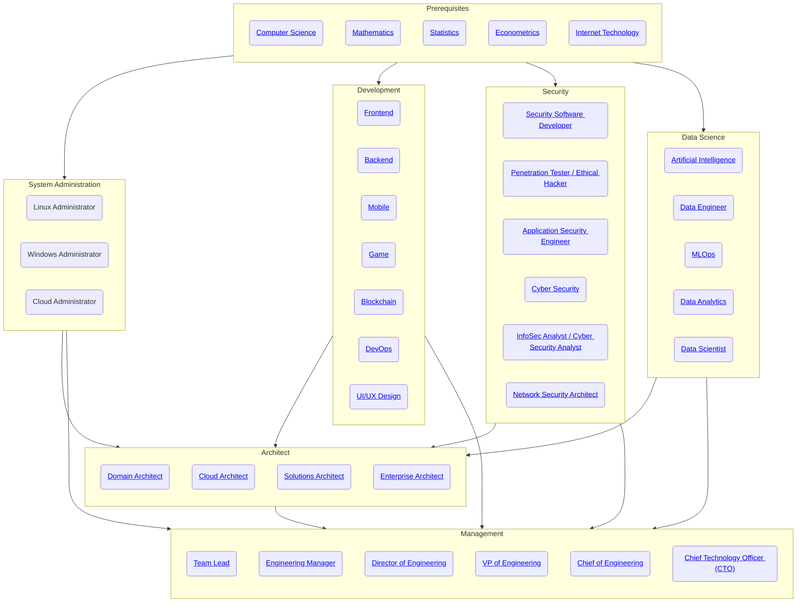

```mermaid
graph TB

    Prerequisites --> SystemAdministration
    Prerequisites --> Development
    Prerequisites --> Security
    Prerequisites --> DataScience
    SystemAdministration --> Architect
    Security --> Architect
    Development --> Architect
    DataScience --> Architect

    SystemAdministration --> Management
    Security --> Management
    Development --> Management
    DataScience --> Management
    Architect --> Management

    subgraph Prerequisites
      direction TB

      ComputerScience(<a href="/en/docs/roadmap/computer-science" target="_blank" rel="noopener noreferrer">Computer Science</a>)
      Mathematics(<a href="en/docs/category/computer-science" target="_blank" rel="noopener noreferrer">Mathematics</a>)
      Statistics(<a href="/en/docs/category/statistics" target="_blank" rel="noopener noreferrer">Statistics</a>)
      Econometrics(<a href="/en/docs/category/econometrics" target="_blank" rel="noopener noreferrer">Econometrics</a>)
      InternetTechnology(<a href="/en/docs/category/networking" target="_blank" rel="noopener noreferrer">Internet Technology</a>)
    end

    subgraph SystemAdministration [System Administration]
      direction LR

      LinuxAdmin(Linux Administrator)
      WindowsAdmin(Windows Administrator)
      CloudAdmin(Cloud Administrator)
    end

    subgraph Security
      direction LR

      SecuritySoftwareDeveloper(<a href="/en/docs/roadmap/cyber-security" target="_blank" rel="noopener noreferrer">Security Software Developer</a>)
      PenetrationTester(<a href="/en/docs/roadmap/cyber-security" target="_blank" rel="noopener noreferrer">Penetration Tester / Ethical Hacker</a>)
      ApplicationSecurityEngineer(<a href="/en/docs/roadmap/cyber-security" target="_blank" rel="noopener noreferrer">Application Security Engineer</a>)
      CyberSecurity(<a href="/en/docs/roadmap/cyber-security" target="_blank" rel="noopener noreferrer">Cyber Security</a>)
      infoSec(<a href="/en/docs/roadmap/cyber-security" target="_blank" rel="noopener noreferrer">InfoSec Analyst / Cyber Security Analyst</a>)
      NetworkSecurityArchitect(<a href="/en/docs/roadmap/cyber-security" target="_blank" rel="noopener noreferrer">Network Security Architect</a>)
    end

    subgraph Development
      direction LR

      Frontend(<a href="/en/docs/roadmap/frontend" target="_blank" rel="noopener noreferrer">Frontend</a>)
      Backend(<a href="/en/docs/roadmap/backend" target="_blank" rel="noopener noreferrer">Backend</a>)
      Mobile(<a href="/en/docs/roadmap/mobile" target="_blank" rel="noopener noreferrer">Mobile</a>)
      Game(<a href="/en/docs/roadmap/game" target="_blank" rel="noopener noreferrer">Game</a>)
      Blockchain(<a href="/en/docs/roadmap/blockchain" target="_blank" rel="noopener noreferrer">Blockchain</a>)
      DevOps(<a href="/en/docs/roadmap/devops" target="_blank" rel="noopener noreferrer">DevOps</a>)
      UIUX(<a href="/en/docs/roadmap/ui-ux-designer" target="_blank" rel="noopener noreferrer">UI/UX Design</a>)
    end

    subgraph DataScience [Data Science]
      direction LR

      AI(<a href="/en/docs/roadmap/data-scientist" target="_blank" rel="noopener noreferrer">Artificial Intelligence</a>)
      DataEngineer(<a href="/en/docs/roadmap/mlops" target="_blank" rel="noopener noreferrer">Data Engineer</a>)
      MLOps(<a href="/en/docs/roadmap/mlops" target="_blank" rel="noopener noreferrer">MLOps</a>)
      DataAnalytics(<a href="/en/docs/roadmap/data-scientist" target="_blank" rel="noopener noreferrer">Data Analytics</a>)
      DataScientist(<a href="/en/docs/roadmap/data-scientist" target="_blank" rel="noopener noreferrer">Data Scientist</a>)
    end

    subgraph Architect
      direction TB

      Domain(<a href="/en/docs/roadmap/software-architect" target="_blank" rel="noopener noreferrer">Domain Architect</a>)
      Cloud(<a href="/en/docs/roadmap-architect" target="_blank" rel="noopener noreferrer">Cloud Architect</a>)
      Solution(<a href="/en/docs/roadmap-architect" target="_blank" rel="noopener noreferrer">Solutions Architect</a>)
      Enterprise(<a href="/en/docs/roadmap-architect" target="_blank" rel="noopener noreferrer">Enterprise Architect</a>)
    end

    subgraph Management
      direction TB

      TeamLead(<a href="/en/docs/roadmap/management" target="_blank" rel="noopener noreferrer">Team Lead</a>)
      EngineeringManager(<a href="/en/docs/roadmap/management" target="_blank" rel="noopener noreferrer">Engineering Manager</a>)
      DirectorOfEngineering(<a href="/en/docs/roadmap/management" target="_blank" rel="noopener noreferrer">Director of Engineering</a>)
      VPOfEngineering(<a href="/en/docs/roadmap/management" target="_blank" rel="noopener noreferrer">VP of Engineering</a>)
      ChiefOfEngineering(<a href="/en/docs/roadmap/management" target="_blank" rel="noopener noreferrer">Chief of Engineering</a>)
      CTO(<a href="/en/docs/roadmap/management" target="_blank" rel="noopener noreferrer">Chief Technology Officer #40;CTO#41;</a>)
    end
```
