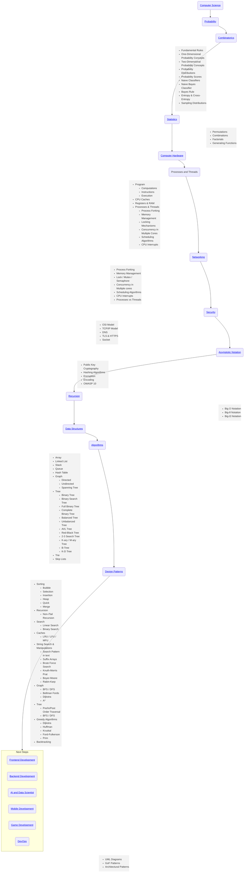

```mermaid
graph TB
  ComputerScience(<a href="/en/docs/category/computer-science" target="_blank" rel="noopener noreferrer">Computer Science</a>) --> Probability(<a href="/en/docs/category/probability/" target="_blank" rel="noopener noreferrer">Probability</a>)
  Probability ~~~|<ul style="text-align:left"><li>Fundamental Rules</li><li>One-Dimensional Probability Concepts</li><li>Two-Dimensional Probability Concepts</li><li>Probability Distributions</li><li>Probability Scores</li><li>Naive Classifiers</li><li>Naive Bayes Classifier</li><li>Bayes Rule</li><li>Entropy & Cross-Entropy</li><li>Sampling Distributions</li></ul></br>| Probability

  Probability --> Combinatorics(<a href="/en/docs/category/combinatorics/" target="_blank" rel="noopener noreferrer">Combinatorics</a>)
  Combinatorics ~~~|<ul style="text-align:left"><li>Permutations</li><li>Combinations</li><li>Factorials</li><li>Generating Functions</li></ul>| Combinatorics

  Combinatorics --> Statistics(<a href="/en/docs/category/statistics/" target="_blank" rel="noopener noreferrer">Statistics</a>)

  Statistics --> ComputerHardware(<a href="/en/docs/computer-hardware/" target="_blank" rel="noopener noreferrer">Computer Hardware</a>)
  ComputerHardware ~~~|<ul style="text-align:left"><li>Program <ul><li>Computations</li><li>Instructions</li><li>Execution</li></ul></li><li>CPU Caches</li><li>Registers & RAM</li><li>Processes & Threads <ul><li>Process Forking</li><li>Memory Management</li><li>Locking Mechanisms</li><li>Concurrency in Multiple Cores</li><li>Scheduling Algorithms</li><li>CPU Interrupts</li></ul></li></ul>| ComputerHardware

  ComputerHardware --> ProcessesAndThreads(Processes and Threads)
  ProcessesAndThreads ~~~|<ul style="text-align:left"><li>Process Forking</li><li>Memory Management</li><li>Lock / Mutex / Semaphore</li><li>Concurrency in Multiple cores</li><li>Scheduling Algorithms</li><li>CPU Interrupts</li><li>Processes vs Threads</li></ul>| ProcessesAndThreads

  ProcessesAndThreads --> Networking(<a href="/en/docs/category/networking/" target="_blank" rel="noopener noreferrer">Networking</a>)
  Networking ~~~|<ul style="text-align:left"><li>OSI Model</li><li>TCP/IP Model</li><li>DNS</li><li>TLS & HTTPS</li><li>Socket</li></ul>| Networking

  Networking --> Security(<a href="/en/docs/category/security/" target="_blank" rel="noopener noreferrer">Security</a>)
  Security ~~~|<ul style="text-align:left"><li>Public Key Cryptography</li><li>Hashing Algorithms</li><li>Encryption</li><li>Encoding</li><li>OWASP 10</li></ul>| Security

  Security --> AsymptoticNotation(<a href="/en/docs/category/asymptotic-notation" target="_blank" rel="noopener noreferrer">Asymptotic Notation</a>)
  AsymptoticNotation ~~~|<ul style="text-align:left"><li>Big O Notation</li><li>Big-θ Notation</li><li>Big-Ω Notation</li></ul>| AsymptoticNotation

  AsymptoticNotation --> Recursion(<a href="/en/docs/category/recursion/" target="_blank" rel="noopener noreferrer">Recursion</a>)

  Recursion --> DataStructures(<a href="/en/docs/category/data-structures" target="_blank" rel="noopener noreferrer">Data Structures</a>)
  DataStructures ~~~|<ul style="text-align:left"><li>Array</li><li>Linked List</li><li>Stack</li><li>Queue</li><li>Hash Table</li><li>Graph <ul><li>Directed</li><li>Undirected</li><li>Spanning Tree</li></ul></li><li>Tree <ul><li>Binary Tree</li><li>Binary Search Tree</li><li>Full Binary Tree</li><li>Complete Binary Tree</li><li>Balanced Tree</li><li>Unbalanced Tree</li><li>AVL Tree</li><li>Red-Black Tree</li><li>2-3 Search Tree</li><li>K-ary / M-ary Tree</li><li>B-Tree</li><li>K-D Tree</li></ul></li><li>Trie</li><li>Skip Lists</li></ul>| DataStructures

  DataStructures --> Algorithms(<a href="/en/docs/category/algorithms" target="_blank" rel="noopener noreferrer">Algorithms</a>)
  Algorithms ~~~|<ul style="text-align:left"><li>Sorting <ul><li>Bubble</li><li>Selection</li><li>Insertion</li><li>Heap</li><li>Quick</li><li>Merge</li></ul></li><li>Recursion <ul><li>Non-/Tail Recursion</li></ul></li><li>Search <ul><li>Linear Search</li><li>Binary Search</li></ul></li><li>Caches <ul><li>LRU / LFU / MFU</li></ul></li><li>String Search & Manipulations <ul><li>Search Pattern in text</li><li>Suffix Arrays</li><li>Brute Force Search</li><li>Knuth-Morris Prat</li><li>Boyer-Moore</li><li>Rabin-Karp</li></ul></li><li>Graph <ul><li>BFS / DFS</li><li>Bellman Fords</li><li>Dijkstra</li><li>A*</li></ul></li><li>Tree <ul><li>Pre/In/Post Order Traversal</li><li>BFS / DFS</li></ul></li><li>Greedy Algorithms <ul><li>Dijkstra</li><li>Huffman</li><li>Kruskal</li><li>Ford-Fulkerson</li><li>Prim</li></ul></li><li>Backtracking</li></ul>| Algorithms

  Algorithms --> DesignPatterns(<a href="/en/docs/category/design-patterns" target="_blank" rel="noopener noreferrer">Design Patterns</a>)
  DesignPatterns ~~~|<ul style="text-align:left"><li>UML Diagrams</li><li>GoF Patterns</li><li>Architectural Patterns</li></ul>| DesignPatterns

  DesignPatterns --> NextSteps

  subgraph NextSteps [Next Steps]
    direction LR

    Frontend(<a href="/en/docs/roadmap/frontend" target="_blank" rel="noopener noreferrer">Frontend Development</a>)
    Backend(<a href="/en/docs/roadmap/backend" target="_blank" rel="noopener noreferrer">Backend Development</a>)
    DataScientist(<a href="/en/docs/roadmap/data-scientist" target="_blank" rel="noopener noreferrer">AI and Data Scientist</a>)
    Mobile(<a href="/en/docs/roadmap/mobile" target="_blank" rel="noopener noreferrer">Mobile Development</a>)
    Game(<a href="/en/docs/roadmap/game" target="_blank" rel="noopener noreferrer">Game Development</a>)
    DevOps(<a href="/en/docs/roadmap/devops" target="_blank" rel="noopener noreferrer">DevOps</a>)
  end
```
