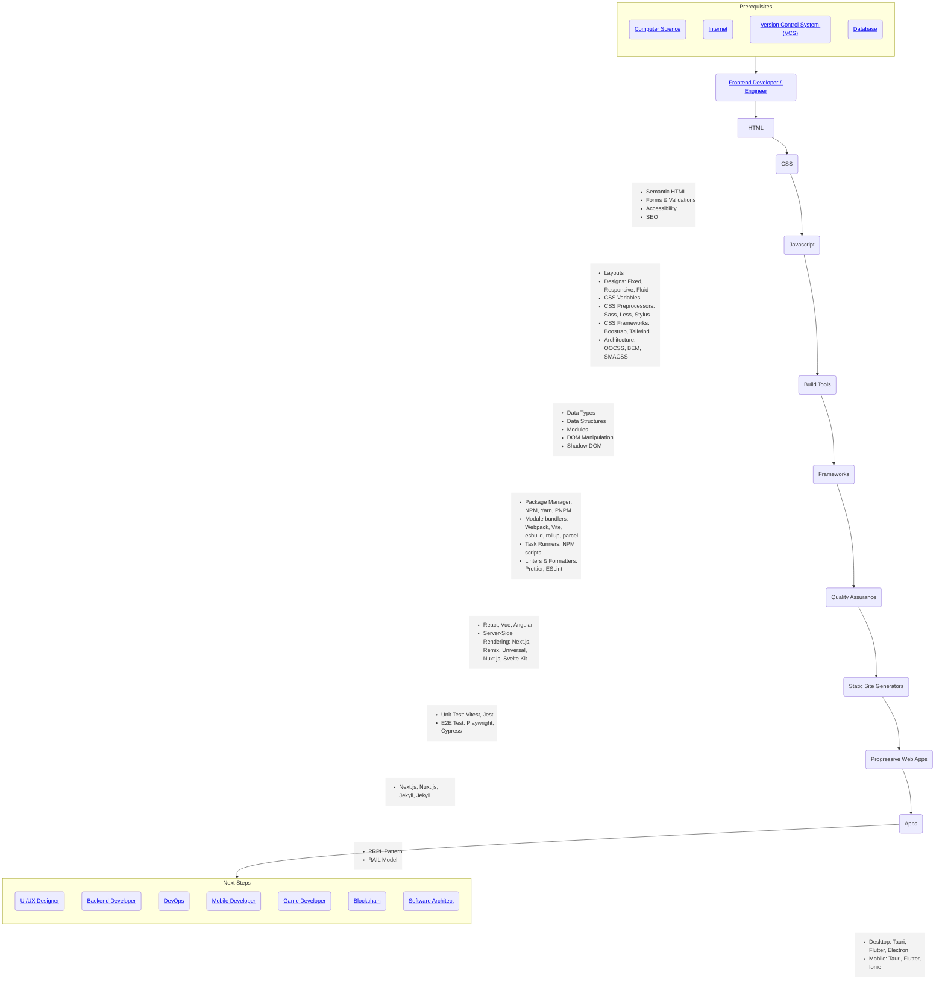

```mermaid
graph TB

  Prerequisites --> Frontend

  Frontend(<a href="/tech-labs/docs/" target="_blank" rel="noopener noreferrer">Frontend Developer / Engineer</a>) --> HTML
  HTML ~~~|<ul style="text-align:left"><li>Semantic HTML</li><li>Forms & Validations</li><li>Accessibility</li><li>SEO</li></ul>| HTML

  HTML --> CSS(CSS)
  CSS ~~~|<ul style="text-align:left"><li>Layouts</li><li>Designs: Fixed, Responsive, Fluid</li><li>CSS Variables</li><li>CSS Preprocessors: Sass, Less, Stylus</li><li>CSS Frameworks: Boostrap, Tailwind</li><li>Architecture: OOCSS, BEM, SMACSS</li></ul>| CSS

  CSS --> Javascript(Javascript)
  Javascript ~~~|<ul style="text-align:left"><li>Data Types</li><li>Data Structures</li><li>Modules</li><li>DOM Manipulation</li><li>Shadow DOM</li></ul>| Javascript

  Javascript --> BuildTools(Build Tools)
  BuildTools ~~~|<ul style="text-align:left"><li>Package Manager: NPM, Yarn, PNPM</li><li>Module bundlers: Webpack, Vite, esbuild, rollup, parcel</li><li>Task Runners: NPM scripts</li><li>Linters & Formatters: Prettier, ESLint</li></ul>| BuildTools

  BuildTools --> Frameworks(Frameworks)
  Frameworks ~~~|<ul style="text-align:left"><li>React, Vue, Angular</li><li>Server-Side Rendering: Next.js, Remix, Universal, Nuxt.js, Svelte Kit</li></ul>| Frameworks

  Frameworks --> QualityAssurance(Quality Assurance)
  QualityAssurance ~~~|<ul style="text-align:left"><li>Unit Test: Vitest, Jest</li><li>E2E Test: Playwright, Cypress</li></ul>| QualityAssurance

  QualityAssurance --> StaticSiteGenerators(Static Site Generators)
  StaticSiteGenerators ~~~|<ul style="text-align:left"><li>Next.js, Nuxt.js, Jekyll, Jekyll</li></ul>| StaticSiteGenerators

  StaticSiteGenerators --> ProgressiveWebApps(Progressive Web Apps)
  ProgressiveWebApps ~~~|<ul style="text-align:left"><li>PRPL Pattern</li><li>RAIL Model</li></ul>| ProgressiveWebApps

  ProgressiveWebApps --> Apps(Apps)
  Apps ~~~|<ul style="text-align:left"><li>Desktop: Tauri, Flutter, Electron</li><li>Mobile: Tauri, Flutter, Ionic</li></ul>| Apps

  Apps --> NextSteps

  subgraph Prerequisites [Prerequisites]
  direction TB

    ComputerScience(<a href="/tech-labs/docs/roadmap/computer-science" target="_blank" rel="noopener noreferrer">Computer Science</a>)
    Internet(<a href="/tech-labs/docs/category/networking" target="_blank" rel="noopener noreferrer">Internet</a>)
    VersionControlSystem(<a href="/tech-labs/docs/category/version-control-system" target="_blank" rel="noopener noreferrer">Version Control System #40;VCS#41;</a>)
    Database(<a href="/tech-labs/docs/roadmap/database" target="_blank" rel="noopener noreferrer">Database</a>)
  end

  subgraph NextSteps [Next Steps]
      direction TB

      UIUX(<a href="/tech-labs/docs/roadmap/ui-ux-designer" target="_blank" rel="noopener noreferrer">UI/UX Designer</a>)
      BackendDeveloper(<a href="/tech-labs/docs/roadmap/backend" target="_blank" rel="noopener noreferrer">Backend Developer</a>)
      DevOps(<a href="/tech-labs/docs/roadmap/devops" target="_blank" rel="noopener noreferrer">DevOps</a>)
      MobileDeveloper(<a href="/tech-labs/docs/roadmap/mobile-developer" target="_blank" rel="noopener noreferrer">Mobile Developer</a>)
      GameDeveloper(<a href="/tech-labs/docs/roadmap/game-developer" target="_blank" rel="noopener noreferrer">Game Developer</a>)
      Blockchain(<a href="/tech-labs/docs/roadmap/Blockchain" target="_blank" rel="noopener noreferrer">Blockchain</a>)
      SoftwareArchitect(<a href="/tech-labs/docs/roadmap/software-architect" target="_blank" rel="noopener noreferrer">Software Architect</a>)
  end
```
