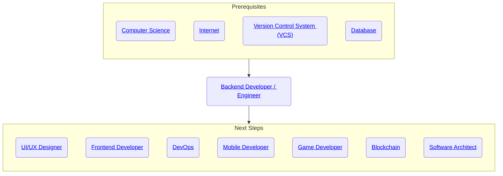

```mermaid
graph TB

  Prerequisites --> Backend

  Backend(<a href="/en/docs/roadmap/computer-science" target="_blank" rel="noopener noreferrer">Backend Developer / Engineer</a>) --> NextSteps


  subgraph Prerequisites
  direction TB

    ComputerScience(<a href="/en/docs/roadmap/computer-science" target="_blank" rel="noopener noreferrer">Computer Science</a>)
    Internet(<a href="/en/docs/category/internet" target="_blank" rel="noopener noreferrer">Internet</a>)
    VersionControlSystem(<a href="/en/docs/category/version-control-system" target="_blank" rel="noopener noreferrer">Version Control System #40;VCS#41;</a>)
    Database(<a href="/en/docs/roadmap/database" target="_blank" rel="noopener noreferrer">Database</a>)
  end

  subgraph NextSteps [Next Steps]
      direction TB

      UIUX(<a href="/en/docs/roadmap/ui-ux-designer" target="_blank" rel="noopener noreferrer">UI/UX Designer</a>)
      FrontendDeveloper(<a href="/en/docs/roadmap/frontend" target="_blank" rel="noopener noreferrer">Frontend Developer</a>)
      DevOps(<a href="/en/docs/roadmap/devops" target="_blank" rel="noopener noreferrer">DevOps</a>)
      MobileDeveloper(<a href="/en/docs/roadmap/mobile-developer" target="_blank" rel="noopener noreferrer">Mobile Developer</a>)
      GameDeveloper(<a href="/en/docs/roadmap/game-developer" target="_blank" rel="noopener noreferrer">Game Developer</a>)
      Blockchain(<a href="/en/docs/roadmap/Blockchain" target="_blank" rel="noopener noreferrer">Blockchain</a>)
      SoftwareArchitect(<a href="/en/docs/roadmap/software-architect" target="_blank" rel="noopener noreferrer">Software Architect</a>)
  end
```
