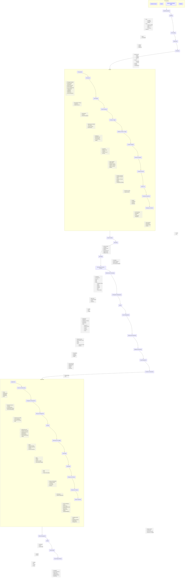

```mermaid
graph TB

  Prerequisites --> OperatingSystems(Operating Systems)
  OperatingSystems ~~~|<ul style="text-align:left"><li>Unix <ul><li>FreeBSD</li><li>OpenBSD</li><li>NetBSD</li></ul></li><li>Linux <ul><li>Ubuntu / Debian</li><li>SUSE Linux</li><li>RHEL / Derivatives</li></ul></li><li>Windows</li></ul>| OperatingSystems

  OperatingSystems --> Scripting(Scripting)
  Scripting ~~~|<ul style="text-align:left"><li>Bash</li><li>PowerShell</li></ul>| Scripting

  Scripting --> VCSHosting(VCS Hosting)
  VCSHosting ~~~|<ul style="text-align:left"><li>GitHub</li><li>GitLab</li><li>Bitbucket</li></ul>| VCSHosting

  VCSHosting --> WebServer(Web Server)
  WebServer ~~~|<ul style="text-align:left"><li>Web Servers: <ul><li>Nginx</li><li>Tomcat</li><li>Apache</li><li>IIS</li></ul><li>Proxy: <ul><li>Reverse</li><li>Forward</li></ul></li></li><li>Firewall</li><li>Caching</li><li>Load Balancer</li></ul><br />| WebServer

  WebServer --> Containers(Containers)
  Containers ~~~|<ul style="text-align:left"><li>Docker</li><li>LXC</li></ul>| Containers

  Containers --> Docker

  Docker --> CloudProviders(Cloud Providers)
  CloudProviders ~~~|<ul style="text-align:left"><li>Amazon Web Services</li><li>Google Cloud Platform</li><li>Microsoft Azure</li><li>Digital Ocean</li><li>Alibaba Cloud</li></ul>| CloudProviders

  CloudProviders --> Serverless(Serverless)
  Serverless ~~~|<ul style="text-align:left"><li>Cloudflare</li><li>Azure Functions</li><li>AWS Lambda</li><li>GCP Cloud Functions</li></ul>| Serverless

  Serverless --> OSIModel(OSI Model)

  OSIModel --> NetworkingSecurityProtocols(Networking & Security Protocols)
  NetworkingSecurityProtocols ~~~|<ul style="text-align:left"><li>FTP/SFTP</li><li>HTTP/HTTPs</li><li>SSL/TLS</li><li>DNS</li><li>SSH</li><li>Email <ul><li>white/grey listing</li><li>SMTP</li><li>IMAPS</li><li>POP3S</li><li>DMARC</li><li>SPF</li><li>Domain Keys</li></ul></li></ul><br/>| NetworkingSecurityProtocols

  NetworkingSecurityProtocols --> InfrastructureProvisioning(Infrastructure Provisioning)
  InfrastructureProvisioning ~~~|<ul style="text-align:left"><li>AWS CDK</li><li>CloudFormation</li><li>Pulumi</li><li>Terraform</li></ul>| InfrastructureProvisioning

  InfrastructureProvisioning --> ConfigurationManagement(Configuration Management)
  ConfigurationManagement ~~~|<ul style="text-align:left"><li>Ansible</li><li>Chef</li><li>Puppet</li></ul>| ConfigurationManagement

  ConfigurationManagement --> CICD(CD/CD)
  CICD ~~~|<ul style="text-align:left"><li>Continuous Integration</li><li>Continuous Delivery</li><li>Continuous Deployment</li><li>Tools <ul><li>GitLab CI</li><li>GitHub Actions</li><li>Circle CI</li><li>Jenkins</li><li>Travis CI</li><li>Drone</li></ul></li></ul><br/>| CICD

  CICD --> SecretManagement(Secret Management)
  SecretManagement ~~~|<ul style="text-align:left"><li>Sealed Secrets</li><li>Cloud Specific Tools</li><li>Vault</li><li>SOPS</li><li>Tools <ul><li>HashiCorp Vault</li><li>Keyring</li></ul></ul>| SecretManagement

  SecretManagement --> InfrastructureMonitoring(Infrastructure Monitoring)
  InfrastructureMonitoring ~~~|<ul style="text-align:left"><li>Prometheus</li><li>Grafana</li><li>DataDog</li><li>Zabbix</li></ul>| InfrastructureMonitoring

  InfrastructureMonitoring --> ApplicationMonitoring(Application Monitoring)
  ApplicationMonitoring ~~~|<ul style="text-align:left"><li>OpenTelemetry</li><li>AppDynamics</li><li>DataDog</li><li>Jaeger</li><li>NewRelic</li></ul>| ApplicationMonitoring

  ApplicationMonitoring --> LogsManagement(Logs Management)
  LogsManagement ~~~|<ul style="text-align:left"><li>Elastic Stack</li><li>Loki</li></ul>| LogsManagement

  LogsManagement --> ContainerOrchestration(Container Orchestration)
  ContainerOrchestration ~~~|<ul style="text-align:left"><li>Docker Swarm</li><li>Kubernetes</li><li>GKE / EKS / AKS</li><li>AWS ECS / Fargate</li></ul>| ContainerOrchestration

  ContainerOrchestration --> Kubernetes

  Kubernetes --> ArtifactManagement(Artifact Management)
  ArtifactManagement ~~~|<ul style="text-align:left"><li>Artifactory</li><li>Nexus</li><li>Cloud Smith</li></ul>| ArtifactManagement

  ArtifactManagement --> GitOps(GitOps)
  GitOps ~~~|<ul style="text-align:left"><li>ArgoCD</li><li>FluxCD</li></ul>| GitOps

  GitOps --> ServiceMesh(Service Mesh)
  ServiceMesh ~~~|<ul style="text-align:left"><li>Linkerd</li><li>Istio</li><li>Consul</li><li>Envoy</li></ul>| ServiceMesh

  ServiceMesh --> CloudDesignPatterns(Cloud Design Patterns)
  CloudDesignPatterns ~~~|<ul style="text-align:left"><li>Availability</li><li>Data Management</li><li>Design and Implementation</li><li>Management and Monitoring</li></ul>| CloudDesignPatterns

  subgraph Prerequisites
    direction TB

      ComputerScience(<a href="/en/docs/roadmap/computer-science" target="_blank" rel="noopener noreferrer">Computer Science</a>)
      Internet(<a href="/en/docs/category/internet" target="_blank" rel="noopener noreferrer">Internet</a>)
      VersionControlSystem(<a href="/en/docs/category/version-control-system" target="_blank" rel="noopener noreferrer">Version Control System #40;VCS#41;</a>)
      Database(<a href="/en/docs/roadmap/database" target="_blank" rel="noopener noreferrer">Database</a>)
    end

  subgraph Docker
    direction TB

    PrerequisitesDocker(Prerequisites)
    PrerequisitesDocker ~~~|<ul style="text-align:left"><li>Package Managers</li><li>Users/Groups Permissions</li><li>Shell Commands</li><li>Shell Scripting</li><li>Linux Fundamentals</li><li>Programming Languages</li><li>Application Architecture</li><li>Web Development</li></ul><br/>| PrerequisitesDocker

    PrerequisitesDocker --> Introduction

    Introduction(Introduction)
    Introduction ~~~|<ul style="text-align:left"><li>Bare Metal vs VM vs Containers</li><li>Docker and OCI</li></ul>| Introduction

  Introduction --> Technologies(Technologies)
  Technologies ~~~|<ul style="text-align:left"><li>Namespace</li><li>cgroups</li><li>Union File Systems</li></ul>| Technologies

  Technologies --> DataPersistence(Data Persistence)
  DataPersistence ~~~|<ul style="text-align:left"><li>Ephemeral Container File System</li><li>Volume Mounts</li><li>Bind Mounts</li></ul>| DataPersistence

  DataPersistence --> ContainerImages(Container Images)
  ContainerImages ~~~|<ul style="text-align:left"><li>Databases</li><li>Interactive Test Environments</li><li>Command Line Utilities</li></ul>| ContainerImages

  ContainerImages --> BuildingContainerImages(Building Container Images)
  BuildingContainerImages ~~~|<ul style="text-align:left"><li>Dockerfile</li><li>Efficient Layer Caching</li><li>Image size and Security</li></ul>| BuildingContainerImages

  BuildingContainerImages --> ContainerRegistry(Container Registry)
  ContainerRegistry ~~~|<ul style="text-align:left"><li>Image Tagging</li><li>Docker Hub</li><li>Google Container Registry / Amazon Elastic Container Registry</li></ul>| ContainerRegistry

  ContainerRegistry --> RunningContainers(Running Containers)
  RunningContainers ~~~|<ul style="text-align:left"><li>Container Lifecycle</li><li>Container Lifecycle Hooks</li><li>Container Lifecycle Events</li><li>Runtime Configuration Options</li></ul>| RunningContainers

  RunningContainers --> ContainerSecurity(Container Security)
  ContainerSecurity ~~~|<ul style="text-align:left"><li>Runtime Security</li><li>Image Security</li></ul>| ContainerSecurity

  ContainerSecurity --> DockerCli(Docker CLI)
  DockerCli ~~~|<ul style="text-align:left"><li>Images</li><li>Containers</li><li>Volumes</li><li>Networks</li></ul>| DockerCli

  DockerCli --> DeveloperExperience(Developer Experience)
  DeveloperExperience ~~~|<ul style="text-align:left"><li>Hot Reloading</li><li>Debuggers</li><li>Tests</li><li>Continuous Integration</li></ul>| DeveloperExperience

  DeveloperExperience --> DeployingContainers(Deploying Containers)
  DeployingContainers ~~~|<ul style="text-align:left"><li>PaaS Options</li><li>Kubernetes</li><li>Docker Swarm</li><li>Nomad</li></ul>| DeployingContainers
  end

  subgraph Kubernetes
    direction TB

    Applications(Applications)
    Applications ~~~|<ul style="text-align:left"><li>Pods</li><li>Deployments</li><li>ReplicaSet</li><li>StatefulSet</li><li>Jobs</li></ul>| Applications

    Applications --> ServiceNetworking(Service and Networking)
    ServiceNetworking ~~~|<ul style="text-align:left"><li>External Access to Services</li><li>Load Balancing</li><li>Networking & Pod-to-Pod Communication</li></ul>| ServiceNetworking

    ServiceNetworking --> ConfigurationManagementK8s(Configuration Management)
    ConfigurationManagementK8s ~~~|<ul style="text-align:left"><li>Injecting Pod Config with ConfigMaps</li><li>Secrets for sensitive data</li></ul>| ConfigurationManagementK8s

    ConfigurationManagementK8s --> ResourceManagement(Resource Management)
    ResourceManagement ~~~|<ul style="text-align:left"><li>Setting Resource Requests and Limits</li><li>Assigning Quotas to Namespaces</li><li>Monitoring and Optimizing Resource Usage</li></ul>| ResourceManagement

    ResourceManagement --> Security(Security)
    Security ~~~|<ul style="text-align:left"><li>RBAC</li><li>Network Security</li><li>Container and Pod Security</li><li>Security Scanners</li></ul>| Security

    Security --> Monitoring(Monitoring and Logging)
    Monitoring ~~~|<ul style="text-align:left"><li>Logs</li><li>Metrics</li><li>Traces</li><li>Resource Health</li><li>Observability Engines</li></ul>| Monitoring

    Monitoring --> Autoscaling(Autoscaling)
    Autoscaling ~~~|<ul style="text-align:left"><li>HPA</li><li>VPA</li><li>Cluster Autoscaling</li></ul>| Autoscaling

    Autoscaling --> Scheduling(Scheduling)
    Scheduling ~~~|<ul style="text-align:left"><li>Taints and Tolerations</li><li>Topology Spread Constraints</li><li>Pod Priority</li><li>Evictions</li></ul>| Scheduling

    Scheduling --> StorageVolumes(Storage and Volumes)
    StorageVolumes ~~~|<ul style="text-align:left"><li>CSI Drivers</li><li>Stateful Applications</li></ul>| StorageVolumes

    StorageVolumes --> DeploymentPatterns(Deployment Patterns)
    DeploymentPatterns ~~~|<ul style="text-align:left"><li>CI/CD Integration</li><li>GitOps</li><li>Helm Charts</li><li>Canary Deployments</li><li>Blue/Green Deployments</li><li>Rolling Updates/Rollbacks</li></ul>| DeploymentPatterns

    DeploymentPatterns --> ClusterOperations(Cluster Operations)
    ClusterOperations ~~~|<ul style="text-align:left">Installing Control Plane</li><li>Managing Workers</li><li>Multi-Cluster Management</li></ul>| ClusterOperations
  end
```
