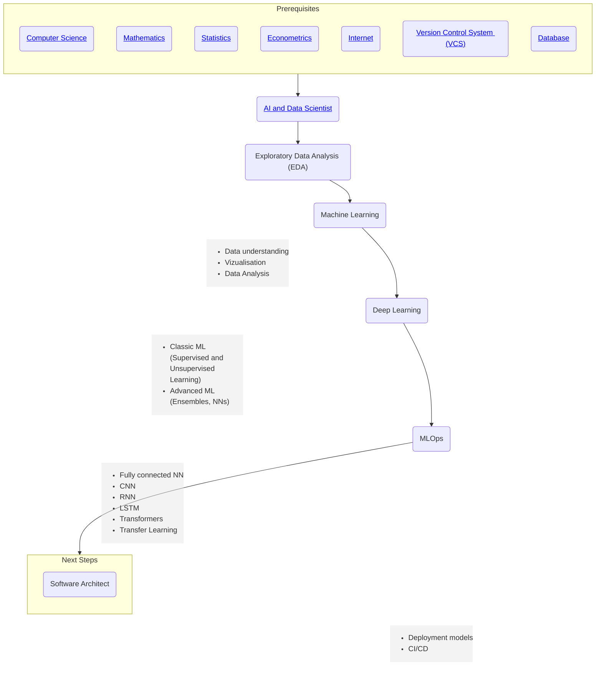

```mermaid
graph TB

  Prerequisites --> DataScientist

  DataScientist(<a href="/tech-labs/docs/category/ai-data-scientist/" target="_blank" rel="noopener noreferrer">AI and Data Scientist</a>) --> ExploratoryDataAnalysis(Exploratory Data Analysis #40;EDA#41;)
  ExploratoryDataAnalysis ~~~|<ul style="text-align:left"><li>Data understanding</li><li>Vizualisation</li><li>Data Analysis</li></ul>| ExploratoryDataAnalysis

  ExploratoryDataAnalysis --> MachineLearning(Machine Learning)
  MachineLearning ~~~|<ul style="text-align:left"><li>Classic ML #40;Supervised and Unsupervised Learning#41;</li><li>Advanced ML #40;Ensembles, NNs#41;</li></ul>| MachineLearning

  MachineLearning --> DeepLearning(Deep Learning)
  DeepLearning ~~~|<ul style="text-align:left"><li>Fully connected NN</li><li>CNN</li><li>RNN</li><li>LSTM</li><li>Transformers</li><li>Transfer Learning</li></ul>| DeepLearning

  DeepLearning --> MLOps(MLOps)
  MLOps ~~~|<ul style="text-align:left"><li>Deployment models</li><li>CI/CD</li></ul>| MLOps

  MLOps --> NextSteps

  subgraph Prerequisites [Prerequisites]
  direction TB

    ComputerScience(<a href="/tech-labs/docs/roadmap/computer-science" target="_blank" rel="noopener noreferrer">Computer Science</a>)
    Mathematics(<a href="/tech-labs/docs/roadmap/computer-science" target="_blank" rel="noopener noreferrer">Mathematics</a>)
    Statistics(<a href="/tech-labs/docs/education/computer-science/statistics/basics/" target="_blank" rel="noopener noreferrer">Statistics</a>)
    Econometrics(<a href="/tech-labs/docs/" target="_blank" rel="noopener noreferrer">Econometrics</a>)
    Internet(<a href="/tech-labs/docs/roadmap/internet" target="_blank" rel="noopener noreferrer">Internet</a>)
    VersionControlSystem(<a href="/tech-labs/docs/roadmap/version-control-system" target="_blank" rel="noopener noreferrer">Version Control System #40;VCS#41;</a>)
    Database(<a href="/tech-labs/docs/roadmap/database" target="_blank" rel="noopener noreferrer">Database</a>)
  end

  subgraph NextSteps [Next Steps]
    direction TB

    SoftwareArchitect(Software Architect)
  end
```
