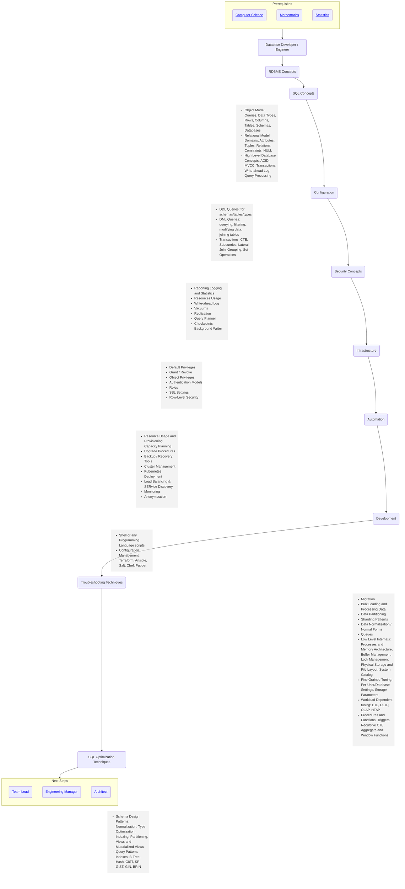

```mermaid
graph TB

  Prerequisites --> DatabaseDeveloper(Database Developer / Engineer)

  DatabaseDeveloper --> RDBMSConcept(RDBMS Concepts)
  RDBMSConcept ~~~|<ul style="text-align:left"><li>Object Model: Queries, Data Types, Rows, Columns, Tables, Schemas, Databases</li><li>Relational Model: Domains, Attributes, Tuples, Relations, Constraints, NULL</li><li>High Level Database Concepts: ACID, MVCC, Transactions, Write-ahead Log, Query Processing</li></ul>| RDBMSConcept

  RDBMSConcept --> SQLConcepts(SQL Concepts)
  SQLConcepts ~~~|<ul style="text-align:left"><li>DDL Queries: for schemas/tables/types</li><li>DML Queries: querying, filtering, modifying data, joining tables</li><li>Transactions, CTE, Subqueries, Lateral Join, Grouping, Set Operations</li></ul>| SQLConcepts

  SQLConcepts --> Configuration(Configuration)
  Configuration ~~~|<ul style="text-align:left"><li>Reporting Logging and Statistics</li><li>Resources Usage</li><li>Write-ahead Log</li><li>Vacuums</li><li>Replication</li><li>Query Planner</li><li>Checkpoints Background Writer</li></ul><br/>| Configuration

  Configuration --> SecurityConcepts(Security Concepts)
  SecurityConcepts ~~~|<ul style="text-align:left"><li>Default Privileges</li><li>Grant / Revoke</li><li>Object Privileges</li><li>Authentication Models</li><li>Roles</li><li>SSL Settings</li><li>Row-Level Security</li></ul><br/>| SecurityConcepts

  SecurityConcepts --> Infrastructure(Infrastructure)
  Infrastructure ~~~|<ul style="text-align:left"><li>Resource Usage and Provisioning, Capacity Planning</li><li>Upgrade Procedures</li><li>Backup / Recovery Tools</li><li>Cluster Management</li><li>Kubernetes Deployment</li><li>Load Balancing & SERvice Discovery</li><li>Monitoring</li><li>Anonymization</li></ul><br/>| Infrastructure

  Infrastructure --> Automation(Automation)
  Automation ~~~|<ul style="text-align:left"><li>Shell or any Programming Language scripts</li><li>Configuration Management: Terraform, Ansible, Salt, Chef, Puppet</li></ul>| Automation

  Automation --> Development(Development)
  Development ~~~|<ul style="text-align:left"><li>Migration</li><li>Bulk Loading and Processing Data</li><li>Data Partitioning</li><li>Sharding Patterns</li><li>Data Normalization / Normal Forms</li><li>Queues</li><li>Low Level Internals: Processes and Memory Architecture, Buffer Management, Lock Management, Physical Storage and File Layout, System Catalog</li><li>Fine Grained Tuning: Per-User/Database Settings, Storage Parameters</li><li>Workload Dependent tuning: ETL, OLTP, OLAP, HTAP</li><li>Procedures and Functions, Triggers, Recursive CTE, Aggregate and Window Functions</li></ul><br/>| Development

  Development --> TroubleshootingTechniques(Troubleshooting Techniques)

  TroubleshootingTechniques --> SQLOptimizationTechniques(SQL Optimization Techniques)
  SQLOptimizationTechniques ~~~|<ul style="text-align:left"><li>Schema Design Patterns: Normalization, Type Optimization, Indexing, Partitioning, Views and Materialized Views</li><li>Query Patterns</li><li>Indexes: B-Tree, Hash, GIST, SP-GIST, GIN, BRIN</li></ul>| SQLOptimizationTechniques

  SQLOptimizationTechniques --> NextSteps

  subgraph Prerequisites
    direction TB

    ComputerScience(<a href="/en/docs/category/computer-science" target="_blank" rel="noopener noreferrer">Computer Science</a>)
    Mathematics(<a href="/en/docs/roadmap/computer-science" target="_blank" rel="noopener noreferrer">Mathematics</a>)
    Statistics(<a href="/en/docs/education/computer-science/statistics/basics/" target="_blank" rel="noopener noreferrer">Statistics</a>)
  end

  subgraph NextSteps [Next Steps]
      direction TB

      TeamLead(<a href="/en/docs/roadmap/management" target="_blank" rel="noopener noreferrer">Team Lead</a>)
      EngineeringManager(<a href="/en/docs/roadmap/management" target="_blank" rel="noopener noreferrer">Engineering Manager</a>)
      Architect(<a href="/en/docs/roadmap/software-architect" target="_blank" rel="noopener noreferrer">Architect</a>)
  end
```
